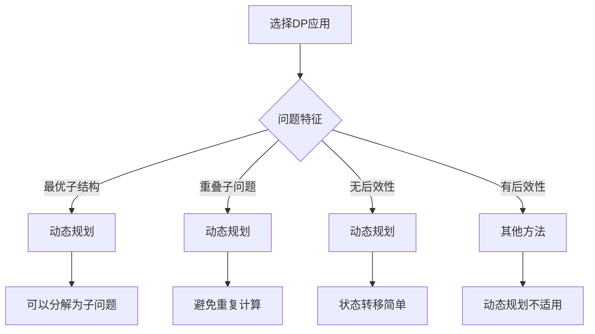

# 动态规划应用

## 🎯 核心概念

**动态规划应用**是将动态规划原理和模板应用到具体问题中的实践，包括问题识别、状态设计、转移方程推导和实现优化等关键步骤。

## 🔍 经典应用

### 1. 序列问题
```python
def longest_increasing_subsequence(nums):
    """最长递增子序列 - O(n^2)"""
    if not nums:
        return 0
    
    n = len(nums)
    dp = [1] * n
    
    for i in range(1, n):
        for j in range(i):
            if nums[j] < nums[i]:
                dp[i] = max(dp[i], dp[j] + 1)
    
    return max(dp)

def longest_common_subsequence(text1, text2):
    """最长公共子序列 - O(m*n)"""
    m, n = len(text1), len(text2)
    dp = [[0] * (n + 1) for _ in range(m + 1)]
    
    for i in range(1, m + 1):
        for j in range(1, n + 1):
            if text1[i-1] == text2[j-1]:
                dp[i][j] = dp[i-1][j-1] + 1
            else:
                dp[i][j] = max(dp[i-1][j], dp[i][j-1])
    
    return dp[m][n]

def edit_distance(word1, word2):
    """编辑距离 - O(m*n)"""
    m, n = len(word1), len(word2)
    dp = [[0] * (n + 1) for _ in range(m + 1)]
    
    # 初始化
    for i in range(m + 1):
        dp[i][0] = i
    for j in range(n + 1):
        dp[0][j] = j
    
    # 状态转移
    for i in range(1, m + 1):
        for j in range(1, n + 1):
            if word1[i-1] == word2[j-1]:
                dp[i][j] = dp[i-1][j-1]
            else:
                dp[i][j] = min(
                    dp[i-1][j] + 1,      # 删除
                    dp[i][j-1] + 1,      # 插入
                    dp[i-1][j-1] + 1     # 替换
                )
    
    return dp[m][n]

def longest_palindromic_subsequence(s):
    """最长回文子序列 - O(n^2)"""
    n = len(s)
    dp = [[0] * n for _ in range(n)]
    
    # 单个字符都是回文
    for i in range(n):
        dp[i][i] = 1
    
    # 状态转移
    for length in range(2, n + 1):
        for i in range(n - length + 1):
            j = i + length - 1
            if s[i] == s[j]:
                dp[i][j] = dp[i+1][j-1] + 2
            else:
                dp[i][j] = max(dp[i+1][j], dp[i][j-1])
    
    return dp[0][n-1]
```

### 2. 路径问题
```python
def unique_paths(m, n):
    """不同路径 - O(m*n)"""
    dp = [[1] * n for _ in range(m)]
    
    for i in range(1, m):
        for j in range(1, n):
            dp[i][j] = dp[i-1][j] + dp[i][j-1]
    
    return dp[m-1][n-1]

def min_path_sum(grid):
    """最小路径和 - O(m*n)"""
    m, n = len(grid), len(grid[0])
    dp = [[0] * n for _ in range(m)]
    
    dp[0][0] = grid[0][0]
    
    # 初始化第一行
    for j in range(1, n):
        dp[0][j] = dp[0][j-1] + grid[0][j]
    
    # 初始化第一列
    for i in range(1, m):
        dp[i][0] = dp[i-1][0] + grid[i][0]
    
    # 状态转移
    for i in range(1, m):
        for j in range(1, n):
            dp[i][j] = min(dp[i-1][j], dp[i][j-1]) + grid[i][j]
    
    return dp[m-1][n-1]

def unique_paths_with_obstacles(obstacleGrid):
    """带障碍的不同路径 - O(m*n)"""
    m, n = len(obstacleGrid), len(obstacleGrid[0])
    dp = [[0] * n for _ in range(m)]
    
    # 初始化起点
    dp[0][0] = 1 if obstacleGrid[0][0] == 0 else 0
    
    # 初始化第一行
    for j in range(1, n):
        if obstacleGrid[0][j] == 0:
            dp[0][j] = dp[0][j-1]
    
    # 初始化第一列
    for i in range(1, m):
        if obstacleGrid[i][0] == 0:
            dp[i][0] = dp[i-1][0]
    
    # 状态转移
    for i in range(1, m):
        for j in range(1, n):
            if obstacleGrid[i][j] == 0:
                dp[i][j] = dp[i-1][j] + dp[i][j-1]
    
    return dp[m-1][n-1]

def triangle_minimum_path_sum(triangle):
    """三角形最小路径和 - O(n^2)"""
    n = len(triangle)
    dp = [[0] * n for _ in range(n)]
    
    # 初始化最后一行
    for j in range(n):
        dp[n-1][j] = triangle[n-1][j]
    
    # 从下往上计算
    for i in range(n-2, -1, -1):
        for j in range(i+1):
            dp[i][j] = min(dp[i+1][j], dp[i+1][j+1]) + triangle[i][j]
    
    return dp[0][0]
```

### 3. 背包问题
```python
def zero_one_knapsack(weights, values, capacity):
    """0-1背包问题 - O(n*W)"""
    n = len(weights)
    dp = [[0] * (capacity + 1) for _ in range(n + 1)]
    
    for i in range(1, n + 1):
        for j in range(capacity + 1):
            if j < weights[i-1]:
                dp[i][j] = dp[i-1][j]
            else:
                dp[i][j] = max(dp[i-1][j], dp[i-1][j-weights[i-1]] + values[i-1])
    
    return dp[n][capacity]

def unbounded_knapsack(weights, values, capacity):
    """完全背包问题 - O(n*W)"""
    n = len(weights)
    dp = [[0] * (capacity + 1) for _ in range(n + 1)]
    
    for i in range(1, n + 1):
        for j in range(capacity + 1):
            if j < weights[i-1]:
                dp[i][j] = dp[i-1][j]
            else:
                dp[i][j] = max(dp[i-1][j], dp[i][j-weights[i-1]] + values[i-1])
    
    return dp[n][capacity]

def coin_change(coins, amount):
    """硬币找零 - O(n*amount)"""
    dp = [float('inf')] * (amount + 1)
    dp[0] = 0
    
    for coin in coins:
        for i in range(coin, amount + 1):
            dp[i] = min(dp[i], dp[i-coin] + 1)
    
    return dp[amount] if dp[amount] != float('inf') else -1

def coin_change_ways(coins, amount):
    """硬币找零方案数 - O(n*amount)"""
    dp = [0] * (amount + 1)
    dp[0] = 1
    
    for coin in coins:
        for i in range(coin, amount + 1):
            dp[i] += dp[i-coin]
    
    return dp[amount]

def partition_equal_subset_sum(nums):
    """分割等和子集 - O(n*sum)"""
    total = sum(nums)
    if total % 2 != 0:
        return False
    
    target = total // 2
    dp = [False] * (target + 1)
    dp[0] = True
    
    for num in nums:
        for i in range(target, num - 1, -1):
            dp[i] = dp[i] or dp[i - num]
    
    return dp[target]
```

### 4. 区间问题
```python
def matrix_chain_multiplication(p):
    """矩阵链乘法 - O(n^3)"""
    n = len(p) - 1
    dp = [[0] * n for _ in range(n)]
    
    for length in range(2, n + 1):
        for i in range(n - length + 1):
            j = i + length - 1
            dp[i][j] = float('inf')
            
            for k in range(i, j):
                cost = dp[i][k] + dp[k+1][j] + p[i] * p[k+1] * p[j+1]
                dp[i][j] = min(dp[i][j], cost)
    
    return dp[0][n-1]

def palindrome_substring(s):
    """回文子串 - O(n^2)"""
    n = len(s)
    dp = [[False] * n for _ in range(n)]
    count = 0
    
    # 单个字符都是回文
    for i in range(n):
        dp[i][i] = True
        count += 1
    
    # 两个字符的情况
    for i in range(n - 1):
        if s[i] == s[i + 1]:
            dp[i][i + 1] = True
            count += 1
    
    # 三个或更多字符的情况
    for length in range(3, n + 1):
        for i in range(n - length + 1):
            j = i + length - 1
            if s[i] == s[j] and dp[i + 1][j - 1]:
                dp[i][j] = True
                count += 1
    
    return count

def burst_balloons(nums):
    """戳气球 - O(n^3)"""
    n = len(nums)
    # 在两端添加虚拟气球
    balloons = [1] + nums + [1]
    n += 2
    
    dp = [[0] * n for _ in range(n)]
    
    for length in range(3, n + 1):
        for i in range(n - length + 1):
            j = i + length - 1
            for k in range(i + 1, j):
                dp[i][j] = max(
                    dp[i][j],
                    dp[i][k] + dp[k][j] + balloons[i] * balloons[k] * balloons[j]
                )
    
    return dp[0][n-1]

def stone_game(piles):
    """石子游戏 - O(n^2)"""
    n = len(piles)
    dp = [[0] * n for _ in range(n)]
    
    # 初始化：单个石子
    for i in range(n):
        dp[i][i] = piles[i]
    
    # 状态转移
    for length in range(2, n + 1):
        for i in range(n - length + 1):
            j = i + length - 1
            dp[i][j] = max(
                piles[i] - dp[i+1][j],
                piles[j] - dp[i][j-1]
            )
    
    return dp[0][n-1] > 0
```

## 🎨 高级应用

### 1. 树形DP
```python
class TreeNode:
    def __init__(self, val=0, left=None, right=None):
        self.val = val
        self.left = left
        self.right = right

def binary_tree_max_path_sum(root):
    """二叉树最大路径和 - O(n)"""
    def dfs(node):
        if not node:
            return 0
        
        left_sum = max(0, dfs(node.left))
        right_sum = max(0, dfs(node.right))
        
        nonlocal max_sum
        max_sum = max(max_sum, node.val + left_sum + right_sum)
        
        return node.val + max(left_sum, right_sum)
    
    max_sum = float('-inf')
    dfs(root)
    return max_sum

def house_robber_iii(root):
    """打家劫舍III - O(n)"""
    def dfs(node):
        if not node:
            return (0, 0)  # (偷, 不偷)
        
        left_rob, left_not_rob = dfs(node.left)
        right_rob, right_not_rob = dfs(node.right)
        
        # 偷当前节点
        rob = node.val + left_not_rob + right_not_rob
        
        # 不偷当前节点
        not_rob = max(left_rob, left_not_rob) + max(right_rob, right_not_rob)
        
        return (rob, not_rob)
    
    rob, not_rob = dfs(root)
    return max(rob, not_rob)

def longest_path_in_tree(root):
    """树中最长路径 - O(n)"""
    def dfs(node):
        if not node:
            return 0
        
        left_depth = dfs(node.left)
        right_depth = dfs(node.right)
        
        nonlocal max_path
        max_path = max(max_path, left_depth + right_depth)
        
        return max(left_depth, right_depth) + 1
    
    max_path = 0
    dfs(root)
    return max_path

def binary_tree_cameras(root):
    """监控二叉树 - O(n)"""
    def dfs(node):
        if not node:
            return (0, 0, float('inf'))  # (需要监控, 被监控, 监控其他)
        
        left = dfs(node.left)
        right = dfs(node.right)
        
        # 当前节点需要监控
        need = left[2] + right[2]
        
        # 当前节点被监控
        covered = min(left[2] + right[1], left[1] + right[2], left[2] + right[2])
        
        # 当前节点监控其他
        cover_other = 1 + min(left) + min(right)
        
        return (need, covered, cover_other)
    
    result = dfs(root)
    return min(result[1], result[2])
```

### 2. 状态压缩DP
```python
def traveling_salesman(graph):
    """旅行商问题 - O(n^2 * 2^n)"""
    n = len(graph)
    dp = [[float('inf')] * n for _ in range(1 << n)]
    
    dp[1][0] = 0
    
    for mask in range(1 << n):
        for i in range(n):
            if not (mask & (1 << i)):
                continue
            
            for j in range(n):
                if mask & (1 << j):
                    continue
                
                dp[mask | (1 << j)][j] = min(
                    dp[mask | (1 << j)][j],
                    dp[mask][i] + graph[i][j]
                )
    
    result = float('inf')
    for i in range(1, n):
        result = min(result, dp[(1 << n) - 1][i] + graph[i][0])
    
    return result

def subset_sum(nums, target):
    """子集和问题 - O(n * target)"""
    n = len(nums)
    dp = [[False] * (target + 1) for _ in range(n + 1)]
    
    dp[0][0] = True
    
    for i in range(1, n + 1):
        for j in range(target + 1):
            dp[i][j] = dp[i-1][j]
            if j >= nums[i-1]:
                dp[i][j] = dp[i][j] or dp[i-1][j-nums[i-1]]
    
    return dp[n][target]

def count_palindromic_subsequences(s):
    """回文子序列计数 - O(n^2)"""
    n = len(s)
    dp = [[0] * n for _ in range(n)]
    
    # 单个字符
    for i in range(n):
        dp[i][i] = 1
    
    # 两个字符
    for i in range(n - 1):
        if s[i] == s[i + 1]:
            dp[i][i + 1] = 3
        else:
            dp[i][i + 1] = 2
    
    # 三个或更多字符
    for length in range(3, n + 1):
        for i in range(n - length + 1):
            j = i + length - 1
            if s[i] == s[j]:
                dp[i][j] = dp[i+1][j] + dp[i][j-1] + 1
            else:
                dp[i][j] = dp[i+1][j] + dp[i][j-1] - dp[i+1][j-1]
    
    return dp[0][n-1]
```

### 3. 概率DP
```python
def knight_probability(n, k, row, column):
    """骑士概率 - O(k * n^2)"""
    directions = [(-2, -1), (-2, 1), (-1, -2), (-1, 2),
                  (1, -2), (1, 2), (2, -1), (2, 1)]
    
    dp = [[[0] * n for _ in range(n)] for _ in range(k + 1)]
    dp[0][row][column] = 1
    
    for step in range(k):
        for i in range(n):
            for j in range(n):
                if dp[step][i][j] > 0:
                    for di, dj in directions:
                        ni, nj = i + di, j + dj
                        if 0 <= ni < n and 0 <= nj < n:
                            dp[step + 1][ni][nj] += dp[step][i][j] / 8
    
    total = 0
    for i in range(n):
        for j in range(n):
            total += dp[k][i][j]
    
    return total

def dice_roll_simulation(n, rollMax):
    """骰子模拟 - O(n * 6 * max(rollMax))"""
    dp = [[[0] * (max(rollMax) + 1) for _ in range(6)] for _ in range(n + 1)]
    
    # 初始化
    for j in range(6):
        dp[1][j][1] = 1
    
    for i in range(2, n + 1):
        for j in range(6):
            for k in range(1, rollMax[j] + 1):
                if k == 1:
                    for prev_j in range(6):
                        if prev_j != j:
                            for prev_k in range(1, rollMax[prev_j] + 1):
                                dp[i][j][k] += dp[i-1][prev_j][prev_k]
                else:
                    dp[i][j][k] = dp[i-1][j][k-1]
    
    total = 0
    for j in range(6):
        for k in range(1, rollMax[j] + 1):
            total += dp[n][j][k]
    
    return total % (10**9 + 7)
```

## 🔍 应用策略

### 1. 问题识别
```python
def identify_dp_problem():
    """识别动态规划问题"""
    # 1. 最优子结构：问题的最优解包含子问题的最优解
    # 2. 重叠子问题：递归过程中会重复计算相同的子问题
    # 3. 无后效性：当前状态只依赖于之前的状态
    
    pass

def check_optimal_substructure():
    """检查最优子结构"""
    # 问题的最优解是否可以通过子问题的最优解构造
    # 例如：最短路径问题中，从A到C的最短路径 = 从A到B的最短路径 + 从B到C的最短路径
    
    pass

def check_overlapping_subproblems():
    """检查重叠子问题"""
    # 递归过程中是否会重复计算相同的子问题
    # 例如：斐波那契数列中，fib(n-1)和fib(n-2)都会重复计算fib(n-3)
    
    pass

def check_no_aftereffect():
    """检查无后效性"""
    # 当前状态是否只依赖于之前的状态，不依赖于如何到达当前状态
    # 例如：在路径问题中，到达某个点的最短距离只依赖于该点的位置
    
    pass
```

### 2. 状态设计
```python
def design_state():
    """设计状态"""
    # 1. 状态定义：明确状态的含义
    # 2. 状态维度：确定状态的维度
    # 3. 状态转移：设计状态转移方程
    # 4. 状态优化：优化状态空间
    
    pass

def state_definition():
    """状态定义"""
    # 状态应该能够唯一确定问题的子问题
    # 例如：在背包问题中，状态dp[i][j]表示前i个物品在容量为j的背包中的最大价值
    
    pass

def state_dimension():
    """状态维度"""
    # 状态的维度应该尽可能少
    # 例如：在路径问题中，状态dp[i][j]表示从起点到(i,j)的最短距离
    
    pass

def state_transition():
    """状态转移"""
    # 状态转移方程应该能够从已知状态推导出未知状态
    # 例如：dp[i][j] = min(dp[i-1][j], dp[i][j-1]) + grid[i][j]
    
    pass
```

### 3. 实现优化
```python
def optimize_implementation():
    """优化实现"""
    # 1. 空间优化：减少空间复杂度
    # 2. 时间优化：减少时间复杂度
    # 3. 代码优化：提高代码可读性
    # 4. 边界优化：处理边界情况
    
    pass

def space_optimization():
    """空间优化"""
    # 1. 滚动数组：只保留必要的状态
    # 2. 状态压缩：使用位运算压缩状态
    # 3. 原地DP：在原数组上进行DP
    # 4. 降维：将多维DP降为一维
    
    pass

def time_optimization():
    """时间优化"""
    # 1. 预处理：预先计算必要信息
    # 2. 剪枝：提前终止不必要的计算
    # 3. 记忆化：避免重复计算
    # 4. 并行化：使用并行计算
    
    pass

def code_optimization():
    """代码优化"""
    # 1. 简化逻辑：简化状态转移逻辑
    # 2. 减少分支：减少条件分支
    # 3. 使用内置函数：使用Python内置函数
    # 4. 代码重构：重构代码结构
    
    pass
```

## 📈 应用效果分析

### 性能对比
| 问题类型 | 暴力解法 | 动态规划 | 优化效果 |
|----------|----------|----------|----------|
| 斐波那契数列 | O(2^n) | O(n) | 指数级优化 |
| 最长公共子序列 | O(2^m) | O(m*n) | 指数级优化 |
| 0-1背包 | O(2^n) | O(n*W) | 指数级优化 |
| 矩阵链乘法 | O(n!) | O(n^3) | 阶乘级优化 |

### 空间复杂度对比
| 优化方法 | 原始空间 | 优化后空间 | 优化效果 |
|----------|----------|------------|----------|
| 滚动数组 | O(m*n) | O(n) | 线性优化 |
| 状态压缩 | O(n*2^n) | O(2^n) | 线性优化 |
| 原地DP | O(n) | O(1) | 常数优化 |
| 降维 | O(m*n) | O(n) | 线性优化 |

## 🎯 应用选择指南

### 选择原则
| 问题特征 | 推荐方法 | 原因 |
|----------|----------|------|
| 最优子结构 | 动态规划 | 可以分解为子问题 |
| 重叠子问题 | 动态规划 | 避免重复计算 |
| 无后效性 | 动态规划 | 状态转移简单 |
| 有后效性 | 其他方法 | 动态规划不适用 |

### 应用策略


## 🔗 相关概念

### 动态规划原理
- **关系**：动态规划应用基于动态规划原理
- **链接**：[[01-动态规划原理]]

### 动态规划模板
- **关系**：动态规划应用使用动态规划模板
- **链接**：[[02-动态规划模板]]

### 具体实现
- **关系**：动态规划应用的具体实现
- **链接**：[[04-动态规划优化]]、[[05-动态规划证明]]

## 📚 学习建议

### 费曼学习法
1. **选择概念**：动态规划应用
2. **教授他人**：解释动态规划应用
3. **回顾简化**：找出理解不足
4. **重新组织**：用更简单的方式表达

### 刻意练习
1. **应用练习**：掌握各种动态规划应用
2. **问题练习**：解决实际动态规划问题
3. **优化练习**：优化动态规划应用
4. **创新练习**：创造新的动态规划应用

## 🔗 相关链接
- [[01-动态规划原理]] - 动态规划的基本原理
- [[02-动态规划模板]] - 动态规划的实现模板
- [[04-动态规划优化]] - 动态规划的优化技巧
- [[05-动态规划证明]] - 动态规划的正确性证明
