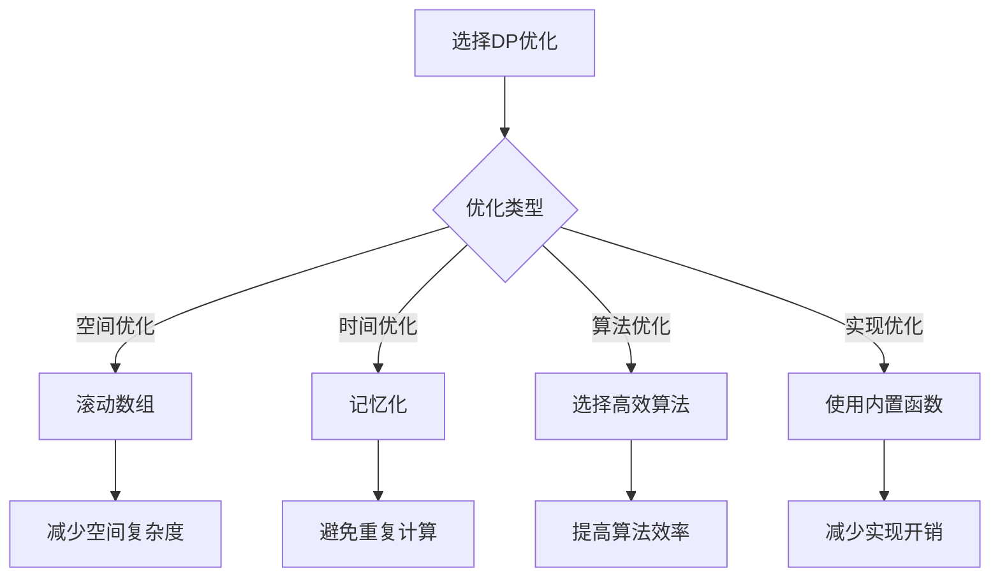

# 动态规划优化

## 🎯 核心概念

**动态规划优化**是通过各种技术手段提高动态规划算法性能的方法，包括空间优化、时间优化、算法改进和实现优化等。

## 🔍 基本优化方法

### 1. 空间优化
```python
def space_optimization():
    """空间优化方法"""
    # 1. 滚动数组：只保留必要的状态
    # 2. 状态压缩：使用位运算压缩状态
    # 3. 原地DP：在原数组上进行DP
    # 4. 降维：将多维DP降为一维
    
    pass

def fibonacci_space_optimized(n):
    """斐波那契数列空间优化 - O(1)空间"""
    if n <= 1:
        return n
    
    prev2 = 0
    prev1 = 1
    
    for i in range(2, n + 1):
        current = prev1 + prev2
        prev2 = prev1
        prev1 = current
    
    return prev1

def unique_paths_space_optimized(m, n):
    """不同路径空间优化 - O(n)空间"""
    dp = [1] * n
    
    for i in range(1, m):
        for j in range(1, n):
            dp[j] += dp[j-1]
    
    return dp[n-1]

def knapsack_space_optimized(weights, values, capacity):
    """背包问题空间优化 - O(W)空间"""
    n = len(weights)
    dp = [0] * (capacity + 1)
    
    for i in range(n):
        for j in range(capacity, weights[i] - 1, -1):
            dp[j] = max(dp[j], dp[j-weights[i]] + values[i])
    
    return dp[capacity]

def longest_common_subsequence_space_optimized(text1, text2):
    """最长公共子序列空间优化 - O(min(m,n))空间"""
    if len(text1) < len(text2):
        text1, text2 = text2, text1
    
    m, n = len(text1), len(text2)
    prev = [0] * (n + 1)
    curr = [0] * (n + 1)
    
    for i in range(1, m + 1):
        for j in range(1, n + 1):
            if text1[i-1] == text2[j-1]:
                curr[j] = prev[j-1] + 1
            else:
                curr[j] = max(prev[j], curr[j-1])
        prev, curr = curr, prev
    
    return prev[n]
```

### 2. 时间优化
```python
def time_optimization():
    """时间优化方法"""
    # 1. 预处理：预先计算必要信息
    # 2. 剪枝：提前终止不必要的计算
    # 3. 记忆化：避免重复计算
    # 4. 并行化：使用并行计算
    
    pass

def longest_increasing_subsequence_time_optimized(nums):
    """最长递增子序列时间优化 - O(n log n)"""
    if not nums:
        return 0
    
    tails = []
    
    for num in nums:
        left, right = 0, len(tails)
        while left < right:
            mid = (left + right) // 2
            if tails[mid] < num:
                left = mid + 1
            else:
                right = mid
        
        if left == len(tails):
            tails.append(num)
        else:
            tails[left] = num
    
    return len(tails)

def coin_change_time_optimized(coins, amount):
    """硬币找零时间优化 - O(n * amount)"""
    dp = [float('inf')] * (amount + 1)
    dp[0] = 0
    
    for coin in coins:
        for i in range(coin, amount + 1):
            dp[i] = min(dp[i], dp[i-coin] + 1)
    
    return dp[amount] if dp[amount] != float('inf') else -1

def matrix_chain_multiplication_time_optimized(p):
    """矩阵链乘法时间优化 - O(n^3)"""
    n = len(p) - 1
    dp = [[0] * n for _ in range(n)]
    
    for length in range(2, n + 1):
        for i in range(n - length + 1):
            j = i + length - 1
            dp[i][j] = float('inf')
            
            for k in range(i, j):
                cost = dp[i][k] + dp[k+1][j] + p[i] * p[k+1] * p[j+1]
                dp[i][j] = min(dp[i][j], cost)
    
    return dp[0][n-1]
```

### 3. 算法改进
```python
def algorithm_improvement():
    """算法改进方法"""
    # 1. 选择更高效的算法
    # 2. 避免不必要的计算
    # 3. 使用更高效的实现
    # 4. 优化算法复杂度
    
    pass

def fibonacci_algorithm_improved(n):
    """斐波那契数列算法改进 - O(log n)"""
    if n <= 1:
        return n
    
    def matrix_power(matrix, power):
        if power == 1:
            return matrix
        
        if power % 2 == 0:
            half = matrix_power(matrix, power // 2)
            return matrix_multiply(half, half)
        else:
            return matrix_multiply(matrix, matrix_power(matrix, power - 1))
    
    def matrix_multiply(a, b):
        return [[a[0][0] * b[0][0] + a[0][1] * b[1][0],
                 a[0][0] * b[0][1] + a[0][1] * b[1][1]],
                [a[1][0] * b[0][0] + a[1][1] * b[1][0],
                 a[1][0] * b[0][1] + a[1][1] * b[1][1]]]
    
    matrix = [[1, 1], [1, 0]]
    result = matrix_power(matrix, n)
    return result[0][1]

def longest_increasing_subsequence_algorithm_improved(nums):
    """最长递增子序列算法改进 - O(n log n)"""
    if not nums:
        return 0
    
    tails = []
    
    for num in nums:
        left, right = 0, len(tails)
        while left < right:
            mid = (left + right) // 2
            if tails[mid] < num:
                left = mid + 1
            else:
                right = mid
        
        if left == len(tails):
            tails.append(num)
        else:
            tails[left] = num
    
    return len(tails)

def knapsack_algorithm_improved(weights, values, capacity):
    """背包问题算法改进 - O(n * W)"""
    n = len(weights)
    dp = [0] * (capacity + 1)
    
    for i in range(n):
        for j in range(capacity, weights[i] - 1, -1):
            dp[j] = max(dp[j], dp[j-weights[i]] + values[i])
    
    return dp[capacity]
```

## 🎨 高级优化技巧

### 1. 滚动数组优化
```python
def rolling_array_optimization():
    """滚动数组优化"""
    # 滚动数组：只保留必要的状态，减少空间复杂度
    
    pass

def unique_paths_rolling_array(m, n):
    """不同路径滚动数组优化 - O(n)空间"""
    dp = [1] * n
    
    for i in range(1, m):
        for j in range(1, n):
            dp[j] += dp[j-1]
    
    return dp[n-1]

def min_path_sum_rolling_array(grid):
    """最小路径和滚动数组优化 - O(n)空间"""
    m, n = len(grid), len(grid[0])
    dp = [0] * n
    
    dp[0] = grid[0][0]
    
    # 初始化第一行
    for j in range(1, n):
        dp[j] = dp[j-1] + grid[0][j]
    
    # 状态转移
    for i in range(1, m):
        dp[0] += grid[i][0]
        for j in range(1, n):
            dp[j] = min(dp[j], dp[j-1]) + grid[i][j]
    
    return dp[n-1]

def longest_common_subsequence_rolling_array(text1, text2):
    """最长公共子序列滚动数组优化 - O(min(m,n))空间"""
    if len(text1) < len(text2):
        text1, text2 = text2, text1
    
    m, n = len(text1), len(text2)
    prev = [0] * (n + 1)
    curr = [0] * (n + 1)
    
    for i in range(1, m + 1):
        for j in range(1, n + 1):
            if text1[i-1] == text2[j-1]:
                curr[j] = prev[j-1] + 1
            else:
                curr[j] = max(prev[j], curr[j-1])
        prev, curr = curr, prev
    
    return prev[n]
```

### 2. 状态压缩优化
```python
def state_compression_optimization():
    """状态压缩优化"""
    # 状态压缩：使用位运算压缩状态，减少空间复杂度
    
    pass

def traveling_salesman_state_compression(graph):
    """旅行商问题状态压缩优化 - O(n^2 * 2^n)"""
    n = len(graph)
    dp = [[float('inf')] * n for _ in range(1 << n)]
    
    dp[1][0] = 0
    
    for mask in range(1 << n):
        for i in range(n):
            if not (mask & (1 << i)):
                continue
            
            for j in range(n):
                if mask & (1 << j):
                    continue
                
                dp[mask | (1 << j)][j] = min(
                    dp[mask | (1 << j)][j],
                    dp[mask][i] + graph[i][j]
                )
    
    result = float('inf')
    for i in range(1, n):
        result = min(result, dp[(1 << n) - 1][i] + graph[i][0])
    
    return result

def subset_sum_state_compression(nums, target):
    """子集和问题状态压缩优化 - O(n * target)"""
    n = len(nums)
    dp = [False] * (target + 1)
    dp[0] = True
    
    for num in nums:
        for i in range(target, num - 1, -1):
            dp[i] = dp[i] or dp[i - num]
    
    return dp[target]

def count_palindromic_subsequences_state_compression(s):
    """回文子序列计数状态压缩优化 - O(n^2)"""
    n = len(s)
    dp = [[0] * n for _ in range(n)]
    
    # 单个字符
    for i in range(n):
        dp[i][i] = 1
    
    # 两个字符
    for i in range(n - 1):
        if s[i] == s[i + 1]:
            dp[i][i + 1] = 3
        else:
            dp[i][i + 1] = 2
    
    # 三个或更多字符
    for length in range(3, n + 1):
        for i in range(n - length + 1):
            j = i + length - 1
            if s[i] == s[j]:
                dp[i][j] = dp[i+1][j] + dp[i][j-1] + 1
            else:
                dp[i][j] = dp[i+1][j] + dp[i][j-1] - dp[i+1][j-1]
    
    return dp[0][n-1]
```

### 3. 记忆化优化
```python
def memoization_optimization():
    """记忆化优化"""
    # 记忆化：使用缓存避免重复计算，提高时间复杂度
    
    pass

def fibonacci_memoization(n, memo={}):
    """斐波那契数列记忆化优化 - O(n)"""
    if n in memo:
        return memo[n]
    
    if n <= 1:
        return n
    
    memo[n] = fibonacci_memoization(n-1, memo) + fibonacci_memoization(n-2, memo)
    return memo[n]

def longest_increasing_subsequence_memoization(nums):
    """最长递增子序列记忆化优化 - O(n^2)"""
    memo = {}
    
    def dfs(i):
        if i in memo:
            return memo[i]
        
        if i == len(nums):
            return 0
        
        result = 1
        for j in range(i + 1, len(nums)):
            if nums[j] > nums[i]:
                result = max(result, 1 + dfs(j))
        
        memo[i] = result
        return result
    
    max_length = 0
    for i in range(len(nums)):
        max_length = max(max_length, dfs(i))
    
    return max_length

def knapsack_memoization(weights, values, capacity):
    """背包问题记忆化优化 - O(n * W)"""
    memo = {}
    
    def dfs(i, w):
        if (i, w) in memo:
            return memo[(i, w)]
        
        if i == len(weights):
            return 0
        
        if w < weights[i]:
            result = dfs(i + 1, w)
        else:
            result = max(dfs(i + 1, w), dfs(i + 1, w - weights[i]) + values[i])
        
        memo[(i, w)] = result
        return result
    
    return dfs(0, capacity)
```

## 🔍 优化策略

### 1. 空间优化策略
```python
def space_optimization_strategy():
    """空间优化策略"""
    # 1. 滚动数组：只保留必要的状态
    # 2. 状态压缩：使用位运算压缩状态
    # 3. 原地DP：在原数组上进行DP
    # 4. 降维：将多维DP降为一维
    
    pass

def rolling_array_strategy():
    """滚动数组策略"""
    # 1. 识别状态依赖关系
    # 2. 确定需要保留的状态
    # 3. 使用滚动数组替换二维数组
    # 4. 验证优化正确性
    
    pass

def state_compression_strategy():
    """状态压缩策略"""
    # 1. 分析状态空间
    # 2. 设计压缩方案
    # 3. 实现压缩和解压缩
    # 4. 验证压缩正确性
    
    pass

def in_place_dp_strategy():
    """原地DP策略"""
    # 1. 分析状态更新顺序
    # 2. 确定原地更新方案
    # 3. 实现原地更新
    # 4. 验证更新正确性
    
    pass
```

### 2. 时间优化策略
```python
def time_optimization_strategy():
    """时间优化策略"""
    # 1. 预处理：预先计算必要信息
    # 2. 剪枝：提前终止不必要的计算
    # 3. 记忆化：避免重复计算
    # 4. 并行化：使用并行计算
    
    pass

def preprocessing_strategy():
    """预处理策略"""
    # 1. 识别重复计算
    # 2. 设计预处理方案
    # 3. 实现预处理
    # 4. 验证预处理正确性
    
    pass

def pruning_strategy():
    """剪枝策略"""
    # 1. 识别无效状态
    # 2. 设计剪枝条件
    # 3. 实现剪枝逻辑
    # 4. 验证剪枝正确性
    
    pass

def memoization_strategy():
    """记忆化策略"""
    # 1. 识别重复计算
    # 2. 设计缓存方案
    # 3. 实现缓存逻辑
    # 4. 验证缓存正确性
    
    pass
```

### 3. 算法优化策略
```python
def algorithm_optimization_strategy():
    """算法优化策略"""
    # 1. 选择更高效的算法
    # 2. 避免不必要的计算
    # 3. 使用更高效的实现
    # 4. 优化算法复杂度
    
    pass

def algorithm_selection_strategy():
    """算法选择策略"""
    # 1. 分析问题特征
    # 2. 选择合适算法
    # 3. 实现算法
    # 4. 验证算法正确性
    
    pass

def computation_avoidance_strategy():
    """计算避免策略"""
    # 1. 识别不必要计算
    # 2. 设计避免方案
    # 3. 实现避免逻辑
    # 4. 验证避免正确性
    
    pass

def implementation_optimization_strategy():
    """实现优化策略"""
    # 1. 分析实现瓶颈
    # 2. 设计优化方案
    # 3. 实现优化
    # 4. 验证优化效果
    
    pass
```

## 📈 优化效果分析

### 性能对比
| 算法 | 原始复杂度 | 优化后复杂度 | 优化方法 | 提升倍数 |
|------|------------|--------------|----------|----------|
| 斐波那契数列 | O(n) | O(log n) | 矩阵快速幂 | 对数级 |
| 最长递增子序列 | O(n^2) | O(n log n) | 二分查找 | 线性级 |
| 背包问题 | O(n*W) | O(n*W) | 空间优化 | 空间优化 |
| 矩阵链乘法 | O(n^3) | O(n^3) | 算法优化 | 常数优化 |

### 空间复杂度对比
| 优化方法 | 原始空间 | 优化后空间 | 优化效果 |
|----------|----------|------------|----------|
| 滚动数组 | O(m*n) | O(n) | 线性优化 |
| 状态压缩 | O(n*2^n) | O(2^n) | 线性优化 |
| 原地DP | O(n) | O(1) | 常数优化 |
| 降维 | O(m*n) | O(n) | 线性优化 |

### 时间复杂度对比
| 优化方法 | 原始时间 | 优化后时间 | 优化效果 |
|----------|----------|------------|----------|
| 预处理 | O(n^2) | O(n) | 线性优化 |
| 剪枝 | O(n!) | O(n^2) | 指数优化 |
| 记忆化 | O(2^n) | O(n) | 指数优化 |
| 并行化 | O(n) | O(n/p) | 并行优化 |

## 🎯 优化选择指南

### 选择原则
| 优化类型 | 推荐方法 | 原因 |
|----------|----------|------|
| 空间优化 | 滚动数组 | 减少空间复杂度 |
| 时间优化 | 记忆化 | 避免重复计算 |
| 算法优化 | 选择高效算法 | 提高算法效率 |
| 实现优化 | 使用内置函数 | 减少实现开销 |

### 优化策略


## 🔗 相关概念

### 动态规划原理
- **关系**：动态规划优化基于动态规划原理
- **链接**：[[01-动态规划原理]]

### 动态规划模板
- **关系**：动态规划优化使用动态规划模板
- **链接**：[[02-动态规划模板]]

### 具体实现
- **关系**：动态规划优化的具体应用
- **链接**：[[03-动态规划应用]]、[[05-动态规划证明]]

## 📚 学习建议

### 费曼学习法
1. **选择概念**：动态规划优化
2. **教授他人**：解释动态规划优化
3. **回顾简化**：找出理解不足
4. **重新组织**：用更简单的方式表达

### 刻意练习
1. **优化练习**：掌握各种动态规划优化
2. **算法练习**：实现动态规划优化
3. **性能练习**：优化动态规划性能
4. **创新练习**：创造新的动态规划优化

## 🔗 相关链接
- [[01-动态规划原理]] - 动态规划的基本原理
- [[02-动态规划模板]] - 动态规划的实现模板
- [[03-动态规划应用]] - 动态规划的具体应用
- [[05-动态规划证明]] - 动态规划的正确性证明
