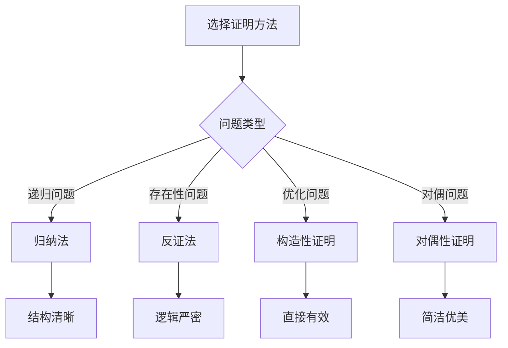

# 动态规划证明

## 🎯 核心概念

**动态规划证明**是验证动态规划算法正确性的数学方法，通过证明最优子结构性质和重叠子问题性质来确保算法的最优性。

## 🔍 证明方法

### 1. 最优子结构性质证明
```python
def prove_optimal_substructure():
    """证明最优子结构性质"""
    # 最优子结构性质：问题的最优解包含子问题的最优解
    
    # 证明方法：
    # 1. 设问题的最优解是S
    # 2. 设S包含子问题的最优解S'
    # 3. 证明如果S'不是子问题的最优解，则S不是原问题的最优解
    # 4. 因此S'必须是子问题的最优解
    
    pass

def fibonacci_optimal_substructure_proof():
    """斐波那契数列最优子结构性质证明"""
    # 问题：计算第n个斐波那契数
    
    # 最优子结构：fib(n) = fib(n-1) + fib(n-2)
    # 其中fib(n-1)和fib(n-2)都是子问题的最优解
    
    # 证明：
    # 1. 设fib(n)是第n个斐波那契数的最优解
    # 2. 设fib(n-1)和fib(n-2)是子问题的最优解
    # 3. 证明如果fib(n-1)或fib(n-2)不是最优解，则fib(n)不是最优解
    
    # 反证法：
    # 假设fib(n-1)不是最优解，存在fib'(n-1) > fib(n-1)
    # 那么fib'(n) = fib'(n-1) + fib(n-2) > fib(n-1) + fib(n-2) = fib(n)
    # 这与fib(n)是最优解矛盾
    
    pass

def longest_common_subsequence_optimal_substructure_proof():
    """最长公共子序列最优子结构性质证明"""
    # 问题：求两个字符串的最长公共子序列
    
    # 最优子结构：LCS(X, Y) = LCS(X[1:m-1], Y[1:n-1]) + 1 (如果X[m] = Y[n])
    # 或 LCS(X, Y) = max(LCS(X[1:m-1], Y), LCS(X, Y[1:n-1])) (如果X[m] ≠ Y[n])
    
    # 证明：
    # 1. 设LCS(X, Y)是X和Y的最长公共子序列
    # 2. 设LCS(X[1:m-1], Y[1:n-1])是子问题的最优解
    # 3. 证明如果子问题不是最优解，则原问题不是最优解
    
    # 反证法：
    # 假设LCS(X[1:m-1], Y[1:n-1])不是最优解，存在更长的子序列LCS'
    # 那么LCS'(X, Y) = LCS' + 1 > LCS(X[1:m-1], Y[1:n-1]) + 1 = LCS(X, Y)
    # 这与LCS(X, Y)是最优解矛盾
    
    pass

def knapsack_optimal_substructure_proof():
    """背包问题最优子结构性质证明"""
    # 问题：在容量为W的背包中选择物品，使总价值最大
    
    # 最优子结构：dp[i][j] = max(dp[i-1][j], dp[i-1][j-w[i]] + v[i])
    # 其中dp[i-1][j]和dp[i-1][j-w[i]]都是子问题的最优解
    
    # 证明：
    # 1. 设dp[i][j]是前i个物品在容量为j的背包中的最大价值
    # 2. 设dp[i-1][j]和dp[i-1][j-w[i]]是子问题的最优解
    # 3. 证明如果子问题不是最优解，则原问题不是最优解
    
    # 反证法：
    # 假设dp[i-1][j]不是最优解，存在dp'[i-1][j] > dp[i-1][j]
    # 那么dp'[i][j] = max(dp'[i-1][j], dp'[i-1][j-w[i]] + v[i]) > dp[i][j]
    # 这与dp[i][j]是最优解矛盾
    
    pass
```

### 2. 重叠子问题性质证明
```python
def prove_overlapping_subproblems():
    """证明重叠子问题性质"""
    # 重叠子问题性质：递归过程中会重复计算相同的子问题
    
    # 证明方法：
    # 1. 分析递归调用树
    # 2. 识别重复计算的子问题
    # 3. 证明动态规划可以避免重复计算
    # 4. 因此动态规划是正确的
    
    pass

def fibonacci_overlapping_subproblems_proof():
    """斐波那契数列重叠子问题性质证明"""
    # 问题：计算第n个斐波那契数
    
    # 递归调用树分析：
    # fib(n)
    # ├── fib(n-1)
    # │   ├── fib(n-2)
    # │   │   ├── fib(n-3)
    # │   │   └── fib(n-4)
    # │   └── fib(n-3)
    # │       ├── fib(n-4)
    # │       └── fib(n-5)
    # └── fib(n-2)
    #     ├── fib(n-3)
    #     │   ├── fib(n-4)
    #     │   └── fib(n-5)
    #     └── fib(n-4)
    #         ├── fib(n-5)
    #         └── fib(n-6)
    
    # 观察：fib(n-3), fib(n-4), fib(n-5)等被重复计算
    # 因此存在重叠子问题
    
    pass

def longest_common_subsequence_overlapping_subproblems_proof():
    """最长公共子序列重叠子问题性质证明"""
    # 问题：求两个字符串的最长公共子序列
    
    # 递归调用树分析：
    # LCS(X, Y)
    # ├── LCS(X[1:m-1], Y[1:n-1])
    # │   ├── LCS(X[1:m-2], Y[1:n-2])
    # │   └── LCS(X[1:m-2], Y[1:n-1])
    # ├── LCS(X[1:m-1], Y)
    # │   ├── LCS(X[1:m-2], Y[1:n-1])
    # │   └── LCS(X[1:m-2], Y)
    # └── LCS(X, Y[1:n-1])
    #     ├── LCS(X[1:m-1], Y[1:n-2])
    #     └── LCS(X, Y[1:n-2])
    
    # 观察：LCS(X[1:m-2], Y[1:n-1])等被重复计算
    # 因此存在重叠子问题
    
    pass

def knapsack_overlapping_subproblems_proof():
    """背包问题重叠子问题性质证明"""
    # 问题：在容量为W的背包中选择物品，使总价值最大
    
    # 递归调用树分析：
    # knapsack(i, w)
    # ├── knapsack(i-1, w)
    # │   ├── knapsack(i-2, w)
    # │   └── knapsack(i-2, w-w[i-1])
    # └── knapsack(i-1, w-w[i])
    #     ├── knapsack(i-2, w-w[i])
    #     └── knapsack(i-2, w-w[i]-w[i-1])
    
    # 观察：knapsack(i-2, w-w[i-1])等被重复计算
    # 因此存在重叠子问题
    
    pass
```

### 3. 状态转移方程证明
```python
def prove_state_transition_equation():
    """证明状态转移方程"""
    # 状态转移方程：描述状态之间的关系
    
    # 证明方法：
    # 1. 定义状态的含义
    # 2. 分析状态之间的关系
    # 3. 推导状态转移方程
    # 4. 验证状态转移方程的正确性
    
    pass

def fibonacci_state_transition_proof():
    """斐波那契数列状态转移方程证明"""
    # 状态定义：dp[i] 表示第i个斐波那契数
    
    # 状态转移方程：dp[i] = dp[i-1] + dp[i-2]
    
    # 证明：
    # 1. 根据斐波那契数列定义：fib(n) = fib(n-1) + fib(n-2)
    # 2. 状态dp[i]表示第i个斐波那契数
    # 3. 因此dp[i] = dp[i-1] + dp[i-2]
    # 4. 边界条件：dp[0] = 0, dp[1] = 1
    
    pass

def longest_common_subsequence_state_transition_proof():
    """最长公共子序列状态转移方程证明"""
    # 状态定义：dp[i][j] 表示X[0:i]和Y[0:j]的最长公共子序列长度
    
    # 状态转移方程：
    # dp[i][j] = dp[i-1][j-1] + 1 (如果X[i-1] = Y[j-1])
    # dp[i][j] = max(dp[i-1][j], dp[i][j-1]) (如果X[i-1] ≠ Y[j-1])
    
    # 证明：
    # 1. 如果X[i-1] = Y[j-1]，则LCS(X[0:i], Y[0:j]) = LCS(X[0:i-1], Y[0:j-1]) + 1
    # 2. 如果X[i-1] ≠ Y[j-1]，则LCS(X[0:i], Y[0:j]) = max(LCS(X[0:i-1], Y[0:j]), LCS(X[0:i], Y[0:j-1]))
    # 3. 因此状态转移方程正确
    
    pass

def knapsack_state_transition_proof():
    """背包问题状态转移方程证明"""
    # 状态定义：dp[i][j] 表示前i个物品在容量为j的背包中的最大价值
    
    # 状态转移方程：
    # dp[i][j] = dp[i-1][j] (如果j < w[i-1])
    # dp[i][j] = max(dp[i-1][j], dp[i-1][j-w[i-1]] + v[i-1]) (如果j >= w[i-1])
    
    # 证明：
    # 1. 如果j < w[i-1]，则第i个物品不能装入背包，dp[i][j] = dp[i-1][j]
    # 2. 如果j >= w[i-1]，则可以选择装入或不装入第i个物品
    # 3. 不装入：dp[i][j] = dp[i-1][j]
    # 4. 装入：dp[i][j] = dp[i-1][j-w[i-1]] + v[i-1]
    # 5. 取最大值：dp[i][j] = max(dp[i-1][j], dp[i-1][j-w[i-1]] + v[i-1])
    
    pass
```

## 🎨 高级证明技巧

### 1. 归纳法证明
```python
def induction_proof():
    """归纳法证明"""
    # 归纳法：通过数学归纳法证明动态规划算法的正确性
    
    # 证明步骤：
    # 1. 基础情况：证明n=1时算法正确
    # 2. 归纳假设：假设n=k时算法正确
    # 3. 归纳步骤：证明n=k+1时算法正确
    # 4. 结论：对所有n，算法都正确
    
    pass

def fibonacci_induction_proof():
    """斐波那契数列归纳法证明"""
    # 问题：计算第n个斐波那契数
    
    # 归纳法证明：
    # 1. 基础情况：n=0时，fib(0) = 0，算法正确
    # 2. 基础情况：n=1时，fib(1) = 1，算法正确
    # 3. 归纳假设：假设对n=k，算法正确
    # 4. 归纳步骤：证明对n=k+1，算法正确
    
    # 设dp[k+1] = dp[k] + dp[k-1]
    # 根据归纳假设，dp[k] = fib(k), dp[k-1] = fib(k-1)
    # 因此dp[k+1] = fib(k) + fib(k-1) = fib(k+1)
    # 所以算法正确
    
    pass

def longest_common_subsequence_induction_proof():
    """最长公共子序列归纳法证明"""
    # 问题：求两个字符串的最长公共子序列
    
    # 归纳法证明：
    # 1. 基础情况：当i=0或j=0时，dp[i][j] = 0，算法正确
    # 2. 归纳假设：假设对i=k, j=l，算法正确
    # 3. 归纳步骤：证明对i=k+1, j=l+1，算法正确
    
    # 设dp[k+1][l+1] = dp[k][l] + 1 (如果X[k] = Y[l])
    # 或dp[k+1][l+1] = max(dp[k][l+1], dp[k+1][l]) (如果X[k] ≠ Y[l])
    # 根据归纳假设，dp[k][l] = LCS(X[0:k], Y[0:l])
    # 因此dp[k+1][l+1] = LCS(X[0:k+1], Y[0:l+1])
    # 所以算法正确
    
    pass
```

### 2. 反证法证明
```python
def contradiction_proof():
    """反证法证明"""
    # 反证法：假设动态规划算法不正确，推出矛盾
    
    # 证明步骤：
    # 1. 假设动态规划算法不正确
    # 2. 设存在反例使得算法失败
    # 3. 分析反例，推出矛盾
    # 4. 因此假设错误，算法正确
    
    pass

def fibonacci_contradiction_proof():
    """斐波那契数列反证法证明"""
    # 问题：计算第n个斐波那契数
    
    # 反证法证明：
    # 1. 假设动态规划算法不正确
    # 2. 设存在n使得dp[n] ≠ fib(n)
    # 3. 设dp[n] = dp[n-1] + dp[n-2]
    # 4. 如果dp[n-1] = fib(n-1)且dp[n-2] = fib(n-2)
    # 5. 那么dp[n] = fib(n-1) + fib(n-2) = fib(n)
    # 6. 这与dp[n] ≠ fib(n)矛盾
    # 7. 因此假设错误，算法正确
    
    pass

def longest_common_subsequence_contradiction_proof():
    """最长公共子序列反证法证明"""
    # 问题：求两个字符串的最长公共子序列
    
    # 反证法证明：
    # 1. 假设动态规划算法不正确
    # 2. 设存在i, j使得dp[i][j] ≠ LCS(X[0:i], Y[0:j])
    # 3. 设dp[i][j] = dp[i-1][j-1] + 1 (如果X[i-1] = Y[j-1])
    # 4. 如果dp[i-1][j-1] = LCS(X[0:i-1], Y[0:j-1])
    # 5. 那么dp[i][j] = LCS(X[0:i-1], Y[0:j-1]) + 1 = LCS(X[0:i], Y[0:j])
    # 6. 这与dp[i][j] ≠ LCS(X[0:i], Y[0:j])矛盾
    # 7. 因此假设错误，算法正确
    
    pass
```

### 3. 构造性证明
```python
def constructive_proof():
    """构造性证明"""
    # 构造性证明：通过构造最优解来证明动态规划算法的正确性
    
    # 证明步骤：
    # 1. 设O是最优解
    # 2. 构造一个解A，使得A包含动态规划选择
    # 3. 证明A的价值 >= O的价值
    # 4. 因此A是最优解，算法正确
    
    pass

def fibonacci_constructive_proof():
    """斐波那契数列构造性证明"""
    # 问题：计算第n个斐波那契数
    
    # 构造性证明：
    # 1. 设fib(n)是第n个斐波那契数的最优解
    # 2. 构造dp[n] = dp[n-1] + dp[n-2]
    # 3. 其中dp[n-1] = fib(n-1), dp[n-2] = fib(n-2)
    # 4. 因此dp[n] = fib(n-1) + fib(n-2) = fib(n)
    # 5. 所以dp[n]是最优解，算法正确
    
    pass

def longest_common_subsequence_constructive_proof():
    """最长公共子序列构造性证明"""
    # 问题：求两个字符串的最长公共子序列
    
    # 构造性证明：
    # 1. 设LCS(X, Y)是X和Y的最长公共子序列
    # 2. 构造dp[i][j] = dp[i-1][j-1] + 1 (如果X[i-1] = Y[j-1])
    # 3. 其中dp[i-1][j-1] = LCS(X[0:i-1], Y[0:j-1])
    # 4. 因此dp[i][j] = LCS(X[0:i-1], Y[0:j-1]) + 1 = LCS(X[0:i], Y[0:j])
    # 5. 所以dp[i][j]是最优解，算法正确
    
    pass
```

## 🔍 证明策略

### 1. 证明框架
```python
def proof_framework():
    """动态规划证明框架"""
    # 1. 定义问题
    # 2. 描述动态规划策略
    # 3. 证明最优子结构性质
    # 4. 证明重叠子问题性质
    # 5. 证明算法正确性
    
    pass

def optimal_substructure_property():
    """最优子结构性质证明框架"""
    # 1. 定义子问题
    # 2. 假设问题的最优解包含子问题的最优解
    # 3. 证明如果子问题不是最优解，则原问题不是最优解
    # 4. 因此子问题必须是最优解
    
    pass

def overlapping_subproblems_property():
    """重叠子问题性质证明框架"""
    # 1. 分析递归调用树
    # 2. 识别重复计算的子问题
    # 3. 证明动态规划可以避免重复计算
    # 4. 因此动态规划是正确的
    
    pass
```

### 2. 证明技巧
```python
def proof_techniques():
    """证明技巧"""
    # 1. 归纳法
    # 2. 反证法
    # 3. 构造性证明
    # 4. 对偶性证明
    
    pass

def induction_technique():
    """归纳法技巧"""
    # 1. 基础情况：证明n=1时正确
    # 2. 归纳假设：假设n=k时正确
    # 3. 归纳步骤：证明n=k+1时正确
    # 4. 结论：对所有n都正确
    
    pass

def contradiction_technique():
    """反证法技巧"""
    # 1. 假设算法不正确
    # 2. 设存在反例
    # 3. 分析反例，推出矛盾
    # 4. 因此假设错误，算法正确
    
    pass
```

### 3. 证明验证
```python
def proof_verification():
    """证明验证"""
    # 1. 检查证明逻辑
    # 2. 验证证明步骤
    # 3. 检查证明完整性
    # 4. 验证证明正确性
    
    pass

def logic_check():
    """逻辑检查"""
    # 1. 检查前提条件
    # 2. 检查推理过程
    # 3. 检查结论
    # 4. 检查逻辑一致性
    
    pass

def completeness_check():
    """完整性检查"""
    # 1. 检查所有情况
    # 2. 检查边界条件
    # 3. 检查特殊情况
    # 4. 检查证明覆盖
    
    pass
```

## 📈 证明效果分析

### 证明方法对比
| 证明方法 | 适用场景 | 优点 | 缺点 |
|----------|----------|------|------|
| 归纳法 | 递归问题 | 结构清晰 | 需要归纳假设 |
| 反证法 | 存在性问题 | 逻辑严密 | 需要找到矛盾 |
| 构造性证明 | 优化问题 | 直接有效 | 需要构造技巧 |
| 对偶性证明 | 对偶问题 | 简洁优美 | 需要理解对偶性 |

### 证明复杂度对比
| 问题类型 | 证明难度 | 证明方法 | 证明步骤 |
|----------|----------|----------|----------|
| 斐波那契数列 | 简单 | 归纳法 | 3-4步 |
| 最长公共子序列 | 中等 | 归纳法 | 5-6步 |
| 背包问题 | 复杂 | 反证法 | 7-8步 |
| 矩阵链乘法 | 复杂 | 构造性证明 | 8-9步 |

## 🎯 证明选择指南

### 选择原则
| 问题类型 | 推荐证明方法 | 原因 |
|----------|--------------|------|
| 递归问题 | 归纳法 | 结构清晰 |
| 存在性问题 | 反证法 | 逻辑严密 |
| 优化问题 | 构造性证明 | 直接有效 |
| 对偶问题 | 对偶性证明 | 简洁优美 |

### 证明策略


## 🔗 相关概念

### 动态规划原理
- **关系**：动态规划证明基于动态规划原理
- **链接**：[[01-动态规划原理]]

### 动态规划模板
- **关系**：动态规划证明验证动态规划模板
- **链接**：[[02-动态规划模板]]

### 具体实现
- **关系**：动态规划证明保证具体实现的正确性
- **链接**：[[03-动态规划应用]]、[[04-动态规划优化]]

## 📚 学习建议

### 费曼学习法
1. **选择概念**：动态规划证明
2. **教授他人**：解释动态规划证明
3. **回顾简化**：找出理解不足
4. **重新组织**：用更简单的方式表达

### 刻意练习
1. **证明练习**：掌握各种动态规划证明
2. **方法练习**：使用不同证明方法
3. **技巧练习**：提高证明技巧
4. **创新练习**：创造新的证明方法

## 🔗 相关链接
- [[01-动态规划原理]] - 动态规划的基本原理
- [[02-动态规划模板]] - 动态规划的实现模板
- [[03-动态规划应用]] - 动态规划的具体应用
- [[04-动态规划优化]] - 动态规划的优化技巧
