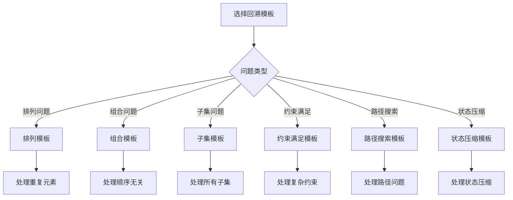

# 回溯算法模板

## 🎯 核心概念

**回溯算法模板**是解决回溯问题的标准化框架，包括状态定义、选择列表、约束条件、目标函数和回溯过程等关键步骤。

## 🔍 基本模板

### 1. 通用回溯模板
```python
def backtracking_template():
    """通用回溯算法模板"""
    def backtrack(path, choices):
        """回溯函数"""
        # 1. 检查是否达到目标
        if is_goal(path):
            result.append(path[:])
            return
        
        # 2. 遍历所有可能的选择
        for choice in choices:
            # 3. 检查约束条件
            if is_valid(path, choice):
                # 4. 做出选择
                path.append(choice)
                # 5. 递归搜索
                backtrack(path, get_next_choices(choice))
                # 6. 撤销选择（回溯）
                path.pop()
    
    result = []
    backtrack([], initial_choices)
    return result

def is_goal(path):
    """检查是否达到目标"""
    # 根据具体问题实现
    pass

def is_valid(path, choice):
    """检查选择是否有效"""
    # 根据具体问题实现
    pass

def get_next_choices(choice):
    """获取下一个可能的选择"""
    # 根据具体问题实现
    pass
```

### 2. 排列问题模板
```python
def permutation_template():
    """排列问题模板"""
    def backtrack(path, used):
        """回溯函数"""
        # 1. 检查是否达到目标
        if len(path) == len(nums):
            result.append(path[:])
            return
        
        # 2. 遍历所有可能的选择
        for i in range(len(nums)):
            # 3. 检查约束条件
            if not used[i]:
                # 4. 做出选择
                path.append(nums[i])
                used[i] = True
                # 5. 递归搜索
                backtrack(path, used)
                # 6. 撤销选择（回溯）
                path.pop()
                used[i] = False
    
    result = []
    backtrack([], [False] * len(nums))
    return result

def permute(nums):
    """全排列问题 - O(N!)"""
    def backtrack(path, used):
        if len(path) == len(nums):
            result.append(path[:])
            return
        
        for i in range(len(nums)):
            if not used[i]:
                path.append(nums[i])
                used[i] = True
                backtrack(path, used)
                path.pop()
                used[i] = False
    
    result = []
    backtrack([], [False] * len(nums))
    return result

def permute_unique(nums):
    """全排列II（包含重复元素） - O(N!)"""
    def backtrack(path, used):
        if len(path) == len(nums):
            result.append(path[:])
            return
        
        for i in range(len(nums)):
            if used[i] or (i > 0 and nums[i] == nums[i-1] and not used[i-1]):
                continue
            
            path.append(nums[i])
            used[i] = True
            backtrack(path, used)
            path.pop()
            used[i] = False
    
    result = []
    nums.sort()
    backtrack([], [False] * len(nums))
    return result
```

### 3. 组合问题模板
```python
def combination_template():
    """组合问题模板"""
    def backtrack(start, path):
        """回溯函数"""
        # 1. 检查是否达到目标
        if len(path) == k:
            result.append(path[:])
            return
        
        # 2. 遍历所有可能的选择
        for i in range(start, n + 1):
            # 3. 做出选择
            path.append(i)
            # 4. 递归搜索
            backtrack(i + 1, path)
            # 5. 撤销选择（回溯）
            path.pop()
    
    result = []
    backtrack(1, [])
    return result

def combine(n, k):
    """组合问题 - O(C(n,k))"""
    def backtrack(start, path):
        if len(path) == k:
            result.append(path[:])
            return
        
        for i in range(start, n + 1):
            path.append(i)
            backtrack(i + 1, path)
            path.pop()
    
    result = []
    backtrack(1, [])
    return result

def combination_sum(candidates, target):
    """组合总和 - O(2^N)"""
    def backtrack(start, path, remaining):
        if remaining == 0:
            result.append(path[:])
            return
        
        for i in range(start, len(candidates)):
            if candidates[i] <= remaining:
                path.append(candidates[i])
                backtrack(i, path, remaining - candidates[i])
                path.pop()
    
    result = []
    backtrack(0, [], target)
    return result
```

### 4. 子集问题模板
```python
def subset_template():
    """子集问题模板"""
    def backtrack(start, path):
        """回溯函数"""
        # 1. 添加当前路径到结果
        result.append(path[:])
        
        # 2. 遍历所有可能的选择
        for i in range(start, len(nums)):
            # 3. 做出选择
            path.append(nums[i])
            # 4. 递归搜索
            backtrack(i + 1, path)
            # 5. 撤销选择（回溯）
            path.pop()
    
    result = []
    backtrack(0, [])
    return result

def subsets(nums):
    """子集问题 - O(2^N)"""
    def backtrack(start, path):
        result.append(path[:])
        
        for i in range(start, len(nums)):
            path.append(nums[i])
            backtrack(i + 1, path)
            path.pop()
    
    result = []
    backtrack(0, [])
    return result

def subsets_with_dup(nums):
    """子集II（包含重复元素） - O(2^N)"""
    def backtrack(start, path):
        result.append(path[:])
        
        for i in range(start, len(nums)):
            if i > start and nums[i] == nums[i-1]:
                continue
            
            path.append(nums[i])
            backtrack(i + 1, path)
            path.pop()
    
    result = []
    nums.sort()
    backtrack(0, [])
    return result
```

## 🎨 高级模板

### 1. 约束满足问题模板
```python
def constraint_satisfaction_template():
    """约束满足问题模板"""
    def backtrack(state):
        """回溯函数"""
        # 1. 检查是否达到目标
        if is_complete(state):
            result.append(state[:])
            return
        
        # 2. 选择下一个变量
        var = select_variable(state)
        
        # 3. 遍历所有可能的值
        for value in get_domain(var):
            # 4. 检查约束条件
            if is_consistent(state, var, value):
                # 5. 做出选择
                state[var] = value
                # 6. 递归搜索
                backtrack(state)
                # 7. 撤销选择（回溯）
                state[var] = None
    
    result = []
    backtrack(initial_state)
    return result

def solve_n_queens(n):
    """N皇后问题 - O(N!)"""
    def is_safe(board, row, col):
        # 检查同一列
        for i in range(row):
            if board[i][col] == 1:
                return False
        
        # 检查左上对角线
        for i, j in zip(range(row-1, -1, -1), range(col-1, -1, -1)):
            if board[i][j] == 1:
                return False
        
        # 检查右上对角线
        for i, j in zip(range(row-1, -1, -1), range(col+1, n)):
            if board[i][j] == 1:
                return False
        
        return True
    
    def backtrack(board, row):
        if row == n:
            result.append([row[:] for row in board])
            return
        
        for col in range(n):
            if is_safe(board, row, col):
                board[row][col] = 1
                backtrack(board, row + 1)
                board[row][col] = 0
    
    result = []
    board = [[0] * n for _ in range(n)]
    backtrack(board, 0)
    return result

def solve_sudoku(board):
    """数独问题 - O(9^81)"""
    def is_valid(board, row, col, num):
        # 检查行
        for i in range(9):
            if board[row][i] == num:
                return False
        
        # 检查列
        for i in range(9):
            if board[i][col] == num:
                return False
        
        # 检查3x3宫格
        start_row = (row // 3) * 3
        start_col = (col // 3) * 3
        for i in range(3):
            for j in range(3):
                if board[start_row + i][start_col + j] == num:
                    return False
        
        return True
    
    def backtrack(board):
        for i in range(9):
            for j in range(9):
                if board[i][j] == '.':
                    for num in '123456789':
                        if is_valid(board, i, j, num):
                            board[i][j] = num
                            if backtrack(board):
                                return True
                            board[i][j] = '.'
                    return False
        return True
    
    backtrack(board)
    return board
```

### 2. 路径搜索问题模板
```python
def path_search_template():
    """路径搜索问题模板"""
    def backtrack(path, current):
        """回溯函数"""
        # 1. 检查是否达到目标
        if is_goal(current):
            result.append(path[:])
            return
        
        # 2. 遍历所有可能的选择
        for next_pos in get_neighbors(current):
            # 3. 检查约束条件
            if is_valid_move(current, next_pos):
                # 4. 做出选择
                path.append(next_pos)
                # 5. 递归搜索
                backtrack(path, next_pos)
                # 6. 撤销选择（回溯）
                path.pop()
    
    result = []
    backtrack([start], start)
    return result

def word_search(board, word):
    """单词搜索 - O(M*N*4^L)"""
    def backtrack(row, col, index, path):
        if index == len(word):
            return True
        
        if (row < 0 or row >= len(board) or 
            col < 0 or col >= len(board[0]) or 
            board[row][col] != word[index] or
            (row, col) in path):
            return False
        
        path.add((row, col))
        
        for dr, dc in [(0, 1), (1, 0), (0, -1), (-1, 0)]:
            if backtrack(row + dr, col + dc, index + 1, path):
                return True
        
        path.remove((row, col))
        return False
    
    for i in range(len(board)):
        for j in range(len(board[0])):
            if backtrack(i, j, 0, set()):
                return True
    
    return False

def generate_parentheses(n):
    """生成括号 - O(4^N)"""
    def backtrack(path, open_count, close_count):
        if len(path) == 2 * n:
            result.append(''.join(path))
            return
        
        if open_count < n:
            path.append('(')
            backtrack(path, open_count + 1, close_count)
            path.pop()
        
        if close_count < open_count:
            path.append(')')
            backtrack(path, open_count, close_count + 1)
            path.pop()
    
    result = []
    backtrack([], 0, 0)
    return result
```

### 3. 状态压缩问题模板
```python
def state_compression_template():
    """状态压缩问题模板"""
    def backtrack(state, path):
        """回溯函数"""
        # 1. 检查是否达到目标
        if state == target_state:
            result.append(path[:])
            return
        
        # 2. 遍历所有可能的选择
        for choice in get_choices(state):
            # 3. 检查约束条件
            if is_valid(state, choice):
                # 4. 更新状态
                new_state = update_state(state, choice)
                # 5. 做出选择
                path.append(choice)
                # 6. 递归搜索
                backtrack(new_state, path)
                # 7. 撤销选择（回溯）
                path.pop()
    
    result = []
    backtrack(initial_state, [])
    return result

def traveling_salesman(graph):
    """旅行商问题 - O(N^2 * 2^N)"""
    def backtrack(mask, pos, path, cost):
        if mask == (1 << n) - 1:
            result.append((path[:], cost + graph[pos][0]))
            return
        
        for i in range(n):
            if not (mask & (1 << i)):
                new_mask = mask | (1 << i)
                new_cost = cost + graph[pos][i]
                path.append(i)
                backtrack(new_mask, i, path, new_cost)
                path.pop()
    
    n = len(graph)
    result = []
    backtrack(1, 0, [0], 0)
    return min(result, key=lambda x: x[1])

def subset_sum_bitmask(nums, target):
    """子集和问题（位掩码） - O(2^N)"""
    def backtrack(mask, index, current_sum):
        if current_sum == target:
            result.append([nums[i] for i in range(len(nums)) if mask & (1 << i)])
            return
        
        if index >= len(nums) or current_sum > target:
            return
        
        # 不选择当前元素
        backtrack(mask, index + 1, current_sum)
        
        # 选择当前元素
        new_mask = mask | (1 << index)
        backtrack(new_mask, index + 1, current_sum + nums[index])
    
    result = []
    backtrack(0, 0, 0)
    return result
```

## 🔍 模板选择指南

### 选择原则
| 问题类型 | 推荐模板 | 原因 |
|----------|----------|------|
| 排列问题 | 排列模板 | 需要处理重复元素 |
| 组合问题 | 组合模板 | 需要处理顺序无关 |
| 子集问题 | 子集模板 | 需要处理所有子集 |
| 约束满足 | 约束满足模板 | 需要处理复杂约束 |
| 路径搜索 | 路径搜索模板 | 需要处理路径问题 |
| 状态压缩 | 状态压缩模板 | 需要处理状态压缩 |

### 模板应用


## 📈 模板优化

### 空间优化
```python
def space_optimization_template():
    """空间优化模板"""
    # 1. 使用位掩码代替数组
    # 2. 使用生成器代替列表
    # 3. 使用原地修改
    # 4. 使用缓存避免重复计算
    
    pass

def permute_space_optimized(nums):
    """空间优化的全排列 - O(1)额外空间"""
    def backtrack(start):
        if start == len(nums):
            result.append(nums[:])
            return
        
        for i in range(start, len(nums)):
            nums[start], nums[i] = nums[i], nums[start]
            backtrack(start + 1)
            nums[start], nums[i] = nums[i], nums[start]
    
    result = []
    backtrack(0)
    return result

def subsets_space_optimized(nums):
    """空间优化的子集 - O(1)额外空间"""
    def backtrack(start, path):
        result.append(path[:])
        
        for i in range(start, len(nums)):
            path.append(nums[i])
            backtrack(i + 1, path)
            path.pop()
    
    result = []
    backtrack(0, [])
    return result
```

### 时间优化
```python
def time_optimization_template():
    """时间优化模板"""
    # 1. 剪枝：提前终止不可能的分支
    # 2. 排序：排序以便剪枝和去重
    # 3. 缓存：使用缓存避免重复计算
    # 4. 并行：使用并行计算
    
    pass

def combination_sum_optimized(candidates, target):
    """时间优化的组合总和 - O(2^N)"""
    def backtrack(start, path, remaining):
        if remaining == 0:
            result.append(path[:])
            return
        
        for i in range(start, len(candidates)):
            # 剪枝：如果当前元素大于剩余值，后面的元素也都会大于剩余值
            if candidates[i] > remaining:
                break
            
            path.append(candidates[i])
            backtrack(i, path, remaining - candidates[i])
            path.pop()
    
    result = []
    candidates.sort()  # 排序以便剪枝
    backtrack(0, [], target)
    return result

def n_queens_optimized(n):
    """时间优化的N皇后 - O(N!)"""
    def is_safe(row, col, cols, diag1, diag2):
        return cols[col] == 0 and diag1[row - col + n - 1] == 0 and diag2[row + col] == 0
    
    def backtrack(row, cols, diag1, diag2, board):
        if row == n:
            result.append([row[:] for row in board])
            return
        
        for col in range(n):
            if is_safe(row, col, cols, diag1, diag2):
                board[row][col] = 1
                cols[col] = 1
                diag1[row - col + n - 1] = 1
                diag2[row + col] = 1
                
                backtrack(row + 1, cols, diag1, diag2, board)
                
                board[row][col] = 0
                cols[col] = 0
                diag1[row - col + n - 1] = 0
                diag2[row + col] = 0
    
    result = []
    board = [[0] * n for _ in range(n)]
    cols = [0] * n
    diag1 = [0] * (2 * n - 1)
    diag2 = [0] * (2 * n - 1)
    backtrack(0, cols, diag1, diag2, board)
    return result
```

## 🔗 相关概念

### 回溯算法原理
- **关系**：回溯算法模板基于回溯算法原理
- **链接**：[[01-回溯算法原理]]

### 具体应用
- **关系**：回溯算法模板的具体应用
- **链接**：[[03-回溯算法应用]]、[[04-回溯算法优化]]

### 算法证明
- **关系**：回溯算法模板的正确性证明
- **链接**：[[05-回溯算法证明]]

## 📚 学习建议

### 费曼学习法
1. **选择概念**：回溯算法模板
2. **教授他人**：解释回溯算法模板
3. **回顾简化**：找出理解不足
4. **重新组织**：用更简单的方式表达

### 刻意练习
1. **模板练习**：掌握各种回溯算法模板
2. **应用练习**：使用模板解决实际问题
3. **优化练习**：优化模板的空间和时间复杂度
4. **创新练习**：创造新的回溯算法模板

## 🔗 相关链接
- [[01-回溯算法原理]] - 回溯算法的基本原理
- [[03-回溯算法应用]] - 回溯算法的具体应用
- [[04-回溯算法优化]] - 回溯算法的优化技巧
- [[05-回溯算法证明]] - 回溯算法的正确性证明
