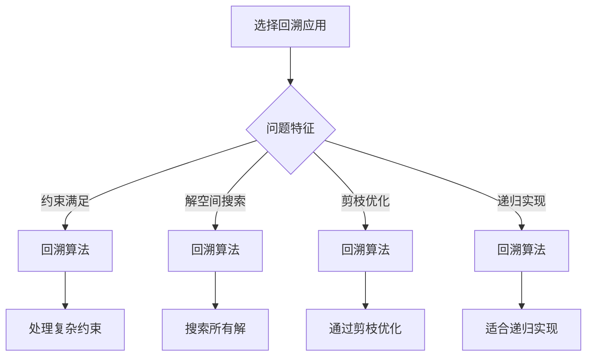

# 回溯算法应用

## 🎯 核心概念

**回溯算法应用**是将回溯算法原理和模板应用到具体问题中的实践，包括问题识别、状态设计、约束条件分析和实现优化等关键步骤。

## 🔍 经典应用

### 1. 约束满足问题
```python
def solve_n_queens(n):
    """N皇后问题 - O(N!)"""
    def is_safe(board, row, col):
        """检查在(row, col)放置皇后是否安全"""
        # 检查同一列
        for i in range(row):
            if board[i][col] == 1:
                return False
        
        # 检查左上对角线
        for i, j in zip(range(row-1, -1, -1), range(col-1, -1, -1)):
            if board[i][j] == 1:
                return False
        
        # 检查右上对角线
        for i, j in zip(range(row-1, -1, -1), range(col+1, n)):
            if board[i][j] == 1:
                return False
        
        return True
    
    def backtrack(board, row):
        """回溯函数"""
        if row == n:
            result.append([row[:] for row in board])
            return
        
        for col in range(n):
            if is_safe(board, row, col):
                board[row][col] = 1
                backtrack(board, row + 1)
                board[row][col] = 0
    
    result = []
    board = [[0] * n for _ in range(n)]
    backtrack(board, 0)
    return result

def solve_sudoku(board):
    """数独问题 - O(9^81)"""
    def is_valid(board, row, col, num):
        """检查在(row, col)放置num是否有效"""
        # 检查行
        for i in range(9):
            if board[row][i] == num:
                return False
        
        # 检查列
        for i in range(9):
            if board[i][col] == num:
                return False
        
        # 检查3x3宫格
        start_row = (row // 3) * 3
        start_col = (col // 3) * 3
        for i in range(3):
            for j in range(3):
                if board[start_row + i][start_col + j] == num:
                    return False
        
        return True
    
    def backtrack(board):
        """回溯函数"""
        for i in range(9):
            for j in range(9):
                if board[i][j] == '.':
                    for num in '123456789':
                        if is_valid(board, i, j, num):
                            board[i][j] = num
                            if backtrack(board):
                                return True
                            board[i][j] = '.'
                    return False
        return True
    
    backtrack(board)
    return board

def solve_knight_tour(n):
    """骑士巡游问题 - O(8^(N^2))"""
    def is_valid_move(x, y, board):
        """检查移动是否有效"""
        return (x >= 0 and x < n and y >= 0 and y < n and board[x][y] == -1)
    
    def backtrack(board, x, y, move_count):
        """回溯函数"""
        if move_count == n * n:
            return True
        
        # 8个可能的移动方向
        moves = [(2, 1), (1, 2), (-1, 2), (-2, 1),
                 (-2, -1), (-1, -2), (1, -2), (2, -1)]
        
        for dx, dy in moves:
            next_x = x + dx
            next_y = y + dy
            
            if is_valid_move(next_x, next_y, board):
                board[next_x][next_y] = move_count
                if backtrack(board, next_x, next_y, move_count + 1):
                    return True
                board[next_x][next_y] = -1
        
        return False
    
    board = [[-1] * n for _ in range(n)]
    board[0][0] = 0
    
    if backtrack(board, 0, 0, 1):
        return board
    else:
        return None
```

### 2. 排列组合问题
```python
def permute(nums):
    """全排列问题 - O(N!)"""
    def backtrack(path, used):
        """回溯函数"""
        if len(path) == len(nums):
            result.append(path[:])
            return
        
        for i in range(len(nums)):
            if not used[i]:
                path.append(nums[i])
                used[i] = True
                backtrack(path, used)
                path.pop()
                used[i] = False
    
    result = []
    backtrack([], [False] * len(nums))
    return result

def permute_unique(nums):
    """全排列II（包含重复元素） - O(N!)"""
    def backtrack(path, used):
        """回溯函数"""
        if len(path) == len(nums):
            result.append(path[:])
            return
        
        for i in range(len(nums)):
            if used[i] or (i > 0 and nums[i] == nums[i-1] and not used[i-1]):
                continue
            
            path.append(nums[i])
            used[i] = True
            backtrack(path, used)
            path.pop()
            used[i] = False
    
    result = []
    nums.sort()
    backtrack([], [False] * len(nums))
    return result

def combine(n, k):
    """组合问题 - O(C(n,k))"""
    def backtrack(start, path):
        """回溯函数"""
        if len(path) == k:
            result.append(path[:])
            return
        
        for i in range(start, n + 1):
            path.append(i)
            backtrack(i + 1, path)
            path.pop()
    
    result = []
    backtrack(1, [])
    return result

def combination_sum(candidates, target):
    """组合总和 - O(2^N)"""
    def backtrack(start, path, remaining):
        """回溯函数"""
        if remaining == 0:
            result.append(path[:])
            return
        
        for i in range(start, len(candidates)):
            if candidates[i] <= remaining:
                path.append(candidates[i])
                backtrack(i, path, remaining - candidates[i])
                path.pop()
    
    result = []
    backtrack(0, [], target)
    return result

def subsets(nums):
    """子集问题 - O(2^N)"""
    def backtrack(start, path):
        """回溯函数"""
        result.append(path[:])
        
        for i in range(start, len(nums)):
            path.append(nums[i])
            backtrack(i + 1, path)
            path.pop()
    
    result = []
    backtrack(0, [])
    return result

def subsets_with_dup(nums):
    """子集II（包含重复元素） - O(2^N)"""
    def backtrack(start, path):
        """回溯函数"""
        result.append(path[:])
        
        for i in range(start, len(nums)):
            if i > start and nums[i] == nums[i-1]:
                continue
            
            path.append(nums[i])
            backtrack(i + 1, path)
            path.pop()
    
    result = []
    nums.sort()
    backtrack(0, [])
    return result
```

### 3. 路径搜索问题
```python
def word_search(board, word):
    """单词搜索 - O(M*N*4^L)"""
    def backtrack(row, col, index, path):
        """回溯函数"""
        if index == len(word):
            return True
        
        if (row < 0 or row >= len(board) or 
            col < 0 or col >= len(board[0]) or 
            board[row][col] != word[index] or
            (row, col) in path):
            return False
        
        path.add((row, col))
        
        for dr, dc in [(0, 1), (1, 0), (0, -1), (-1, 0)]:
            if backtrack(row + dr, col + dc, index + 1, path):
                return True
        
        path.remove((row, col))
        return False
    
    for i in range(len(board)):
        for j in range(len(board[0])):
            if backtrack(i, j, 0, set()):
                return True
    
    return False

def generate_parentheses(n):
    """生成括号 - O(4^N)"""
    def backtrack(path, open_count, close_count):
        """回溯函数"""
        if len(path) == 2 * n:
            result.append(''.join(path))
            return
        
        if open_count < n:
            path.append('(')
            backtrack(path, open_count + 1, close_count)
            path.pop()
        
        if close_count < open_count:
            path.append(')')
            backtrack(path, open_count, close_count + 1)
            path.pop()
    
    result = []
    backtrack([], 0, 0)
    return result

def restore_ip_addresses(s):
    """恢复IP地址 - O(3^4)"""
    def is_valid_segment(segment):
        """检查IP段是否有效"""
        if len(segment) > 3 or len(segment) == 0:
            return False
        if len(segment) > 1 and segment[0] == '0':
            return False
        return 0 <= int(segment) <= 255
    
    def backtrack(start, path):
        """回溯函数"""
        if len(path) == 4 and start == len(s):
            result.append('.'.join(path))
            return
        
        if len(path) >= 4:
            return
        
        for i in range(start, min(start + 3, len(s))):
            segment = s[start:i+1]
            if is_valid_segment(segment):
                path.append(segment)
                backtrack(i + 1, path)
                path.pop()
    
    result = []
    backtrack(0, [])
    return result

def letter_combinations(digits):
    """电话号码字母组合 - O(3^N * 4^M)"""
    if not digits:
        return []
    
    phone_map = {
        '2': 'abc', '3': 'def', '4': 'ghi', '5': 'jkl',
        '6': 'mno', '7': 'pqrs', '8': 'tuv', '9': 'wxyz'
    }
    
    def backtrack(index, path):
        """回溯函数"""
        if index == len(digits):
            result.append(''.join(path))
            return
        
        digit = digits[index]
        for letter in phone_map[digit]:
            path.append(letter)
            backtrack(index + 1, path)
            path.pop()
    
    result = []
    backtrack(0, [])
    return result
```

### 4. 游戏问题
```python
def solve_maze(maze):
    """迷宫问题 - O(4^(M*N))"""
    def is_valid_move(x, y, maze):
        """检查移动是否有效"""
        return (x >= 0 and x < len(maze) and 
                y >= 0 and y < len(maze[0]) and 
                maze[x][y] == 0)
    
    def backtrack(x, y, path):
        """回溯函数"""
        if x == len(maze) - 1 and y == len(maze[0]) - 1:
            result.append(path[:])
            return
        
        directions = [(0, 1), (1, 0), (0, -1), (-1, 0)]
        
        for dx, dy in directions:
            next_x = x + dx
            next_y = y + dy
            
            if is_valid_move(next_x, next_y, maze):
                maze[next_x][next_y] = 2  # 标记为已访问
                path.append((next_x, next_y))
                backtrack(next_x, next_y, path)
                path.pop()
                maze[next_x][next_y] = 0  # 恢复
    
    result = []
    maze[0][0] = 2
    backtrack(0, 0, [(0, 0)])
    return result

def solve_8_puzzle(board):
    """8数码问题 - O(9!)"""
    def get_neighbors(board):
        """获取相邻状态"""
        neighbors = []
        empty_row, empty_col = find_empty(board)
        
        directions = [(0, 1), (1, 0), (0, -1), (-1, 0)]
        
        for dr, dc in directions:
            new_row = empty_row + dr
            new_col = empty_col + dc
            
            if 0 <= new_row < 3 and 0 <= new_col < 3:
                new_board = [row[:] for row in board]
                new_board[empty_row][empty_col] = new_board[new_row][new_col]
                new_board[new_row][new_col] = 0
                neighbors.append(new_board)
        
        return neighbors
    
    def find_empty(board):
        """找到空格位置"""
        for i in range(3):
            for j in range(3):
                if board[i][j] == 0:
                    return i, j
    
    def backtrack(board, path, visited):
        """回溯函数"""
        if board == target:
            result.append(path[:])
            return
        
        board_str = str(board)
        if board_str in visited:
            return
        
        visited.add(board_str)
        
        for neighbor in get_neighbors(board):
            path.append(neighbor)
            backtrack(neighbor, path, visited)
            path.pop()
        
        visited.remove(board_str)
    
    target = [[1, 2, 3], [4, 5, 6], [7, 8, 0]]
    result = []
    backtrack(board, [board], set())
    return result

def solve_tower_of_hanoi(n):
    """汉诺塔问题 - O(2^N)"""
    def backtrack(n, source, destination, auxiliary, moves):
        """回溯函数"""
        if n == 1:
            moves.append(f"Move disk 1 from {source} to {destination}")
            return
        
        backtrack(n - 1, source, auxiliary, destination, moves)
        moves.append(f"Move disk {n} from {source} to {destination}")
        backtrack(n - 1, auxiliary, destination, source, moves)
    
    moves = []
    backtrack(n, 'A', 'C', 'B', moves)
    return moves
```

## 🎨 高级应用

### 1. 状态压缩问题
```python
def traveling_salesman(graph):
    """旅行商问题 - O(N^2 * 2^N)"""
    def backtrack(mask, pos, path, cost):
        """回溯函数"""
        if mask == (1 << n) - 1:
            result.append((path[:], cost + graph[pos][0]))
            return
        
        for i in range(n):
            if not (mask & (1 << i)):
                new_mask = mask | (1 << i)
                new_cost = cost + graph[pos][i]
                path.append(i)
                backtrack(new_mask, i, path, new_cost)
                path.pop()
    
    n = len(graph)
    result = []
    backtrack(1, 0, [0], 0)
    return min(result, key=lambda x: x[1])

def subset_sum_bitmask(nums, target):
    """子集和问题（位掩码） - O(2^N)"""
    def backtrack(mask, index, current_sum):
        """回溯函数"""
        if current_sum == target:
            result.append([nums[i] for i in range(len(nums)) if mask & (1 << i)])
            return
        
        if index >= len(nums) or current_sum > target:
            return
        
        # 不选择当前元素
        backtrack(mask, index + 1, current_sum)
        
        # 选择当前元素
        new_mask = mask | (1 << index)
        backtrack(new_mask, index + 1, current_sum + nums[index])
    
    result = []
    backtrack(0, 0, 0)
    return result

def solve_graph_coloring(graph, colors):
    """图着色问题 - O(M^V)"""
    def is_safe(node, color, graph, color_assignment):
        """检查着色是否安全"""
        for neighbor in graph[node]:
            if color_assignment[neighbor] == color:
                return False
        return True
    
    def backtrack(node, graph, colors, color_assignment):
        """回溯函数"""
        if node == len(graph):
            result.append(color_assignment[:])
            return
        
        for color in colors:
            if is_safe(node, color, graph, color_assignment):
                color_assignment[node] = color
                backtrack(node + 1, graph, colors, color_assignment)
                color_assignment[node] = None
    
    result = []
    color_assignment = [None] * len(graph)
    backtrack(0, graph, colors, color_assignment)
    return result
```

### 2. 优化问题
```python
def solve_job_assignment(cost_matrix):
    """工作分配问题 - O(N!)"""
    def backtrack(worker, assigned, total_cost):
        """回溯函数"""
        if worker == len(cost_matrix):
            result.append((assigned[:], total_cost))
            return
        
        for job in range(len(cost_matrix[0])):
            if job not in assigned:
                assigned.append(job)
                backtrack(worker + 1, assigned, total_cost + cost_matrix[worker][job])
                assigned.pop()
    
    result = []
    backtrack(0, [], 0)
    return min(result, key=lambda x: x[1])

def solve_knapsack_01(weights, values, capacity):
    """0-1背包问题（回溯） - O(2^N)"""
    def backtrack(index, current_weight, current_value, selected):
        """回溯函数"""
        if index == len(weights):
            result.append((selected[:], current_value))
            return
        
        # 不选择当前物品
        backtrack(index + 1, current_weight, current_value, selected)
        
        # 选择当前物品
        if current_weight + weights[index] <= capacity:
            selected.append(index)
            backtrack(index + 1, current_weight + weights[index], 
                     current_value + values[index], selected)
            selected.pop()
    
    result = []
    backtrack(0, 0, 0, [])
    return max(result, key=lambda x: x[1])

def solve_partition_problem(nums):
    """分割问题 - O(2^N)"""
    def backtrack(index, subset1, subset2, sum1, sum2):
        """回溯函数"""
        if index == len(nums):
            if sum1 == sum2:
                result.append((subset1[:], subset2[:]))
            return
        
        # 将当前元素加入第一个子集
        subset1.append(nums[index])
        backtrack(index + 1, subset1, subset2, sum1 + nums[index], sum2)
        subset1.pop()
        
        # 将当前元素加入第二个子集
        subset2.append(nums[index])
        backtrack(index + 1, subset1, subset2, sum1, sum2 + nums[index])
        subset2.pop()
    
    result = []
    backtrack(0, [], [], 0, 0)
    return result
```

### 3. 搜索问题
```python
def solve_word_ladder(begin_word, end_word, word_list):
    """单词接龙 - O(N*M*26)"""
    def get_neighbors(word, word_set):
        """获取相邻单词"""
        neighbors = []
        for i in range(len(word)):
            for c in 'abcdefghijklmnopqrstuvwxyz':
                if c != word[i]:
                    new_word = word[:i] + c + word[i+1:]
                    if new_word in word_set:
                        neighbors.append(new_word)
        return neighbors
    
    def backtrack(current_word, path, word_set):
        """回溯函数"""
        if current_word == end_word:
            result.append(path[:])
            return
        
        neighbors = get_neighbors(current_word, word_set)
        for neighbor in neighbors:
            if neighbor not in path:
                path.append(neighbor)
                backtrack(neighbor, path, word_set)
                path.pop()
    
    result = []
    word_set = set(word_list)
    backtrack(begin_word, [begin_word], word_set)
    return result

def solve_palindrome_partitioning(s):
    """回文分割 - O(2^N)"""
    def is_palindrome(s, start, end):
        """检查是否为回文"""
        while start < end:
            if s[start] != s[end]:
                return False
            start += 1
            end -= 1
        return True
    
    def backtrack(start, path):
        """回溯函数"""
        if start == len(s):
            result.append(path[:])
            return
        
        for end in range(start, len(s)):
            if is_palindrome(s, start, end):
                path.append(s[start:end+1])
                backtrack(end + 1, path)
                path.pop()
    
    result = []
    backtrack(0, [])
    return result

def solve_expression_add_operators(num, target):
    """表达式添加运算符 - O(4^N)"""
    def backtrack(index, path, current_val, prev_val):
        """回溯函数"""
        if index == len(num):
            if current_val == target:
                result.append(''.join(path))
            return
        
        for i in range(index, len(num)):
            if i > index and num[index] == '0':
                break
            
            current_num = int(num[index:i+1])
            
            if index == 0:
                path.append(str(current_num))
                backtrack(i + 1, path, current_num, current_num)
                path.pop()
            else:
                # 加法
                path.append('+' + str(current_num))
                backtrack(i + 1, path, current_val + current_num, current_num)
                path.pop()
                
                # 减法
                path.append('-' + str(current_num))
                backtrack(i + 1, path, current_val - current_num, -current_num)
                path.pop()
                
                # 乘法
                path.append('*' + str(current_num))
                backtrack(i + 1, path, current_val - prev_val + prev_val * current_num, 
                         prev_val * current_num)
                path.pop()
    
    result = []
    backtrack(0, [], 0, 0)
    return result
```

## 🔍 应用策略

### 1. 问题识别
```python
def identify_backtracking_problem():
    """识别回溯问题"""
    # 1. 约束满足：问题有明确的约束条件
    # 2. 解空间搜索：需要在解空间中搜索所有可能的解
    # 3. 剪枝优化：可以通过剪枝减少搜索空间
    # 4. 递归实现：适合用递归实现
    
    pass

def check_constraint_satisfaction():
    """检查约束满足"""
    # 问题是否有明确的约束条件
    # 例如：N皇后问题中，皇后不能相互攻击
    
    pass

def check_solution_space_search():
    """检查解空间搜索"""
    # 是否需要搜索所有可能的解
    # 例如：全排列问题中，需要找到所有可能的排列
    
    pass

def check_pruning_optimization():
    """检查剪枝优化"""
    # 是否可以通过剪枝减少搜索空间
    # 例如：在搜索过程中，如果发现当前路径不可能得到解，就停止搜索
    
    pass
```

### 2. 状态设计
```python
def design_state():
    """设计状态"""
    # 1. 状态定义：明确状态的含义
    # 2. 状态表示：选择合适的表示方法
    # 3. 状态转移：设计状态转移规则
    # 4. 状态优化：优化状态空间
    
    pass

def state_definition():
    """状态定义"""
    # 状态应该能够唯一确定问题的子问题
    # 例如：在N皇后问题中，状态是棋盘上皇后的位置
    
    pass

def state_representation():
    """状态表示"""
    # 选择合适的表示方法
    # 例如：使用数组、位掩码、字符串等
    
    pass

def state_transition():
    """状态转移"""
    # 设计状态转移规则
    # 例如：在N皇后问题中，状态转移是放置一个皇后
    
    pass
```

### 3. 实现优化
```python
def optimize_implementation():
    """优化实现"""
    # 1. 空间优化：减少空间复杂度
    # 2. 时间优化：减少时间复杂度
    # 3. 代码优化：提高代码可读性
    # 4. 边界优化：处理边界情况
    
    pass

def space_optimization():
    """空间优化"""
    # 1. 使用位掩码代替数组
    # 2. 使用生成器代替列表
    # 3. 使用原地修改
    # 4. 使用缓存避免重复计算
    
    pass

def time_optimization():
    """时间优化"""
    # 1. 剪枝：提前终止不可能的分支
    # 2. 排序：排序以便剪枝和去重
    # 3. 缓存：使用缓存避免重复计算
    # 4. 并行：使用并行计算
    
    pass

def code_optimization():
    """代码优化"""
    # 1. 简化逻辑：简化状态转移逻辑
    # 2. 减少分支：减少条件分支
    # 3. 使用内置函数：使用Python内置函数
    # 4. 代码重构：重构代码结构
    
    pass
```

## 📈 应用效果分析

### 性能对比
| 问题类型 | 暴力解法 | 回溯算法 | 优化效果 |
|----------|----------|----------|----------|
| N皇后 | O(N^N) | O(N!) | 指数级优化 |
| 全排列 | O(N^N) | O(N!) | 指数级优化 |
| 组合 | O(2^N) | O(C(N,K)) | 指数级优化 |
| 子集 | O(2^N) | O(2^N) | 无优化 |

### 空间复杂度对比
| 问题类型 | 空间复杂度 | 说明 |
|----------|------------|------|
| 递归栈 | O(N) | 递归深度 |
| 状态存储 | O(N) | 存储当前状态 |
| 结果存储 | O(解的数量) | 存储所有解 |

## 🎯 应用选择指南

### 选择原则
| 问题特征 | 推荐方法 | 原因 |
|----------|----------|------|
| 约束满足 | 回溯算法 | 可以处理复杂约束 |
| 解空间搜索 | 回溯算法 | 可以搜索所有解 |
| 剪枝优化 | 回溯算法 | 可以通过剪枝优化 |
| 递归实现 | 回溯算法 | 适合用递归实现 |

### 应用策略


## 🔗 相关概念

### 回溯算法原理
- **关系**：回溯算法应用基于回溯算法原理
- **链接**：[[01-回溯算法原理]]

### 回溯算法模板
- **关系**：回溯算法应用使用回溯算法模板
- **链接**：[[02-回溯算法模板]]

### 具体实现
- **关系**：回溯算法应用的具体实现
- **链接**：[[04-回溯算法优化]]、[[05-回溯算法证明]]

## 📚 学习建议

### 费曼学习法
1. **选择概念**：回溯算法应用
2. **教授他人**：解释回溯算法应用
3. **回顾简化**：找出理解不足
4. **重新组织**：用更简单的方式表达

### 刻意练习
1. **应用练习**：掌握各种回溯算法应用
2. **问题练习**：解决实际回溯问题
3. **优化练习**：优化回溯算法应用
4. **创新练习**：创造新的回溯算法应用

## 🔗 相关链接
- [[01-回溯算法原理]] - 回溯算法的基本原理
- [[02-回溯算法模板]] - 回溯算法的实现模板
- [[04-回溯算法优化]] - 回溯算法的优化技巧
- [[05-回溯算法证明]] - 回溯算法的正确性证明
