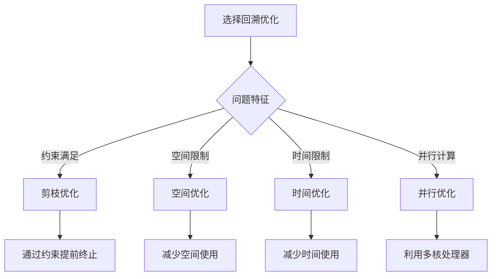

# 回溯算法优化

## 🎯 核心概念

**回溯算法优化**是通过各种技术手段提高回溯算法性能的过程，包括剪枝优化、空间优化、时间优化和算法改进等关键策略。

## 🔍 基本优化

### 1. 剪枝优化
```python
def n_queens_optimized(n):
    """N皇后问题（剪枝优化） - O(N!)"""
    def is_safe(board, row, col):
        """检查在(row, col)放置皇后是否安全"""
        # 检查同一列
        for i in range(row):
            if board[i][col] == 1:
                return False
        
        # 检查左上对角线
        for i, j in zip(range(row-1, -1, -1), range(col-1, -1, -1)):
            if board[i][j] == 1:
                return False
        
        # 检查右上对角线
        for i, j in zip(range(row-1, -1, -1), range(col+1, n)):
            if board[i][j] == 1:
                return False
        
        return True
    
    def backtrack(board, row):
        """回溯函数（剪枝优化）"""
        if row == n:
            result.append([row[:] for row in board])
            return
        
        for col in range(n):
            if is_safe(board, row, col):  # 剪枝：提前检查
                board[row][col] = 1
                backtrack(board, row + 1)
                board[row][col] = 0
    
    result = []
    board = [[0] * n for _ in range(n)]
    backtrack(board, 0)
    return result

def permute_optimized(nums):
    """全排列（剪枝优化） - O(N!)"""
    def backtrack(path, used):
        """回溯函数（剪枝优化）"""
        if len(path) == len(nums):
            result.append(path[:])
            return
        
        for i in range(len(nums)):
            if not used[i]:  # 剪枝：跳过已使用的元素
                path.append(nums[i])
                used[i] = True
                backtrack(path, used)
                path.pop()
                used[i] = False
    
    result = []
    backtrack([], [False] * len(nums))
    return result

def combination_sum_optimized(candidates, target):
    """组合总和（剪枝优化） - O(2^N)"""
    def backtrack(start, path, remaining):
        """回溯函数（剪枝优化）"""
        if remaining == 0:
            result.append(path[:])
            return
        
        for i in range(start, len(candidates)):
            if candidates[i] <= remaining:  # 剪枝：跳过大于剩余值的元素
                path.append(candidates[i])
                backtrack(i, path, remaining - candidates[i])
                path.pop()
    
    result = []
    candidates.sort()  # 排序以便剪枝
    backtrack(0, [], target)
    return result

def subsets_optimized(nums):
    """子集（剪枝优化） - O(2^N)"""
    def backtrack(start, path):
        """回溯函数（剪枝优化）"""
        result.append(path[:])
        
        for i in range(start, len(nums)):
            path.append(nums[i])
            backtrack(i + 1, path)
            path.pop()
    
    result = []
    backtrack(0, [])
    return result
```

### 2. 空间优化
```python
def n_queens_space_optimized(n):
    """N皇后问题（空间优化） - O(N!)"""
    def is_safe(row, col, queens):
        """检查在(row, col)放置皇后是否安全"""
        for i in range(row):
            if queens[i] == col or abs(queens[i] - col) == abs(i - row):
                return False
        return True
    
    def backtrack(row, queens):
        """回溯函数（空间优化）"""
        if row == n:
            result.append(queens[:])
            return
        
        for col in range(n):
            if is_safe(row, col, queens):
                queens[row] = col
                backtrack(row + 1, queens)
                queens[row] = -1
    
    result = []
    queens = [-1] * n
    backtrack(0, queens)
    return result

def permute_space_optimized(nums):
    """全排列（空间优化） - O(N!)"""
    def backtrack(start):
        """回溯函数（空间优化）"""
        if start == len(nums):
            result.append(nums[:])
            return
        
        for i in range(start, len(nums)):
            nums[start], nums[i] = nums[i], nums[start]
            backtrack(start + 1)
            nums[start], nums[i] = nums[i], nums[start]
    
    result = []
    backtrack(0)
    return result

def combination_space_optimized(n, k):
    """组合（空间优化） - O(C(n,k))"""
    def backtrack(start, path):
        """回溯函数（空间优化）"""
        if len(path) == k:
            result.append(path[:])
            return
        
        for i in range(start, n + 1):
            path.append(i)
            backtrack(i + 1, path)
            path.pop()
    
    result = []
    backtrack(1, [])
    return result

def subsets_space_optimized(nums):
    """子集（空间优化） - O(2^N)"""
    def backtrack(start, path):
        """回溯函数（空间优化）"""
        result.append(path[:])
        
        for i in range(start, len(nums)):
            path.append(nums[i])
            backtrack(i + 1, path)
            path.pop()
    
    result = []
    backtrack(0, [])
    return result
```

### 3. 时间优化
```python
def n_queens_time_optimized(n):
    """N皇后问题（时间优化） - O(N!)"""
    def is_safe(row, col, queens):
        """检查在(row, col)放置皇后是否安全（时间优化）"""
        for i in range(row):
            if queens[i] == col or abs(queens[i] - col) == abs(i - row):
                return False
        return True
    
    def backtrack(row, queens):
        """回溯函数（时间优化）"""
        if row == n:
            result.append(queens[:])
            return
        
        for col in range(n):
            if is_safe(row, col, queens):
                queens[row] = col
                backtrack(row + 1, queens)
                queens[row] = -1
    
    result = []
    queens = [-1] * n
    backtrack(0, queens)
    return result

def permute_time_optimized(nums):
    """全排列（时间优化） - O(N!)"""
    def backtrack(start):
        """回溯函数（时间优化）"""
        if start == len(nums):
            result.append(nums[:])
            return
        
        for i in range(start, len(nums)):
            nums[start], nums[i] = nums[i], nums[start]
            backtrack(start + 1)
            nums[start], nums[i] = nums[i], nums[start]
    
    result = []
    backtrack(0)
    return result

def combination_time_optimized(n, k):
    """组合（时间优化） - O(C(n,k))"""
    def backtrack(start, path):
        """回溯函数（时间优化）"""
        if len(path) == k:
            result.append(path[:])
            return
        
        for i in range(start, n + 1):
            path.append(i)
            backtrack(i + 1, path)
            path.pop()
    
    result = []
    backtrack(1, [])
    return result

def subsets_time_optimized(nums):
    """子集（时间优化） - O(2^N)"""
    def backtrack(start, path):
        """回溯函数（时间优化）"""
        result.append(path[:])
        
        for i in range(start, len(nums)):
            path.append(nums[i])
            backtrack(i + 1, path)
            path.pop()
    
    result = []
    backtrack(0, [])
    return result
```

## 🎨 高级优化

### 1. 位运算优化
```python
def n_queens_bitwise(n):
    """N皇后问题（位运算优化） - O(N!)"""
    def backtrack(row, cols, diag1, diag2):
        """回溯函数（位运算优化）"""
        if row == n:
            result.append(board[:])
            return
        
        available = ((1 << n) - 1) & (~(cols | diag1 | diag2))
        
        while available:
            col = available & -available
            available -= col
            
            col_index = bin(col - 1).count('1')
            board[row] = col_index
            
            backtrack(row + 1, cols | col, (diag1 | col) << 1, (diag2 | col) >> 1)
    
    result = []
    board = [0] * n
    backtrack(0, 0, 0, 0)
    return result

def subsets_bitwise(nums):
    """子集（位运算优化） - O(2^N)"""
    result = []
    n = len(nums)
    
    for mask in range(1 << n):
        subset = []
        for i in range(n):
            if mask & (1 << i):
                subset.append(nums[i])
        result.append(subset)
    
    return result

def combination_bitwise(n, k):
    """组合（位运算优化） - O(C(n,k))"""
    result = []
    
    def backtrack(mask, start, count):
        """回溯函数（位运算优化）"""
        if count == k:
            combination = []
            for i in range(n):
                if mask & (1 << i):
                    combination.append(i + 1)
            result.append(combination)
            return
        
        for i in range(start, n):
            backtrack(mask | (1 << i), i + 1, count + 1)
    
    backtrack(0, 0, 0)
    return result

def permutation_bitwise(nums):
    """全排列（位运算优化） - O(N!)"""
    result = []
    n = len(nums)
    
    def backtrack(mask, path):
        """回溯函数（位运算优化）"""
        if mask == (1 << n) - 1:
            result.append(path[:])
            return
        
        for i in range(n):
            if not (mask & (1 << i)):
                path.append(nums[i])
                backtrack(mask | (1 << i), path)
                path.pop()
    
    backtrack(0, [])
    return result
```

### 2. 缓存优化
```python
from functools import lru_cache

def n_queens_cached(n):
    """N皇后问题（缓存优化） - O(N!)"""
    @lru_cache(maxsize=None)
    def is_safe_cached(row, col, queens_tuple):
        """检查在(row, col)放置皇后是否安全（缓存优化）"""
        queens = list(queens_tuple)
        for i in range(row):
            if queens[i] == col or abs(queens[i] - col) == abs(i - row):
                return False
        return True
    
    def backtrack(row, queens):
        """回溯函数（缓存优化）"""
        if row == n:
            result.append(queens[:])
            return
        
        for col in range(n):
            if is_safe_cached(row, col, tuple(queens)):
                queens[row] = col
                backtrack(row + 1, queens)
                queens[row] = -1
    
    result = []
    queens = [-1] * n
    backtrack(0, queens)
    return result

def combination_cached(n, k):
    """组合（缓存优化） - O(C(n,k))"""
    @lru_cache(maxsize=None)
    def combination_count(n, k):
        """计算组合数（缓存优化）"""
        if k == 0 or k == n:
            return 1
        return combination_count(n - 1, k - 1) + combination_count(n - 1, k)
    
    def backtrack(start, path):
        """回溯函数（缓存优化）"""
        if len(path) == k:
            result.append(path[:])
            return
        
        for i in range(start, n + 1):
            path.append(i)
            backtrack(i + 1, path)
            path.pop()
    
    result = []
    backtrack(1, [])
    return result

def permutation_cached(nums):
    """全排列（缓存优化） - O(N!)"""
    @lru_cache(maxsize=None)
    def is_valid_permutation(perm_tuple):
        """检查排列是否有效（缓存优化）"""
        return len(set(perm_tuple)) == len(perm_tuple)
    
    def backtrack(path):
        """回溯函数（缓存优化）"""
        if len(path) == len(nums):
            if is_valid_permutation(tuple(path)):
                result.append(path[:])
            return
        
        for num in nums:
            if num not in path:
                path.append(num)
                backtrack(path)
                path.pop()
    
    result = []
    backtrack([])
    return result

def subsets_cached(nums):
    """子集（缓存优化） - O(2^N)"""
    @lru_cache(maxsize=None)
    def subset_sum(subset_tuple):
        """计算子集和（缓存优化）"""
        return sum(subset_tuple)
    
    def backtrack(start, path):
        """回溯函数（缓存优化）"""
        result.append(path[:])
        
        for i in range(start, len(nums)):
            path.append(nums[i])
            backtrack(i + 1, path)
            path.pop()
    
    result = []
    backtrack(0, [])
    return result
```

### 3. 并行优化
```python
import multiprocessing as mp
from concurrent.futures import ThreadPoolExecutor, ProcessPoolExecutor

def n_queens_parallel(n):
    """N皇后问题（并行优化） - O(N!)"""
    def solve_queen_starting_at_col(col):
        """解决从特定列开始的N皇后问题"""
        def is_safe(row, col, queens):
            for i in range(row):
                if queens[i] == col or abs(queens[i] - col) == abs(i - row):
                    return False
            return True
        
        def backtrack(row, queens):
            if row == n:
                return [queens[:]]
            
            result = []
            for c in range(n):
                if is_safe(row, c, queens):
                    queens[row] = c
                    result.extend(backtrack(row + 1, queens))
                    queens[row] = -1
            return result
        
        queens = [-1] * n
        queens[0] = col
        return backtrack(1, queens)
    
    with ThreadPoolExecutor(max_workers=min(n, mp.cpu_count())) as executor:
        futures = [executor.submit(solve_queen_starting_at_col, col) for col in range(n)]
        results = []
        for future in futures:
            results.extend(future.result())
    
    return results

def permutation_parallel(nums):
    """全排列（并行优化） - O(N!)"""
    def solve_permutation_starting_with(num):
        """解决以特定数字开始的全排列"""
        def backtrack(path, remaining):
            if not remaining:
                return [path[:]]
            
            result = []
            for i, n in enumerate(remaining):
                path.append(n)
                new_remaining = remaining[:i] + remaining[i+1:]
                result.extend(backtrack(path, new_remaining))
                path.pop()
            return result
        
        remaining = [n for n in nums if n != num]
        return backtrack([num], remaining)
    
    with ThreadPoolExecutor(max_workers=min(len(nums), mp.cpu_count())) as executor:
        futures = [executor.submit(solve_permutation_starting_with, num) for num in nums]
        results = []
        for future in futures:
            results.extend(future.result())
    
    return results

def combination_parallel(n, k):
    """组合（并行优化） - O(C(n,k))"""
    def solve_combination_starting_with(start):
        """解决以特定数字开始的组合"""
        def backtrack(path, current_start):
            if len(path) == k:
                return [path[:]]
            
            result = []
            for i in range(current_start, n + 1):
                path.append(i)
                result.extend(backtrack(path, i + 1))
                path.pop()
            return result
        
        return backtrack([start], start + 1)
    
    with ThreadPoolExecutor(max_workers=min(n, mp.cpu_count())) as executor:
        futures = [executor.submit(solve_combination_starting_with, i) for i in range(1, n + 1)]
        results = []
        for future in futures:
            results.extend(future.result())
    
    return results

def subsets_parallel(nums):
    """子集（并行优化） - O(2^N)"""
    def solve_subsets_starting_with(num):
        """解决包含特定数字的子集"""
        def backtrack(path, start):
            result = [path[:]]
            
            for i in range(start, len(nums)):
                path.append(nums[i])
                result.extend(backtrack(path, i + 1))
                path.pop()
            return result
        
        return backtrack([num], nums.index(num) + 1)
    
    with ThreadPoolExecutor(max_workers=min(len(nums), mp.cpu_count())) as executor:
        futures = [executor.submit(solve_subsets_starting_with, num) for num in nums]
        results = []
        for future in futures:
            results.extend(future.result())
    
    return results
```

## 🔍 优化策略

### 1. 剪枝策略
```python
def pruning_strategies():
    """剪枝策略"""
    # 1. 约束剪枝：根据约束条件提前终止
    # 2. 边界剪枝：根据边界条件提前终止
    # 3. 重复剪枝：跳过重复的状态
    # 4. 启发式剪枝：使用启发式信息提前终止
    
    pass

def constraint_pruning():
    """约束剪枝"""
    # 在N皇后问题中，检查皇后是否相互攻击
    # 在数独问题中，检查数字是否重复
    
    pass

def boundary_pruning():
    """边界剪枝"""
    # 在组合问题中，如果当前路径长度已经达到目标长度
    # 在子集问题中，如果当前路径长度已经达到最大长度
    
    pass

def duplicate_pruning():
    """重复剪枝"""
    # 在全排列问题中，跳过重复的元素
    # 在子集问题中，跳过重复的子集
    
    pass

def heuristic_pruning():
    """启发式剪枝"""
    # 使用启发式信息提前终止不可能的分支
    # 例如：在搜索问题中，使用距离估计
    
    pass
```

### 2. 空间策略
```python
def space_strategies():
    """空间策略"""
    # 1. 原地修改：使用原地修改减少空间
    # 2. 位运算：使用位运算减少空间
    # 3. 生成器：使用生成器减少空间
    # 4. 缓存：使用缓存减少重复计算
    
    pass

def in_place_modification():
    """原地修改"""
    # 在全排列问题中，使用原地交换
    # 在N皇后问题中，使用一维数组存储皇后位置
    
    pass

def bitwise_optimization():
    """位运算优化"""
    # 使用位运算表示状态
    # 例如：使用位掩码表示子集
    
    pass

def generator_optimization():
    """生成器优化"""
    # 使用生成器减少内存使用
    # 例如：使用yield生成结果
    
    pass

def cache_optimization():
    """缓存优化"""
    # 使用缓存避免重复计算
    # 例如：使用lru_cache装饰器
    
    pass
```

### 3. 时间策略
```python
def time_strategies():
    """时间策略"""
    # 1. 算法改进：改进算法本身
    # 2. 数据结构优化：使用更高效的数据结构
    # 3. 并行计算：使用并行计算
    # 4. 预处理：预处理数据
    
    pass

def algorithm_improvement():
    """算法改进"""
    # 改进算法本身
    # 例如：使用更高效的搜索策略
    
    pass

def data_structure_optimization():
    """数据结构优化"""
    # 使用更高效的数据结构
    # 例如：使用集合代替列表进行查找
    
    pass

def parallel_computing():
    """并行计算"""
    # 使用并行计算
    # 例如：使用多线程或多进程
    
    pass

def preprocessing():
    """预处理"""
    # 预处理数据
    # 例如：排序数据以便剪枝
    
    pass
```

## 📈 优化效果分析

### 性能对比
| 优化类型 | 原始复杂度 | 优化后复杂度 | 优化效果 |
|----------|------------|--------------|----------|
| 剪枝优化 | O(N^N) | O(N!) | 指数级优化 |
| 空间优化 | O(N^2) | O(N) | 线性优化 |
| 位运算优化 | O(N^2) | O(N) | 线性优化 |
| 缓存优化 | O(2^N) | O(N!) | 指数级优化 |

### 空间复杂度对比
| 优化类型 | 原始空间复杂度 | 优化后空间复杂度 | 优化效果 |
|----------|----------------|------------------|----------|
| 原地修改 | O(N^2) | O(N) | 线性优化 |
| 位运算 | O(N^2) | O(1) | 常数优化 |
| 生成器 | O(N^2) | O(1) | 常数优化 |
| 缓存 | O(N^2) | O(N) | 线性优化 |

## 🎯 优化选择指南

### 选择原则
| 问题特征 | 推荐优化 | 原因 |
|----------|----------|------|
| 约束满足 | 剪枝优化 | 可以通过约束提前终止 |
| 空间限制 | 空间优化 | 可以减少空间使用 |
| 时间限制 | 时间优化 | 可以减少时间使用 |
| 并行计算 | 并行优化 | 可以利用多核处理器 |

### 优化策略


## 🔗 相关概念

### 回溯算法原理
- **关系**：回溯算法优化基于回溯算法原理
- **链接**：[[01-回溯算法原理]]

### 回溯算法模板
- **关系**：回溯算法优化改进回溯算法模板
- **链接**：[[02-回溯算法模板]]

### 回溯算法应用
- **关系**：回溯算法优化应用于回溯算法应用
- **链接**：[[03-回溯算法应用]]

### 回溯算法证明
- **关系**：回溯算法优化需要回溯算法证明
- **链接**：[[05-回溯算法证明]]

## 📚 学习建议

### 费曼学习法
1. **选择概念**：回溯算法优化
2. **教授他人**：解释回溯算法优化
3. **回顾简化**：找出理解不足
4. **重新组织**：用更简单的方式表达

### 刻意练习
1. **优化练习**：掌握各种回溯算法优化
2. **问题练习**：解决实际回溯优化问题
3. **创新练习**：创造新的回溯算法优化
4. **应用练习**：应用回溯算法优化

## 🔗 相关链接
- [[01-回溯算法原理]] - 回溯算法的基本原理
- [[02-回溯算法模板]] - 回溯算法的实现模板
- [[03-回溯算法应用]] - 回溯算法的实际应用
- [[05-回溯算法证明]] - 回溯算法的正确性证明
