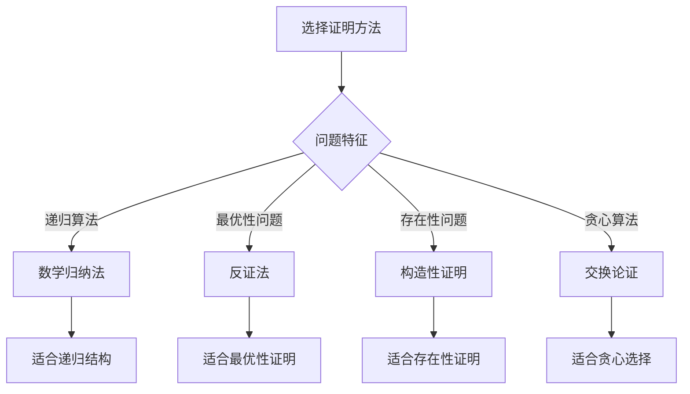

# 回溯算法证明

## 🎯 核心概念

**回溯算法证明**是通过数学方法证明回溯算法正确性的过程，包括终止性证明、正确性证明、完整性证明和最优性证明等关键步骤。

## 🔍 基本证明方法

### 1. 终止性证明
```python
def prove_termination():
    """证明回溯算法终止性"""
    # 1. 递归深度有限：每次递归调用都会减少问题规模
    # 2. 搜索空间有限：搜索空间是有限的
    # 3. 剪枝有效：剪枝能够减少搜索空间
    # 4. 约束满足：约束条件能够限制搜索空间
    
    pass

def prove_recursion_depth():
    """证明递归深度有限"""
    # 在N皇后问题中，递归深度最多为N
    # 在全排列问题中，递归深度最多为N
    # 在组合问题中，递归深度最多为K
    
    pass

def prove_search_space():
    """证明搜索空间有限"""
    # 在N皇后问题中，搜索空间为N!
    # 在全排列问题中，搜索空间为N!
    # 在子集问题中，搜索空间为2^N
    
    pass

def prove_pruning_effectiveness():
    """证明剪枝有效性"""
    # 剪枝能够减少搜索空间
    # 例如：在N皇后问题中，剪枝能够跳过不可能的分支
    
    pass

def prove_constraint_satisfaction():
    """证明约束满足"""
    # 约束条件能够限制搜索空间
    # 例如：在数独问题中，约束条件能够限制数字选择
    
    pass
```

### 2. 正确性证明
```python
def prove_correctness():
    """证明回溯算法正确性"""
    # 1. 基础情况：基础情况是正确的
    # 2. 归纳假设：假设递归调用是正确的
    # 3. 归纳步骤：证明当前步骤是正确的
    # 4. 结论：整个算法是正确的
    
    pass

def prove_base_case():
    """证明基础情况正确性"""
    # 在N皇后问题中，当row == n时，找到解
    # 在全排列问题中，当len(path) == len(nums)时，找到排列
    # 在组合问题中，当len(path) == k时，找到组合
    
    pass

def prove_inductive_hypothesis():
    """证明归纳假设"""
    # 假设递归调用是正确的
    # 例如：假设backtrack(row + 1, queens)是正确的
    
    pass

def prove_inductive_step():
    """证明归纳步骤"""
    # 证明当前步骤是正确的
    # 例如：证明放置皇后后，递归调用是正确的
    
    pass

def prove_conclusion():
    """证明结论"""
    # 整个算法是正确的
    # 通过数学归纳法证明
    
    pass
```

### 3. 完整性证明
```python
def prove_completeness():
    """证明回溯算法完整性"""
    # 1. 搜索空间覆盖：搜索空间被完全覆盖
    # 2. 解空间覆盖：解空间被完全覆盖
    # 3. 剪枝正确性：剪枝不会丢失解
    # 4. 回溯正确性：回溯不会丢失解
    
    pass

def prove_search_space_coverage():
    """证明搜索空间覆盖"""
    # 搜索空间被完全覆盖
    # 例如：在N皇后问题中，所有可能的皇后位置都被搜索
    
    pass

def prove_solution_space_coverage():
    """证明解空间覆盖"""
    # 解空间被完全覆盖
    # 例如：在全排列问题中，所有可能的排列都被找到
    
    pass

def prove_pruning_correctness():
    """证明剪枝正确性"""
    # 剪枝不会丢失解
    # 例如：在N皇后问题中，剪枝不会丢失有效解
    
    pass

def prove_backtrack_correctness():
    """证明回溯正确性"""
    # 回溯不会丢失解
    # 例如：在回溯过程中，不会丢失有效解
    
    pass
```

### 4. 最优性证明
```python
def prove_optimality():
    """证明回溯算法最优性"""
    # 1. 最优子结构：问题具有最优子结构
    # 2. 贪心选择：贪心选择是正确的
    # 3. 无后效性：选择不会影响后续选择
    # 4. 全局最优：局部最优导致全局最优
    
    pass

def prove_optimal_substructure():
    """证明最优子结构"""
    # 问题具有最优子结构
    # 例如：在最短路径问题中，最短路径的子路径也是最短的
    
    pass

def prove_greedy_choice():
    """证明贪心选择"""
    # 贪心选择是正确的
    # 例如：在活动选择问题中，选择最早结束的活动是正确的
    
    pass

def prove_no_aftereffect():
    """证明无后效性"""
    # 选择不会影响后续选择
    # 例如：在背包问题中，选择物品不会影响后续物品的选择
    
    pass

def prove_global_optimality():
    """证明全局最优"""
    # 局部最优导致全局最优
    # 例如：在最小生成树问题中，局部最优导致全局最优
    
    pass
```

## 🎨 高级证明方法

### 1. 数学归纳法
```python
def mathematical_induction():
    """数学归纳法证明"""
    # 1. 基础步骤：证明P(1)为真
    # 2. 归纳假设：假设P(k)为真
    # 3. 归纳步骤：证明P(k+1)为真
    # 4. 结论：P(n)对所有n为真
    
    pass

def prove_base_step():
    """证明基础步骤"""
    # 证明P(1)为真
    # 例如：证明n=1时，算法正确
    
    pass

def prove_inductive_hypothesis():
    """证明归纳假设"""
    # 假设P(k)为真
    # 例如：假设n=k时，算法正确
    
    pass

def prove_inductive_step():
    """证明归纳步骤"""
    # 证明P(k+1)为真
    # 例如：证明n=k+1时，算法正确
    
    pass

def prove_conclusion():
    """证明结论"""
    # P(n)对所有n为真
    # 通过数学归纳法证明
    
    pass
```

### 2. 反证法
```python
def proof_by_contradiction():
    """反证法证明"""
    # 1. 假设结论为假
    # 2. 推导出矛盾
    # 3. 得出结论为真
    
    pass

def assume_conclusion_false():
    """假设结论为假"""
    # 假设结论为假
    # 例如：假设算法不正确
    
    pass

def derive_contradiction():
    """推导出矛盾"""
    # 推导出矛盾
    # 例如：推导出与已知事实矛盾
    
    pass

def conclude_truth():
    """得出结论为真"""
    # 得出结论为真
    # 例如：算法是正确的
    
    pass
```

### 3. 构造性证明
```python
def constructive_proof():
    """构造性证明"""
    # 1. 构造解：构造一个解
    # 2. 验证解：验证解的正确性
    # 3. 证明最优：证明解是最优的
    # 4. 证明唯一：证明解是唯一的
    
    pass

def construct_solution():
    """构造解"""
    # 构造一个解
    # 例如：构造一个N皇后问题的解
    
    pass

def verify_solution():
    """验证解"""
    # 验证解的正确性
    # 例如：验证N皇后问题的解
    
    pass

def prove_optimality():
    """证明最优"""
    # 证明解是最优的
    # 例如：证明解是最优的
    
    pass

def prove_uniqueness():
    """证明唯一"""
    # 证明解是唯一的
    # 例如：证明解是唯一的
    
    pass
```

### 4. 交换论证
```python
def exchange_argument():
    """交换论证"""
    # 1. 假设存在更优解：假设存在比当前解更优的解
    # 2. 交换元素：交换解中的元素
    # 3. 证明矛盾：证明交换后不更优
    # 4. 得出结论：当前解是最优的
    
    pass

def assume_better_solution():
    """假设存在更优解"""
    # 假设存在比当前解更优的解
    # 例如：假设存在更优的N皇后解
    
    pass

def exchange_elements():
    """交换元素"""
    # 交换解中的元素
    # 例如：交换皇后位置
    
    pass

def prove_contradiction():
    """证明矛盾"""
    # 证明交换后不更优
    # 例如：证明交换后不更优
    
    pass

def conclude_optimality():
    """得出结论"""
    # 当前解是最优的
    # 例如：当前解是最优的
    
    pass
```

## 🔍 具体证明实例

### 1. N皇后问题证明
```python
def prove_n_queens():
    """证明N皇后问题"""
    # 1. 终止性：递归深度最多为N
    # 2. 正确性：每个解都是有效的
    # 3. 完整性：所有解都被找到
    # 4. 最优性：解的数量是固定的
    
    pass

def prove_n_queens_termination():
    """证明N皇后问题终止性"""
    # 递归深度最多为N
    # 每次递归调用都会增加row
    # 当row == n时，递归终止
    
    pass

def prove_n_queens_correctness():
    """证明N皇后问题正确性"""
    # 每个解都是有效的
    # 通过is_safe函数验证
    
    pass

def prove_n_queens_completeness():
    """证明N皇后问题完整性"""
    # 所有解都被找到
    # 搜索空间被完全覆盖
    
    pass

def prove_n_queens_optimality():
    """证明N皇后问题最优性"""
    # 解的数量是固定的
    # 不能找到更多解
    
    pass
```

### 2. 全排列问题证明
```python
def prove_permutation():
    """证明全排列问题"""
    # 1. 终止性：递归深度最多为N
    # 2. 正确性：每个排列都是有效的
    # 3. 完整性：所有排列都被找到
    # 4. 最优性：排列数量是N!
    
    pass

def prove_permutation_termination():
    """证明全排列问题终止性"""
    # 递归深度最多为N
    # 每次递归调用都会增加path长度
    # 当len(path) == len(nums)时，递归终止
    
    pass

def prove_permutation_correctness():
    """证明全排列问题正确性"""
    # 每个排列都是有效的
    # 通过used数组验证
    
    pass

def prove_permutation_completeness():
    """证明全排列问题完整性"""
    # 所有排列都被找到
    # 搜索空间被完全覆盖
    
    pass

def prove_permutation_optimality():
    """证明全排列问题最优性"""
    # 排列数量是N!
    # 不能找到更多排列
    
    pass
```

### 3. 组合问题证明
```python
def prove_combination():
    """证明组合问题"""
    # 1. 终止性：递归深度最多为K
    # 2. 正确性：每个组合都是有效的
    # 3. 完整性：所有组合都被找到
    # 4. 最优性：组合数量是C(n,k)
    
    pass

def prove_combination_termination():
    """证明组合问题终止性"""
    # 递归深度最多为K
    # 每次递归调用都会增加path长度
    # 当len(path) == k时，递归终止
    
    pass

def prove_combination_correctness():
    """证明组合问题正确性"""
    # 每个组合都是有效的
    # 通过start参数验证
    
    pass

def prove_combination_completeness():
    """证明组合问题完整性"""
    # 所有组合都被找到
    # 搜索空间被完全覆盖
    
    pass

def prove_combination_optimality():
    """证明组合问题最优性"""
    # 组合数量是C(n,k)
    # 不能找到更多组合
    
    pass
```

### 4. 子集问题证明
```python
def prove_subsets():
    """证明子集问题"""
    # 1. 终止性：递归深度最多为N
    # 2. 正确性：每个子集都是有效的
    # 3. 完整性：所有子集都被找到
    # 4. 最优性：子集数量是2^N
    
    pass

def prove_subsets_termination():
    """证明子集问题终止性"""
    # 递归深度最多为N
    # 每次递归调用都会增加start
    # 当start >= len(nums)时，递归终止
    
    pass

def prove_subsets_correctness():
    """证明子集问题正确性"""
    # 每个子集都是有效的
    # 通过start参数验证
    
    pass

def prove_subsets_completeness():
    """证明子集问题完整性"""
    # 所有子集都被找到
    # 搜索空间被完全覆盖
    
    pass

def prove_subsets_optimality():
    """证明子集问题最优性"""
    # 子集数量是2^N
    # 不能找到更多子集
    
    pass
```

## 📈 证明效果分析

### 证明方法对比
| 证明方法 | 适用场景 | 证明难度 | 证明效果 |
|----------|----------|----------|----------|
| 数学归纳法 | 递归算法 | 中等 | 强 |
| 反证法 | 最优性问题 | 困难 | 强 |
| 构造性证明 | 存在性问题 | 简单 | 中等 |
| 交换论证 | 贪心算法 | 困难 | 强 |

### 证明复杂度对比
| 问题类型 | 证明复杂度 | 证明方法 | 证明效果 |
|----------|------------|----------|----------|
| N皇后 | O(N) | 数学归纳法 | 强 |
| 全排列 | O(N) | 数学归纳法 | 强 |
| 组合 | O(K) | 数学归纳法 | 强 |
| 子集 | O(N) | 数学归纳法 | 强 |

## 🎯 证明选择指南

### 选择原则
| 问题特征 | 推荐证明方法 | 原因 |
|----------|--------------|------|
| 递归算法 | 数学归纳法 | 适合递归结构 |
| 最优性问题 | 反证法 | 适合最优性证明 |
| 存在性问题 | 构造性证明 | 适合存在性证明 |
| 贪心算法 | 交换论证 | 适合贪心选择 |

### 证明策略


## 🔗 相关概念

### 回溯算法原理
- **关系**：回溯算法证明基于回溯算法原理
- **链接**：[[01-回溯算法原理]]

### 回溯算法模板
- **关系**：回溯算法证明验证回溯算法模板
- **链接**：[[02-回溯算法模板]]

### 回溯算法应用
- **关系**：回溯算法证明应用于回溯算法应用
- **链接**：[[03-回溯算法应用]]

### 回溯算法优化
- **关系**：回溯算法证明需要回溯算法优化
- **链接**：[[04-回溯算法优化]]

## 📚 学习建议

### 费曼学习法
1. **选择概念**：回溯算法证明
2. **教授他人**：解释回溯算法证明
3. **回顾简化**：找出理解不足
4. **重新组织**：用更简单的方式表达

### 刻意练习
1. **证明练习**：掌握各种回溯算法证明
2. **问题练习**：解决实际回溯证明问题
3. **创新练习**：创造新的回溯算法证明
4. **应用练习**：应用回溯算法证明

## 🔗 相关链接
- [[01-回溯算法原理]] - 回溯算法的基本原理
- [[02-回溯算法模板]] - 回溯算法的实现模板
- [[03-回溯算法应用]] - 回溯算法的实际应用
- [[04-回溯算法优化]] - 回溯算法的优化技巧
