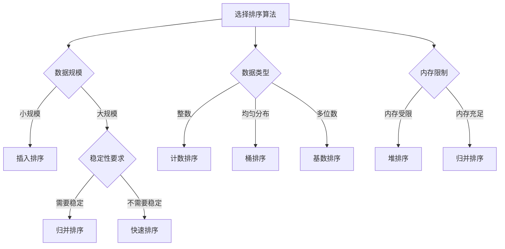

# 排序算法总览

## 🎯 核心概念

**排序算法**是将一组数据按照特定顺序重新排列的算法，是计算机科学中最基础也是最重要的算法之一。排序算法的效率直接影响程序的整体性能。

## 🔍 排序算法分类

### 1. 按比较方式分类
```python
def sorting_classification():
    """排序算法分类"""
    # 1. 比较排序：通过比较元素大小进行排序
    # 2. 非比较排序：不通过比较元素大小进行排序
    
    pass

def comparison_sorting():
    """比较排序"""
    # 通过比较元素大小进行排序
    # 例如：冒泡排序、选择排序、插入排序、归并排序、快速排序、堆排序
    
    pass

def non_comparison_sorting():
    """非比较排序"""
    # 不通过比较元素大小进行排序
    # 例如：计数排序、桶排序、基数排序
    
    pass
```

### 2. 按稳定性分类
```python
def stability_classification():
    """稳定性分类"""
    # 1. 稳定排序：相等元素的相对位置不变
    # 2. 不稳定排序：相等元素的相对位置可能改变
    
    pass

def stable_sorting():
    """稳定排序"""
    # 相等元素的相对位置不变
    # 例如：冒泡排序、插入排序、归并排序、计数排序、桶排序、基数排序
    
    pass

def unstable_sorting():
    """不稳定排序"""
    # 相等元素的相对位置可能改变
    # 例如：选择排序、快速排序、堆排序
    
    pass
```

### 3. 按时间复杂度分类
```python
def complexity_classification():
    """复杂度分类"""
    # 1. O(N^2)：冒泡排序、选择排序、插入排序
    # 2. O(N log N)：归并排序、快速排序、堆排序
    # 3. O(N)：计数排序、桶排序、基数排序
    
    pass

def quadratic_sorting():
    """O(N^2)排序"""
    # 时间复杂度为O(N^2)
    # 例如：冒泡排序、选择排序、插入排序
    
    pass

def linearithmic_sorting():
    """O(N log N)排序"""
    # 时间复杂度为O(N log N)
    # 例如：归并排序、快速排序、堆排序
    
    pass

def linear_sorting():
    """O(N)排序"""
    # 时间复杂度为O(N)
    # 例如：计数排序、桶排序、基数排序
    
    pass
```

### 4. 按空间复杂度分类
```python
def space_complexity_classification():
    """空间复杂度分类"""
    # 1. O(1)：冒泡排序、选择排序、插入排序、堆排序
    # 2. O(N)：归并排序、快速排序、计数排序、桶排序、基数排序
    
    pass

def in_place_sorting():
    """原地排序"""
    # 空间复杂度为O(1)
    # 例如：冒泡排序、选择排序、插入排序、堆排序
    
    pass

def out_of_place_sorting():
    """非原地排序"""
    # 空间复杂度为O(N)
    # 例如：归并排序、快速排序、计数排序、桶排序、基数排序
    
    pass
```

## 🎨 经典排序算法

### 1. 冒泡排序
```python
def bubble_sort(arr):
    """冒泡排序 - O(N^2)"""
    n = len(arr)
    for i in range(n):
        swapped = False
        for j in range(0, n - i - 1):
            if arr[j] > arr[j + 1]:
                arr[j], arr[j + 1] = arr[j + 1], arr[j]
                swapped = True
        if not swapped:
            break
    return arr

def bubble_sort_optimized(arr):
    """冒泡排序（优化版） - O(N^2)"""
    n = len(arr)
    for i in range(n):
        swapped = False
        for j in range(0, n - i - 1):
            if arr[j] > arr[j + 1]:
                arr[j], arr[j + 1] = arr[j + 1], arr[j]
                swapped = True
        if not swapped:
            break
    return arr

def bubble_sort_recursive(arr, n=None):
    """冒泡排序（递归版） - O(N^2)"""
    if n is None:
        n = len(arr)
    
    if n == 1:
        return arr
    
    for i in range(n - 1):
        if arr[i] > arr[i + 1]:
            arr[i], arr[i + 1] = arr[i + 1], arr[i]
    
    return bubble_sort_recursive(arr, n - 1)
```

### 2. 选择排序
```python
def selection_sort(arr):
    """选择排序 - O(N^2)"""
    n = len(arr)
    for i in range(n):
        min_idx = i
        for j in range(i + 1, n):
            if arr[j] < arr[min_idx]:
                min_idx = j
        arr[i], arr[min_idx] = arr[min_idx], arr[i]
    return arr

def selection_sort_stable(arr):
    """选择排序（稳定版） - O(N^2)"""
    n = len(arr)
    for i in range(n):
        min_idx = i
        for j in range(i + 1, n):
            if arr[j] < arr[min_idx]:
                min_idx = j
        
        # 稳定版本：将最小元素插入到正确位置
        min_val = arr[min_idx]
        for k in range(min_idx, i, -1):
            arr[k] = arr[k - 1]
        arr[i] = min_val
    
    return arr

def selection_sort_recursive(arr, start=0):
    """选择排序（递归版） - O(N^2)"""
    if start >= len(arr) - 1:
        return arr
    
    min_idx = start
    for i in range(start + 1, len(arr)):
        if arr[i] < arr[min_idx]:
            min_idx = i
    
    arr[start], arr[min_idx] = arr[min_idx], arr[start]
    return selection_sort_recursive(arr, start + 1)
```

### 3. 插入排序
```python
def insertion_sort(arr):
    """插入排序 - O(N^2)"""
    for i in range(1, len(arr)):
        key = arr[i]
        j = i - 1
        while j >= 0 and arr[j] > key:
            arr[j + 1] = arr[j]
            j -= 1
        arr[j + 1] = key
    return arr

def insertion_sort_binary(arr):
    """插入排序（二分查找优化） - O(N^2)"""
    for i in range(1, len(arr)):
        key = arr[i]
        left, right = 0, i - 1
        
        # 二分查找插入位置
        while left <= right:
            mid = (left + right) // 2
            if arr[mid] < key:
                left = mid + 1
            else:
                right = mid - 1
        
        # 移动元素
        for j in range(i, left, -1):
            arr[j] = arr[j - 1]
        arr[left] = key
    
    return arr

def insertion_sort_recursive(arr, n=None):
    """插入排序（递归版） - O(N^2)"""
    if n is None:
        n = len(arr)
    
    if n <= 1:
        return arr
    
    insertion_sort_recursive(arr, n - 1)
    
    last = arr[n - 1]
    j = n - 2
    
    while j >= 0 and arr[j] > last:
        arr[j + 1] = arr[j]
        j -= 1
    
    arr[j + 1] = last
    return arr
```

### 4. 归并排序
```python
def merge_sort(arr):
    """归并排序 - O(N log N)"""
    if len(arr) <= 1:
        return arr
    
    mid = len(arr) // 2
    left = merge_sort(arr[:mid])
    right = merge_sort(arr[mid:])
    
    return merge(left, right)

def merge(left, right):
    """合并两个有序数组"""
    result = []
    i = j = 0
    
    while i < len(left) and j < len(right):
        if left[i] <= right[j]:
            result.append(left[i])
            i += 1
        else:
            result.append(right[j])
            j += 1
    
    result.extend(left[i:])
    result.extend(right[j:])
    return result

def merge_sort_in_place(arr, left=0, right=None):
    """归并排序（原地版） - O(N log N)"""
    if right is None:
        right = len(arr) - 1
    
    if left < right:
        mid = (left + right) // 2
        merge_sort_in_place(arr, left, mid)
        merge_sort_in_place(arr, mid + 1, right)
        merge_in_place(arr, left, mid, right)
    
    return arr

def merge_in_place(arr, left, mid, right):
    """原地合并"""
    left_arr = arr[left:mid + 1]
    right_arr = arr[mid + 1:right + 1]
    
    i = j = 0
    k = left
    
    while i < len(left_arr) and j < len(right_arr):
        if left_arr[i] <= right_arr[j]:
            arr[k] = left_arr[i]
            i += 1
        else:
            arr[k] = right_arr[j]
            j += 1
        k += 1
    
    while i < len(left_arr):
        arr[k] = left_arr[i]
        i += 1
        k += 1
    
    while j < len(right_arr):
        arr[k] = right_arr[j]
        j += 1
        k += 1
```

### 5. 快速排序
```python
def quick_sort(arr, low=0, high=None):
    """快速排序 - O(N log N)"""
    if high is None:
        high = len(arr) - 1
    
    if low < high:
        pi = partition(arr, low, high)
        quick_sort(arr, low, pi - 1)
        quick_sort(arr, pi + 1, high)
    
    return arr

def partition(arr, low, high):
    """分区函数"""
    pivot = arr[high]
    i = low - 1
    
    for j in range(low, high):
        if arr[j] <= pivot:
            i += 1
            arr[i], arr[j] = arr[j], arr[i]
    
    arr[i + 1], arr[high] = arr[high], arr[i + 1]
    return i + 1

def quick_sort_3_way(arr, low=0, high=None):
    """三路快速排序 - O(N log N)"""
    if high is None:
        high = len(arr) - 1
    
    if low < high:
        lt, gt = partition_3_way(arr, low, high)
        quick_sort_3_way(arr, low, lt - 1)
        quick_sort_3_way(arr, gt + 1, high)
    
    return arr

def partition_3_way(arr, low, high):
    """三路分区"""
    pivot = arr[low]
    lt = low
    gt = high
    i = low + 1
    
    while i <= gt:
        if arr[i] < pivot:
            arr[lt], arr[i] = arr[i], arr[lt]
            lt += 1
            i += 1
        elif arr[i] > pivot:
            arr[i], arr[gt] = arr[gt], arr[i]
            gt -= 1
        else:
            i += 1
    
    return lt, gt
```

### 6. 堆排序
```python
def heap_sort(arr):
    """堆排序 - O(N log N)"""
    n = len(arr)
    
    # 构建最大堆
    for i in range(n // 2 - 1, -1, -1):
        heapify(arr, n, i)
    
    # 逐个提取元素
    for i in range(n - 1, 0, -1):
        arr[0], arr[i] = arr[i], arr[0]
        heapify(arr, i, 0)
    
    return arr

def heapify(arr, n, i):
    """堆化函数"""
    largest = i
    left = 2 * i + 1
    right = 2 * i + 2
    
    if left < n and arr[left] > arr[largest]:
        largest = left
    
    if right < n and arr[right] > arr[largest]:
        largest = right
    
    if largest != i:
        arr[i], arr[largest] = arr[largest], arr[i]
        heapify(arr, n, largest)

def heap_sort_min_heap(arr):
    """堆排序（最小堆） - O(N log N)"""
    n = len(arr)
    
    # 构建最小堆
    for i in range(n // 2 - 1, -1, -1):
        heapify_min(arr, n, i)
    
    # 逐个提取元素
    for i in range(n - 1, 0, -1):
        arr[0], arr[i] = arr[i], arr[0]
        heapify_min(arr, i, 0)
    
    return arr

def heapify_min(arr, n, i):
    """最小堆化函数"""
    smallest = i
    left = 2 * i + 1
    right = 2 * i + 2
    
    if left < n and arr[left] < arr[smallest]:
        smallest = left
    
    if right < n and arr[right] < arr[smallest]:
        smallest = right
    
    if smallest != i:
        arr[i], arr[smallest] = arr[smallest], arr[i]
        heapify_min(arr, n, smallest)
```

## 🔍 非比较排序算法

### 1. 计数排序
```python
def counting_sort(arr):
    """计数排序 - O(N + K)"""
    if not arr:
        return arr
    
    # 找到最大值和最小值
    max_val = max(arr)
    min_val = min(arr)
    
    # 创建计数数组
    count_size = max_val - min_val + 1
    count = [0] * count_size
    
    # 计数
    for num in arr:
        count[num - min_val] += 1
    
    # 重构数组
    result = []
    for i in range(count_size):
        result.extend([i + min_val] * count[i])
    
    return result

def counting_sort_stable(arr):
    """计数排序（稳定版） - O(N + K)"""
    if not arr:
        return arr
    
    max_val = max(arr)
    min_val = min(arr)
    count_size = max_val - min_val + 1
    
    # 计数
    count = [0] * count_size
    for num in arr:
        count[num - min_val] += 1
    
    # 计算累积计数
    for i in range(1, count_size):
        count[i] += count[i - 1]
    
    # 重构数组
    result = [0] * len(arr)
    for i in range(len(arr) - 1, -1, -1):
        result[count[arr[i] - min_val] - 1] = arr[i]
        count[arr[i] - min_val] -= 1
    
    return result
```

### 2. 桶排序
```python
def bucket_sort(arr, bucket_size=10):
    """桶排序 - O(N + K)"""
    if not arr:
        return arr
    
    # 找到最大值和最小值
    max_val = max(arr)
    min_val = min(arr)
    
    # 计算桶的数量
    bucket_count = (max_val - min_val) // bucket_size + 1
    buckets = [[] for _ in range(bucket_count)]
    
    # 将元素分配到桶中
    for num in arr:
        bucket_index = (num - min_val) // bucket_size
        buckets[bucket_index].append(num)
    
    # 对每个桶进行排序
    result = []
    for bucket in buckets:
        bucket.sort()
        result.extend(bucket)
    
    return result

def bucket_sort_uniform(arr):
    """桶排序（均匀分布） - O(N + K)"""
    if not arr:
        return arr
    
    n = len(arr)
    buckets = [[] for _ in range(n)]
    
    # 将元素分配到桶中
    for num in arr:
        bucket_index = int(n * num)
        buckets[bucket_index].append(num)
    
    # 对每个桶进行排序
    result = []
    for bucket in buckets:
        bucket.sort()
        result.extend(bucket)
    
    return result
```

### 3. 基数排序
```python
def radix_sort(arr):
    """基数排序 - O(D * (N + K))"""
    if not arr:
        return arr
    
    # 找到最大值
    max_val = max(arr)
    
    # 按位数排序
    exp = 1
    while max_val // exp > 0:
        counting_sort_by_digit(arr, exp)
        exp *= 10
    
    return arr

def counting_sort_by_digit(arr, exp):
    """按指定位数进行计数排序"""
    n = len(arr)
    output = [0] * n
    count = [0] * 10
    
    # 计数
    for i in range(n):
        index = (arr[i] // exp) % 10
        count[index] += 1
    
    # 计算累积计数
    for i in range(1, 10):
        count[i] += count[i - 1]
    
    # 重构数组
    for i in range(n - 1, -1, -1):
        index = (arr[i] // exp) % 10
        output[count[index] - 1] = arr[i]
        count[index] -= 1
    
    # 复制回原数组
    for i in range(n):
        arr[i] = output[i]

def radix_sort_strings(arr):
    """基数排序（字符串） - O(D * (N + K))"""
    if not arr:
        return arr
    
    # 找到最大长度
    max_len = max(len(s) for s in arr)
    
    # 按字符位置排序
    for i in range(max_len - 1, -1, -1):
        counting_sort_by_char(arr, i)
    
    return arr

def counting_sort_by_char(arr, pos):
    """按指定字符位置进行计数排序"""
    n = len(arr)
    output = [0] * n
    count = [0] * 256  # ASCII字符
    
    # 计数
    for i in range(n):
        char = ord(arr[i][pos]) if pos < len(arr[i]) else 0
        count[char] += 1
    
    # 计算累积计数
    for i in range(1, 256):
        count[i] += count[i - 1]
    
    # 重构数组
    for i in range(n - 1, -1, -1):
        char = ord(arr[i][pos]) if pos < len(arr[i]) else 0
        output[count[char] - 1] = arr[i]
        count[char] -= 1
    
    # 复制回原数组
    for i in range(n):
        arr[i] = output[i]
```

## 📈 性能对比分析

### 时间复杂度对比
| 算法 | 最好情况 | 平均情况 | 最坏情况 | 空间复杂度 |
|------|----------|----------|----------|------------|
| 冒泡排序 | O(N) | O(N^2) | O(N^2) | O(1) |
| 选择排序 | O(N^2) | O(N^2) | O(N^2) | O(1) |
| 插入排序 | O(N) | O(N^2) | O(N^2) | O(1) |
| 归并排序 | O(N log N) | O(N log N) | O(N log N) | O(N) |
| 快速排序 | O(N log N) | O(N log N) | O(N^2) | O(log N) |
| 堆排序 | O(N log N) | O(N log N) | O(N log N) | O(1) |
| 计数排序 | O(N + K) | O(N + K) | O(N + K) | O(K) |
| 桶排序 | O(N + K) | O(N + K) | O(N^2) | O(N + K) |
| 基数排序 | O(D * (N + K)) | O(D * (N + K)) | O(D * (N + K)) | O(N + K) |

### 稳定性对比
| 算法 | 稳定性 | 说明 |
|------|--------|------|
| 冒泡排序 | 稳定 | 相等元素不会交换 |
| 选择排序 | 不稳定 | 可能改变相等元素的相对位置 |
| 插入排序 | 稳定 | 相等元素不会交换 |
| 归并排序 | 稳定 | 相等元素保持原有顺序 |
| 快速排序 | 不稳定 | 分区可能改变相等元素的相对位置 |
| 堆排序 | 不稳定 | 堆化过程可能改变相等元素的相对位置 |
| 计数排序 | 稳定 | 相等元素保持原有顺序 |
| 桶排序 | 稳定 | 相等元素保持原有顺序 |
| 基数排序 | 稳定 | 相等元素保持原有顺序 |

## 🎯 算法选择指南

### 选择原则
| 数据特征 | 推荐算法 | 原因 |
|----------|----------|------|
| 小规模数据 | 插入排序 | 简单高效 |
| 大规模数据 | 快速排序 | 平均性能最好 |
| 需要稳定排序 | 归并排序 | 稳定且高效 |
| 内存受限 | 堆排序 | 原地排序 |
| 整数数据 | 计数排序 | 线性时间复杂度 |
| 均匀分布 | 桶排序 | 线性时间复杂度 |
| 多位数数据 | 基数排序 | 线性时间复杂度 |

### 选择策略


## 🔗 相关概念

### 比较排序算法
- **关系**：比较排序算法是排序算法的重要组成部分
- **链接**：[[02-比较排序算法]]

### 非比较排序算法
- **关系**：非比较排序算法是排序算法的重要组成部分
- **链接**：[[03-非比较排序算法]]

### 复杂度分析
- **关系**：复杂度分析是排序算法选择的重要依据
- **链接**：[[04-排序算法复杂度对比]]

### 算法选择
- **关系**：算法选择是排序算法应用的关键
- **链接**：[[05-排序算法选择指南]]

## 📚 学习建议

### 费曼学习法
1. **选择概念**：排序算法总览
2. **教授他人**：解释排序算法分类和特点
3. **回顾简化**：找出理解不足
4. **重新组织**：用更简单的方式表达

### 刻意练习
1. **算法练习**：掌握各种排序算法
2. **实现练习**：实现排序算法
3. **优化练习**：优化排序算法
4. **应用练习**：应用排序算法

## 🔗 相关链接
- [[02-比较排序算法]] - 比较排序算法的详细实现
- [[03-非比较排序算法]] - 非比较排序算法的详细实现
- [[04-排序算法复杂度对比]] - 排序算法复杂度分析
- [[05-排序算法选择指南]] - 排序算法选择策略
- [[06-排序算法稳定性分析]] - 排序算法稳定性分析
