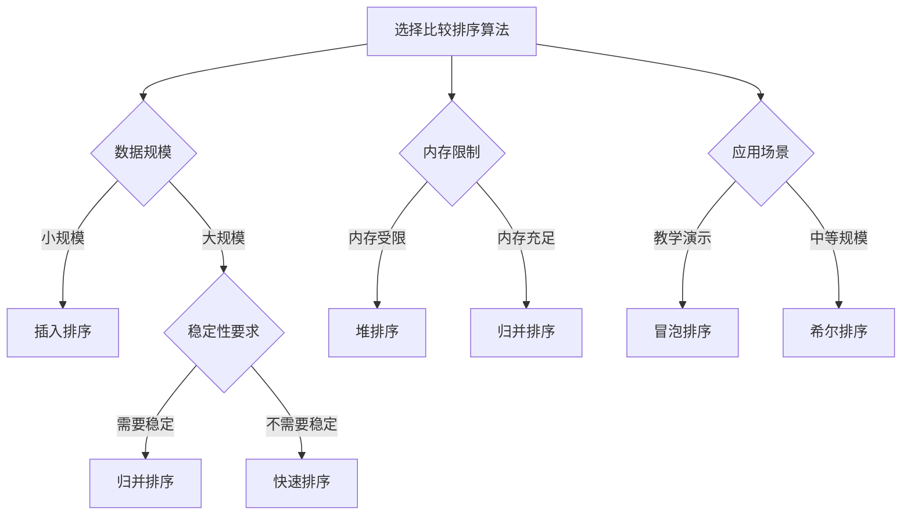

# 比较排序算法

## 🎯 核心概念

**比较排序算法**是通过比较元素大小来确定元素相对位置的排序算法。这类算法的特点是在排序过程中需要比较元素的大小关系，然后根据比较结果进行元素位置的调整。

## 🔍 基本比较排序算法

### 1. 冒泡排序
```python
def bubble_sort(arr):
    """冒泡排序 - O(N^2)"""
    n = len(arr)
    for i in range(n):
        swapped = False
        for j in range(0, n - i - 1):
            if arr[j] > arr[j + 1]:
                arr[j], arr[j + 1] = arr[j + 1], arr[j]
                swapped = True
        if not swapped:
            break
    return arr

def bubble_sort_optimized(arr):
    """冒泡排序（优化版） - O(N^2)"""
    n = len(arr)
    for i in range(n):
        swapped = False
        for j in range(0, n - i - 1):
            if arr[j] > arr[j + 1]:
                arr[j], arr[j + 1] = arr[j + 1], arr[j]
                swapped = True
        if not swapped:
            break
    return arr

def bubble_sort_recursive(arr, n=None):
    """冒泡排序（递归版） - O(N^2)"""
    if n is None:
        n = len(arr)
    
    if n == 1:
        return arr
    
    for i in range(n - 1):
        if arr[i] > arr[i + 1]:
            arr[i], arr[i + 1] = arr[i + 1], arr[i]
    
    return bubble_sort_recursive(arr, n - 1)

def bubble_sort_cocktail(arr):
    """鸡尾酒排序（双向冒泡） - O(N^2)"""
    n = len(arr)
    start = 0
    end = n - 1
    
    while start < end:
        # 从左到右冒泡
        for i in range(start, end):
            if arr[i] > arr[i + 1]:
                arr[i], arr[i + 1] = arr[i + 1], arr[i]
        end -= 1
        
        # 从右到左冒泡
        for i in range(end, start, -1):
            if arr[i] < arr[i - 1]:
                arr[i], arr[i - 1] = arr[i - 1], arr[i]
        start += 1
    
    return arr
```

### 2. 选择排序
```python
def selection_sort(arr):
    """选择排序 - O(N^2)"""
    n = len(arr)
    for i in range(n):
        min_idx = i
        for j in range(i + 1, n):
            if arr[j] < arr[min_idx]:
                min_idx = j
        arr[i], arr[min_idx] = arr[min_idx], arr[i]
    return arr

def selection_sort_stable(arr):
    """选择排序（稳定版） - O(N^2)"""
    n = len(arr)
    for i in range(n):
        min_idx = i
        for j in range(i + 1, n):
            if arr[j] < arr[min_idx]:
                min_idx = j
        
        # 稳定版本：将最小元素插入到正确位置
        min_val = arr[min_idx]
        for k in range(min_idx, i, -1):
            arr[k] = arr[k - 1]
        arr[i] = min_val
    
    return arr

def selection_sort_recursive(arr, start=0):
    """选择排序（递归版） - O(N^2)"""
    if start >= len(arr) - 1:
        return arr
    
    min_idx = start
    for i in range(start + 1, len(arr)):
        if arr[i] < arr[min_idx]:
            min_idx = i
    
    arr[start], arr[min_idx] = arr[min_idx], arr[start]
    return selection_sort_recursive(arr, start + 1)

def selection_sort_max(arr):
    """选择排序（选择最大值） - O(N^2)"""
    n = len(arr)
    for i in range(n - 1, 0, -1):
        max_idx = i
        for j in range(i):
            if arr[j] > arr[max_idx]:
                max_idx = j
        arr[i], arr[max_idx] = arr[max_idx], arr[i]
    return arr
```

### 3. 插入排序
```python
def insertion_sort(arr):
    """插入排序 - O(N^2)"""
    for i in range(1, len(arr)):
        key = arr[i]
        j = i - 1
        while j >= 0 and arr[j] > key:
            arr[j + 1] = arr[j]
            j -= 1
        arr[j + 1] = key
    return arr

def insertion_sort_binary(arr):
    """插入排序（二分查找优化） - O(N^2)"""
    for i in range(1, len(arr)):
        key = arr[i]
        left, right = 0, i - 1
        
        # 二分查找插入位置
        while left <= right:
            mid = (left + right) // 2
            if arr[mid] < key:
                left = mid + 1
            else:
                right = mid - 1
        
        # 移动元素
        for j in range(i, left, -1):
            arr[j] = arr[j - 1]
        arr[left] = key
    
    return arr

def insertion_sort_recursive(arr, n=None):
    """插入排序（递归版） - O(N^2)"""
    if n is None:
        n = len(arr)
    
    if n <= 1:
        return arr
    
    insertion_sort_recursive(arr, n - 1)
    
    last = arr[n - 1]
    j = n - 2
    
    while j >= 0 and arr[j] > last:
        arr[j + 1] = arr[j]
        j -= 1
    
    arr[j + 1] = last
    return arr

def insertion_sort_shell(arr):
    """希尔排序（插入排序的改进） - O(N^1.3)"""
    n = len(arr)
    gap = n // 2
    
    while gap > 0:
        for i in range(gap, n):
            temp = arr[i]
            j = i
            while j >= gap and arr[j - gap] > temp:
                arr[j] = arr[j - gap]
                j -= gap
            arr[j] = temp
        gap //= 2
    
    return arr
```

## 🎨 高级比较排序算法

### 1. 归并排序
```python
def merge_sort(arr):
    """归并排序 - O(N log N)"""
    if len(arr) <= 1:
        return arr
    
    mid = len(arr) // 2
    left = merge_sort(arr[:mid])
    right = merge_sort(arr[mid:])
    
    return merge(left, right)

def merge(left, right):
    """合并两个有序数组"""
    result = []
    i = j = 0
    
    while i < len(left) and j < len(right):
        if left[i] <= right[j]:
            result.append(left[i])
            i += 1
        else:
            result.append(right[j])
            j += 1
    
    result.extend(left[i:])
    result.extend(right[j:])
    return result

def merge_sort_in_place(arr, left=0, right=None):
    """归并排序（原地版） - O(N log N)"""
    if right is None:
        right = len(arr) - 1
    
    if left < right:
        mid = (left + right) // 2
        merge_sort_in_place(arr, left, mid)
        merge_sort_in_place(arr, mid + 1, right)
        merge_in_place(arr, left, mid, right)
    
    return arr

def merge_in_place(arr, left, mid, right):
    """原地合并"""
    left_arr = arr[left:mid + 1]
    right_arr = arr[mid + 1:right + 1]
    
    i = j = 0
    k = left
    
    while i < len(left_arr) and j < len(right_arr):
        if left_arr[i] <= right_arr[j]:
            arr[k] = left_arr[i]
            i += 1
        else:
            arr[k] = right_arr[j]
            j += 1
        k += 1
    
    while i < len(left_arr):
        arr[k] = left_arr[i]
        i += 1
        k += 1
    
    while j < len(right_arr):
        arr[k] = right_arr[j]
        j += 1
        k += 1

def merge_sort_iterative(arr):
    """归并排序（迭代版） - O(N log N)"""
    n = len(arr)
    curr_size = 1
    
    while curr_size < n:
        left = 0
        while left < n - 1:
            mid = min(left + curr_size - 1, n - 1)
            right = min(left + 2 * curr_size - 1, n - 1)
            merge_in_place(arr, left, mid, right)
            left += 2 * curr_size
        curr_size *= 2
    
    return arr
```

### 2. 快速排序
```python
def quick_sort(arr, low=0, high=None):
    """快速排序 - O(N log N)"""
    if high is None:
        high = len(arr) - 1
    
    if low < high:
        pi = partition(arr, low, high)
        quick_sort(arr, low, pi - 1)
        quick_sort(arr, pi + 1, high)
    
    return arr

def partition(arr, low, high):
    """分区函数"""
    pivot = arr[high]
    i = low - 1
    
    for j in range(low, high):
        if arr[j] <= pivot:
            i += 1
            arr[i], arr[j] = arr[j], arr[i]
    
    arr[i + 1], arr[high] = arr[high], arr[i + 1]
    return i + 1

def quick_sort_3_way(arr, low=0, high=None):
    """三路快速排序 - O(N log N)"""
    if high is None:
        high = len(arr) - 1
    
    if low < high:
        lt, gt = partition_3_way(arr, low, high)
        quick_sort_3_way(arr, low, lt - 1)
        quick_sort_3_way(arr, gt + 1, high)
    
    return arr

def partition_3_way(arr, low, high):
    """三路分区"""
    pivot = arr[low]
    lt = low
    gt = high
    i = low + 1
    
    while i <= gt:
        if arr[i] < pivot:
            arr[lt], arr[i] = arr[i], arr[lt]
            lt += 1
            i += 1
        elif arr[i] > pivot:
            arr[i], arr[gt] = arr[gt], arr[i]
            gt -= 1
        else:
            i += 1
    
    return lt, gt

def quick_sort_iterative(arr):
    """快速排序（迭代版） - O(N log N)"""
    if len(arr) <= 1:
        return arr
    
    stack = [(0, len(arr) - 1)]
    
    while stack:
        low, high = stack.pop()
        
        if low < high:
            pi = partition(arr, low, high)
            stack.append((low, pi - 1))
            stack.append((pi + 1, high))
    
    return arr

def quick_sort_median(arr, low=0, high=None):
    """快速排序（中位数选择） - O(N log N)"""
    if high is None:
        high = len(arr) - 1
    
    if low < high:
        # 选择中位数作为基准
        mid = (low + high) // 2
        arr[mid], arr[high] = arr[high], arr[mid]
        
        pi = partition(arr, low, high)
        quick_sort_median(arr, low, pi - 1)
        quick_sort_median(arr, pi + 1, high)
    
    return arr
```

### 3. 堆排序
```python
def heap_sort(arr):
    """堆排序 - O(N log N)"""
    n = len(arr)
    
    # 构建最大堆
    for i in range(n // 2 - 1, -1, -1):
        heapify(arr, n, i)
    
    # 逐个提取元素
    for i in range(n - 1, 0, -1):
        arr[0], arr[i] = arr[i], arr[0]
        heapify(arr, i, 0)
    
    return arr

def heapify(arr, n, i):
    """堆化函数"""
    largest = i
    left = 2 * i + 1
    right = 2 * i + 2
    
    if left < n and arr[left] > arr[largest]:
        largest = left
    
    if right < n and arr[right] > arr[largest]:
        largest = right
    
    if largest != i:
        arr[i], arr[largest] = arr[largest], arr[i]
        heapify(arr, n, largest)

def heap_sort_min_heap(arr):
    """堆排序（最小堆） - O(N log N)"""
    n = len(arr)
    
    # 构建最小堆
    for i in range(n // 2 - 1, -1, -1):
        heapify_min(arr, n, i)
    
    # 逐个提取元素
    for i in range(n - 1, 0, -1):
        arr[0], arr[i] = arr[i], arr[0]
        heapify_min(arr, i, 0)
    
    return arr

def heapify_min(arr, n, i):
    """最小堆化函数"""
    smallest = i
    left = 2 * i + 1
    right = 2 * i + 2
    
    if left < n and arr[left] < arr[smallest]:
        smallest = left
    
    if right < n and arr[right] < arr[smallest]:
        smallest = right
    
    if smallest != i:
        arr[i], arr[smallest] = arr[smallest], arr[i]
        heapify_min(arr, n, smallest)

def heap_sort_iterative(arr):
    """堆排序（迭代版） - O(N log N)"""
    n = len(arr)
    
    # 构建最大堆
    for i in range(n // 2 - 1, -1, -1):
        heapify_iterative(arr, n, i)
    
    # 逐个提取元素
    for i in range(n - 1, 0, -1):
        arr[0], arr[i] = arr[i], arr[0]
        heapify_iterative(arr, i, 0)
    
    return arr

def heapify_iterative(arr, n, i):
    """迭代堆化函数"""
    while True:
        largest = i
        left = 2 * i + 1
        right = 2 * i + 2
        
        if left < n and arr[left] > arr[largest]:
            largest = left
        
        if right < n and arr[right] > arr[largest]:
            largest = right
        
        if largest == i:
            break
        
        arr[i], arr[largest] = arr[largest], arr[i]
        i = largest
```

## 🔍 特殊比较排序算法

### 1. 希尔排序
```python
def shell_sort(arr):
    """希尔排序 - O(N^1.3)"""
    n = len(arr)
    gap = n // 2
    
    while gap > 0:
        for i in range(gap, n):
            temp = arr[i]
            j = i
            while j >= gap and arr[j - gap] > temp:
                arr[j] = arr[j - gap]
                j -= gap
            arr[j] = temp
        gap //= 2
    
    return arr

def shell_sort_knuth(arr):
    """希尔排序（Knuth序列） - O(N^1.3)"""
    n = len(arr)
    gap = 1
    
    # 计算Knuth序列
    while gap < n // 3:
        gap = 3 * gap + 1
    
    while gap > 0:
        for i in range(gap, n):
            temp = arr[i]
            j = i
            while j >= gap and arr[j - gap] > temp:
                arr[j] = arr[j - gap]
                j -= gap
            arr[j] = temp
        gap //= 3
    
    return arr

def shell_sort_sedgewick(arr):
    """希尔排序（Sedgewick序列） - O(N^1.3)"""
    n = len(arr)
    gaps = []
    
    # 计算Sedgewick序列
    i = 0
    while True:
        gap1 = 9 * (4 ** i) - 9 * (2 ** i) + 1
        gap2 = (4 ** i) - 3 * (2 ** i) + 1
        if gap1 < n:
            gaps.append(gap1)
        if gap2 < n:
            gaps.append(gap2)
        if gap1 >= n and gap2 >= n:
            break
        i += 1
    
    gaps.sort(reverse=True)
    
    for gap in gaps:
        for i in range(gap, n):
            temp = arr[i]
            j = i
            while j >= gap and arr[j - gap] > temp:
                arr[j] = arr[j - gap]
                j -= gap
            arr[j] = temp
    
    return arr
```

### 2. 梳排序
```python
def comb_sort(arr):
    """梳排序 - O(N^2)"""
    n = len(arr)
    gap = n
    shrink = 1.3
    swapped = True
    
    while gap > 1 or swapped:
        gap = int(gap / shrink)
        if gap < 1:
            gap = 1
        
        swapped = False
        for i in range(n - gap):
            if arr[i] > arr[i + gap]:
                arr[i], arr[i + gap] = arr[i + gap], arr[i]
                swapped = True
    
    return arr

def comb_sort_optimized(arr):
    """梳排序（优化版） - O(N^2)"""
    n = len(arr)
    gap = n
    shrink = 1.3
    swapped = True
    
    while gap > 1 or swapped:
        gap = int(gap / shrink)
        if gap < 1:
            gap = 1
        
        swapped = False
        for i in range(n - gap):
            if arr[i] > arr[i + gap]:
                arr[i], arr[i + gap] = arr[i + gap], arr[i]
                swapped = True
        
        # 如果gap为1，使用冒泡排序
        if gap == 1 and swapped:
            for i in range(n - 1):
                if arr[i] > arr[i + 1]:
                    arr[i], arr[i + 1] = arr[i + 1], arr[i]
                    swapped = True
    
    return arr
```

### 3. 奇偶排序
```python
def odd_even_sort(arr):
    """奇偶排序 - O(N^2)"""
    n = len(arr)
    sorted = False
    
    while not sorted:
        sorted = True
        
        # 奇数索引
        for i in range(1, n - 1, 2):
            if arr[i] > arr[i + 1]:
                arr[i], arr[i + 1] = arr[i + 1], arr[i]
                sorted = False
        
        # 偶数索引
        for i in range(0, n - 1, 2):
            if arr[i] > arr[i + 1]:
                arr[i], arr[i + 1] = arr[i + 1], arr[i]
                sorted = False
    
    return arr

def odd_even_sort_parallel(arr):
    """奇偶排序（并行版） - O(N^2)"""
    n = len(arr)
    sorted = False
    
    while not sorted:
        sorted = True
        
        # 并行处理奇数索引
        for i in range(1, n - 1, 2):
            if arr[i] > arr[i + 1]:
                arr[i], arr[i + 1] = arr[i + 1], arr[i]
                sorted = False
        
        # 并行处理偶数索引
        for i in range(0, n - 1, 2):
            if arr[i] > arr[i + 1]:
                arr[i], arr[i + 1] = arr[i + 1], arr[i]
                sorted = False
    
    return arr
```

## 📈 性能对比分析

### 时间复杂度对比
| 算法 | 最好情况 | 平均情况 | 最坏情况 | 空间复杂度 | 稳定性 |
|------|----------|----------|----------|------------|--------|
| 冒泡排序 | O(N) | O(N^2) | O(N^2) | O(1) | 稳定 |
| 选择排序 | O(N^2) | O(N^2) | O(N^2) | O(1) | 不稳定 |
| 插入排序 | O(N) | O(N^2) | O(N^2) | O(1) | 稳定 |
| 希尔排序 | O(N log N) | O(N^1.3) | O(N^2) | O(1) | 不稳定 |
| 归并排序 | O(N log N) | O(N log N) | O(N log N) | O(N) | 稳定 |
| 快速排序 | O(N log N) | O(N log N) | O(N^2) | O(log N) | 不稳定 |
| 堆排序 | O(N log N) | O(N log N) | O(N log N) | O(1) | 不稳定 |

### 算法特点对比
| 算法 | 优点 | 缺点 | 适用场景 |
|------|------|------|----------|
| 冒泡排序 | 简单易懂，稳定 | 效率低 | 教学演示 |
| 选择排序 | 简单，交换次数少 | 效率低，不稳定 | 小规模数据 |
| 插入排序 | 简单，稳定，对小规模数据高效 | 效率低 | 小规模数据 |
| 希尔排序 | 比O(N^2)算法快 | 不稳定 | 中等规模数据 |
| 归并排序 | 稳定，效率高 | 需要额外空间 | 大规模数据 |
| 快速排序 | 效率高，原地排序 | 不稳定，最坏情况效率低 | 大规模数据 |
| 堆排序 | 效率高，原地排序 | 不稳定 | 大规模数据 |

## 🎯 算法选择指南

### 选择原则
| 数据特征 | 推荐算法 | 原因 |
|----------|----------|------|
| 小规模数据 | 插入排序 | 简单高效 |
| 大规模数据 | 快速排序 | 平均性能最好 |
| 需要稳定排序 | 归并排序 | 稳定且高效 |
| 内存受限 | 堆排序 | 原地排序 |
| 教学演示 | 冒泡排序 | 简单易懂 |
| 中等规模 | 希尔排序 | 比O(N^2)算法快 |

### 选择策略


## 🔗 相关概念

### 排序算法总览
- **关系**：比较排序算法是排序算法的重要组成部分
- **链接**：[[01-排序算法总览]]

### 非比较排序算法
- **关系**：非比较排序算法是排序算法的另一种分类
- **链接**：[[03-非比较排序算法]]

### 复杂度分析
- **关系**：复杂度分析是算法选择的重要依据
- **链接**：[[04-排序算法复杂度对比]]

### 算法选择
- **关系**：算法选择是排序算法应用的关键
- **链接**：[[05-排序算法选择指南]]

## 📚 学习建议

### 费曼学习法
1. **选择概念**：比较排序算法
2. **教授他人**：解释比较排序算法的原理和实现
3. **回顾简化**：找出理解不足
4. **重新组织**：用更简单的方式表达

### 刻意练习
1. **算法练习**：掌握各种比较排序算法
2. **实现练习**：实现比较排序算法
3. **优化练习**：优化比较排序算法
4. **应用练习**：应用比较排序算法

## 🔗 相关链接
- [[01-排序算法总览]] - 排序算法的总体介绍
- [[03-非比较排序算法]] - 非比较排序算法的详细实现
- [[04-排序算法复杂度对比]] - 排序算法复杂度分析
- [[05-排序算法选择指南]] - 排序算法选择策略
- [[06-排序算法稳定性分析]] - 排序算法稳定性分析
