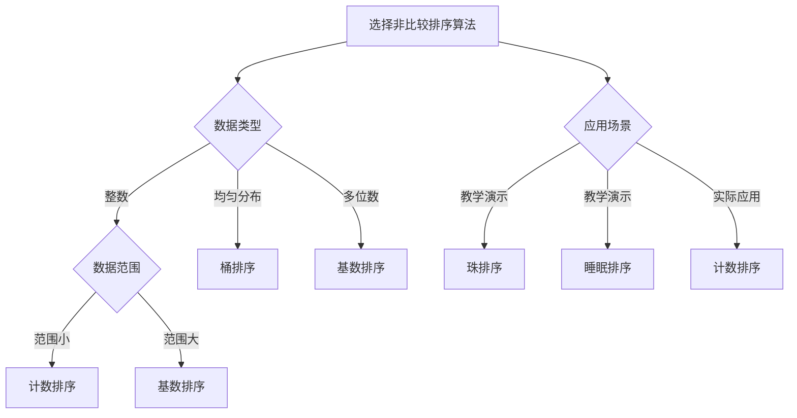

# 非比较排序算法

## 🎯 核心概念

**非比较排序算法**是不通过比较元素大小来确定元素相对位置的排序算法。这类算法的特点是在排序过程中不需要比较元素的大小关系，而是利用元素的其他特性（如数值范围、位数等）进行排序。

## 🔍 基本非比较排序算法

### 1. 计数排序
```python
def counting_sort(arr):
    """计数排序 - O(N + K)"""
    if not arr:
        return arr
    
    # 找到最大值和最小值
    max_val = max(arr)
    min_val = min(arr)
    
    # 创建计数数组
    count_size = max_val - min_val + 1
    count = [0] * count_size
    
    # 计数
    for num in arr:
        count[num - min_val] += 1
    
    # 重构数组
    result = []
    for i in range(count_size):
        result.extend([i + min_val] * count[i])
    
    return result

def counting_sort_stable(arr):
    """计数排序（稳定版） - O(N + K)"""
    if not arr:
        return arr
    
    max_val = max(arr)
    min_val = min(arr)
    count_size = max_val - min_val + 1
    
    # 计数
    count = [0] * count_size
    for num in arr:
        count[num - min_val] += 1
    
    # 计算累积计数
    for i in range(1, count_size):
        count[i] += count[i - 1]
    
    # 重构数组
    result = [0] * len(arr)
    for i in range(len(arr) - 1, -1, -1):
        result[count[arr[i] - min_val] - 1] = arr[i]
        count[arr[i] - min_val] -= 1
    
    return result

def counting_sort_range(arr, min_val, max_val):
    """计数排序（指定范围） - O(N + K)"""
    if not arr:
        return arr
    
    count_size = max_val - min_val + 1
    count = [0] * count_size
    
    # 计数
    for num in arr:
        if min_val <= num <= max_val:
            count[num - min_val] += 1
    
    # 重构数组
    result = []
    for i in range(count_size):
        result.extend([i + min_val] * count[i])
    
    return result

def counting_sort_negative(arr):
    """计数排序（包含负数） - O(N + K)"""
    if not arr:
        return arr
    
    max_val = max(arr)
    min_val = min(arr)
    count_size = max_val - min_val + 1
    
    # 计数
    count = [0] * count_size
    for num in arr:
        count[num - min_val] += 1
    
    # 重构数组
    result = []
    for i in range(count_size):
        result.extend([i + min_val] * count[i])
    
    return result
```

### 2. 桶排序
```python
def bucket_sort(arr, bucket_size=10):
    """桶排序 - O(N + K)"""
    if not arr:
        return arr
    
    # 找到最大值和最小值
    max_val = max(arr)
    min_val = min(arr)
    
    # 计算桶的数量
    bucket_count = (max_val - min_val) // bucket_size + 1
    buckets = [[] for _ in range(bucket_count)]
    
    # 将元素分配到桶中
    for num in arr:
        bucket_index = (num - min_val) // bucket_size
        buckets[bucket_index].append(num)
    
    # 对每个桶进行排序
    result = []
    for bucket in buckets:
        bucket.sort()
        result.extend(bucket)
    
    return result

def bucket_sort_uniform(arr):
    """桶排序（均匀分布） - O(N + K)"""
    if not arr:
        return arr
    
    n = len(arr)
    buckets = [[] for _ in range(n)]
    
    # 将元素分配到桶中
    for num in arr:
        bucket_index = int(n * num)
        buckets[bucket_index].append(num)
    
    # 对每个桶进行排序
    result = []
    for bucket in buckets:
        bucket.sort()
        result.extend(bucket)
    
    return result

def bucket_sort_strings(arr):
    """桶排序（字符串） - O(N + K)"""
    if not arr:
        return arr
    
    # 按字符串长度分组
    max_len = max(len(s) for s in arr)
    buckets = [[] for _ in range(max_len + 1)]
    
    # 将字符串分配到桶中
    for s in arr:
        buckets[len(s)].append(s)
    
    # 对每个桶进行排序
    result = []
    for bucket in buckets:
        bucket.sort()
        result.extend(bucket)
    
    return result

def bucket_sort_custom(arr, key_func):
    """桶排序（自定义键函数） - O(N + K)"""
    if not arr:
        return arr
    
    # 计算键的范围
    keys = [key_func(x) for x in arr]
    min_key = min(keys)
    max_key = max(keys)
    
    # 创建桶
    bucket_count = max_key - min_key + 1
    buckets = [[] for _ in range(bucket_count)]
    
    # 将元素分配到桶中
    for i, num in enumerate(arr):
        bucket_index = keys[i] - min_key
        buckets[bucket_index].append(num)
    
    # 对每个桶进行排序
    result = []
    for bucket in buckets:
        bucket.sort()
        result.extend(bucket)
    
    return result
```

### 3. 基数排序
```python
def radix_sort(arr):
    """基数排序 - O(D * (N + K))"""
    if not arr:
        return arr
    
    # 找到最大值
    max_val = max(arr)
    
    # 按位数排序
    exp = 1
    while max_val // exp > 0:
        counting_sort_by_digit(arr, exp)
        exp *= 10
    
    return arr

def counting_sort_by_digit(arr, exp):
    """按指定位数进行计数排序"""
    n = len(arr)
    output = [0] * n
    count = [0] * 10
    
    # 计数
    for i in range(n):
        index = (arr[i] // exp) % 10
        count[index] += 1
    
    # 计算累积计数
    for i in range(1, 10):
        count[i] += count[i - 1]
    
    # 重构数组
    for i in range(n - 1, -1, -1):
        index = (arr[i] // exp) % 10
        output[count[index] - 1] = arr[i]
        count[index] -= 1
    
    # 复制回原数组
    for i in range(n):
        arr[i] = output[i]

def radix_sort_strings(arr):
    """基数排序（字符串） - O(D * (N + K))"""
    if not arr:
        return arr
    
    # 找到最大长度
    max_len = max(len(s) for s in arr)
    
    # 按字符位置排序
    for i in range(max_len - 1, -1, -1):
        counting_sort_by_char(arr, i)
    
    return arr

def counting_sort_by_char(arr, pos):
    """按指定字符位置进行计数排序"""
    n = len(arr)
    output = [0] * n
    count = [0] * 256  # ASCII字符
    
    # 计数
    for i in range(n):
        char = ord(arr[i][pos]) if pos < len(arr[i]) else 0
        count[char] += 1
    
    # 计算累积计数
    for i in range(1, 256):
        count[i] += count[i - 1]
    
    # 重构数组
    for i in range(n - 1, -1, -1):
        char = ord(arr[i][pos]) if pos < len(arr[i]) else 0
        output[count[char] - 1] = arr[i]
        count[char] -= 1
    
    # 复制回原数组
    for i in range(n):
        arr[i] = output[i]

def radix_sort_negative(arr):
    """基数排序（包含负数） - O(D * (N + K))"""
    if not arr:
        return arr
    
    # 分离正数和负数
    positive = [x for x in arr if x >= 0]
    negative = [abs(x) for x in arr if x < 0]
    
    # 对正数进行基数排序
    if positive:
        radix_sort(positive)
    
    # 对负数进行基数排序
    if negative:
        radix_sort(negative)
        negative.reverse()
        negative = [-x for x in negative]
    
    # 合并结果
    return negative + positive

def radix_sort_hex(arr):
    """基数排序（十六进制） - O(D * (N + K))"""
    if not arr:
        return arr
    
    # 找到最大值
    max_val = max(arr)
    
    # 按十六进制位排序
    exp = 1
    while max_val // exp > 0:
        counting_sort_by_hex_digit(arr, exp)
        exp *= 16
    
    return arr

def counting_sort_by_hex_digit(arr, exp):
    """按指定十六进制位数进行计数排序"""
    n = len(arr)
    output = [0] * n
    count = [0] * 16
    
    # 计数
    for i in range(n):
        index = (arr[i] // exp) % 16
        count[index] += 1
    
    # 计算累积计数
    for i in range(1, 16):
        count[i] += count[i - 1]
    
    # 重构数组
    for i in range(n - 1, -1, -1):
        index = (arr[i] // exp) % 16
        output[count[index] - 1] = arr[i]
        count[index] -= 1
    
    # 复制回原数组
    for i in range(n):
        arr[i] = output[i]
```

## 🎨 高级非比较排序算法

### 1. 鸽巢排序
```python
def pigeonhole_sort(arr):
    """鸽巢排序 - O(N + K)"""
    if not arr:
        return arr
    
    # 找到最大值和最小值
    min_val = min(arr)
    max_val = max(arr)
    
    # 计算鸽巢数量
    pigeonhole_count = max_val - min_val + 1
    pigeonholes = [0] * pigeonhole_count
    
    # 将元素放入鸽巢
    for num in arr:
        pigeonholes[num - min_val] += 1
    
    # 重构数组
    result = []
    for i in range(pigeonhole_count):
        result.extend([i + min_val] * pigeonholes[i])
    
    return result

def pigeonhole_sort_stable(arr):
    """鸽巢排序（稳定版） - O(N + K)"""
    if not arr:
        return arr
    
    min_val = min(arr)
    max_val = max(arr)
    pigeonhole_count = max_val - min_val + 1
    
    # 创建鸽巢
    pigeonholes = [[] for _ in range(pigeonhole_count)]
    
    # 将元素放入鸽巢
    for num in arr:
        pigeonholes[num - min_val].append(num)
    
    # 重构数组
    result = []
    for pigeonhole in pigeonholes:
        result.extend(pigeonhole)
    
    return result

def pigeonhole_sort_range(arr, min_val, max_val):
    """鸽巢排序（指定范围） - O(N + K)"""
    if not arr:
        return arr
    
    pigeonhole_count = max_val - min_val + 1
    pigeonholes = [0] * pigeonhole_count
    
    # 将元素放入鸽巢
    for num in arr:
        if min_val <= num <= max_val:
            pigeonholes[num - min_val] += 1
    
    # 重构数组
    result = []
    for i in range(pigeonhole_count):
        result.extend([i + min_val] * pigeonholes[i])
    
    return result
```

### 2. 珠排序
```python
def bead_sort(arr):
    """珠排序 - O(N^2)"""
    if not arr:
        return arr
    
    # 找到最大值
    max_val = max(arr)
    
    # 创建珠子矩阵
    beads = [[0] * max_val for _ in range(len(arr))]
    
    # 放置珠子
    for i, num in enumerate(arr):
        for j in range(num):
            beads[i][j] = 1
    
    # 让珠子下落
    for j in range(max_val):
        # 计算每列珠子的数量
        sum_col = sum(beads[i][j] for i in range(len(arr)))
        
        # 重新排列珠子
        for i in range(len(arr)):
            if i < sum_col:
                beads[i][j] = 1
            else:
                beads[i][j] = 0
    
    # 计算每行的珠子数量
    result = []
    for i in range(len(arr)):
        count = sum(beads[i])
        result.append(count)
    
    return result

def bead_sort_optimized(arr):
    """珠排序（优化版） - O(N^2)"""
    if not arr:
        return arr
    
    max_val = max(arr)
    
    # 使用一维数组表示珠子
    beads = [0] * (len(arr) * max_val)
    
    # 放置珠子
    for i, num in enumerate(arr):
        for j in range(num):
            beads[i * max_val + j] = 1
    
    # 让珠子下落
    for j in range(max_val):
        sum_col = 0
        for i in range(len(arr)):
            if beads[i * max_val + j] == 1:
                sum_col += 1
        
        # 重新排列珠子
        for i in range(len(arr)):
            if i < sum_col:
                beads[i * max_val + j] = 1
            else:
                beads[i * max_val + j] = 0
    
    # 计算每行的珠子数量
    result = []
    for i in range(len(arr)):
        count = sum(beads[i * max_val:(i + 1) * max_val])
        result.append(count)
    
    return result
```

### 3. 睡眠排序
```python
import threading
import time

def sleep_sort(arr):
    """睡眠排序 - O(N + max(arr))"""
    if not arr:
        return arr
    
    result = []
    threads = []
    
    def sleep_and_append(num):
        time.sleep(num / 1000)  # 转换为秒
        result.append(num)
    
    # 创建线程
    for num in arr:
        thread = threading.Thread(target=sleep_and_append, args=(num,))
        threads.append(thread)
        thread.start()
    
    # 等待所有线程完成
    for thread in threads:
        thread.join()
    
    return result

def sleep_sort_optimized(arr):
    """睡眠排序（优化版） - O(N + max(arr))"""
    if not arr:
        return arr
    
    result = []
    threads = []
    
    def sleep_and_append(num):
        time.sleep(num / 10000)  # 更快的睡眠时间
        result.append(num)
    
    # 创建线程
    for num in arr:
        thread = threading.Thread(target=sleep_and_append, args=(num,))
        threads.append(thread)
        thread.start()
    
    # 等待所有线程完成
    for thread in threads:
        thread.join()
    
    return result
```

## 🔍 特殊非比较排序算法

### 1. 位排序
```python
def bit_sort(arr):
    """位排序 - O(N)"""
    if not arr:
        return arr
    
    # 找到最大值
    max_val = max(arr)
    
    # 创建位数组
    bits = [False] * (max_val + 1)
    
    # 设置位
    for num in arr:
        bits[num] = True
    
    # 重构数组
    result = []
    for i in range(max_val + 1):
        if bits[i]:
            result.append(i)
    
    return result

def bit_sort_range(arr, min_val, max_val):
    """位排序（指定范围） - O(N)"""
    if not arr:
        return arr
    
    bit_count = max_val - min_val + 1
    bits = [False] * bit_count
    
    # 设置位
    for num in arr:
        if min_val <= num <= max_val:
            bits[num - min_val] = True
    
    # 重构数组
    result = []
    for i in range(bit_count):
        if bits[i]:
            result.append(i + min_val)
    
    return result

def bit_sort_negative(arr):
    """位排序（包含负数） - O(N)"""
    if not arr:
        return arr
    
    min_val = min(arr)
    max_val = max(arr)
    bit_count = max_val - min_val + 1
    bits = [False] * bit_count
    
    # 设置位
    for num in arr:
        bits[num - min_val] = True
    
    # 重构数组
    result = []
    for i in range(bit_count):
        if bits[i]:
            result.append(i + min_val)
    
    return result
```

### 2. 哈希排序
```python
def hash_sort(arr):
    """哈希排序 - O(N)"""
    if not arr:
        return arr
    
    # 创建哈希表
    hash_table = {}
    
    # 将元素放入哈希表
    for num in arr:
        if num in hash_table:
            hash_table[num] += 1
        else:
            hash_table[num] = 1
    
    # 重构数组
    result = []
    for num in sorted(hash_table.keys()):
        result.extend([num] * hash_table[num])
    
    return result

def hash_sort_custom(arr, hash_func):
    """哈希排序（自定义哈希函数） - O(N)"""
    if not arr:
        return arr
    
    # 创建哈希表
    hash_table = {}
    
    # 将元素放入哈希表
    for num in arr:
        key = hash_func(num)
        if key in hash_table:
            hash_table[key].append(num)
        else:
            hash_table[key] = [num]
    
    # 重构数组
    result = []
    for key in sorted(hash_table.keys()):
        result.extend(sorted(hash_table[key]))
    
    return result
```

## 📈 性能对比分析

### 时间复杂度对比
| 算法 | 最好情况 | 平均情况 | 最坏情况 | 空间复杂度 | 稳定性 |
|------|----------|----------|----------|------------|--------|
| 计数排序 | O(N + K) | O(N + K) | O(N + K) | O(K) | 稳定 |
| 桶排序 | O(N + K) | O(N + K) | O(N^2) | O(N + K) | 稳定 |
| 基数排序 | O(D * (N + K)) | O(D * (N + K)) | O(D * (N + K)) | O(N + K) | 稳定 |
| 鸽巢排序 | O(N + K) | O(N + K) | O(N + K) | O(K) | 稳定 |
| 珠排序 | O(N^2) | O(N^2) | O(N^2) | O(N * K) | 稳定 |
| 睡眠排序 | O(N + max(arr)) | O(N + max(arr)) | O(N + max(arr)) | O(N) | 稳定 |
| 位排序 | O(N) | O(N) | O(N) | O(K) | 稳定 |
| 哈希排序 | O(N) | O(N) | O(N) | O(N) | 稳定 |

### 算法特点对比
| 算法 | 优点 | 缺点 | 适用场景 |
|------|------|------|----------|
| 计数排序 | 效率高，稳定 | 需要额外空间 | 整数数据，范围小 |
| 桶排序 | 效率高，稳定 | 需要额外空间 | 均匀分布数据 |
| 基数排序 | 效率高，稳定 | 需要额外空间 | 多位数数据 |
| 鸽巢排序 | 效率高，稳定 | 需要额外空间 | 整数数据，范围小 |
| 珠排序 | 稳定 | 效率低，需要额外空间 | 教学演示 |
| 睡眠排序 | 稳定 | 效率低，需要多线程 | 教学演示 |
| 位排序 | 效率高，稳定 | 需要额外空间 | 整数数据，范围小 |
| 哈希排序 | 效率高，稳定 | 需要额外空间 | 任意数据类型 |

## 🎯 算法选择指南

### 选择原则
| 数据特征 | 推荐算法 | 原因 |
|----------|----------|------|
| 整数数据，范围小 | 计数排序 | 效率高，稳定 |
| 均匀分布数据 | 桶排序 | 效率高，稳定 |
| 多位数数据 | 基数排序 | 效率高，稳定 |
| 整数数据，范围小 | 鸽巢排序 | 效率高，稳定 |
| 教学演示 | 珠排序 | 稳定，直观 |
| 教学演示 | 睡眠排序 | 稳定，有趣 |
| 整数数据，范围小 | 位排序 | 效率高，稳定 |
| 任意数据类型 | 哈希排序 | 效率高，稳定 |

### 选择策略


## 🔗 相关概念

### 排序算法总览
- **关系**：非比较排序算法是排序算法的重要组成部分
- **链接**：[[01-排序算法总览]]

### 比较排序算法
- **关系**：比较排序算法是排序算法的另一种分类
- **链接**：[[02-比较排序算法]]

### 复杂度分析
- **关系**：复杂度分析是算法选择的重要依据
- **链接**：[[04-排序算法复杂度对比]]

### 算法选择
- **关系**：算法选择是排序算法应用的关键
- **链接**：[[05-排序算法选择指南]]

## 📚 学习建议

### 费曼学习法
1. **选择概念**：非比较排序算法
2. **教授他人**：解释非比较排序算法的原理和实现
3. **回顾简化**：找出理解不足
4. **重新组织**：用更简单的方式表达

### 刻意练习
1. **算法练习**：掌握各种非比较排序算法
2. **实现练习**：实现非比较排序算法
3. **优化练习**：优化非比较排序算法
4. **应用练习**：应用非比较排序算法

## 🔗 相关链接
- [[01-排序算法总览]] - 排序算法的总体介绍
- [[02-比较排序算法]] - 比较排序算法的详细实现
- [[04-排序算法复杂度对比]] - 排序算法复杂度分析
- [[05-排序算法选择指南]] - 排序算法选择策略
- [[06-排序算法稳定性分析]] - 排序算法稳定性分析
