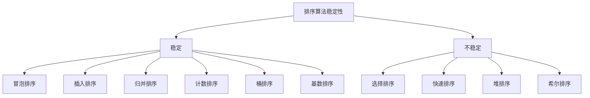
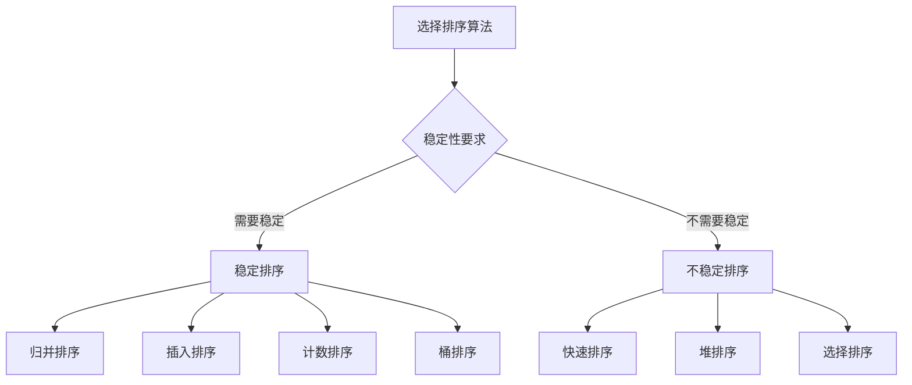

# 排序算法复杂度对比

## 🎯 核心概念

**排序算法复杂度对比**是对各种排序算法的时间复杂度、空间复杂度和稳定性进行详细分析和比较的过程。通过复杂度分析，我们可以选择最适合特定场景的排序算法。

## 🔍 时间复杂度对比

### 1. 基本排序算法复杂度
| 算法 | 最好情况 | 平均情况 | 最坏情况 | 说明 |
|------|----------|----------|----------|------|
| 冒泡排序 | O(N) | O(N^2) | O(N^2) | 最好情况：已排序 |
| 选择排序 | O(N^2) | O(N^2) | O(N^2) | 无论什么情况都是O(N^2) |
| 插入排序 | O(N) | O(N^2) | O(N^2) | 最好情况：已排序 |
| 希尔排序 | O(N log N) | O(N^1.3) | O(N^2) | 取决于增量序列 |

### 2. 高级排序算法复杂度
| 算法 | 最好情况 | 平均情况 | 最坏情况 | 说明 |
|------|----------|----------|----------|------|
| 归并排序 | O(N log N) | O(N log N) | O(N log N) | 稳定，总是O(N log N) |
| 快速排序 | O(N log N) | O(N log N) | O(N^2) | 最坏情况：已排序 |
| 堆排序 | O(N log N) | O(N log N) | O(N log N) | 稳定，总是O(N log N) |

### 3. 非比较排序算法复杂度
| 算法 | 最好情况 | 平均情况 | 最坏情况 | 说明 |
|------|----------|----------|----------|------|
| 计数排序 | O(N + K) | O(N + K) | O(N + K) | K为数据范围 |
| 桶排序 | O(N + K) | O(N + K) | O(N^2) | 最坏情况：所有元素在一个桶 |
| 基数排序 | O(D * (N + K)) | O(D * (N + K)) | O(D * (N + K)) | D为位数 |

## 🎨 空间复杂度对比

### 1. 原地排序算法
| 算法 | 空间复杂度 | 说明 |
|------|------------|------|
| 冒泡排序 | O(1) | 原地排序 |
| 选择排序 | O(1) | 原地排序 |
| 插入排序 | O(1) | 原地排序 |
| 希尔排序 | O(1) | 原地排序 |
| 快速排序 | O(log N) | 递归栈空间 |
| 堆排序 | O(1) | 原地排序 |

### 2. 非原地排序算法
| 算法 | 空间复杂度 | 说明 |
|------|------------|------|
| 归并排序 | O(N) | 需要额外数组 |
| 计数排序 | O(K) | K为数据范围 |
| 桶排序 | O(N + K) | 桶数组和元素数组 |
| 基数排序 | O(N + K) | 临时数组和计数数组 |

## 🔍 稳定性对比

### 1. 稳定排序算法
| 算法 | 稳定性 | 说明 |
|------|--------|------|
| 冒泡排序 | 稳定 | 相等元素不会交换 |
| 插入排序 | 稳定 | 相等元素不会交换 |
| 归并排序 | 稳定 | 相等元素保持原有顺序 |
| 计数排序 | 稳定 | 相等元素保持原有顺序 |
| 桶排序 | 稳定 | 相等元素保持原有顺序 |
| 基数排序 | 稳定 | 相等元素保持原有顺序 |

### 2. 不稳定排序算法
| 算法 | 稳定性 | 说明 |
|------|--------|------|
| 选择排序 | 不稳定 | 可能改变相等元素的相对位置 |
| 快速排序 | 不稳定 | 分区可能改变相等元素的相对位置 |
| 堆排序 | 不稳定 | 堆化过程可能改变相等元素的相对位置 |
| 希尔排序 | 不稳定 | 增量排序可能改变相等元素的相对位置 |

## 📈 性能分析

### 1. 时间复杂度分析
```python
def analyze_time_complexity():
    """时间复杂度分析"""
    # 1. 最好情况：数据已经有序
    # 2. 平均情况：数据随机分布
    # 3. 最坏情况：数据完全逆序
    
    pass

def best_case_analysis():
    """最好情况分析"""
    # 冒泡排序：O(N) - 已排序
    # 插入排序：O(N) - 已排序
    # 快速排序：O(N log N) - 平衡分区
    # 归并排序：O(N log N) - 总是O(N log N)
    
    pass

def average_case_analysis():
    """平均情况分析"""
    # 冒泡排序：O(N^2) - 平均需要N^2/2次比较
    # 插入排序：O(N^2) - 平均需要N^2/4次比较
    # 快速排序：O(N log N) - 平均分区平衡
    # 归并排序：O(N log N) - 总是O(N log N)
    
    pass

def worst_case_analysis():
    """最坏情况分析"""
    # 冒泡排序：O(N^2) - 完全逆序
    # 插入排序：O(N^2) - 完全逆序
    # 快速排序：O(N^2) - 每次选择最值作为基准
    # 归并排序：O(N log N) - 总是O(N log N)
    
    pass
```

### 2. 空间复杂度分析
```python
def analyze_space_complexity():
    """空间复杂度分析"""
    # 1. 原地排序：O(1)空间复杂度
    # 2. 非原地排序：O(N)或更多空间复杂度
    
    pass

def in_place_sorting():
    """原地排序分析"""
    # 冒泡排序：O(1) - 只使用常数个额外变量
    # 选择排序：O(1) - 只使用常数个额外变量
    # 插入排序：O(1) - 只使用常数个额外变量
    # 堆排序：O(1) - 只使用常数个额外变量
    
    pass

def out_of_place_sorting():
    """非原地排序分析"""
    # 归并排序：O(N) - 需要额外数组存储结果
    # 计数排序：O(K) - 需要计数数组
    # 桶排序：O(N + K) - 需要桶数组和元素数组
    # 基数排序：O(N + K) - 需要临时数组和计数数组
    
    pass
```

### 3. 稳定性分析
```python
def analyze_stability():
    """稳定性分析"""
    # 1. 稳定排序：相等元素的相对位置不变
    # 2. 不稳定排序：相等元素的相对位置可能改变
    
    pass

def stable_sorting():
    """稳定排序分析"""
    # 冒泡排序：稳定 - 相等元素不会交换
    # 插入排序：稳定 - 相等元素不会交换
    # 归并排序：稳定 - 相等元素保持原有顺序
    # 计数排序：稳定 - 相等元素保持原有顺序
    
    pass

def unstable_sorting():
    """不稳定排序分析"""
    # 选择排序：不稳定 - 可能改变相等元素的相对位置
    # 快速排序：不稳定 - 分区可能改变相等元素的相对位置
    # 堆排序：不稳定 - 堆化过程可能改变相等元素的相对位置
    # 希尔排序：不稳定 - 增量排序可能改变相等元素的相对位置
    
    pass
```

## 🎯 复杂度选择指南

### 1. 时间复杂度选择
| 数据规模 | 推荐算法 | 时间复杂度 | 原因 |
|----------|----------|------------|------|
| 小规模(N < 50) | 插入排序 | O(N^2) | 简单高效 |
| 中等规模(50 < N < 1000) | 希尔排序 | O(N^1.3) | 比O(N^2)快 |
| 大规模(N > 1000) | 快速排序 | O(N log N) | 平均性能最好 |
| 需要稳定排序 | 归并排序 | O(N log N) | 稳定且高效 |
| 内存受限 | 堆排序 | O(N log N) | 原地排序 |

### 2. 空间复杂度选择
| 内存限制 | 推荐算法 | 空间复杂度 | 原因 |
|----------|----------|------------|------|
| 内存充足 | 归并排序 | O(N) | 稳定且高效 |
| 内存受限 | 堆排序 | O(1) | 原地排序 |
| 内存受限 | 快速排序 | O(log N) | 递归栈空间 |
| 内存受限 | 插入排序 | O(1) | 原地排序 |

### 3. 稳定性选择
| 稳定性要求 | 推荐算法 | 稳定性 | 原因 |
|------------|----------|--------|------|
| 需要稳定 | 归并排序 | 稳定 | 稳定且高效 |
| 需要稳定 | 插入排序 | 稳定 | 简单稳定 |
| 不需要稳定 | 快速排序 | 不稳定 | 效率高 |
| 不需要稳定 | 堆排序 | 不稳定 | 原地排序 |

## 🔍 复杂度优化策略

### 1. 时间复杂度优化
```python
def optimize_time_complexity():
    """时间复杂度优化策略"""
    # 1. 选择合适算法
    # 2. 优化算法实现
    # 3. 使用混合算法
    # 4. 预处理数据
    
    pass

def algorithm_selection():
    """算法选择优化"""
    # 小规模数据：插入排序
    # 大规模数据：快速排序
    # 需要稳定：归并排序
    # 内存受限：堆排序
    
    pass

def implementation_optimization():
    """实现优化"""
    # 减少比较次数
    # 减少交换次数
    # 使用位运算
    # 使用缓存
    
    pass

def hybrid_algorithm():
    """混合算法"""
    # 快速排序 + 插入排序
    # 归并排序 + 插入排序
    # 堆排序 + 插入排序
    
    pass

def data_preprocessing():
    """数据预处理"""
    # 检查是否已排序
    # 检查是否部分排序
    # 使用自适应算法
    
    pass
```

### 2. 空间复杂度优化
```python
def optimize_space_complexity():
    """空间复杂度优化策略"""
    # 1. 使用原地排序
    # 2. 优化递归实现
    # 3. 使用迭代实现
    # 4. 压缩数据结构
    
    pass

def in_place_optimization():
    """原地优化"""
    # 使用原地排序算法
    # 减少额外空间使用
    # 使用位运算
    # 使用交换操作
    
    pass

def recursive_optimization():
    """递归优化"""
    # 减少递归深度
    # 使用尾递归
    # 使用迭代实现
    # 使用栈模拟递归
    
    pass

def data_structure_compression():
    """数据结构压缩"""
    # 使用位数组
    # 使用压缩存储
    # 使用稀疏表示
    # 使用增量存储
    
    pass
```

### 3. 稳定性优化
```python
def optimize_stability():
    """稳定性优化策略"""
    # 1. 选择稳定算法
    # 2. 修改不稳定算法
    # 3. 使用稳定排序
    # 4. 保持相对顺序
    
    pass

def stable_algorithm_selection():
    """稳定算法选择"""
    # 归并排序：稳定且高效
    # 插入排序：稳定且简单
    # 计数排序：稳定且高效
    # 桶排序：稳定且高效
    
    pass

def unstable_algorithm_modification():
    """不稳定算法修改"""
    # 快速排序：使用稳定分区
    # 堆排序：使用稳定堆化
    # 选择排序：使用稳定选择
    
    pass

def relative_order_preservation():
    """相对顺序保持"""
    # 使用稳定排序
    # 保持相等元素顺序
    # 使用稳定比较
    # 使用稳定交换
    
    pass
```

## 📊 复杂度对比图表

### 1. 时间复杂度对比图
```mermaid
graph TD
    A[排序算法时间复杂度] --> B[O(N^2)]
    A --> C[O(N log N)]
    A --> D[O(N + K)]
    
    B --> E[冒泡排序]
    B --> F[选择排序]
    B --> G[插入排序]
    
    C --> H[归并排序]
    C --> I[快速排序]
    C --> J[堆排序]
    
    D --> K[计数排序]
    D --> L[桶排序]
    D --> M[基数排序]
```

### 2. 空间复杂度对比图
```mermaid
graph TD
    A[排序算法空间复杂度] --> B[O(1)]
    A --> C[O(log N)]
    A --> D[O(N)]
    A --> E[O(K)]
    
    B --> F[冒泡排序]
    B --> G[选择排序]
    B --> H[插入排序]
    B --> I[堆排序]
    
    C --> J[快速排序]
    
    D --> K[归并排序]
    D --> L[桶排序]
    D --> M[基数排序]
    
    E --> N[计数排序]
```

### 3. 稳定性对比图


## 🎯 复杂度选择决策树

### 1. 时间复杂度选择决策树
```mermaid
graph TD
    A[选择排序算法] --> B{数据规模}
    B -->|小规模| C[插入排序 O(N^2)]
    B -->|中等规模| D[希尔排序 O(N^1.3)]
    B -->|大规模| E{稳定性要求}
    E -->|需要稳定| F[归并排序 O(N log N)]
    E -->|不需要稳定| G[快速排序 O(N log N)]
    
    A --> H{内存限制}
    H -->|内存受限| I[堆排序 O(N log N)]
    H -->|内存充足| J[归并排序 O(N log N)]
```

### 2. 空间复杂度选择决策树
```mermaid
graph TD
    A[选择排序算法] --> B{内存限制}
    B -->|内存受限| C[原地排序 O(1)]
    B -->|内存充足| D[非原地排序 O(N)]
    
    C --> E[插入排序]
    C --> F[堆排序]
    C --> G[快速排序 O(log N)]
    
    D --> H[归并排序]
    D --> I[计数排序 O(K)]
    D --> J[桶排序 O(N + K)]
```

### 3. 稳定性选择决策树


## 🔗 相关概念

### 排序算法总览
- **关系**：复杂度对比是排序算法选择的重要依据
- **链接**：[[01-排序算法总览]]

### 比较排序算法
- **关系**：比较排序算法的复杂度分析
- **链接**：[[02-比较排序算法]]

### 非比较排序算法
- **关系**：非比较排序算法的复杂度分析
- **链接**：[[03-非比较排序算法]]

### 算法选择
- **关系**：复杂度对比是算法选择的基础
- **链接**：[[05-排序算法选择指南]]

## 📚 学习建议

### 费曼学习法
1. **选择概念**：排序算法复杂度对比
2. **教授他人**：解释复杂度分析的方法和意义
3. **回顾简化**：找出理解不足
4. **重新组织**：用更简单的方式表达

### 刻意练习
1. **分析练习**：分析各种排序算法的复杂度
2. **对比练习**：对比不同排序算法的复杂度
3. **选择练习**：根据复杂度选择合适的算法
4. **优化练习**：优化排序算法的复杂度

## 🔗 相关链接
- [[01-排序算法总览]] - 排序算法的总体介绍
- [[02-比较排序算法]] - 比较排序算法的详细实现
- [[03-非比较排序算法]] - 非比较排序算法的详细实现
- [[05-排序算法选择指南]] - 排序算法选择策略
- [[06-排序算法稳定性分析]] - 排序算法稳定性分析
