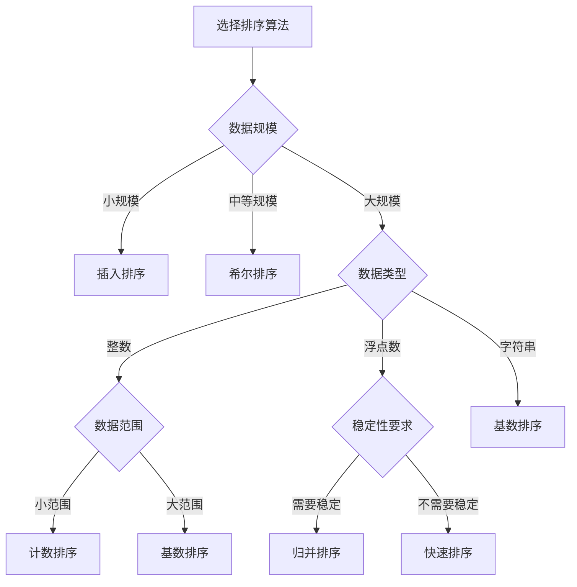
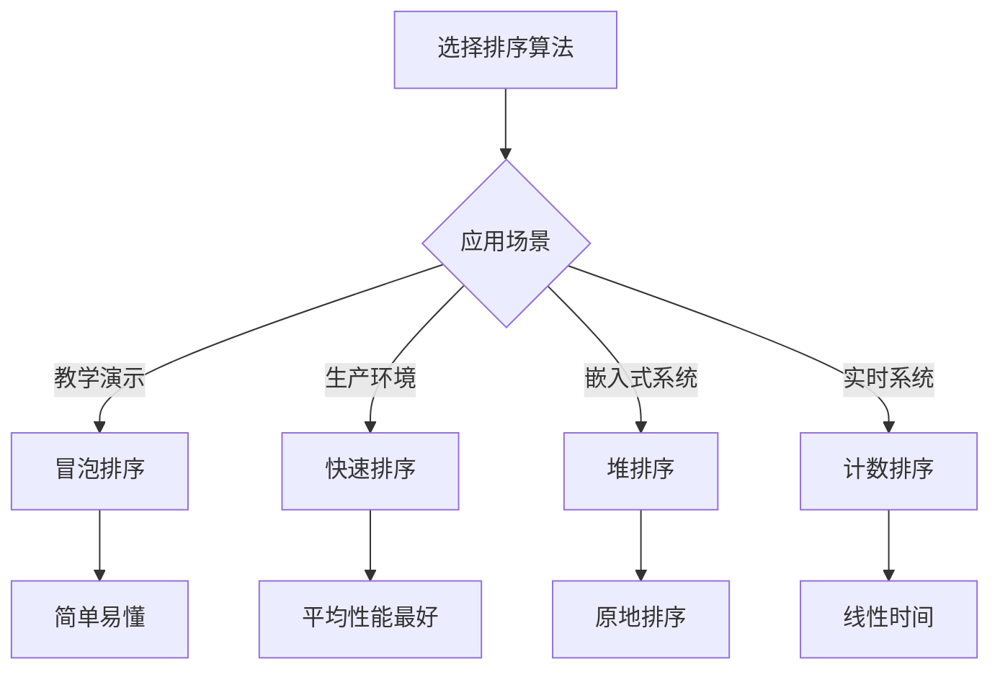

# 排序算法选择指南

## 🎯 核心概念

**排序算法选择指南**是根据不同的数据特征、性能要求和应用场景，选择最适合的排序算法的决策过程。正确的算法选择能够显著提高程序性能。

## 🔍 选择因素分析

### 1. 数据规模
```python
def analyze_data_size():
    """数据规模分析"""
    # 1. 小规模数据(N < 50)：简单算法更高效
    # 2. 中等规模数据(50 < N < 1000)：平衡算法
    # 3. 大规模数据(N > 1000)：高效算法
    
    pass

def small_data_selection():
    """小规模数据选择"""
    # 插入排序：简单高效，O(N^2)
    # 选择排序：简单稳定，O(N^2)
    # 冒泡排序：简单易懂，O(N^2)
    
    pass

def medium_data_selection():
    """中等规模数据选择"""
    # 希尔排序：比O(N^2)快，O(N^1.3)
    # 快速排序：平均O(N log N)
    # 归并排序：稳定O(N log N)
    
    pass

def large_data_selection():
    """大规模数据选择"""
    # 快速排序：平均性能最好
    # 归并排序：稳定且高效
    # 堆排序：原地排序
    # 计数排序：线性时间(整数)
    
    pass
```

### 2. 数据特征
```python
def analyze_data_characteristics():
    """数据特征分析"""
    # 1. 数据类型：整数、浮点数、字符串
    # 2. 数据分布：均匀、正态、偏斜
    # 3. 数据范围：小范围、大范围
    # 4. 数据状态：已排序、部分排序、随机
    
    pass

def integer_data_selection():
    """整数数据选择"""
    # 计数排序：O(N + K)，K为范围
    # 基数排序：O(D * (N + K))，D为位数
    # 桶排序：O(N + K)，均匀分布
    
    pass

def float_data_selection():
    """浮点数数据选择"""
    # 快速排序：平均O(N log N)
    # 归并排序：稳定O(N log N)
    # 堆排序：原地O(N log N)
    
    pass

def string_data_selection():
    """字符串数据选择"""
    # 基数排序：O(D * (N + K))，D为长度
    # 归并排序：稳定O(N log N)
    # 快速排序：平均O(N log N)
    
    pass

def sorted_data_selection():
    """已排序数据选择"""
    # 插入排序：O(N)，已排序
    # 冒泡排序：O(N)，已排序
    # 快速排序：O(N^2)，最坏情况
    
    pass
```

### 3. 性能要求
```python
def analyze_performance_requirements():
    """性能要求分析"""
    # 1. 时间复杂度：最好、平均、最坏
    # 2. 空间复杂度：内存限制
    # 3. 稳定性：相等元素相对位置
    # 4. 实现复杂度：代码难度
    
    pass

def time_complexity_requirements():
    """时间复杂度要求"""
    # O(N)：计数排序、桶排序
    # O(N log N)：快速排序、归并排序、堆排序
    # O(N^2)：冒泡排序、选择排序、插入排序
    
    pass

def space_complexity_requirements():
    """空间复杂度要求"""
    # O(1)：冒泡排序、选择排序、插入排序、堆排序
    # O(log N)：快速排序(递归栈)
    # O(N)：归并排序、计数排序、桶排序
    
    pass

def stability_requirements():
    """稳定性要求"""
    # 稳定：归并排序、插入排序、计数排序、桶排序
    # 不稳定：快速排序、堆排序、选择排序
    
    pass
```

### 4. 应用场景
```python
def analyze_application_scenarios():
    """应用场景分析"""
    # 1. 教学演示：简单易懂
    # 2. 生产环境：高效稳定
    # 3. 嵌入式系统：内存受限
    # 4. 实时系统：时间敏感
    
    pass

def teaching_scenarios():
    """教学场景选择"""
    # 冒泡排序：简单易懂
    # 选择排序：逻辑清晰
    # 插入排序：直观理解
    # 归并排序：分治思想
    
    pass

def production_scenarios():
    """生产环境选择"""
    # 快速排序：平均性能最好
    # 归并排序：稳定且高效
    # 堆排序：原地排序
    # 计数排序：线性时间
    
    pass

def embedded_scenarios():
    """嵌入式系统选择"""
    # 堆排序：O(1)空间
    # 插入排序：O(1)空间
    # 选择排序：O(1)空间
    # 快速排序：O(log N)空间
    
    pass

def real_time_scenarios():
    """实时系统选择"""
    # 计数排序：O(N)时间
    # 桶排序：O(N)时间
    # 基数排序：O(D * N)时间
    # 归并排序：O(N log N)时间
    
    pass
```

## 🎨 选择策略

### 1. 基于数据规模的选择
| 数据规模 | 推荐算法 | 时间复杂度 | 空间复杂度 | 原因 |
|----------|----------|------------|------------|------|
| N < 50 | 插入排序 | O(N^2) | O(1) | 简单高效 |
| 50 < N < 1000 | 希尔排序 | O(N^1.3) | O(1) | 比O(N^2)快 |
| N > 1000 | 快速排序 | O(N log N) | O(log N) | 平均性能最好 |
| N > 1000(稳定) | 归并排序 | O(N log N) | O(N) | 稳定且高效 |

### 2. 基于数据类型的选择
| 数据类型 | 推荐算法 | 时间复杂度 | 空间复杂度 | 原因 |
|----------|----------|------------|------------|------|
| 整数(小范围) | 计数排序 | O(N + K) | O(K) | 线性时间 |
| 整数(大范围) | 基数排序 | O(D * (N + K)) | O(N + K) | 线性时间 |
| 浮点数 | 快速排序 | O(N log N) | O(log N) | 平均性能最好 |
| 字符串 | 基数排序 | O(D * (N + K)) | O(N + K) | 线性时间 |

### 3. 基于性能要求的选择
| 性能要求 | 推荐算法 | 时间复杂度 | 空间复杂度 | 原因 |
|----------|----------|------------|------------|------|
| 最快速度 | 计数排序 | O(N + K) | O(K) | 线性时间 |
| 内存受限 | 堆排序 | O(N log N) | O(1) | 原地排序 |
| 需要稳定 | 归并排序 | O(N log N) | O(N) | 稳定且高效 |
| 平均性能 | 快速排序 | O(N log N) | O(log N) | 平均性能最好 |

### 4. 基于应用场景的选择
| 应用场景 | 推荐算法 | 时间复杂度 | 空间复杂度 | 原因 |
|----------|----------|------------|------------|------|
| 教学演示 | 冒泡排序 | O(N^2) | O(1) | 简单易懂 |
| 生产环境 | 快速排序 | O(N log N) | O(log N) | 平均性能最好 |
| 嵌入式系统 | 堆排序 | O(N log N) | O(1) | 原地排序 |
| 实时系统 | 计数排序 | O(N + K) | O(K) | 线性时间 |

## 🔍 选择决策树

### 1. 主要选择决策树


### 2. 性能要求决策树
```mermaid
graph TD
    A[选择排序算法] --> B{性能要求}
    B -->|最快速度| C[计数排序]
    B -->|内存受限| D[堆排序]
    B -->|需要稳定| E[归并排序]
    B -->|平均性能| F[快速排序]
    
    C --> G[O(N + K)]
    D --> H[O(1)空间]
    E --> I[稳定O(N log N)]
    F --> J[平均O(N log N)]
```

### 3. 应用场景决策树


## 📈 选择优化策略

### 1. 混合算法策略
```python
def hybrid_sorting_strategy():
    """混合排序策略"""
    # 1. 快速排序 + 插入排序
    # 2. 归并排序 + 插入排序
    # 3. 堆排序 + 插入排序
    # 4. 计数排序 + 快速排序
    
    pass

def quick_sort_hybrid(arr, threshold=10):
    """快速排序 + 插入排序混合"""
    if len(arr) <= threshold:
        return insertion_sort(arr)
    
    if len(arr) <= 1:
        return arr
    
    pivot = partition(arr, 0, len(arr) - 1)
    left = quick_sort_hybrid(arr[:pivot], threshold)
    right = quick_sort_hybrid(arr[pivot + 1:], threshold)
    
    return left + [arr[pivot]] + right

def merge_sort_hybrid(arr, threshold=10):
    """归并排序 + 插入排序混合"""
    if len(arr) <= threshold:
        return insertion_sort(arr)
    
    if len(arr) <= 1:
        return arr
    
    mid = len(arr) // 2
    left = merge_sort_hybrid(arr[:mid], threshold)
    right = merge_sort_hybrid(arr[mid:], threshold)
    
    return merge(left, right)

def heap_sort_hybrid(arr, threshold=10):
    """堆排序 + 插入排序混合"""
    if len(arr) <= threshold:
        return insertion_sort(arr)
    
    return heap_sort(arr)
```

### 2. 自适应算法策略
```python
def adaptive_sorting_strategy():
    """自适应排序策略"""
    # 1. 检测数据特征
    # 2. 选择合适算法
    # 3. 动态调整策略
    # 4. 优化性能
    
    pass

def detect_data_characteristics(arr):
    """检测数据特征"""
    # 检测是否已排序
    # 检测数据范围
    # 检测数据分布
    # 检测数据类型
    
    pass

def is_sorted(arr):
    """检测是否已排序"""
    for i in range(len(arr) - 1):
        if arr[i] > arr[i + 1]:
            return False
    return True

def get_data_range(arr):
    """获取数据范围"""
    if not arr:
        return 0
    return max(arr) - min(arr)

def adaptive_sort(arr):
    """自适应排序"""
    if not arr:
        return arr
    
    # 检测是否已排序
    if is_sorted(arr):
        return arr
    
    # 检测数据范围
    data_range = get_data_range(arr)
    
    # 根据数据范围选择算法
    if data_range < len(arr):
        return counting_sort(arr)
    elif len(arr) < 50:
        return insertion_sort(arr)
    else:
        return quick_sort(arr)
```

### 3. 性能优化策略
```python
def performance_optimization_strategy():
    """性能优化策略"""
    # 1. 减少比较次数
    # 2. 减少交换次数
    # 3. 使用位运算
    # 4. 使用缓存
    
    pass

def reduce_comparisons():
    """减少比较次数"""
    # 使用二分查找
    # 使用位运算
    # 使用哈希表
    # 使用索引
    
    pass

def reduce_swaps():
    """减少交换次数"""
    # 使用移动操作
    # 使用批量操作
    # 使用原地操作
    # 使用位运算
    
    pass

def use_bit_operations():
    """使用位运算"""
    # 位排序
    # 位计数
    # 位交换
    # 位比较
    
    pass

def use_caching():
    """使用缓存"""
    # 缓存中间结果
    # 缓存计算结果
    # 缓存比较结果
    # 缓存交换结果
    
    pass
```

## 🎯 实际应用建议

### 1. 通用建议
| 场景 | 建议 | 原因 |
|------|------|------|
| 小规模数据 | 使用插入排序 | 简单高效 |
| 大规模数据 | 使用快速排序 | 平均性能最好 |
| 需要稳定 | 使用归并排序 | 稳定且高效 |
| 内存受限 | 使用堆排序 | 原地排序 |
| 整数数据 | 使用计数排序 | 线性时间 |

### 2. 特殊情况建议
| 特殊情况 | 建议 | 原因 |
|----------|------|------|
| 已排序数据 | 使用插入排序 | O(N)时间 |
| 部分排序数据 | 使用插入排序 | 接近O(N)时间 |
| 重复数据多 | 使用计数排序 | 线性时间 |
| 数据范围小 | 使用计数排序 | 线性时间 |
| 需要稳定排序 | 使用归并排序 | 稳定且高效 |

### 3. 性能优化建议
| 优化目标 | 建议 | 原因 |
|----------|------|------|
| 最快速度 | 使用计数排序 | 线性时间 |
| 最少内存 | 使用堆排序 | O(1)空间 |
| 最稳定 | 使用归并排序 | 稳定且高效 |
| 最通用 | 使用快速排序 | 平均性能最好 |

## 🔗 相关概念

### 排序算法总览
- **关系**：选择指南基于排序算法总览
- **链接**：[[01-排序算法总览]]

### 比较排序算法
- **关系**：比较排序算法的选择策略
- **链接**：[[02-比较排序算法]]

### 非比较排序算法
- **关系**：非比较排序算法的选择策略
- **链接**：[[03-非比较排序算法]]

### 复杂度对比
- **关系**：复杂度对比是选择的基础
- **链接**：[[04-排序算法复杂度对比]]

## 📚 学习建议

### 费曼学习法
1. **选择概念**：排序算法选择指南
2. **教授他人**：解释选择策略和决策过程
3. **回顾简化**：找出理解不足
4. **重新组织**：用更简单的方式表达

### 刻意练习
1. **选择练习**：根据场景选择合适的算法
2. **分析练习**：分析不同场景的算法选择
3. **优化练习**：优化算法选择策略
4. **应用练习**：应用选择指南解决实际问题

## 🔗 相关链接
- [[01-排序算法总览]] - 排序算法的总体介绍
- [[02-比较排序算法]] - 比较排序算法的详细实现
- [[03-非比较排序算法]] - 非比较排序算法的详细实现
- [[04-排序算法复杂度对比]] - 排序算法复杂度分析
- [[06-排序算法稳定性分析]] - 排序算法稳定性分析
