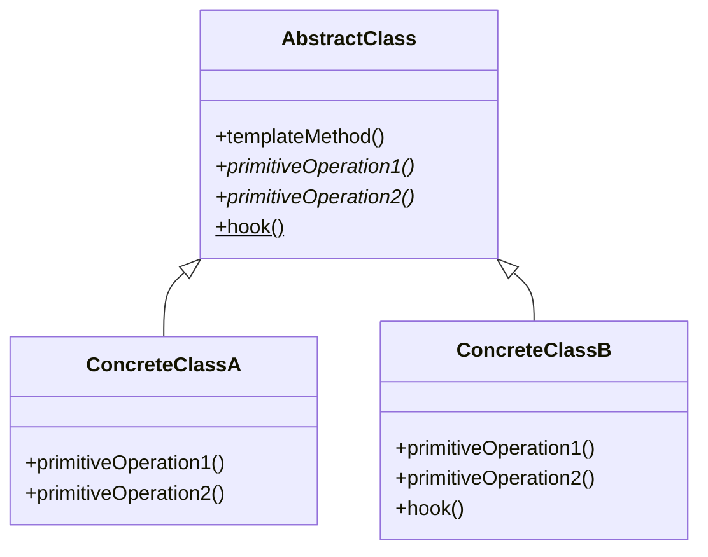

# 模板方法模式

## 概述

模板方法模式（Template Method Pattern）是一种行为设计模式，它定义了一个算法的骨架，将一些步骤延迟到子类中实现。模板方法使得子类可以不改变算法的整体结构而重新定义算法的某些特定步骤。

## 核心概念

### 基本思想
- **算法骨架**：定义算法的基本流程和步骤
- **抽象步骤**：将变化的部分抽象为抽象方法
- **具体实现**：子类实现具体的抽象方法
- **钩子方法**：提供可选的扩展点

### 关键特性
- **不变性**：算法的整体结构不变
- **可扩展性**：通过子类扩展具体实现
- **复用性**：公共代码在父类中实现
- **控制反转**：父类控制算法流程，子类实现细节

## 模式结构

### 类图结构


### 角色定义
- **AbstractClass（抽象类）**：定义模板方法和抽象方法
- **ConcreteClass（具体类）**：实现抽象方法
- **Template Method（模板方法）**：定义算法骨架
- **Primitive Operation（原语操作）**：抽象方法
- **Hook Method（钩子方法）**：可选方法

## 算法应用实例

### 1. 排序算法模板

```python
from abc import ABC, abstractmethod
from typing import List, Any

class SortTemplate(ABC):
    """排序算法模板类"""
    
    def sort(self, data: List[Any]) -> List[Any]:
        """模板方法：定义排序流程"""
        # 1. 数据预处理
        processed_data = self.preprocess(data)
        
        # 2. 执行排序
        sorted_data = self.do_sort(processed_data)
        
        # 3. 后处理
        result = self.postprocess(sorted_data)
        
        # 4. 可选验证
        if self.should_validate():
            self.validate(result)
        
        return result
    
    def preprocess(self, data: List[Any]) -> List[Any]:
        """数据预处理（钩子方法）"""
        return data.copy()
    
    @abstractmethod
    def do_sort(self, data: List[Any]) -> List[Any]:
        """具体排序实现（抽象方法）"""
        pass
    
    def postprocess(self, data: List[Any]) -> List[Any]:
        """后处理（钩子方法）"""
        return data
    
    def should_validate(self) -> bool:
        """是否验证结果（钩子方法）"""
        return True
    
    def validate(self, data: List[Any]) -> None:
        """验证排序结果"""
        for i in range(len(data) - 1):
            if data[i] > data[i + 1]:
                raise ValueError("排序结果不正确")

class QuickSort(SortTemplate):
    """快速排序实现"""
    
    def do_sort(self, data: List[Any]) -> List[Any]:
        """快速排序实现"""
        if len(data) <= 1:
            return data
        
        pivot = data[len(data) // 2]
        left = [x for x in data if x < pivot]
        middle = [x for x in data if x == pivot]
        right = [x for x in data if x > pivot]
        
        return self.do_sort(left) + middle + self.do_sort(right)

class MergeSort(SortTemplate):
    """归并排序实现"""
    
    def do_sort(self, data: List[Any]) -> List[Any]:
        """归并排序实现"""
        if len(data) <= 1:
            return data
        
        mid = len(data) // 2
        left = self.do_sort(data[:mid])
        right = self.do_sort(data[mid:])
        
        return self._merge(left, right)
    
    def _merge(self, left: List[Any], right: List[Any]) -> List[Any]:
        """合并两个有序数组"""
        result = []
        i = j = 0
        
        while i < len(left) and j < len(right):
            if left[i] <= right[j]:
                result.append(left[i])
                i += 1
            else:
                result.append(right[j])
                j += 1
        
        result.extend(left[i:])
        result.extend(right[j:])
        return result

# 使用示例
if __name__ == "__main__":
    data = [64, 34, 25, 12, 22, 11, 90]
    
    # 快速排序
    quick_sort = QuickSort()
    result1 = quick_sort.sort(data)
    print(f"快速排序结果: {result1}")
    
    # 归并排序
    merge_sort = MergeSort()
    result2 = merge_sort.sort(data)
    print(f"归并排序结果: {result2}")
```

### 2. 搜索算法模板

```python
from abc import ABC, abstractmethod
from typing import List, Any, Optional, Tuple

class SearchTemplate(ABC):
    """搜索算法模板类"""
    
    def search(self, data: List[Any], target: Any) -> Optional[int]:
        """模板方法：定义搜索流程"""
        # 1. 数据预处理
        processed_data = self.preprocess(data)
        
        # 2. 执行搜索
        result = self.do_search(processed_data, target)
        
        # 3. 结果处理
        return self.postprocess(result)
    
    def preprocess(self, data: List[Any]) -> List[Any]:
        """数据预处理（钩子方法）"""
        return data
    
    @abstractmethod
    def do_search(self, data: List[Any], target: Any) -> Optional[int]:
        """具体搜索实现（抽象方法）"""
        pass
    
    def postprocess(self, result: Optional[int]) -> Optional[int]:
        """结果处理（钩子方法）"""
        return result

class LinearSearch(SearchTemplate):
    """线性搜索实现"""
    
    def do_search(self, data: List[Any], target: Any) -> Optional[int]:
        """线性搜索实现"""
        for i, item in enumerate(data):
            if item == target:
                return i
        return None

class BinarySearch(SearchTemplate):
    """二分搜索实现"""
    
    def preprocess(self, data: List[Any]) -> List[Any]:
        """预处理：排序数据"""
        return sorted(data)
    
    def do_search(self, data: List[Any], target: Any) -> Optional[int]:
        """二分搜索实现"""
        left, right = 0, len(data) - 1
        
        while left <= right:
            mid = (left + right) // 2
            if data[mid] == target:
                return mid
            elif data[mid] < target:
                left = mid + 1
            else:
                right = mid - 1
        
        return None

# 使用示例
if __name__ == "__main__":
    data = [1, 3, 5, 7, 9, 11, 13, 15]
    target = 7
    
    # 线性搜索
    linear_search = LinearSearch()
    result1 = linear_search.search(data, target)
    print(f"线性搜索结果: {result1}")
    
    # 二分搜索
    binary_search = BinarySearch()
    result2 = binary_search.search(data, target)
    print(f"二分搜索结果: {result2}")
```

### 3. 图算法模板

```python
from abc import ABC, abstractmethod
from typing import Dict, List, Set, Tuple, Any
from collections import defaultdict, deque

class GraphAlgorithmTemplate(ABC):
    """图算法模板类"""
    
    def __init__(self):
        self.graph = defaultdict(list)
        self.visited = set()
        self.result = []
    
    def execute(self, graph: Dict[int, List[int]], start: int) -> List[Any]:
        """模板方法：定义图算法流程"""
        # 1. 初始化
        self.initialize(graph, start)
        
        # 2. 执行算法
        self.run_algorithm(start)
        
        # 3. 清理和返回结果
        return self.finalize()
    
    def initialize(self, graph: Dict[int, List[int]], start: int) -> None:
        """初始化（钩子方法）"""
        self.graph = graph
        self.visited.clear()
        self.result.clear()
    
    @abstractmethod
    def run_algorithm(self, start: int) -> None:
        """具体算法实现（抽象方法）"""
        pass
    
    def finalize(self) -> List[Any]:
        """最终处理（钩子方法）"""
        return self.result.copy()

class DFSTemplate(GraphAlgorithmTemplate):
    """深度优先搜索模板"""
    
    def run_algorithm(self, start: int) -> None:
        """DFS实现"""
        self._dfs(start)
    
    def _dfs(self, node: int) -> None:
        """递归DFS"""
        if node in self.visited:
            return
        
        self.visited.add(node)
        self.result.append(node)
        
        for neighbor in self.graph[node]:
            self._dfs(neighbor)

class BFSTemplate(GraphAlgorithmTemplate):
    """广度优先搜索模板"""
    
    def run_algorithm(self, start: int) -> None:
        """BFS实现"""
        queue = deque([start])
        self.visited.add(start)
        
        while queue:
            node = queue.popleft()
            self.result.append(node)
            
            for neighbor in self.graph[node]:
                if neighbor not in self.visited:
                    self.visited.add(neighbor)
                    queue.append(neighbor)

# 使用示例
if __name__ == "__main__":
    graph = {
        1: [2, 3],
        2: [4, 5],
        3: [6],
        4: [],
        5: [],
        6: []
    }
    
    # DFS
    dfs = DFSTemplate()
    dfs_result = dfs.execute(graph, 1)
    print(f"DFS结果: {dfs_result}")
    
    # BFS
    bfs = BFSTemplate()
    bfs_result = bfs.execute(graph, 1)
    print(f"BFS结果: {bfs_result}")
```

## 高级应用

### 1. 数据处理管道模板

```python
from abc import ABC, abstractmethod
from typing import List, Dict, Any, Optional
import json

class DataProcessingTemplate(ABC):
    """数据处理管道模板"""
    
    def process(self, input_data: Any) -> Any:
        """模板方法：定义数据处理流程"""
        # 1. 数据验证
        validated_data = self.validate(input_data)
        
        # 2. 数据转换
        transformed_data = self.transform(validated_data)
        
        # 3. 业务处理
        processed_data = self.business_logic(transformed_data)
        
        # 4. 结果格式化
        formatted_data = self.format_output(processed_data)
        
        # 5. 可选后处理
        if self.should_post_process():
            formatted_data = self.post_process(formatted_data)
        
        return formatted_data
    
    def validate(self, data: Any) -> Any:
        """数据验证（钩子方法）"""
        return data
    
    @abstractmethod
    def transform(self, data: Any) -> Any:
        """数据转换（抽象方法）"""
        pass
    
    @abstractmethod
    def business_logic(self, data: Any) -> Any:
        """业务逻辑（抽象方法）"""
        pass
    
    def format_output(self, data: Any) -> Any:
        """输出格式化（钩子方法）"""
        return data
    
    def should_post_process(self) -> bool:
        """是否需要后处理（钩子方法）"""
        return False
    
    def post_process(self, data: Any) -> Any:
        """后处理（钩子方法）"""
        return data

class JSONProcessor(DataProcessingTemplate):
    """JSON数据处理器"""
    
    def validate(self, data: Any) -> Dict[str, Any]:
        """验证JSON数据"""
        if isinstance(data, str):
            return json.loads(data)
        elif isinstance(data, dict):
            return data
        else:
            raise ValueError("输入数据必须是JSON字符串或字典")
    
    def transform(self, data: Dict[str, Any]) -> Dict[str, Any]:
        """数据转换"""
        # 添加时间戳
        data['processed_at'] = '2024-01-01T00:00:00Z'
        return data
    
    def business_logic(self, data: Dict[str, Any]) -> Dict[str, Any]:
        """业务逻辑处理"""
        # 计算字段
        if 'values' in data:
            data['sum'] = sum(data['values'])
            data['count'] = len(data['values'])
        return data
    
    def format_output(self, data: Dict[str, Any]) -> str:
        """格式化输出为JSON字符串"""
        return json.dumps(data, indent=2)

# 使用示例
if __name__ == "__main__":
    input_data = '{"values": [1, 2, 3, 4, 5], "name": "test"}'
    
    processor = JSONProcessor()
    result = processor.process(input_data)
    print(f"处理结果:\n{result}")
```

### 2. 算法测试模板

```python
from abc import ABC, abstractmethod
from typing import List, Any, Callable
import time
import random

class AlgorithmTestTemplate(ABC):
    """算法测试模板"""
    
    def run_tests(self, test_cases: List[Any]) -> Dict[str, Any]:
        """模板方法：定义测试流程"""
        results = {
            'algorithm_name': self.get_algorithm_name(),
            'test_results': [],
            'performance_stats': {},
            'summary': {}
        }
        
        for i, test_case in enumerate(test_cases):
            # 1. 准备测试数据
            test_data = self.prepare_test_data(test_case)
            
            # 2. 执行算法
            start_time = time.time()
            result = self.execute_algorithm(test_data)
            end_time = time.time()
            
            # 3. 验证结果
            is_correct = self.validate_result(test_data, result)
            
            # 4. 记录结果
            test_result = {
                'test_case': i + 1,
                'input': test_data,
                'output': result,
                'execution_time': end_time - start_time,
                'is_correct': is_correct
            }
            results['test_results'].append(test_result)
        
        # 5. 生成统计信息
        results['performance_stats'] = self.calculate_stats(results['test_results'])
        results['summary'] = self.generate_summary(results)
        
        return results
    
    def prepare_test_data(self, test_case: Any) -> Any:
        """准备测试数据（钩子方法）"""
        return test_case
    
    @abstractmethod
    def execute_algorithm(self, data: Any) -> Any:
        """执行算法（抽象方法）"""
        pass
    
    def validate_result(self, input_data: Any, output: Any) -> bool:
        """验证结果（钩子方法）"""
        return True
    
    def get_algorithm_name(self) -> str:
        """获取算法名称（钩子方法）"""
        return self.__class__.__name__
    
    def calculate_stats(self, test_results: List[Dict]) -> Dict[str, Any]:
        """计算统计信息"""
        execution_times = [tr['execution_time'] for tr in test_results]
        correct_count = sum(1 for tr in test_results if tr['is_correct'])
        
        return {
            'total_tests': len(test_results),
            'correct_tests': correct_count,
            'accuracy': correct_count / len(test_results),
            'avg_execution_time': sum(execution_times) / len(execution_times),
            'max_execution_time': max(execution_times),
            'min_execution_time': min(execution_times)
        }
    
    def generate_summary(self, results: Dict[str, Any]) -> Dict[str, Any]:
        """生成总结"""
        stats = results['performance_stats']
        return {
            'algorithm': results['algorithm_name'],
            'accuracy': f"{stats['accuracy']:.2%}",
            'avg_time': f"{stats['avg_execution_time']:.6f}s",
            'status': 'PASS' if stats['accuracy'] == 1.0 else 'FAIL'
        }

class SortAlgorithmTest(AlgorithmTestTemplate):
    """排序算法测试"""
    
    def execute_algorithm(self, data: List[int]) -> List[int]:
        """执行排序算法"""
        return sorted(data)
    
    def validate_result(self, input_data: List[int], output: List[int]) -> bool:
        """验证排序结果"""
        return output == sorted(input_data)

# 使用示例
if __name__ == "__main__":
    # 生成测试用例
    test_cases = [
        [3, 1, 4, 1, 5, 9, 2, 6],
        [1, 2, 3, 4, 5],
        [5, 4, 3, 2, 1],
        [1],
        []
    ]
    
    # 运行测试
    tester = SortAlgorithmTest()
    results = tester.run_tests(test_cases)
    
    print(f"测试结果:")
    print(f"算法: {results['summary']['algorithm']}")
    print(f"准确率: {results['summary']['accuracy']}")
    print(f"平均执行时间: {results['summary']['avg_time']}")
    print(f"状态: {results['summary']['status']}")
```

## 性能分析

### 时间复杂度
- **模板方法调用**：O(1)
- **具体算法实现**：取决于具体算法
- **钩子方法调用**：O(1) 到 O(n)

### 空间复杂度
- **模板类存储**：O(1)
- **具体实现存储**：取决于具体算法
- **递归调用栈**：取决于算法深度

### 性能对比表

| 算法类型 | 模板方法开销 | 具体实现复杂度 | 总体性能 |
|---------|-------------|---------------|----------|
| 排序算法 | O(1) | O(n log n) | O(n log n) |
| 搜索算法 | O(1) | O(log n) | O(log n) |
| 图算法 | O(1) | O(V + E) | O(V + E) |
| 数据处理 | O(1) | O(n) | O(n) |

## 应用场景

### 1. 算法框架设计
- **排序算法库**：统一接口，不同实现
- **搜索算法库**：标准流程，灵活扩展
- **图算法库**：通用模板，特定算法

### 2. 数据处理管道
- **ETL流程**：标准流程，自定义转换
- **数据验证**：统一验证，特定规则
- **报告生成**：标准格式，自定义内容

### 3. 测试框架
- **算法测试**：标准测试流程
- **性能测试**：统一测试框架
- **回归测试**：自动化测试流程

## 优缺点分析

### 优点
- **代码复用**：公共代码在父类中实现
- **扩展性好**：通过子类扩展功能
- **结构清晰**：算法流程一目了然
- **维护性强**：修改模板影响所有子类

### 缺点
- **类数量多**：每个具体实现需要一个类
- **继承限制**：只能通过继承扩展
- **复杂度增加**：理解模板方法需要时间
- **调试困难**：调用链较长

## 相关概念

- **策略模式**：[[02-策略模式]] - 算法族的选择
- **状态模式**：[[03-状态模式]] - 状态转换的控制
- **工厂方法模式**：创建对象的模板
- **命令模式**：请求的封装和执行

## 学习建议

### 费曼学习法
1. **理解概念**：用简单语言解释模板方法模式
2. **举例说明**：用生活中的例子说明模板方法
3. **实践应用**：实现一个完整的模板方法示例
4. **教授他人**：向他人解释模板方法模式

### 刻意练习
1. **基础练习**：实现简单的排序算法模板
2. **进阶练习**：设计复杂的数据处理模板
3. **综合练习**：构建完整的算法测试框架
4. **创新练习**：设计新的模板方法应用场景

### 学习路径
1. **理论学习**：理解模板方法模式的基本概念
2. **代码实践**：实现各种算法模板
3. **项目应用**：在实际项目中使用模板方法
4. **模式组合**：与其他设计模式结合使用
