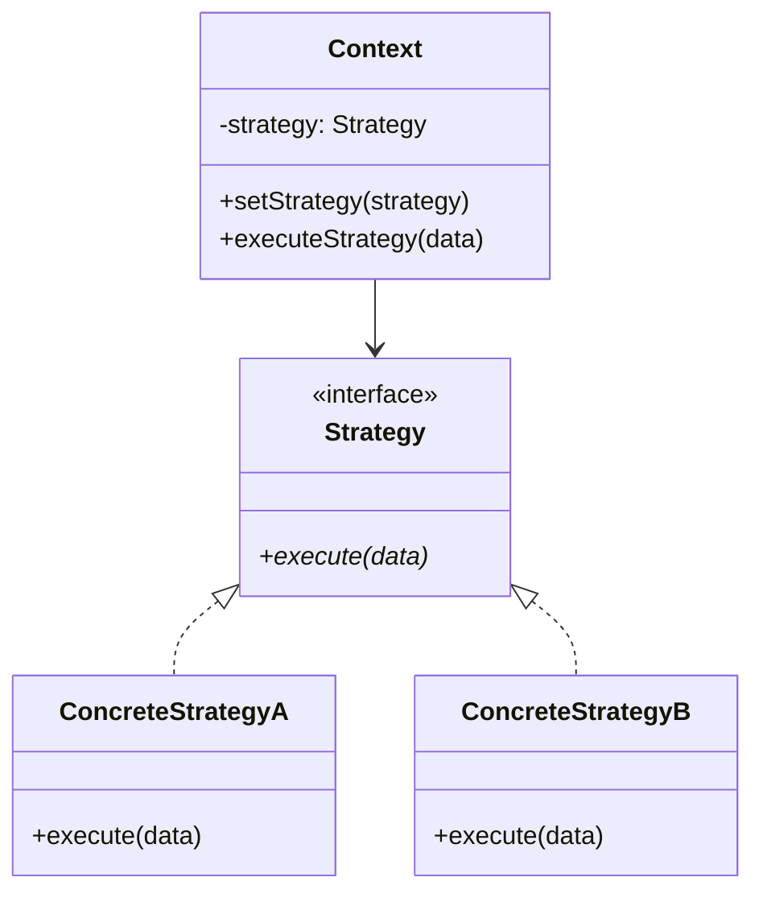

# 策略模式

## 概述

策略模式（Strategy Pattern）是一种行为设计模式，它定义了一系列算法，并将每个算法封装起来，使它们可以相互替换。策略模式让算法的变化独立于使用算法的客户。

## 核心概念

### 基本思想
- **算法族**：定义一系列相关的算法
- **策略接口**：定义算法的通用接口
- **具体策略**：实现具体的算法
- **上下文**：使用策略的类

### 关键特性
- **可替换性**：算法可以动态切换
- **封装性**：每个算法独立封装
- **扩展性**：易于添加新算法
- **解耦性**：算法与使用方解耦

## 模式结构

### 类图结构


### 角色定义
- **Strategy（策略接口）**：定义算法的通用接口
- **ConcreteStrategy（具体策略）**：实现具体的算法
- **Context（上下文）**：使用策略的类
- **Client（客户端）**：创建和使用策略

## 算法应用实例

### 1. 排序策略模式

```python
from abc import ABC, abstractmethod
from typing import List, Any
import random

class SortStrategy(ABC):
    """排序策略接口"""
    
    @abstractmethod
    def sort(self, data: List[Any]) -> List[Any]:
        """排序方法"""
        pass
    
    @abstractmethod
    def get_name(self) -> str:
        """获取策略名称"""
        pass

class QuickSortStrategy(SortStrategy):
    """快速排序策略"""
    
    def sort(self, data: List[Any]) -> List[Any]:
        """快速排序实现"""
        if len(data) <= 1:
            return data
        
        pivot = data[len(data) // 2]
        left = [x for x in data if x < pivot]
        middle = [x for x in data if x == pivot]
        right = [x for x in data if x > pivot]
        
        return self.sort(left) + middle + self.sort(right)
    
    def get_name(self) -> str:
        return "快速排序"

class MergeSortStrategy(SortStrategy):
    """归并排序策略"""
    
    def sort(self, data: List[Any]) -> List[Any]:
        """归并排序实现"""
        if len(data) <= 1:
            return data
        
        mid = len(data) // 2
        left = self.sort(data[:mid])
        right = self.sort(data[mid:])
        
        return self._merge(left, right)
    
    def _merge(self, left: List[Any], right: List[Any]) -> List[Any]:
        """合并两个有序数组"""
        result = []
        i = j = 0
        
        while i < len(left) and j < len(right):
            if left[i] <= right[j]:
                result.append(left[i])
                i += 1
            else:
                result.append(right[j])
                j += 1
        
        result.extend(left[i:])
        result.extend(right[j:])
        return result
    
    def get_name(self) -> str:
        return "归并排序"

class HeapSortStrategy(SortStrategy):
    """堆排序策略"""
    
    def sort(self, data: List[Any]) -> List[Any]:
        """堆排序实现"""
        if len(data) <= 1:
            return data
        
        # 构建最大堆
        for i in range(len(data) // 2 - 1, -1, -1):
            self._heapify(data, len(data), i)
        
        # 提取元素
        for i in range(len(data) - 1, 0, -1):
            data[0], data[i] = data[i], data[0]
            self._heapify(data, i, 0)
        
        return data
    
    def _heapify(self, data: List[Any], n: int, i: int) -> None:
        """堆化操作"""
        largest = i
        left = 2 * i + 1
        right = 2 * i + 2
        
        if left < n and data[left] > data[largest]:
            largest = left
        
        if right < n and data[right] > data[largest]:
            largest = right
        
        if largest != i:
            data[i], data[largest] = data[largest], data[i]
            self._heapify(data, n, largest)
    
    def get_name(self) -> str:
        return "堆排序"

class SortContext:
    """排序上下文"""
    
    def __init__(self, strategy: SortStrategy = None):
        self._strategy = strategy
    
    def set_strategy(self, strategy: SortStrategy) -> None:
        """设置排序策略"""
        self._strategy = strategy
    
    def sort(self, data: List[Any]) -> List[Any]:
        """执行排序"""
        if self._strategy is None:
            raise ValueError("未设置排序策略")
        
        return self._strategy.sort(data)
    
    def get_strategy_name(self) -> str:
        """获取当前策略名称"""
        if self._strategy is None:
            return "未设置策略"
        return self._strategy.get_name()

# 使用示例
if __name__ == "__main__":
    data = [64, 34, 25, 12, 22, 11, 90, 5]
    
    # 创建排序上下文
    sort_context = SortContext()
    
    # 使用快速排序
    sort_context.set_strategy(QuickSortStrategy())
    result1 = sort_context.sort(data.copy())
    print(f"{sort_context.get_strategy_name()}结果: {result1}")
    
    # 使用归并排序
    sort_context.set_strategy(MergeSortStrategy())
    result2 = sort_context.sort(data.copy())
    print(f"{sort_context.get_strategy_name()}结果: {result2}")
    
    # 使用堆排序
    sort_context.set_strategy(HeapSortStrategy())
    result3 = sort_context.sort(data.copy())
    print(f"{sort_context.get_strategy_name()}结果: {result3}")
```

### 2. 搜索策略模式

```python
from abc import ABC, abstractmethod
from typing import List, Any, Optional, Tuple
import bisect

class SearchStrategy(ABC):
    """搜索策略接口"""
    
    @abstractmethod
    def search(self, data: List[Any], target: Any) -> Optional[int]:
        """搜索方法"""
        pass
    
    @abstractmethod
    def get_name(self) -> str:
        """获取策略名称"""
        pass

class LinearSearchStrategy(SearchStrategy):
    """线性搜索策略"""
    
    def search(self, data: List[Any], target: Any) -> Optional[int]:
        """线性搜索实现"""
        for i, item in enumerate(data):
            if item == target:
                return i
        return None
    
    def get_name(self) -> str:
        return "线性搜索"

class BinarySearchStrategy(SearchStrategy):
    """二分搜索策略"""
    
    def search(self, data: List[Any], target: Any) -> Optional[int]:
        """二分搜索实现"""
        left, right = 0, len(data) - 1
        
        while left <= right:
            mid = (left + right) // 2
            if data[mid] == target:
                return mid
            elif data[mid] < target:
                left = mid + 1
            else:
                right = mid - 1
        
        return None
    
    def get_name(self) -> str:
        return "二分搜索"

class InterpolationSearchStrategy(SearchStrategy):
    """插值搜索策略"""
    
    def search(self, data: List[Any], target: Any) -> Optional[int]:
        """插值搜索实现"""
        left, right = 0, len(data) - 1
        
        while left <= right and data[left] <= target <= data[right]:
            if left == right:
                return left if data[left] == target else None
            
            # 计算插值位置
            pos = left + int((target - data[left]) * (right - left) / (data[right] - data[left]))
            
            if data[pos] == target:
                return pos
            elif data[pos] < target:
                left = pos + 1
            else:
                right = pos - 1
        
        return None
    
    def get_name(self) -> str:
        return "插值搜索"

class SearchContext:
    """搜索上下文"""
    
    def __init__(self, strategy: SearchStrategy = None):
        self._strategy = strategy
    
    def set_strategy(self, strategy: SearchStrategy) -> None:
        """设置搜索策略"""
        self._strategy = strategy
    
    def search(self, data: List[Any], target: Any) -> Optional[int]:
        """执行搜索"""
        if self._strategy is None:
            raise ValueError("未设置搜索策略")
        
        return self._strategy.search(data, target)
    
    def get_strategy_name(self) -> str:
        """获取当前策略名称"""
        if self._strategy is None:
            return "未设置策略"
        return self._strategy.get_name()

# 使用示例
if __name__ == "__main__":
    # 有序数据
    sorted_data = [1, 3, 5, 7, 9, 11, 13, 15, 17, 19]
    target = 11
    
    # 创建搜索上下文
    search_context = SearchContext()
    
    # 使用线性搜索
    search_context.set_strategy(LinearSearchStrategy())
    result1 = search_context.search(sorted_data, target)
    print(f"{search_context.get_strategy_name()}结果: {result1}")
    
    # 使用二分搜索
    search_context.set_strategy(BinarySearchStrategy())
    result2 = search_context.search(sorted_data, target)
    print(f"{search_context.get_strategy_name()}结果: {result2}")
    
    # 使用插值搜索
    search_context.set_strategy(InterpolationSearchStrategy())
    result3 = search_context.search(sorted_data, target)
    print(f"{search_context.get_strategy_name()}结果: {result3}")
```

### 3. 压缩策略模式

```python
from abc import ABC, abstractmethod
from typing import List, Dict, Any
import zlib
import gzip
import bz2

class CompressionStrategy(ABC):
    """压缩策略接口"""
    
    @abstractmethod
    def compress(self, data: bytes) -> bytes:
        """压缩方法"""
        pass
    
    @abstractmethod
    def decompress(self, data: bytes) -> bytes:
        """解压方法"""
        pass
    
    @abstractmethod
    def get_name(self) -> str:
        """获取策略名称"""
        pass
    
    @abstractmethod
    def get_compression_ratio(self) -> float:
        """获取压缩比"""
        pass

class GzipCompressionStrategy(CompressionStrategy):
    """Gzip压缩策略"""
    
    def compress(self, data: bytes) -> bytes:
        """Gzip压缩"""
        return gzip.compress(data)
    
    def decompress(self, data: bytes) -> bytes:
        """Gzip解压"""
        return gzip.decompress(data)
    
    def get_name(self) -> str:
        return "Gzip压缩"
    
    def get_compression_ratio(self) -> float:
        return 0.3  # 压缩比约30%

class Bzip2CompressionStrategy(CompressionStrategy):
    """Bzip2压缩策略"""
    
    def compress(self, data: bytes) -> bytes:
        """Bzip2压缩"""
        return bz2.compress(data)
    
    def decompress(self, data: bytes) -> bytes:
        """Bzip2解压"""
        return bz2.decompress(data)
    
    def get_name(self) -> str:
        return "Bzip2压缩"
    
    def get_compression_ratio(self) -> float:
        return 0.2  # 压缩比约20%

class ZlibCompressionStrategy(CompressionStrategy):
    """Zlib压缩策略"""
    
    def compress(self, data: bytes) -> bytes:
        """Zlib压缩"""
        return zlib.compress(data)
    
    def decompress(self, data: bytes) -> bytes:
        """Zlib解压"""
        return zlib.decompress(data)
    
    def get_name(self) -> str:
        return "Zlib压缩"
    
    def get_compression_ratio(self) -> float:
        return 0.4  # 压缩比约40%

class CompressionContext:
    """压缩上下文"""
    
    def __init__(self, strategy: CompressionStrategy = None):
        self._strategy = strategy
    
    def set_strategy(self, strategy: CompressionStrategy) -> None:
        """设置压缩策略"""
        self._strategy = strategy
    
    def compress(self, data: bytes) -> bytes:
        """执行压缩"""
        if self._strategy is None:
            raise ValueError("未设置压缩策略")
        
        return self._strategy.compress(data)
    
    def decompress(self, data: bytes) -> bytes:
        """执行解压"""
        if self._strategy is None:
            raise ValueError("未设置压缩策略")
        
        return self._strategy.decompress(data)
    
    def get_strategy_name(self) -> str:
        """获取当前策略名称"""
        if self._strategy is None:
            return "未设置策略"
        return self._strategy.get_name()
    
    def get_compression_ratio(self) -> float:
        """获取压缩比"""
        if self._strategy is None:
            return 0.0
        return self._strategy.get_compression_ratio()

# 使用示例
if __name__ == "__main__":
    # 测试数据
    test_data = b"This is a test string for compression. " * 100
    
    # 创建压缩上下文
    compression_context = CompressionContext()
    
    # 使用Gzip压缩
    compression_context.set_strategy(GzipCompressionStrategy())
    compressed1 = compression_context.compress(test_data)
    decompressed1 = compression_context.decompress(compressed1)
    print(f"{compression_context.get_strategy_name()}:")
    print(f"  原始大小: {len(test_data)} bytes")
    print(f"  压缩后大小: {len(compressed1)} bytes")
    print(f"  压缩比: {len(compressed1) / len(test_data):.2%}")
    print(f"  解压正确: {test_data == decompressed1}")
    print()
    
    # 使用Bzip2压缩
    compression_context.set_strategy(Bzip2CompressionStrategy())
    compressed2 = compression_context.compress(test_data)
    decompressed2 = compression_context.decompress(compressed2)
    print(f"{compression_context.get_strategy_name()}:")
    print(f"  原始大小: {len(test_data)} bytes")
    print(f"  压缩后大小: {len(compressed2)} bytes")
    print(f"  压缩比: {len(compressed2) / len(test_data):.2%}")
    print(f"  解压正确: {test_data == decompressed2}")
    print()
    
    # 使用Zlib压缩
    compression_context.set_strategy(ZlibCompressionStrategy())
    compressed3 = compression_context.compress(test_data)
    decompressed3 = compression_context.decompress(compressed3)
    print(f"{compression_context.get_strategy_name()}:")
    print(f"  原始大小: {len(test_data)} bytes")
    print(f"  压缩后大小: {len(compressed3)} bytes")
    print(f"  压缩比: {len(compressed3) / len(test_data):.2%}")
    print(f"  解压正确: {test_data == decompressed3}")
```

## 高级应用

### 1. 动态策略选择

```python
from abc import ABC, abstractmethod
from typing import List, Any, Dict, Type
import random
import time

class DynamicStrategySelector:
    """动态策略选择器"""
    
    def __init__(self):
        self.strategies: Dict[str, Type] = {}
        self.performance_stats: Dict[str, List[float]] = {}
    
    def register_strategy(self, name: str, strategy_class: Type) -> None:
        """注册策略"""
        self.strategies[name] = strategy_class
    
    def select_best_strategy(self, data: List[Any], operation: str) -> str:
        """选择最佳策略"""
        if not self.strategies:
            raise ValueError("未注册任何策略")
        
        # 基于数据特征选择策略
        if len(data) < 10:
            return "linear"
        elif len(data) < 1000:
            return "binary"
        else:
            return "interpolation"
    
    def benchmark_strategies(self, data: List[Any], target: Any) -> Dict[str, float]:
        """基准测试策略"""
        results = {}
        
        for name, strategy_class in self.strategies.items():
            strategy = strategy_class()
            start_time = time.time()
            
            # 执行多次测试
            for _ in range(100):
                strategy.search(data, target)
            
            end_time = time.time()
            avg_time = (end_time - start_time) / 100
            results[name] = avg_time
        
        return results
    
    def get_recommended_strategy(self, data: List[Any], target: Any) -> str:
        """获取推荐策略"""
        # 基于历史性能选择
        if not self.performance_stats:
            return self.select_best_strategy(data, "search")
        
        # 选择平均性能最好的策略
        avg_performance = {}
        for name, times in self.performance_stats.items():
            avg_performance[name] = sum(times) / len(times)
        
        return min(avg_performance, key=avg_performance.get)

# 使用示例
if __name__ == "__main__":
    # 创建动态策略选择器
    selector = DynamicStrategySelector()
    
    # 注册策略
    selector.register_strategy("linear", LinearSearchStrategy)
    selector.register_strategy("binary", BinarySearchStrategy)
    selector.register_strategy("interpolation", InterpolationSearchStrategy)
    
    # 测试数据
    test_data = list(range(1000))
    target = 500
    
    # 基准测试
    benchmark_results = selector.benchmark_strategies(test_data, target)
    print("策略性能基准测试:")
    for strategy, time_taken in benchmark_results.items():
        print(f"  {strategy}: {time_taken:.6f} seconds")
    
    # 推荐策略
    recommended = selector.get_recommended_strategy(test_data, target)
    print(f"\n推荐策略: {recommended}")
```

### 2. 策略工厂模式

```python
from abc import ABC, abstractmethod
from typing import Dict, Type, Any
from enum import Enum

class StrategyType(Enum):
    """策略类型枚举"""
    QUICK_SORT = "quick_sort"
    MERGE_SORT = "merge_sort"
    HEAP_SORT = "heap_sort"
    LINEAR_SEARCH = "linear_search"
    BINARY_SEARCH = "binary_search"
    INTERPOLATION_SEARCH = "interpolation_search"

class StrategyFactory:
    """策略工厂"""
    
    def __init__(self):
        self._strategies: Dict[StrategyType, Type] = {}
        self._register_default_strategies()
    
    def _register_default_strategies(self) -> None:
        """注册默认策略"""
        self._strategies[StrategyType.QUICK_SORT] = QuickSortStrategy
        self._strategies[StrategyType.MERGE_SORT] = MergeSortStrategy
        self._strategies[StrategyType.HEAP_SORT] = HeapSortStrategy
        self._strategies[StrategyType.LINEAR_SEARCH] = LinearSearchStrategy
        self._strategies[StrategyType.BINARY_SEARCH] = BinarySearchStrategy
        self._strategies[StrategyType.INTERPOLATION_SEARCH] = InterpolationSearchStrategy
    
    def register_strategy(self, strategy_type: StrategyType, strategy_class: Type) -> None:
        """注册策略"""
        self._strategies[strategy_type] = strategy_class
    
    def create_strategy(self, strategy_type: StrategyType) -> Any:
        """创建策略实例"""
        if strategy_type not in self._strategies:
            raise ValueError(f"未注册的策略类型: {strategy_type}")
        
        return self._strategies[strategy_type]()
    
    def get_available_strategies(self) -> List[StrategyType]:
        """获取可用策略列表"""
        return list(self._strategies.keys())
    
    def get_strategy_info(self, strategy_type: StrategyType) -> Dict[str, Any]:
        """获取策略信息"""
        if strategy_type not in self._strategies:
            return {}
        
        strategy = self._strategies[strategy_type]()
        return {
            'name': strategy.get_name(),
            'type': strategy_type.value,
            'class': self._strategies[strategy_type].__name__
        }

# 使用示例
if __name__ == "__main__":
    # 创建策略工厂
    factory = StrategyFactory()
    
    # 获取可用策略
    available_strategies = factory.get_available_strategies()
    print("可用策略:")
    for strategy_type in available_strategies:
        info = factory.get_strategy_info(strategy_type)
        print(f"  {strategy_type.value}: {info['name']}")
    
    # 创建策略实例
    quick_sort = factory.create_strategy(StrategyType.QUICK_SORT)
    binary_search = factory.create_strategy(StrategyType.BINARY_SEARCH)
    
    # 使用策略
    test_data = [64, 34, 25, 12, 22, 11, 90]
    sorted_data = quick_sort.sort(test_data.copy())
    print(f"\n快速排序结果: {sorted_data}")
    
    target = 25
    index = binary_search.search(sorted_data, target)
    print(f"二分搜索结果: {index}")
```

## 性能分析

### 时间复杂度
- **策略选择**：O(1)
- **策略执行**：取决于具体策略
- **策略切换**：O(1)

### 空间复杂度
- **策略存储**：O(1)
- **策略实例**：O(1)
- **上下文存储**：O(1)

### 性能对比表

| 策略类型 | 选择开销 | 执行复杂度 | 切换开销 | 总体性能 |
|---------|---------|-----------|----------|----------|
| 排序策略 | O(1) | O(n log n) | O(1) | O(n log n) |
| 搜索策略 | O(1) | O(log n) | O(1) | O(log n) |
| 压缩策略 | O(1) | O(n) | O(1) | O(n) |

## 应用场景

### 1. 算法库设计
- **排序算法库**：多种排序算法可选
- **搜索算法库**：不同搜索策略
- **压缩算法库**：多种压缩方式

### 2. 业务逻辑处理
- **支付方式**：不同支付策略
- **折扣计算**：多种折扣策略
- **物流配送**：不同配送策略

### 3. 系统配置
- **缓存策略**：不同缓存算法
- **负载均衡**：多种负载均衡策略
- **安全策略**：不同安全算法

## 优缺点分析

### 优点
- **算法切换**：运行时动态切换算法
- **代码复用**：算法独立封装
- **扩展性好**：易于添加新算法
- **解耦性强**：算法与使用方解耦

### 缺点
- **类数量多**：每个算法需要一个类
- **客户端复杂**：需要了解所有策略
- **策略选择**：需要额外的选择逻辑
- **内存开销**：多个策略实例

## 相关概念

- **模板方法模式**：[[01-模板方法模式]] - 算法骨架的定义
- **状态模式**：[[03-状态模式]] - 状态转换的控制
- **工厂方法模式**：策略的创建
- **命令模式**：请求的封装

## 学习建议

### 费曼学习法
1. **理解概念**：用简单语言解释策略模式
2. **举例说明**：用生活中的例子说明策略模式
3. **实践应用**：实现一个完整的策略模式示例
4. **教授他人**：向他人解释策略模式

### 刻意练习
1. **基础练习**：实现简单的排序策略模式
2. **进阶练习**：设计复杂的业务策略模式
3. **综合练习**：构建完整的策略管理系统
4. **创新练习**：设计新的策略模式应用场景

### 学习路径
1. **理论学习**：理解策略模式的基本概念
2. **代码实践**：实现各种策略模式
3. **项目应用**：在实际项目中使用策略模式
4. **模式组合**：与其他设计模式结合使用
