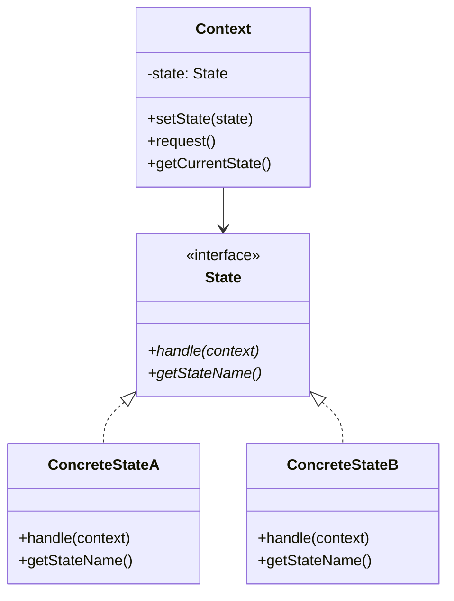

# 状态模式

## 概述

状态模式（State Pattern）是一种行为设计模式，它允许对象在内部状态改变时改变其行为。状态模式将状态封装成独立的类，并将状态转换逻辑委托给当前状态对象。

## 核心概念

### 基本思想
- **状态封装**：将每个状态封装成独立的类
- **状态转换**：状态对象负责状态转换逻辑
- **行为变化**：不同状态下的行为不同
- **上下文委托**：上下文将请求委托给当前状态

### 关键特性
- **状态独立**：每个状态独立封装
- **行为变化**：状态改变时行为改变
- **转换控制**：状态对象控制转换
- **扩展性好**：易于添加新状态

## 模式结构

### 类图结构


### 角色定义
- **State（状态接口）**：定义状态的通用接口
- **ConcreteState（具体状态）**：实现具体的状态行为
- **Context（上下文）**：维护状态引用
- **Client（客户端）**：使用上下文

## 算法应用实例

### 1. 排序状态机

```python
from abc import ABC, abstractmethod
from typing import List, Any, Optional
from enum import Enum

class SortState(Enum):
    """排序状态枚举"""
    UNSORTED = "unsorted"
    PARTIALLY_SORTED = "partially_sorted"
    SORTED = "sorted"
    ERROR = "error"

class SortStateInterface(ABC):
    """排序状态接口"""
    
    @abstractmethod
    def handle_sort(self, context: 'SortContext', data: List[Any]) -> List[Any]:
        """处理排序请求"""
        pass
    
    @abstractmethod
    def get_state_name(self) -> str:
        """获取状态名称"""
        pass
    
    @abstractmethod
    def can_transition_to(self, new_state: SortState) -> bool:
        """检查是否可以转换到新状态"""
        pass

class UnsortedState(SortStateInterface):
    """未排序状态"""
    
    def handle_sort(self, context: 'SortContext', data: List[Any]) -> List[Any]:
        """处理未排序数据的排序"""
        if not data:
            return data
        
        # 检查数据是否已排序
        if self._is_sorted(data):
            context.set_state(SortedState())
            return data
        
        # 开始排序
        context.set_state(PartiallySortedState())
        return context.sort_data(data)
    
    def get_state_name(self) -> str:
        return "未排序"
    
    def can_transition_to(self, new_state: SortState) -> bool:
        return new_state in [SortState.PARTIALLY_SORTED, SortState.SORTED, SortState.ERROR]
    
    def _is_sorted(self, data: List[Any]) -> bool:
        """检查数据是否已排序"""
        for i in range(len(data) - 1):
            if data[i] > data[i + 1]:
                return False
        return True

class PartiallySortedState(SortStateInterface):
    """部分排序状态"""
    
    def handle_sort(self, context: 'SortContext', data: List[Any]) -> List[Any]:
        """处理部分排序数据的排序"""
        # 继续排序过程
        sorted_data = context.sort_data(data)
        
        # 检查是否完成排序
        if self._is_sorted(sorted_data):
            context.set_state(SortedState())
        
        return sorted_data
    
    def get_state_name(self) -> str:
        return "部分排序"
    
    def can_transition_to(self, new_state: SortState) -> bool:
        return new_state in [SortState.SORTED, SortState.ERROR]
    
    def _is_sorted(self, data: List[Any]) -> bool:
        """检查数据是否已排序"""
        for i in range(len(data) - 1):
            if data[i] > data[i + 1]:
                return False
        return True

class SortedState(SortStateInterface):
    """已排序状态"""
    
    def handle_sort(self, context: 'SortContext', data: List[Any]) -> List[Any]:
        """处理已排序数据的排序"""
        # 数据已排序，直接返回
        return data
    
    def get_state_name(self) -> str:
        return "已排序"
    
    def can_transition_to(self, new_state: SortState) -> bool:
        return new_state in [SortState.UNSORTED, SortState.ERROR]
    
    def _is_sorted(self, data: List[Any]) -> bool:
        """检查数据是否已排序"""
        for i in range(len(data) - 1):
            if data[i] > data[i + 1]:
                return False
        return True

class ErrorState(SortStateInterface):
    """错误状态"""
    
    def handle_sort(self, context: 'SortContext', data: List[Any]) -> List[Any]:
        """处理错误状态"""
        raise RuntimeError("排序过程中发生错误")
    
    def get_state_name(self) -> str:
        return "错误"
    
    def can_transition_to(self, new_state: SortState) -> bool:
        return new_state == SortState.UNSORTED

class SortContext:
    """排序上下文"""
    
    def __init__(self):
        self._state: SortStateInterface = UnsortedState()
        self._sort_strategy = None
    
    def set_state(self, state: SortStateInterface) -> None:
        """设置状态"""
        if self._state.can_transition_to(SortState(state.get_state_name())):
            self._state = state
        else:
            raise ValueError(f"无法从 {self._state.get_state_name()} 转换到 {state.get_state_name()}")
    
    def sort(self, data: List[Any]) -> List[Any]:
        """执行排序"""
        return self._state.handle_sort(self, data)
    
    def sort_data(self, data: List[Any]) -> List[Any]:
        """实际排序数据"""
        if not data:
            return data
        
        # 简单的冒泡排序实现
        n = len(data)
        for i in range(n):
            for j in range(0, n - i - 1):
                if data[j] > data[j + 1]:
                    data[j], data[j + 1] = data[j + 1], data[j]
        
        return data
    
    def get_current_state(self) -> str:
        """获取当前状态"""
        return self._state.get_state_name()
    
    def reset(self) -> None:
        """重置状态"""
        self._state = UnsortedState()

# 使用示例
if __name__ == "__main__":
    # 创建排序上下文
    sort_context = SortContext()
    
    # 测试数据
    test_data = [64, 34, 25, 12, 22, 11, 90]
    
    print(f"初始状态: {sort_context.get_current_state()}")
    print(f"原始数据: {test_data}")
    
    # 执行排序
    result = sort_context.sort(test_data.copy())
    print(f"排序后状态: {sort_context.get_current_state()}")
    print(f"排序结果: {result}")
    
    # 再次排序已排序的数据
    result2 = sort_context.sort(result.copy())
    print(f"再次排序后状态: {sort_context.get_current_state()}")
    print(f"再次排序结果: {result2}")
```

### 2. 搜索状态机

```python
from abc import ABC, abstractmethod
from typing import List, Any, Optional, Tuple
from enum import Enum

class SearchState(Enum):
    """搜索状态枚举"""
    IDLE = "idle"
    SEARCHING = "searching"
    FOUND = "found"
    NOT_FOUND = "not_found"
    ERROR = "error"

class SearchStateInterface(ABC):
    """搜索状态接口"""
    
    @abstractmethod
    def handle_search(self, context: 'SearchContext', data: List[Any], target: Any) -> Optional[int]:
        """处理搜索请求"""
        pass
    
    @abstractmethod
    def get_state_name(self) -> str:
        """获取状态名称"""
        pass
    
    @abstractmethod
    def can_transition_to(self, new_state: SearchState) -> bool:
        """检查是否可以转换到新状态"""
        pass

class IdleState(SearchStateInterface):
    """空闲状态"""
    
    def handle_search(self, context: 'SearchContext', data: List[Any], target: Any) -> Optional[int]:
        """处理搜索请求"""
        if not data:
            context.set_state(ErrorState())
            return None
        
        context.set_state(SearchingState())
        return context.search_data(data, target)
    
    def get_state_name(self) -> str:
        return "空闲"
    
    def can_transition_to(self, new_state: SearchState) -> bool:
        return new_state in [SearchState.SEARCHING, SearchState.ERROR]

class SearchingState(SearchStateInterface):
    """搜索中状态"""
    
    def handle_search(self, context: 'SearchContext', data: List[Any], target: Any) -> Optional[int]:
        """处理搜索请求"""
        result = context.search_data(data, target)
        
        if result is not None:
            context.set_state(FoundState())
        else:
            context.set_state(NotFoundState())
        
        return result
    
    def get_state_name(self) -> str:
        return "搜索中"
    
    def can_transition_to(self, new_state: SearchState) -> bool:
        return new_state in [SearchState.FOUND, SearchState.NOT_FOUND, SearchState.ERROR]

class FoundState(SearchStateInterface):
    """找到状态"""
    
    def handle_search(self, context: 'SearchContext', data: List[Any], target: Any) -> Optional[int]:
        """处理搜索请求"""
        # 已经找到，直接返回结果
        return context.get_last_result()
    
    def get_state_name(self) -> str:
        return "找到"
    
    def can_transition_to(self, new_state: SearchState) -> bool:
        return new_state in [SearchState.IDLE, SearchState.SEARCHING, SearchState.ERROR]

class NotFoundState(SearchStateInterface):
    """未找到状态"""
    
    def handle_search(self, context: 'SearchContext', data: List[Any], target: Any) -> Optional[int]:
        """处理搜索请求"""
        # 未找到，返回None
        return None
    
    def get_state_name(self) -> str:
        return "未找到"
    
    def can_transition_to(self, new_state: SearchState) -> bool:
        return new_state in [SearchState.IDLE, SearchState.SEARCHING, SearchState.ERROR]

class ErrorState(SearchStateInterface):
    """错误状态"""
    
    def handle_search(self, context: 'SearchContext', data: List[Any], target: Any) -> Optional[int]:
        """处理搜索请求"""
        raise RuntimeError("搜索过程中发生错误")
    
    def get_state_name(self) -> str:
        return "错误"
    
    def can_transition_to(self, new_state: SearchState) -> bool:
        return new_state == SearchState.IDLE

class SearchContext:
    """搜索上下文"""
    
    def __init__(self):
        self._state: SearchStateInterface = IdleState()
        self._last_result: Optional[int] = None
        self._search_strategy = None
    
    def set_state(self, state: SearchStateInterface) -> None:
        """设置状态"""
        if self._state.can_transition_to(SearchState(state.get_state_name())):
            self._state = state
        else:
            raise ValueError(f"无法从 {self._state.get_state_name()} 转换到 {state.get_state_name()}")
    
    def search(self, data: List[Any], target: Any) -> Optional[int]:
        """执行搜索"""
        return self._state.handle_search(self, data, target)
    
    def search_data(self, data: List[Any], target: Any) -> Optional[int]:
        """实际搜索数据"""
        for i, item in enumerate(data):
            if item == target:
                self._last_result = i
                return i
        self._last_result = None
        return None
    
    def get_last_result(self) -> Optional[int]:
        """获取最后搜索结果"""
        return self._last_result
    
    def get_current_state(self) -> str:
        """获取当前状态"""
        return self._state.get_state_name()
    
    def reset(self) -> None:
        """重置状态"""
        self._state = IdleState()
        self._last_result = None

# 使用示例
if __name__ == "__main__":
    # 创建搜索上下文
    search_context = SearchContext()
    
    # 测试数据
    test_data = [1, 3, 5, 7, 9, 11, 13, 15]
    target = 7
    
    print(f"初始状态: {search_context.get_current_state()}")
    print(f"搜索数据: {test_data}")
    print(f"搜索目标: {target}")
    
    # 执行搜索
    result = search_context.search(test_data, target)
    print(f"搜索后状态: {search_context.get_current_state()}")
    print(f"搜索结果: {result}")
    
    # 搜索不存在的目标
    target2 = 20
    result2 = search_context.search(test_data, target2)
    print(f"搜索后状态: {search_context.get_current_state()}")
    print(f"搜索结果: {result2}")
```

### 3. 缓存状态机

```python
from abc import ABC, abstractmethod
from typing import Dict, Any, Optional, List
from enum import Enum
import time
import random

class CacheState(Enum):
    """缓存状态枚举"""
    EMPTY = "empty"
    PARTIAL = "partial"
    FULL = "full"
    EVICTING = "evicting"
    ERROR = "error"

class CacheStateInterface(ABC):
    """缓存状态接口"""
    
    @abstractmethod
    def handle_get(self, context: 'CacheContext', key: str) -> Optional[Any]:
        """处理获取请求"""
        pass
    
    @abstractmethod
    def handle_set(self, context: 'CacheContext', key: str, value: Any) -> bool:
        """处理设置请求"""
        pass
    
    @abstractmethod
    def get_state_name(self) -> str:
        """获取状态名称"""
        pass
    
    @abstractmethod
    def can_transition_to(self, new_state: CacheState) -> bool:
        """检查是否可以转换到新状态"""
        pass

class EmptyState(CacheStateInterface):
    """空缓存状态"""
    
    def handle_get(self, context: 'CacheContext', key: str) -> Optional[Any]:
        """处理获取请求"""
        # 空缓存，直接返回None
        return None
    
    def handle_set(self, context: 'CacheContext', key: str, value: Any) -> bool:
        """处理设置请求"""
        # 设置第一个元素
        context.set_cache_item(key, value)
        context.set_state(PartialState())
        return True
    
    def get_state_name(self) -> str:
        return "空缓存"
    
    def can_transition_to(self, new_state: CacheState) -> bool:
        return new_state in [CacheState.PARTIAL, CacheState.ERROR]

class PartialState(CacheStateInterface):
    """部分缓存状态"""
    
    def handle_get(self, context: 'CacheContext', key: str) -> Optional[Any]:
        """处理获取请求"""
        return context.get_cache_item(key)
    
    def handle_set(self, context: 'CacheContext', key: str, value: Any) -> bool:
        """处理设置请求"""
        if context.is_cache_full():
            context.set_state(FullState())
        else:
            context.set_cache_item(key, value)
        return True
    
    def get_state_name(self) -> str:
        return "部分缓存"
    
    def can_transition_to(self, new_state: CacheState) -> bool:
        return new_state in [CacheState.FULL, CacheState.EMPTY, CacheState.ERROR]

class FullState(CacheStateInterface):
    """满缓存状态"""
    
    def handle_get(self, context: 'CacheContext', key: str) -> Optional[Any]:
        """处理获取请求"""
        return context.get_cache_item(key)
    
    def handle_set(self, context: 'CacheContext', key: str, value: Any) -> bool:
        """处理设置请求"""
        # 缓存已满，需要驱逐
        context.set_state(EvictingState())
        return context.evict_and_set(key, value)
    
    def get_state_name(self) -> str:
        return "满缓存"
    
    def can_transition_to(self, new_state: CacheState) -> bool:
        return new_state in [CacheState.EVICTING, CacheState.PARTIAL, CacheState.ERROR]

class EvictingState(CacheStateInterface):
    """驱逐状态"""
    
    def handle_get(self, context: 'CacheContext', key: str) -> Optional[Any]:
        """处理获取请求"""
        return context.get_cache_item(key)
    
    def handle_set(self, context: 'CacheContext', key: str, value: Any) -> bool:
        """处理设置请求"""
        # 驱逐完成后设置新值
        context.set_cache_item(key, value)
        context.set_state(FullState())
        return True
    
    def get_state_name(self) -> str:
        return "驱逐中"
    
    def can_transition_to(self, new_state: CacheState) -> bool:
        return new_state in [CacheState.FULL, CacheState.PARTIAL, CacheState.ERROR]

class ErrorState(CacheStateInterface):
    """错误状态"""
    
    def handle_get(self, context: 'CacheContext', key: str) -> Optional[Any]:
        """处理获取请求"""
        raise RuntimeError("缓存处于错误状态")
    
    def handle_set(self, context: 'CacheContext', key: str, value: Any) -> bool:
        """处理设置请求"""
        raise RuntimeError("缓存处于错误状态")
    
    def get_state_name(self) -> str:
        return "错误"
    
    def can_transition_to(self, new_state: CacheState) -> bool:
        return new_state == CacheState.EMPTY

class CacheContext:
    """缓存上下文"""
    
    def __init__(self, max_size: int = 3):
        self._state: CacheStateInterface = EmptyState()
        self._cache: Dict[str, Any] = {}
        self._max_size = max_size
        self._access_times: Dict[str, float] = {}
    
    def set_state(self, state: CacheStateInterface) -> None:
        """设置状态"""
        if self._state.can_transition_to(CacheState(state.get_state_name())):
            self._state = state
        else:
            raise ValueError(f"无法从 {self._state.get_state_name()} 转换到 {state.get_state_name()}")
    
    def get(self, key: str) -> Optional[Any]:
        """获取缓存值"""
        return self._state.handle_get(self, key)
    
    def set(self, key: str, value: Any) -> bool:
        """设置缓存值"""
        return self._state.handle_set(self, key, value)
    
    def get_cache_item(self, key: str) -> Optional[Any]:
        """获取缓存项"""
        if key in self._cache:
            self._access_times[key] = time.time()
            return self._cache[key]
        return None
    
    def set_cache_item(self, key: str, value: Any) -> None:
        """设置缓存项"""
        self._cache[key] = value
        self._access_times[key] = time.time()
    
    def is_cache_full(self) -> bool:
        """检查缓存是否已满"""
        return len(self._cache) >= self._max_size
    
    def evict_and_set(self, key: str, value: Any) -> bool:
        """驱逐并设置"""
        # 使用LRU策略驱逐
        if self._cache:
            lru_key = min(self._access_times, key=self._access_times.get)
            del self._cache[lru_key]
            del self._access_times[lru_key]
        
        self.set_cache_item(key, value)
        return True
    
    def get_current_state(self) -> str:
        """获取当前状态"""
        return self._state.get_state_name()
    
    def get_cache_info(self) -> Dict[str, Any]:
        """获取缓存信息"""
        return {
            'state': self.get_current_state(),
            'size': len(self._cache),
            'max_size': self._max_size,
            'keys': list(self._cache.keys())
        }
    
    def reset(self) -> None:
        """重置缓存"""
        self._state = EmptyState()
        self._cache.clear()
        self._access_times.clear()

# 使用示例
if __name__ == "__main__":
    # 创建缓存上下文
    cache_context = CacheContext(max_size=3)
    
    print(f"初始状态: {cache_context.get_current_state()}")
    print(f"缓存信息: {cache_context.get_cache_info()}")
    
    # 设置缓存项
    cache_context.set("key1", "value1")
    print(f"设置后状态: {cache_context.get_current_state()}")
    print(f"缓存信息: {cache_context.get_cache_info()}")
    
    cache_context.set("key2", "value2")
    cache_context.set("key3", "value3")
    print(f"设置后状态: {cache_context.get_current_state()}")
    print(f"缓存信息: {cache_context.get_cache_info()}")
    
    # 获取缓存项
    value = cache_context.get("key1")
    print(f"获取值: {value}")
    
    # 设置新项（触发驱逐）
    cache_context.set("key4", "value4")
    print(f"驱逐后状态: {cache_context.get_current_state()}")
    print(f"缓存信息: {cache_context.get_cache_info()}")
```

## 高级应用

### 1. 状态机管理器

```python
from abc import ABC, abstractmethod
from typing import Dict, Any, List, Optional, Type
from enum import Enum
import json

class StateMachineManager:
    """状态机管理器"""
    
    def __init__(self):
        self._state_machines: Dict[str, Any] = {}
        self._state_transitions: Dict[str, Dict[str, List[str]]] = {}
        self._state_history: Dict[str, List[str]] = {}
    
    def register_state_machine(self, name: str, state_machine: Any) -> None:
        """注册状态机"""
        self._state_machines[name] = state_machine
        self._state_transitions[name] = {}
        self._state_history[name] = []
    
    def add_transition(self, machine_name: str, from_state: str, to_state: str) -> None:
        """添加状态转换"""
        if machine_name not in self._state_transitions:
            self._state_transitions[machine_name] = {}
        
        if from_state not in self._state_transitions[machine_name]:
            self._state_transitions[machine_name][from_state] = []
        
        self._state_transitions[machine_name][from_state].append(to_state)
    
    def execute_transition(self, machine_name: str, action: str, *args, **kwargs) -> Any:
        """执行状态转换"""
        if machine_name not in self._state_machines:
            raise ValueError(f"未注册的状态机: {machine_name}")
        
        state_machine = self._state_machines[machine_name]
        current_state = state_machine.get_current_state()
        
        # 记录状态历史
        self._state_history[machine_name].append(current_state)
        
        # 执行操作
        result = getattr(state_machine, action)(*args, **kwargs)
        
        # 记录新状态
        new_state = state_machine.get_current_state()
        if new_state != current_state:
            self._state_history[machine_name].append(new_state)
        
        return result
    
    def get_state_history(self, machine_name: str) -> List[str]:
        """获取状态历史"""
        return self._state_history.get(machine_name, [])
    
    def get_possible_transitions(self, machine_name: str, current_state: str) -> List[str]:
        """获取可能的转换"""
        return self._state_transitions.get(machine_name, {}).get(current_state, [])
    
    def export_state_machine(self, machine_name: str) -> Dict[str, Any]:
        """导出状态机信息"""
        if machine_name not in self._state_machines:
            return {}
        
        state_machine = self._state_machines[machine_name]
        return {
            'name': machine_name,
            'current_state': state_machine.get_current_state(),
            'state_history': self.get_state_history(machine_name),
            'possible_transitions': self.get_possible_transitions(machine_name, state_machine.get_current_state()),
            'transitions': self._state_transitions.get(machine_name, {})
        }

# 使用示例
if __name__ == "__main__":
    # 创建状态机管理器
    manager = StateMachineManager()
    
    # 注册状态机
    sort_context = SortContext()
    manager.register_state_machine("sort", sort_context)
    
    # 添加状态转换
    manager.add_transition("sort", "未排序", "部分排序")
    manager.add_transition("sort", "部分排序", "已排序")
    manager.add_transition("sort", "已排序", "未排序")
    
    # 执行操作
    test_data = [64, 34, 25, 12, 22, 11, 90]
    result = manager.execute_transition("sort", "sort", test_data.copy())
    
    # 获取状态机信息
    info = manager.export_state_machine("sort")
    print(f"状态机信息: {json.dumps(info, indent=2, ensure_ascii=False)}")
```

### 2. 状态模式与策略模式结合

```python
from abc import ABC, abstractmethod
from typing import List, Any, Optional
from enum import Enum

class AlgorithmState(Enum):
    """算法状态枚举"""
    IDLE = "idle"
    RUNNING = "running"
    PAUSED = "paused"
    COMPLETED = "completed"
    ERROR = "error"

class AlgorithmStrategy(ABC):
    """算法策略接口"""
    
    @abstractmethod
    def execute(self, data: List[Any]) -> List[Any]:
        """执行算法"""
        pass
    
    @abstractmethod
    def get_name(self) -> str:
        """获取算法名称"""
        pass

class QuickSortStrategy(AlgorithmStrategy):
    """快速排序策略"""
    
    def execute(self, data: List[Any]) -> List[Any]:
        """执行快速排序"""
        if len(data) <= 1:
            return data
        
        pivot = data[len(data) // 2]
        left = [x for x in data if x < pivot]
        middle = [x for x in data if x == pivot]
        right = [x for x in data if x > pivot]
        
        return self.execute(left) + middle + self.execute(right)
    
    def get_name(self) -> str:
        return "快速排序"

class MergeSortStrategy(AlgorithmStrategy):
    """归并排序策略"""
    
    def execute(self, data: List[Any]) -> List[Any]:
        """执行归并排序"""
        if len(data) <= 1:
            return data
        
        mid = len(data) // 2
        left = self.execute(data[:mid])
        right = self.execute(data[mid:])
        
        return self._merge(left, right)
    
    def _merge(self, left: List[Any], right: List[Any]) -> List[Any]:
        """合并两个有序数组"""
        result = []
        i = j = 0
        
        while i < len(left) and j < len(right):
            if left[i] <= right[j]:
                result.append(left[i])
                i += 1
            else:
                result.append(right[j])
                j += 1
        
        result.extend(left[i:])
        result.extend(right[j:])
        return result
    
    def get_name(self) -> str:
        return "归并排序"

class AlgorithmStateInterface(ABC):
    """算法状态接口"""
    
    @abstractmethod
    def handle_execute(self, context: 'AlgorithmContext', data: List[Any]) -> List[Any]:
        """处理执行请求"""
        pass
    
    @abstractmethod
    def handle_pause(self, context: 'AlgorithmContext') -> None:
        """处理暂停请求"""
        pass
    
    @abstractmethod
    def handle_resume(self, context: 'AlgorithmContext') -> None:
        """处理恢复请求"""
        pass
    
    @abstractmethod
    def get_state_name(self) -> str:
        """获取状态名称"""
        pass

class IdleState(AlgorithmStateInterface):
    """空闲状态"""
    
    def handle_execute(self, context: 'AlgorithmContext', data: List[Any]) -> List[Any]:
        """处理执行请求"""
        if context.get_strategy() is None:
            raise ValueError("未设置算法策略")
        
        context.set_state(RunningState())
        return context.execute_algorithm(data)
    
    def handle_pause(self, context: 'AlgorithmContext') -> None:
        """处理暂停请求"""
        raise ValueError("算法未运行，无法暂停")
    
    def handle_resume(self, context: 'AlgorithmContext') -> None:
        """处理恢复请求"""
        raise ValueError("算法未运行，无法恢复")
    
    def get_state_name(self) -> str:
        return "空闲"

class RunningState(AlgorithmStateInterface):
    """运行状态"""
    
    def handle_execute(self, context: 'AlgorithmContext', data: List[Any]) -> List[Any]:
        """处理执行请求"""
        raise ValueError("算法正在运行，无法执行新任务")
    
    def handle_pause(self, context: 'AlgorithmContext') -> None:
        """处理暂停请求"""
        context.set_state(PausedState())
    
    def handle_resume(self, context: 'AlgorithmContext') -> None:
        """处理恢复请求"""
        raise ValueError("算法正在运行，无需恢复")
    
    def get_state_name(self) -> str:
        return "运行中"

class PausedState(AlgorithmStateInterface):
    """暂停状态"""
    
    def handle_execute(self, context: 'AlgorithmContext', data: List[Any]) -> List[Any]:
        """处理执行请求"""
        raise ValueError("算法已暂停，无法执行新任务")
    
    def handle_pause(self, context: 'AlgorithmContext') -> None:
        """处理暂停请求"""
        raise ValueError("算法已暂停，无需再次暂停")
    
    def handle_resume(self, context: 'AlgorithmContext') -> None:
        """处理恢复请求"""
        context.set_state(RunningState())
    
    def get_state_name(self) -> str:
        return "暂停"

class CompletedState(AlgorithmStateInterface):
    """完成状态"""
    
    def handle_execute(self, context: 'AlgorithmContext', data: List[Any]) -> List[Any]:
        """处理执行请求"""
        context.set_state(RunningState())
        return context.execute_algorithm(data)
    
    def handle_pause(self, context: 'AlgorithmContext') -> None:
        """处理暂停请求"""
        raise ValueError("算法已完成，无法暂停")
    
    def handle_resume(self, context: 'AlgorithmContext') -> None:
        """处理恢复请求"""
        raise ValueError("算法已完成，无需恢复")
    
    def get_state_name(self) -> str:
        return "完成"

class AlgorithmContext:
    """算法上下文"""
    
    def __init__(self):
        self._state: AlgorithmStateInterface = IdleState()
        self._strategy: Optional[AlgorithmStrategy] = None
        self._result: Optional[List[Any]] = None
    
    def set_state(self, state: AlgorithmStateInterface) -> None:
        """设置状态"""
        self._state = state
    
    def set_strategy(self, strategy: AlgorithmStrategy) -> None:
        """设置策略"""
        self._strategy = strategy
    
    def get_strategy(self) -> Optional[AlgorithmStrategy]:
        """获取策略"""
        return self._strategy
    
    def execute(self, data: List[Any]) -> List[Any]:
        """执行算法"""
        result = self._state.handle_execute(self, data)
        self._result = result
        self.set_state(CompletedState())
        return result
    
    def execute_algorithm(self, data: List[Any]) -> List[Any]:
        """实际执行算法"""
        if self._strategy is None:
            raise ValueError("未设置算法策略")
        
        return self._strategy.execute(data)
    
    def pause(self) -> None:
        """暂停算法"""
        self._state.handle_pause(self)
    
    def resume(self) -> None:
        """恢复算法"""
        self._state.handle_resume(self)
    
    def get_current_state(self) -> str:
        """获取当前状态"""
        return self._state.get_state_name()
    
    def get_result(self) -> Optional[List[Any]]:
        """获取结果"""
        return self._result

# 使用示例
if __name__ == "__main__":
    # 创建算法上下文
    algorithm_context = AlgorithmContext()
    
    # 设置策略
    algorithm_context.set_strategy(QuickSortStrategy())
    
    # 测试数据
    test_data = [64, 34, 25, 12, 22, 11, 90]
    
    print(f"初始状态: {algorithm_context.get_current_state()}")
    print(f"使用策略: {algorithm_context.get_strategy().get_name()}")
    
    # 执行算法
    result = algorithm_context.execute(test_data.copy())
    print(f"执行后状态: {algorithm_context.get_current_state()}")
    print(f"执行结果: {result}")
    
    # 切换策略
    algorithm_context.set_strategy(MergeSortStrategy())
    result2 = algorithm_context.execute(test_data.copy())
    print(f"切换策略后结果: {result2}")
```

## 性能分析

### 时间复杂度
- **状态转换**：O(1)
- **状态处理**：取决于具体状态
- **状态查询**：O(1)

### 空间复杂度
- **状态存储**：O(1)
- **状态历史**：O(n)
- **上下文存储**：O(1)

### 性能对比表

| 状态类型 | 转换开销 | 处理复杂度 | 查询开销 | 总体性能 |
|---------|---------|-----------|----------|----------|
| 简单状态 | O(1) | O(1) | O(1) | O(1) |
| 复杂状态 | O(1) | O(n) | O(1) | O(n) |
| 状态机 | O(1) | O(1) | O(1) | O(1) |

## 应用场景

### 1. 算法状态管理
- **排序过程**：未排序→部分排序→已排序
- **搜索过程**：空闲→搜索中→找到/未找到
- **缓存管理**：空→部分→满→驱逐

### 2. 业务流程控制
- **订单处理**：待处理→处理中→已完成
- **用户状态**：未登录→已登录→已注销
- **系统状态**：启动→运行→停止

### 3. 游戏开发
- **角色状态**：待机→移动→攻击→死亡
- **游戏状态**：菜单→游戏中→暂停→结束
- **AI状态**：巡逻→追击→攻击→逃跑

## 优缺点分析

### 优点
- **状态清晰**：每个状态独立封装
- **行为变化**：状态改变时行为改变
- **扩展性好**：易于添加新状态
- **维护性强**：状态逻辑集中管理

### 缺点
- **类数量多**：每个状态需要一个类
- **状态转换**：需要管理状态转换逻辑
- **复杂度增加**：理解状态机需要时间
- **调试困难**：状态转换链较长

## 相关概念

- **模板方法模式**：[[01-模板方法模式]] - 算法骨架的定义
- **策略模式**：[[02-策略模式]] - 算法族的选择
- **状态机**：状态转换的数学模型
- **有限状态机**：有限状态的状态机

## 学习建议

### 费曼学习法
1. **理解概念**：用简单语言解释状态模式
2. **举例说明**：用生活中的例子说明状态模式
3. **实践应用**：实现一个完整的状态模式示例
4. **教授他人**：向他人解释状态模式

### 刻意练习
1. **基础练习**：实现简单的状态机
2. **进阶练习**：设计复杂的状态转换
3. **综合练习**：构建完整的状态管理系统
4. **创新练习**：设计新的状态模式应用场景

### 学习路径
1. **理论学习**：理解状态模式的基本概念
2. **代码实践**：实现各种状态模式
3. **项目应用**：在实际项目中使用状态模式
4. **模式组合**：与其他设计模式结合使用
