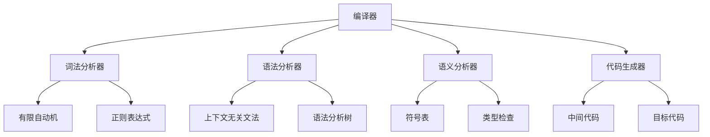

# 核心概念速查

## 🔍 快速索引

### A
- **AST (Abstract Syntax Tree)** - [[抽象语法树构建]]
- **Attribute Grammar** - [[属性文法与计算]]

### B
- **Bottom-up Parsing** - [[自底向上分析]]

### C
- **CFG (Context-Free Grammar)** - [[上下文无关文法]]
- **Compiler** - [[编译原理概述]]
- **Control Flow Graph** - [[控制流图构建]]

### D
- **DFA (Deterministic Finite Automaton)** - [[有限自动机理论]]
- **Data Flow Analysis** - [[数据流分析框架]]

### E
- **Error Handling** - [[语法分析错误处理]]

### F
- **Finite Automaton** - [[有限自动机理论]]

### G
- **Grammar** - [[上下文无关文法]]

### I
- **Intermediate Code** - [[中间代码概述]]

### L
- **Lexical Analysis** - [[词法分析概述]]
- **LL(1) Parsing** - [[LL(1)文法与构造]]
- **LR Parsing** - [[LR(0)分析表构造]]

### M
- **Minimization** - [[DFA最小化算法]]

### N
- **NFA (Nondeterministic Finite Automaton)** - [[有限自动机理论]]

### O
- **Optimization** - [[代码优化概述]]

### P
- **Parsing** - [[语法分析概述]]
- **Production** - [[上下文无关文法]]

### R
- **Regular Expression** - [[正则表达式与正则语言]]
- **Register Allocation** - [[寄存器分配算法]]

### S
- **Semantic Analysis** - [[语义分析概述]]
- **Symbol Table** - [[符号表管理]]
- **Syntax Tree** - [[语法分析树]]

### T
- **Token** - [[词法分析概述]]
- **Top-down Parsing** - [[自顶向下分析]]

## 📚 概念分类

### 基础概念
| 概念 | 定义 | 相关链接 |
|------|------|----------|
| 编译器 | 将高级语言转换为机器语言的程序 | [[编译原理概述]] |
| 词法分析 | 将源代码分解为token的过程 | [[词法分析概述]] |
| 语法分析 | 根据语法规则分析token序列的过程 | [[语法分析概述]] |
| 语义分析 | 检查程序语义正确性的过程 | [[语义分析概述]] |

### 数据结构
| 概念 | 定义 | 相关链接 |
|------|------|----------|
| 有限自动机 | 识别正则语言的数学模型 | [[有限自动机理论]] |
| 语法分析树 | 表示语法结构的树形结构 | [[语法分析树]] |
| 抽象语法树 | 简化的语法树表示 | [[抽象语法树构建]] |
| 符号表 | 存储标识符信息的表 | [[符号表管理]] |

### 算法技术
| 概念 | 定义 | 相关链接 |
|------|------|----------|
| Thompson算法 | 正则表达式转NFA的算法 | [[正则表达式到NFA转换]] |
| 子集构造法 | NFA转DFA的算法 | [[NFA到DFA转换算法]] |
| Hopcroft算法 | DFA最小化算法 | [[DFA最小化算法]] |
| LL(1)分析 | 自顶向下的语法分析方法 | [[LL(1)文法与构造]] |

## 🎯 重要公式

### 正则表达式
- `ε` - 空字符串
- `a` - 单个字符
- `r|s` - 选择（或）
- `rs` - 连接
- `r*` - 闭包（零次或多次）

### 文法表示
- `A → α` - 产生式
- `A → α|β` - 多个产生式
- `S → ε` - 空产生式

### 自动机表示
- `(Q, Σ, δ, q₀, F)` - DFA五元组
- `(Q, Σ, δ, q₀, F)` - NFA五元组

## 🔗 概念关系图

## 📖 记忆技巧

### 编译过程记忆
**"词法语法语义，中间优化目标"**
- 词法分析 → 语法分析 → 语义分析 → 中间代码生成 → 代码优化 → 目标代码生成

### 自动机层次记忆
**"正则→NFA→DFA→最小化"**
- 正则表达式 → NFA → DFA → 最小化DFA

### 语法分析记忆
**"自顶向下LL，自底向上LR"**
- 自顶向下：LL(1)分析
- 自底向上：LR(0), SLR(1), LR(1), LALR(1)

## 🔗 相关链接
- [[学习路线图]] - 学习路径
- [[知识图谱]] - 知识关系
- [[学习进度]] - 进度跟踪

