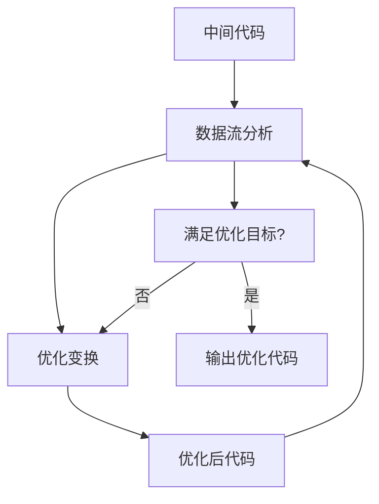

# 编译原理知识图谱

## 🧠 核心知识网络

```mermaid
graph TD
    A[编译原理] --> B[词法分析]
    A --> C[语法分析]
    A --> D[语义分析]
    A --> E[中间代码生成]
    A --> F[代码优化]
    A --> G[目标代码生成]
    
    B --> B1[有限自动机]
    B --> B2[正则表达式]
    B --> B3[词法分析器]
    
    C --> C1[自顶向下分析]
    C --> C2[自底向上分析]
    C1 --> C11[LL(1)]
    C2 --> C21[LR(0)]
    C2 --> C22[SLR(1)]
    C2 --> C23[LR(1)]
    C2 --> C24[LALR(1)]
    
    D --> D1[语法制导翻译]
    D --> D2[符号表]
    D --> D3[类型检查]
    
    E --> E1[三地址码]
    E --> E2[四元式]
    E --> E3[抽象语法树]
    
    F --> F1[局部优化]
    F --> F2[全局优化]
    F --> F3[数据流分析]
    
    G --> G1[指令选择]
    G --> G2[寄存器分配]
    G --> G3[指令调度]
```

## 📊 知识点依赖关系

### 前置知识要求
| 知识点 | 前置要求 | 后续应用 |
|--------|----------|----------|
| [[有限自动机理论]] | 集合论、图论 | [[正则表达式到NFA转换]] |
| [[上下文无关文法]] | 形式语言理论 | [[语法分析]] |
| [[语法制导翻译]] | 语法分析 | [[中间代码生成]] |
| [[数据流分析]] | 图论、算法 | [[代码优化]] |

### 学习顺序建议
1. **基础理论** → [[形式语言理论]] → [[正则表达式与正则语言]]
2. **词法分析** → [[有限自动机理论]] → [[词法分析器实现]]
3. **语法分析** → [[自顶向下分析]] → [[自底向上分析]]
4. **语义分析** → [[语法制导翻译]] → [[符号表管理]]
5. **代码生成** → [[中间代码生成]] → [[目标代码生成]]

## 🔄 知识点循环关系

### 编译过程循环


### 优化循环


## 🎯 重点知识节点

### 核心算法节点
- **Thompson算法**：正则表达式 → NFA
- **子集构造法**：NFA → DFA
- **Hopcroft算法**：DFA最小化
- **LL(1)分析**：自顶向下语法分析
- **LR分析**：自底向上语法分析
- **数据流分析**：代码优化基础

### 关键概念节点
- **有限自动机**：词法分析核心
- **上下文无关文法**：语法分析基础
- **语法制导翻译**：语义分析方法
- **控制流图**：程序结构表示
- **活跃变量**：寄存器分配基础

## 🔗 跨模块关联

### 词法分析 ↔ 语法分析
- 词法分析为语法分析提供token流
- 语法分析指导词法分析的错误处理

### 语法分析 ↔ 语义分析
- 语法分析树是语义分析的基础
- 语义分析验证语法分析的正确性

### 中间代码 ↔ 代码优化
- 中间代码是优化的输入
- 优化技术改进中间代码质量

## 📈 学习深度递进

| 层次 | 内容 | 目标 |
|------|------|------|
| 认识 | 概念理解 | 知道"是什么" |
| 理解 | 原理掌握 | 明白"为什么" |
| 应用 | 算法实现 | 能够"怎么做" |
| 创新 | 技术改进 | 思考"如何更好" |

## 🔗 相关链接
- [[学习路线图]] - 学习路径规划
- [[核心概念速查]] - 快速查找概念
- [[学习进度]] - 进度跟踪

