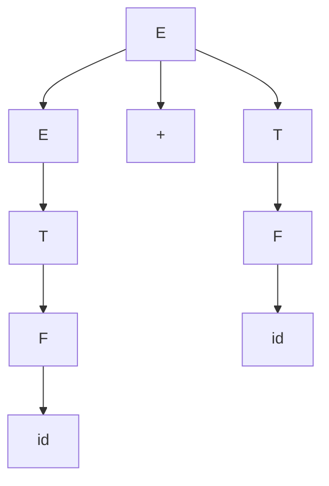

# 上下文无关文法

## 🎯 上下文无关文法概述

**上下文无关文法(CFG)**是描述编程语言语法的重要工具。它能够生成上下文无关语言，是语法分析的理论基础。

## 📚 CFG定义

### 形式定义
上下文无关文法是一个四元组 G = (V, T, P, S)：
- **V**：非终结符集合（变量）
- **T**：终结符集合（终端符号）
- **P**：产生式集合（规则）
- **S**：开始符号

### 产生式形式
产生式的一般形式：A → α
- **A**：非终结符（左部）
- **α**：终结符和非终结符的串（右部）

## 🔍 CFG示例

### 简单算术表达式文法
```c
// 文法 G = (V, T, P, S)
// V = {E, T, F}
// T = {+, *, (, ), id}
// S = E
// P = {
//   E → E + T | T
//   T → T * F | F
//   F → (E) | id
// }
```

### 产生式分析
| 产生式 | 含义 | 优先级 |
|--------|------|--------|
| E → E + T | 加法运算 | 最低 |
| E → T | 项 | - |
| T → T * F | 乘法运算 | 较高 |
| T → F | 因子 | - |
| F → (E) | 括号表达式 | 最高 |
| F → id | 标识符 | 最高 |

## 🌳 语法分析树

### 树结构
语法分析树是CFG的图形表示：



### 示例：a + b * c
```
      E
     /|\
    E + T
    |   |
    T   F
    |   |
    F   id
    |   |
    id  c
    |
    a
```

## 🔄 推导过程

### 最左推导
每次替换最左边的非终结符：

```c
// 文法：E → E + T | T, T → T * F | F, F → (E) | id
// 输入：a + b * c

E
→ E + T
→ T + T
→ F + T
→ id + T
→ a + T
→ a + T * F
→ a + F * F
→ a + id * F
→ a + b * F
→ a + b * id
→ a + b * c
```

### 最右推导
每次替换最右边的非终结符：

```c
E
→ E + T
→ E + T * F
→ E + T * id
→ E + T * c
→ E + F * c
→ E + id * c
→ E + b * c
→ T + b * c
→ F + b * c
→ id + b * c
→ a + b * c
```

## 📊 CFG分类

### 按产生式形式分类

| 类型 | 产生式形式 | 特点 | 应用 |
|------|------------|------|------|
| 左递归 | A → Aα | 左递归 | 自顶向下分析困难 |
| 右递归 | A → αA | 右递归 | 适合自顶向下分析 |
| 直接左递归 | A → Aα \| β | 直接左递归 | 需要消除 |
| 间接左递归 | A → Bα, B → Aβ | 间接左递归 | 需要消除 |

### 按文法性质分类

| 性质 | 定义 | 示例 |
|------|------|------|
| 二义性 | 存在多个语法分析树 | E → E + E \| E * E \| id |
| 左递归 | 存在左递归产生式 | A → Aα |
| 左因子 | 存在左因子 | A → αβ \| αγ |

## 🔧 CFG变换

### 消除左递归
将左递归文法转换为右递归文法：

```c
// 原文法（左递归）
A → Aα | β

// 变换后（右递归）
A → βA'
A' → αA' | ε
```

### 消除左因子
提取左因子：

```c
// 原文法
A → αβ | αγ

// 变换后
A → αA'
A' → β | γ
```

## 🎯 CFG应用

### 语法分析
- **自顶向下分析**：从开始符号推导
- **自底向上分析**：从输入符号归约

### 语言设计
- **语法定义**：定义编程语言语法
- **语法检查**：检查语法正确性

### 编译器构造
- **语法分析器生成**：自动生成语法分析器
- **错误处理**：处理语法错误

## 📈 CFG性质

### 封闭性
上下文无关语言在以下运算下封闭：
- **并集**：L₁ ∪ L₂
- **连接**：L₁ · L₂
- **闭包**：L*

### 判定性
- **空性**：可以判定CFL是否为空
- **有限性**：可以判定CFL是否为有限
- **成员性**：可以判定字符串是否属于CFL

## 🔗 相关链接
- [[形式语言理论]] - 形式语言理论基础
- [[语法分析树]] - 语法树构建
- [[语法分析概述]] - 语法分析应用
- [[自顶向下分析]] - 自顶向下分析方法

