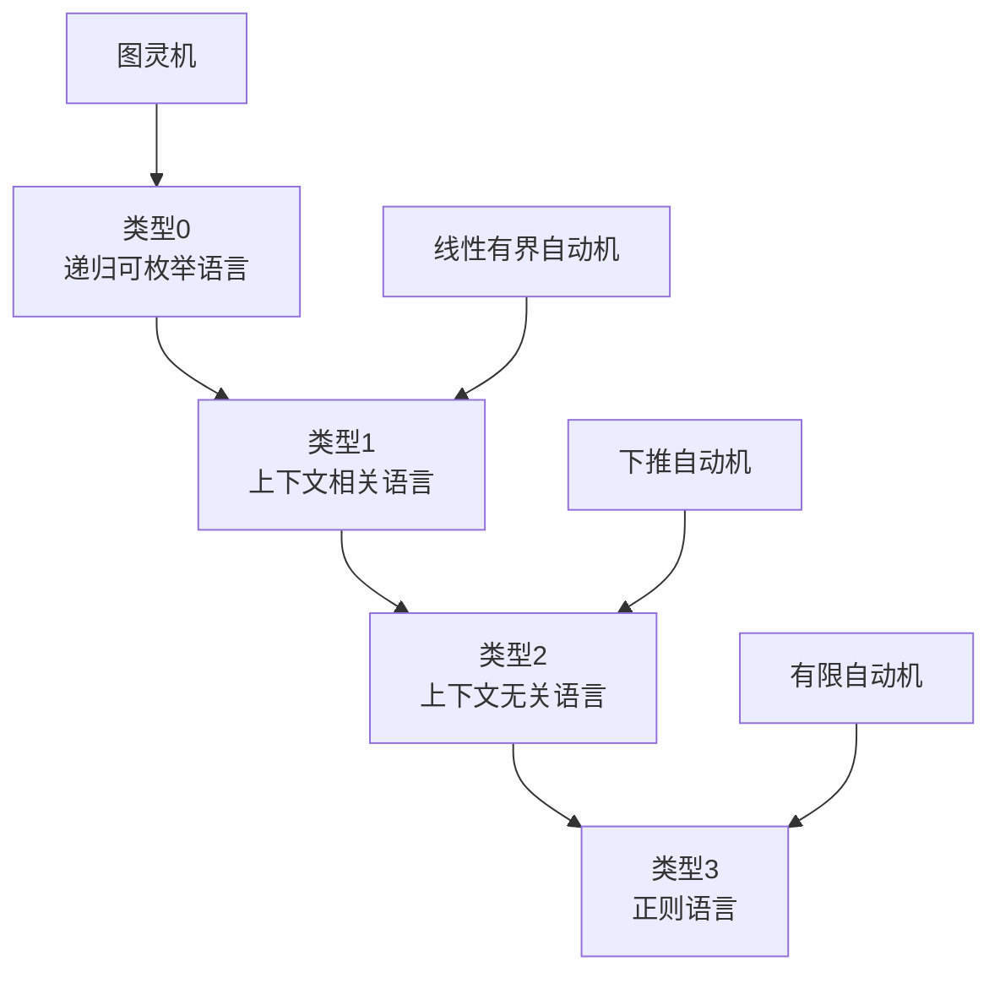

# 形式语言理论

## 🎯 什么是形式语言理论

**形式语言理论**是研究语言的数学性质的学科，它为编译原理提供了理论基础。通过数学方法描述和分析语言的结构和性质。

## 📚 基本概念

### 字母表 (Alphabet)
字母表是一个有限的符号集合，通常用Σ表示。

**示例**：
- 二进制字母表：Σ = {0, 1}
- 英文字母表：Σ = {a, b, c, ..., z}
- 编程语言字母表：Σ = {a, b, c, ..., z, 0, 1, ..., 9, +, -, *, /, ...}

### 字符串 (String)
字符串是字母表中符号的有限序列。

**示例**：
- 空字符串：ε（长度为0）
- 二进制字符串：0110
- 标识符：variable1

### 语言 (Language)
语言是字母表上所有字符串的某个子集。

**示例**：
- 所有二进制字符串：{ε, 0, 1, 00, 01, 10, 11, 000, ...}
- 所有偶数长度的二进制字符串：{ε, 00, 01, 10, 11, 0000, ...}

## 🔢 语言运算

### 基本运算

| 运算 | 符号 | 定义 | 示例 |
|------|------|------|------|
| 连接 | · | L₁·L₂ = {xy \| x∈L₁, y∈L₂} | {a}·{b} = {ab} |
| 并集 | ∪ | L₁∪L₂ = {x \| x∈L₁ 或 x∈L₂} | {a}∪{b} = {a, b} |
| 闭包 | * | L* = {ε}∪L∪L²∪L³∪... | {a}* = {ε, a, aa, aaa, ...} |
| 正闭包 | + | L+ = L∪L²∪L³∪... | {a}+ = {a, aa, aaa, ...} |

### 运算示例
```c
// 设 L₁ = {a, b}, L₂ = {c, d}
L₁·L₂ = {ac, ad, bc, bd}  // 连接
L₁∪L₂ = {a, b, c, d}     // 并集
L₁* = {ε, a, b, aa, ab, ba, bb, aaa, ...}  // 闭包
```

## 📊 语言层次结构

### Chomsky层次
语言按照生成能力分为四个层次：



### 各类型语言特点

| 类型 | 文法 | 自动机 | 生成能力 | 应用 |
|------|------|--------|----------|------|
| 类型0 | 无限制文法 | 图灵机 | 最强 | 计算理论 |
| 类型1 | 上下文相关文法 | 线性有界自动机 | 强 | 自然语言 |
| 类型2 | 上下文无关文法 | 下推自动机 | 中等 | 编程语言语法 |
| 类型3 | 正则文法 | 有限自动机 | 最弱 | 词法分析 |

## 🔍 正则语言 (Regular Languages)

### 定义
正则语言是能够用正则表达式描述的语言。

### 正则表达式
正则表达式是描述正则语言的符号表示法：

| 符号 | 含义 | 示例 |
|------|------|------|
| ε | 空字符串 | 匹配空字符串 |
| a | 单个字符 | 匹配字符'a' |
| r\|s | 选择 | a\|b 匹配'a'或'b' |
| rs | 连接 | ab 匹配'ab' |
| r* | 闭包 | a* 匹配'a'的零次或多次重复 |

### 正则表达式示例
```c
// 标识符：字母开头，后跟字母或数字
[a-zA-Z][a-zA-Z0-9]*

// 整数：一位或多位数字
[0-9]+

// 浮点数：数字.数字
[0-9]+\.[0-9]+
```

## 🌳 上下文无关语言 (Context-Free Languages)

### 定义
上下文无关语言是能够用上下文无关文法描述的语言。

### 上下文无关文法 (CFG)
上下文无关文法是一个四元组 G = (V, T, P, S)：
- **V**：非终结符集合
- **T**：终结符集合
- **P**：产生式集合
- **S**：开始符号

### CFG示例
```c
// 简单算术表达式文法
E → E + T | T
T → T * F | F
F → (E) | id

// 其中：
// V = {E, T, F}
// T = {+, *, (, ), id}
// S = E
```

## 🔄 语言识别

### 有限自动机 (FA)
有限自动机是识别正则语言的数学模型。

### 下推自动机 (PDA)
下推自动机是识别上下文无关语言的数学模型。

## 📈 语言性质

### 正则语言性质
- **封闭性**：正则语言在并、交、补、连接、闭包运算下封闭
- **判定性**：可以判定两个正则语言是否相等
- **泵引理**：用于证明语言不是正则的

### 上下文无关语言性质
- **封闭性**：CFL在并、连接、闭包运算下封闭
- **判定性**：可以判定CFL是否为空
- **泵引理**：用于证明语言不是上下文无关的

## 🎯 在编译原理中的应用

### 词法分析
- 使用正则表达式描述token模式
- 使用有限自动机识别token

### 语法分析
- 使用上下文无关文法描述语法规则
- 使用下推自动机进行语法分析

### 语义分析
- 使用属性文法进行语义分析
- 使用符号表管理标识符

## 🔗 相关链接
- [[正则表达式与正则语言]] - 正则语言详细内容
- [[上下文无关文法]] - CFG详细内容
- [[有限自动机理论]] - 有限自动机理论
- [[语法分析树]] - 语法树构建

