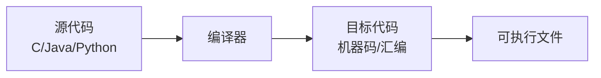
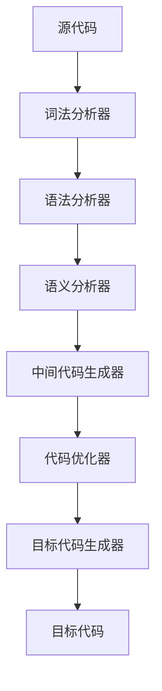

# 编译原理概述

## 🎯 什么是编译原理

**编译原理**是研究如何将高级程序设计语言转换为机器语言或汇编语言的计算机科学分支。它是连接人类思维与机器执行的重要桥梁。

## 🔍 核心概念

### 编译器 (Compiler)
编译器是将源代码（高级语言）转换为目标代码（机器语言）的程序。

### 编译过程
编译是一个多阶段的过程，每个阶段都有特定的任务：

| 阶段 | 输入 | 输出 | 主要任务 |
|------|------|------|----------|
| 词法分析 | 源代码 | Token流 | 识别单词 |
| 语法分析 | Token流 | 语法树 | 分析语法结构 |
| 语义分析 | 语法树 | 语法树+语义信息 | 检查语义正确性 |
| 中间代码生成 | 语法树 | 中间代码 | 生成中间表示 |
| 代码优化 | 中间代码 | 优化后中间代码 | 提高代码效率 |
| 目标代码生成 | 中间代码 | 目标代码 | 生成机器码 |

## 🏗️ 编译器结构

### 前端 (Frontend)
负责源代码的分析和理解：
- **词法分析器**：将源代码分解为token
- **语法分析器**：构建语法分析树
- **语义分析器**：检查语义正确性

### 后端 (Backend)
负责目标代码的生成和优化：
- **代码生成器**：生成目标代码
- **代码优化器**：优化代码性能

## 🔄 编译器 vs 解释器

| 特性 | 编译器 | 解释器 |
|------|--------|--------|
| 执行方式 | 先编译后执行 | 边解释边执行 |
| 执行速度 | 快 | 慢 |
| 内存占用 | 少 | 多 |
| 错误检测 | 编译时检测 | 运行时检测 |
| 典型例子 | C, C++, Java | Python, JavaScript |

## 📚 编译原理的重要性

### 理论价值
- **形式语言理论**：研究语言的数学性质
- **算法设计**：设计高效的编译算法
- **系统设计**：理解计算机系统的工作原理

### 实践价值
- **语言设计**：设计新的编程语言
- **工具开发**：开发编译工具和IDE
- **性能优化**：优化程序性能

## 🎯 学习目标

### 基础目标
- 理解编译过程的基本原理
- 掌握词法分析和语法分析的基本方法
- 了解语义分析和代码生成的基本概念

### 进阶目标
- 能够实现简单的编译器
- 掌握代码优化技术
- 理解现代编译器的工作原理

## 🔗 相关链接
- [[编译过程详解]] - 详细学习编译过程
- [[形式语言理论]] - 学习语言理论基础
- [[编译器分类与历史]] - 了解编译器发展
- [[学习路线图]] - 规划学习路径

