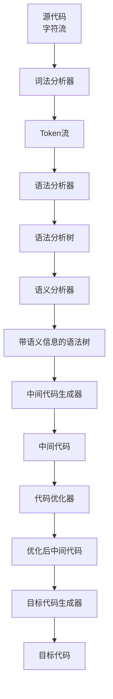

# 编译过程详解

## 🔄 编译过程概览

编译过程是一个将高级语言源代码转换为机器可执行代码的复杂过程。整个过程可以分为六个主要阶段：


## 📝 第一阶段：词法分析 (Lexical Analysis)

### 任务
将源代码的字符流转换为token流（词法单元流）。

### 输入输出
- **输入**：源代码字符串
- **输出**：token序列

### 示例
```c
// 源代码
int x = 10;

// Token流
<INT, "int">
<ID, "x">
<ASSIGN, "=">
<NUM, "10">
<SEMICOLON, ";">
```

### 关键概念
- **Token**：词法单元，包含类型和值
- **词法分析器**：执行词法分析的程序
- **正则表达式**：描述token模式

## 🌳 第二阶段：语法分析 (Syntax Analysis)

### 任务
根据语法规则分析token序列，构建语法分析树。

### 输入输出
- **输入**：token序列
- **输出**：语法分析树

### 示例
```c
// Token序列
<INT, "int"> <ID, "x"> <ASSIGN, "="> <NUM, "10"> <SEMICOLON, ";">

// 语法分析树
    Declaration
    /    |    \
   int   x    Assignment
                /      \
              =        10
```

### 关键概念
- **语法分析树**：表示程序语法结构的树
- **上下文无关文法**：描述语法规则
- **语法分析器**：执行语法分析的程序

## 🔍 第三阶段：语义分析 (Semantic Analysis)

### 任务
检查程序的语义正确性，进行类型检查和作用域分析。

### 输入输出
- **输入**：语法分析树
- **输出**：带有语义信息的语法树

### 主要任务
- **类型检查**：检查类型匹配
- **作用域分析**：分析变量作用域
- **符号表管理**：维护标识符信息

### 示例
```c
int x = 10;
float y = x;  // 类型转换：int → float
```

## 💻 第四阶段：中间代码生成 (Intermediate Code Generation)

### 任务
将语法分析树转换为中间代码表示。

### 输入输出
- **输入**：语法分析树
- **输出**：中间代码

### 中间代码形式
- **三地址码**：`x = y + z`
- **四元式**：`(+, y, z, x)`
- **抽象语法树**：简化的语法树

### 示例
```c
// 源代码
int x = a + b * c;

// 三地址码
t1 = b * c
t2 = a + t1
x = t2
```

## ⚡ 第五阶段：代码优化 (Code Optimization)

### 任务
改进中间代码，提高执行效率。

### 优化类型
- **局部优化**：基本块内优化
- **全局优化**：跨基本块优化
- **循环优化**：循环结构优化

### 示例
```c
// 优化前
t1 = a + b
t2 = t1 + c
x = t2

// 优化后
x = a + b + c
```

## 🎯 第六阶段：目标代码生成 (Target Code Generation)

### 任务
将中间代码转换为目标机器的机器码。

### 输入输出
- **输入**：优化后的中间代码
- **输出**：目标机器码

### 主要任务
- **指令选择**：选择适当的机器指令
- **寄存器分配**：分配寄存器给变量
- **指令调度**：优化指令执行顺序

## 🔄 编译过程的数据流



## 📊 各阶段特点对比

| 阶段 | 主要任务 | 输入 | 输出 | 复杂度 |
|------|----------|------|------|--------|
| 词法分析 | 识别单词 | 字符流 | Token流 | 低 |
| 语法分析 | 分析结构 | Token流 | 语法树 | 中 |
| 语义分析 | 检查语义 | 语法树 | 语义树 | 中 |
| 中间代码生成 | 生成中间表示 | 语法树 | 中间代码 | 中 |
| 代码优化 | 优化代码 | 中间代码 | 优化代码 | 高 |
| 目标代码生成 | 生成机器码 | 中间代码 | 机器码 | 高 |

## 🎯 学习重点

### 理解重点
- 各阶段的任务和输入输出
- 数据在编译过程中的流动
- 各阶段之间的依赖关系

### 实践重点
- 能够手工执行简单的编译过程
- 理解各阶段的作用和重要性
- 掌握编译过程的基本概念

## 🔗 相关链接
- [[编译原理概述]] - 编译原理基本概念
- [[词法分析概述]] - 词法分析详细内容
- [[语法分析概述]] - 语法分析详细内容
- [[语义分析概述]] - 语义分析详细内容

