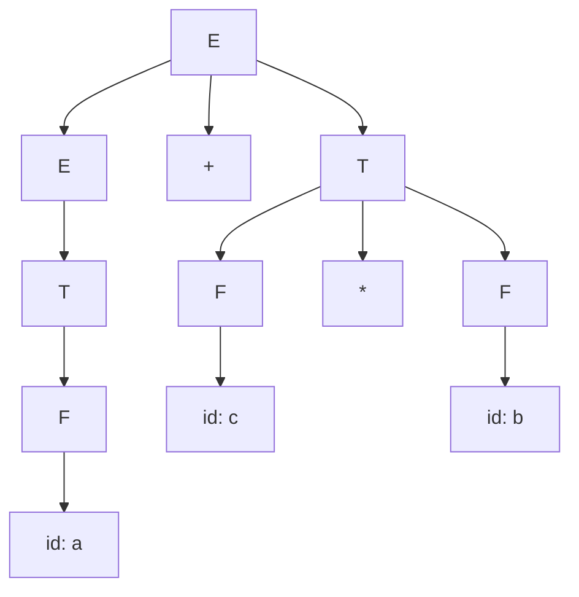

# 语法分析树

## 🎯 语法分析树概述

**语法分析树**是表示程序语法结构的树形数据结构，它是上下文无关文法推导过程的图形表示。

## 🌳 树结构定义

### 基本概念
- **根节点**：开始符号
- **内部节点**：非终结符
- **叶节点**：终结符
- **边**：产生式关系

### 树的性质
- 每个内部节点对应一个非终结符
- 每个叶节点对应一个终结符
- 子节点从左到右对应产生式右部的符号

## 🔍 语法分析树示例

### 简单表达式：a + b * c



### 文本表示
```
      E
     /|\
    E + T
    |   |
    T   F
    |   |
    F   id
    |   |
    id  c
    |
    a
```

## 🔄 树构建过程

### 自顶向下构建
从开始符号开始，逐步展开：

```c
// 步骤1：开始
E

// 步骤2：应用 E → E + T
    E
   /|\
  E + T

// 步骤3：应用 E → T
    E
   /|\
  T + T

// 步骤4：应用 T → F
    E
   /|\
  F + T

// 步骤5：应用 F → id
    E
   /|\
 id + T
  |
  a
```

### 自底向上构建
从输入符号开始，逐步归约：

```c
// 输入：a + b * c
// 步骤1：识别 a
id

// 步骤2：归约 F → id
F

// 步骤3：归约 T → F
T

// 步骤4：识别 +
T +

// 步骤5：识别 b
T + id

// 步骤6：归约 F → id
T + F

// 步骤7：识别 *
T + F *

// 步骤8：识别 c
T + F * id

// 步骤9：归约 F → id
T + F * F

// 步骤10：归约 T → T * F
T + T

// 步骤11：归约 E → T
E + T

// 步骤12：归约 E → E + T
E
```

## 📊 树的性质

### 唯一性
- **无二义性**：每个输入对应唯一的语法分析树
- **二义性**：存在多个语法分析树

### 二义性示例
```c
// 文法：E → E + E | E * E | id
// 输入：a + b * c

// 树1：加法优先
      E
     /|\
    E + E
    |   |
    id  E
    |  /|\
    a E * E
     |   |
     id  id
     |   |
     b   c

// 树2：乘法优先
      E
     /|\
    E * E
    |   |
    E   id
   /|\  |
  E + E  c
  |   |
  id  id
  |   |
  a   b
```

## 🔧 树操作

### 遍历
- **前序遍历**：根 → 左 → 右
- **中序遍历**：左 → 根 → 右
- **后序遍历**：左 → 右 → 根

### 遍历示例
```c
// 树：E → E + T, T → F, F → id
// 前序遍历：E, E, T, F, id, +, T, F, id
// 中序遍历：id, F, T, E, +, id, F, T, E
// 后序遍历：id, F, T, E, id, F, T, +, E
```

## 🎯 抽象语法树 (AST)

### AST vs 语法分析树
| 特性 | 语法分析树 | AST |
|------|------------|-----|
| 节点 | 所有符号 | 关键符号 |
| 大小 | 较大 | 较小 |
| 用途 | 语法分析 | 语义分析 |
| 表示 | 完整推导 | 简化结构 |

### AST示例
```c
// 语法分析树
      E
     /|\
    E + T
    |   |
    T   F
    |   |
    F   id
    |   |
    id  c
    |
    a

// AST
    +
   / \
  a   *
     / \
    b   c
```

## 📈 树的应用

### 语法分析
- **树构建**：构建语法分析树
- **错误检测**：检测语法错误
- **错误恢复**：从错误中恢复

### 语义分析
- **类型检查**：检查类型匹配
- **作用域分析**：分析变量作用域
- **符号表构建**：构建符号表

### 代码生成
- **中间代码生成**：生成中间代码
- **目标代码生成**：生成目标代码

## 🔗 相关链接
- [[上下文无关文法]] - CFG理论基础
- [[语法分析概述]] - 语法分析应用
- [[抽象语法树构建]] - AST构建
- [[语义分析概述]] - 语义分析应用

