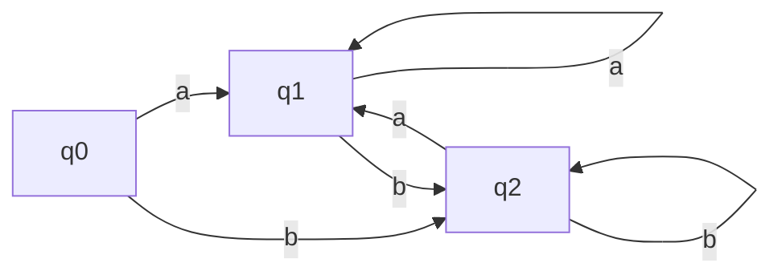
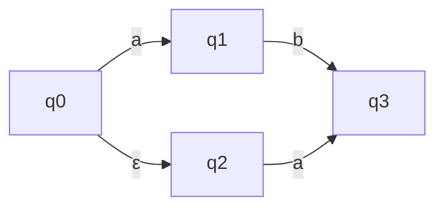

# 有限自动机理论

## 🎯 有限自动机概述

**有限自动机(FA)**是识别正则语言的数学模型，是词法分析的理论基础。它能够根据输入字符序列决定是否接受该序列。

## 📚 基本定义

### 有限自动机五元组
有限自动机是一个五元组 M = (Q, Σ, δ, q₀, F)：
- **Q**：有限状态集合
- **Σ**：输入字母表
- **δ**：状态转换函数 δ: Q × Σ → Q
- **q₀**：初始状态
- **F**：接受状态集合

### 状态转换函数
δ(q, a) = q' 表示在状态q下读入字符a后转换到状态q'。

## 🔍 有限自动机类型

### 确定性有限自动机 (DFA)
每个状态对每个输入字符都有唯一的转换：



### 非确定性有限自动机 (NFA)
状态转换可能不唯一，允许ε转换：



## 📊 DFA vs NFA

| 特性 | DFA | NFA |
|------|-----|-----|
| 状态转换 | 唯一 | 可能不唯一 |
| ε转换 | 不允许 | 允许 |
| 状态数 | 可能较多 | 通常较少 |
| 实现复杂度 | 简单 | 复杂 |
| 接受能力 | 相同 | 相同 |

## 🔧 DFA实现

### 状态转换表
```c
// 识别标识符的DFA
// 状态：0(初始), 1(标识符), 2(错误)
// 输入：字母(a-z), 数字(0-9), 其他

int transition[3][3] = {
    // 字母, 数字, 其他
    {1, 2, 2},  // 状态0
    {1, 1, 2},  // 状态1
    {2, 2, 2}   // 状态2
};
```

### DFA模拟器
```c
class DFA {
private:
    int states[][];
    int currentState;
    set<int> acceptStates;
    
public:
    bool accept(string input) {
        currentState = 0;  // 初始状态
        
        for (char c : input) {
            int inputType = getInputType(c);
            currentState = states[currentState][inputType];
        }
        
        return acceptStates.count(currentState);
    }
};
```

## 🔄 NFA实现

### NFA模拟器
```c
class NFA {
private:
    vector<map<char, set<int>>> transitions;
    set<int> acceptStates;
    
public:
    bool accept(string input) {
        set<int> currentStates = {0};  // 初始状态
        
        for (char c : input) {
            set<int> nextStates;
            for (int state : currentStates) {
                if (transitions[state].count(c)) {
                    nextStates.insert(transitions[state][c].begin(),
                                    transitions[state][c].end());
                }
            }
            currentStates = nextStates;
        }
        
        // 检查是否有接受状态
        for (int state : currentStates) {
            if (acceptStates.count(state)) {
                return true;
            }
        }
        return false;
    }
};
```

## 🎯 自动机构造

### 基本自动机
```c
// 识别单个字符'a'
// 状态：0(初始), 1(接受)
// 转换：0 --a--> 1

// 识别字符串"ab"
// 状态：0(初始), 1, 2(接受)
// 转换：0 --a--> 1 --b--> 2
```

### 组合自动机
```c
// 识别"a|b"（选择）
// 状态：0(初始), 1(接受a), 2(接受b)
// 转换：0 --a--> 1, 0 --b--> 2

// 识别"a*"（闭包）
// 状态：0(初始), 1(接受)
// 转换：0 --a--> 1, 1 --a--> 1
```

## 📈 自动机应用

### 词法分析
- **Token识别**：识别各种token
- **关键字识别**：识别语言关键字
- **标识符识别**：识别变量名、函数名

### 模式匹配
- **字符串匹配**：在文本中查找模式
- **正则表达式**：实现正则表达式引擎
- **数据验证**：验证输入格式

## 🔗 相关链接
- [[正则表达式到NFA转换]] - 正则表达式转换
- [[NFA到DFA转换算法]] - 转换算法
- [[DFA最小化算法]] - 最小化算法
- [[词法分析器实现]] - 实际应用

