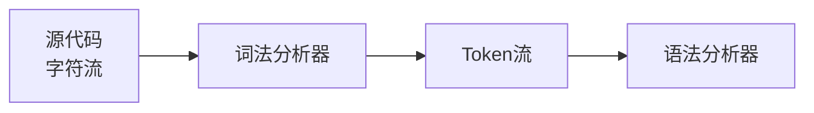

# 词法分析概述

## 🎯 词法分析的作用

**词法分析**是编译过程的第一个阶段，负责将源代码的字符流转换为token流（词法单元流）。它是连接源代码和语法分析的桥梁。

## 🔍 基本概念

### Token（词法单元）
Token是词法分析的基本输出单位，包含两个部分：
- **类型**：token的类别（如标识符、关键字、操作符）
- **值**：token的具体内容

### 词法分析器
词法分析器是执行词法分析的程序，也称为扫描器（Scanner）。

## 📝 Token分类

### 关键字（Keywords）
语言预定义的保留字：
```c
// C语言关键字
int, float, char, if, else, while, for, return, void, struct
```

### 标识符（Identifiers）
用户定义的名称：
```c
// 标识符示例
variable_name, function_name, class_name
```

### 操作符（Operators）
各种运算符号：
```c
// 算术操作符
+, -, *, /, %

// 比较操作符
==, !=, <, >, <=, >=

// 逻辑操作符
&&, ||, !
```

### 分隔符（Delimiters）
用于分隔的符号：
```c
// 分隔符示例
(, ), {, }, [, ], ;, ,, .
```

### 字面量（Literals）
常量值：
```c
// 整数字面量
123, 456, 789

// 浮点字面量
3.14, 2.718, 1.414

// 字符串字面量
"Hello World", "C Programming"

// 字符字面量
'a', 'b', '1'
```

## 🔄 词法分析过程

### 输入输出
- **输入**：源代码字符流
- **输出**：token序列

### 处理流程


### 示例
```c
// 源代码
int x = 10;

// Token流
<INT, "int">
<ID, "x">
<ASSIGN, "=">
<NUM, "10">
<SEMICOLON, ";">
```

## 🎯 词法分析任务

### 主要任务
1. **识别单词**：将字符流分解为有意义的单词
2. **分类标记**：为每个单词分配类型
3. **错误检测**：检测词法错误
4. **预处理**：处理注释、空白等

### 具体工作
- **跳过空白**：忽略空格、制表符、换行符
- **处理注释**：识别并跳过注释
- **识别数字**：识别整数和浮点数
- **识别字符串**：识别字符串字面量
- **识别标识符**：识别变量名、函数名等

## 📊 Token表示

### Token结构
```c
struct Token {
    TokenType type;    // token类型
    string value;      // token值
    int line;         // 行号
    int column;       // 列号
};
```

### Token类型枚举
```c
enum TokenType {
    // 关键字
    INT, FLOAT, CHAR, IF, ELSE, WHILE, FOR, RETURN,
    
    // 标识符
    IDENTIFIER,
    
    // 操作符
    PLUS, MINUS, MULTIPLY, DIVIDE, ASSIGN,
    EQUAL, NOT_EQUAL, LESS, GREATER,
    
    // 分隔符
    LPAREN, RPAREN, LBRACE, RBRACE,
    SEMICOLON, COMMA,
    
    // 字面量
    NUMBER, STRING, CHARACTER,
    
    // 特殊
    EOF_TOKEN, ERROR
};
```

## 🔧 词法分析器实现

### 基本结构
```c
class Lexer {
private:
    string source;      // 源代码
    int position;      // 当前位置
    int line;          // 当前行号
    int column;        // 当前列号
    
public:
    Token getNextToken();    // 获取下一个token
    void skipWhitespace();   // 跳过空白
    Token readNumber();       // 读取数字
    Token readIdentifier();  // 读取标识符
    Token readString();       // 读取字符串
};
```

### 核心算法
```c
Token Lexer::getNextToken() {
    skipWhitespace();
    
    if (position >= source.length()) {
        return Token(EOF_TOKEN, "", line, column);
    }
    
    char current = source[position];
    
    if (isdigit(current)) {
        return readNumber();
    } else if (isalpha(current) || current == '_') {
        return readIdentifier();
    } else if (current == '"') {
        return readString();
    } else {
        return readOperator();
    }
}
```

## 🎯 词法分析特点

### 优点
- **简单高效**：算法相对简单
- **错误定位**：能够精确定位词法错误
- **预处理**：能够处理注释和空白

### 挑战
- **关键字识别**：区分关键字和标识符
- **最长匹配**：选择最长的匹配
- **错误恢复**：从词法错误中恢复

## 📈 词法分析应用

### 编译器
- **词法分析器生成**：自动生成词法分析器
- **语法分析**：为语法分析提供token流
- **错误处理**：检测和处理词法错误

### 文本处理
- **模式匹配**：在文本中查找模式
- **数据解析**：解析结构化数据
- **代码分析**：分析源代码结构

## 🔗 相关链接
- [[有限自动机理论]] - 词法分析理论基础
- [[正则表达式到NFA转换]] - 正则表达式转换
- [[词法分析器实现]] - 词法分析器实现
- [[词法分析错误处理]] - 错误处理策略

