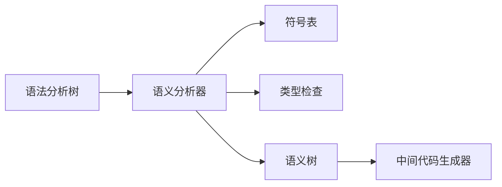

# 语义分析概述

## 🎯 语义分析的作用

**语义分析**是编译过程的第三个阶段，负责检查程序的语义正确性，构建符号表，进行类型检查，并为后续的中间代码生成做准备。

## 🔍 基本概念

### 语义分析器
语义分析器是执行语义分析的程序，也称为语义处理器。

### 符号表
符号表是存储程序中标识符信息的表，包括变量、函数、类型等。

### 类型系统
类型系统是检查程序中类型使用正确性的规则集合。

## 📊 语义分析任务

### 主要任务
1. **符号表管理**：构建和维护符号表
2. **类型检查**：检查类型使用正确性
3. **作用域分析**：分析标识符的作用域
4. **语义检查**：检查语义规则

### 具体工作
- **标识符声明**：处理标识符声明
- **类型推导**：推导表达式的类型
- **类型转换**：处理类型转换
- **语义验证**：验证语义规则

## 🔄 语义分析过程

### 输入输出
- **输入**：语法分析树
- **输出**：带语义信息的语法树

### 处理流程


### 示例
```c
// 语法分析树
    Declaration
    /    |    \
   int   x    Assignment
                /      \
              =        10

// 语义分析后
    Declaration (type: int)
    /    |    \
   int   x    Assignment (type: int)
    (type: int)  /      \
              =        10
              (type: int)
```

## 🎯 语义分析类型

### 静态语义分析
在编译时进行的语义分析：

```c
// 类型检查
int x = 5;        // ✓ 正确
int y = "hello";  // ✗ 类型错误

// 作用域检查
{
    int x = 5;
    {
        int x = 10;  // ✓ 正确，内层作用域
    }
    x = 20;         // ✓ 正确，外层作用域
}
```

### 动态语义分析
在运行时进行的语义分析：

```c
// 数组边界检查
int arr[10];
arr[15] = 5;  // 运行时错误

// 空指针检查
int* ptr = nullptr;
*ptr = 5;     // 运行时错误
```

## 🔧 语义分析器实现

### 基本结构
```c
class SemanticAnalyzer {
private:
    SymbolTable symbolTable;
    TypeChecker typeChecker;
    ScopeManager scopeManager;
    ASTNode* ast;
    
public:
    SemanticAnalyzer(ASTNode* ast);
    void analyze();
    void analyzeNode(ASTNode* node);
    void analyzeDeclaration(ASTNode* node);
    void analyzeExpression(ASTNode* node);
    void analyzeStatement(ASTNode* node);
    void reportError(string message, ASTNode* node);
};
```

### 核心算法
```c
void SemanticAnalyzer::analyze() {
    // 遍历语法分析树
    analyzeNode(ast);
    
    // 检查未声明的标识符
    checkUndeclaredIdentifiers();
    
    // 检查类型一致性
    checkTypeConsistency();
    
    // 检查语义规则
    checkSemanticRules();
}

void SemanticAnalyzer::analyzeNode(ASTNode* node) {
    switch (node->getType()) {
        case DECLARATION:
            analyzeDeclaration(node);
            break;
        case EXPRESSION:
            analyzeExpression(node);
            break;
        case STATEMENT:
            analyzeStatement(node);
            break;
        default:
            // 递归分析子节点
            for (auto child : node->getChildren()) {
                analyzeNode(child);
            }
            break;
    }
}
```

## 📊 语义分析特点

### 优点
- **错误检测**：能够检测语义错误
- **类型安全**：提供类型安全保障
- **优化基础**：为代码优化提供信息

### 挑战
- **复杂度高**：语义分析复杂度高
- **语言特性**：需要处理各种语言特性
- **性能要求**：需要高效的实现

## 🔍 语义分析应用

### 编译器
- **类型检查**：检查类型使用
- **符号解析**：解析标识符
- **语义验证**：验证语义规则

### 语言处理
- **代码分析**：分析代码语义
- **重构工具**：语义感知重构
- **IDE支持**：IDE语义支持

## 📈 语义分析技术

### 属性文法
使用属性文法进行语义分析：

```c
// 属性文法示例
// E → E + T { E.type = E1.type == T.type ? E1.type : error }
// T → id { T.type = lookup(id.name) }
```

### 语法制导翻译
在语法分析过程中进行语义分析：

```c
void parseExpression() {
    ASTNode* left = parseTerm();
    
    while (currentToken.type == PLUS) {
        match(PLUS);
        ASTNode* right = parseTerm();
        
        // 语义分析
        if (left->getType() != right->getType()) {
            reportError("Type mismatch in addition");
        }
        
        left = new BinaryOpNode(PLUS, left, right);
    }
    
    return left;
}
```

## 🎯 语义分析阶段

### 阶段划分
1. **符号表构建**：构建符号表
2. **类型检查**：进行类型检查
3. **语义验证**：验证语义规则
4. **代码生成准备**：为代码生成做准备

### 阶段特点
| 阶段 | 主要任务 | 输入 | 输出 |
|------|----------|------|------|
| 符号表构建 | 处理声明 | AST | 符号表 |
| 类型检查 | 类型推导 | AST | 类型信息 |
| 语义验证 | 规则检查 | AST | 语义信息 |
| 代码生成准备 | 信息收集 | AST | 中间表示 |

## 🔗 相关链接
- [[语法分析概述]] - 语法分析基础
- [[语法制导翻译]] - 语法制导翻译技术
- [[属性文法与计算]] - 属性文法理论
- [[符号表管理]] - 符号表管理技术

