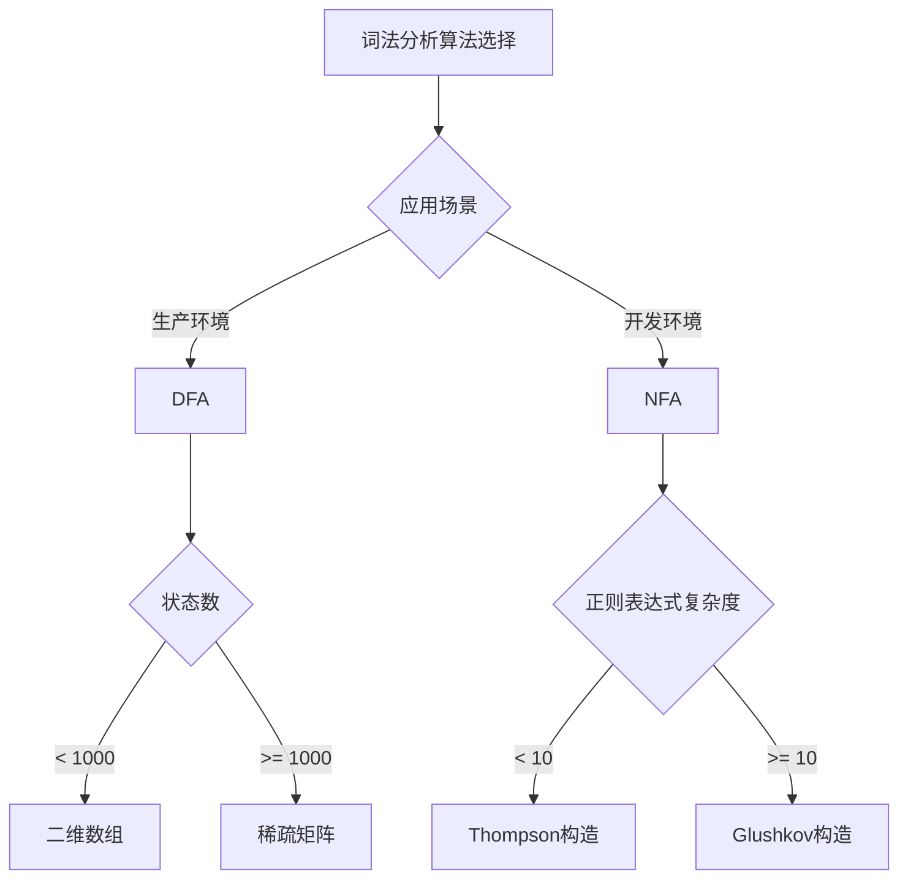
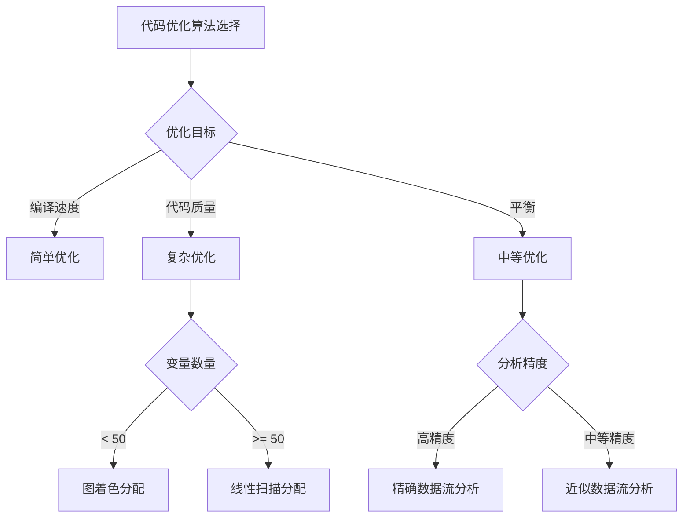

# 算法选择指南

## 🎯 算法选择指南概述

**算法选择指南**是编译器原理学习的重要组成部分，为编译过程中各个阶段选择合适的算法提供指导。掌握算法选择的原则和方法有助于提高编译器的效率、减少资源消耗，并优化目标代码质量。

## 🔍 算法选择原则

### 1. 性能优先原则
- **时间复杂度**：选择时间复杂度更低的算法
- **空间复杂度**：在满足时间要求的前提下，选择空间复杂度更低的算法
- **常数因子**：考虑算法的实际执行效率

### 2. 适用性原则
- **问题规模**：根据输入规模选择合适的算法
- **问题特征**：根据问题的特殊性质选择算法
- **硬件环境**：考虑目标硬件的特点

### 3. 实现复杂度原则
- **实现难度**：选择易于实现的算法
- **维护成本**：考虑算法的维护和调试成本
- **扩展性**：选择易于扩展的算法

## 📊 词法分析算法选择

### 有限自动机算法选择

#### DFA vs NFA选择
**选择标准**：根据应用场景选择

| 算法 | 时间复杂度 | 空间复杂度 | 适用场景 | 优缺点 |
|------|------------|------------|----------|--------|
| DFA | O(n) | O(|Q|) | 生产环境 | 快速、确定、状态数多 |
| NFA | O(n×|Q|) | O(|Q|) | 开发阶段 | 灵活、状态数少、不确定 |

```c
// 算法选择示例
class FiniteAutomataSelector {
public:
    // 时间复杂度：O(1)
    // 空间复杂度：O(1)
    AutomataType selectAutomataType(const string& application) {
        if (application == "production") {
            return AutomataType::DFA;
        } else if (application == "development") {
            return AutomataType::NFA;
        } else {
            return AutomataType::DFA; // 默认选择DFA
        }
    }
    
    // 时间复杂度：O(1)
    // 空间复杂度：O(1)
    bool shouldUseDFA(int stateCount, int symbolCount) {
        // 状态数较少时使用DFA
        return stateCount < 1000 && symbolCount < 256;
    }
    
    // 时间复杂度：O(1)
    // 空间复杂度：O(1)
    bool shouldUseNFA(int stateCount, int symbolCount) {
        // 状态数较多时使用NFA
        return stateCount >= 1000 || symbolCount >= 256;
    }
};
```

#### 状态转移表选择
**选择标准**：根据状态数和符号数选择

| 存储方式 | 时间复杂度 | 空间复杂度 | 适用场景 |
|----------|------------|------------|----------|
| 二维数组 | O(1) | O(|Q|×|Σ|) | 状态数少、符号数少 |
| 稀疏矩阵 | O(1) | O(实际转移数) | 状态数多、转移稀疏 |
| 哈希表 | O(1) | O(实际转移数) | 状态数多、转移稀疏 |

```c
// 状态转移表选择实现
class TransitionTableSelector {
public:
    // 时间复杂度：O(1)
    // 空间复杂度：O(1)
    TransitionTableType selectTableType(int stateCount, int symbolCount) {
        int totalEntries = stateCount * symbolCount;
        int expectedTransitions = estimateTransitionCount(stateCount, symbolCount);
        
        if (expectedTransitions < totalEntries * 0.1) {
            return TransitionTableType::SPARSE_MATRIX;
        } else if (expectedTransitions < totalEntries * 0.3) {
            return TransitionTableType::HASH_TABLE;
        } else {
            return TransitionTableType::DENSE_ARRAY;
        }
    }
    
    // 时间复杂度：O(1)
    // 空间复杂度：O(1)
    int estimateTransitionCount(int stateCount, int symbolCount) {
        // 估算实际转移数
        return stateCount * symbolCount / 4;
    }
};
```

### 正则表达式算法选择

#### Thompson构造 vs 其他构造方法
**选择标准**：根据正则表达式复杂度选择

| 构造方法 | 时间复杂度 | 空间复杂度 | 适用场景 |
|----------|------------|------------|----------|
| Thompson | O(|r|) | O(|r|) | 简单正则表达式 |
| Glushkov | O(|r|²) | O(|r|) | 复杂正则表达式 |
| Position | O(|r|) | O(|r|) | 位置敏感表达式 |

```c
// 正则表达式构造方法选择
class RegexConstructionSelector {
public:
    // 时间复杂度：O(1)
    // 空间复杂度：O(1)
    ConstructionMethod selectMethod(const string& regex) {
        int complexity = calculateComplexity(regex);
        
        if (complexity < 10) {
            return ConstructionMethod::THOMPSON;
        } else if (complexity < 50) {
            return ConstructionMethod::GLUSHKOV;
        } else {
            return ConstructionMethod::POSITION;
        }
    }
    
    // 时间复杂度：O(n)
    // 空间复杂度：O(1)
    int calculateComplexity(const string& regex) {
        int complexity = 0;
        
        for (char c : regex) {
            switch (c) {
                case '*':
                case '+':
                case '?':
                    complexity += 2;
                    break;
                case '|':
                    complexity += 3;
                    break;
                case '(':
                case ')':
                    complexity += 1;
                    break;
                default:
                    complexity += 1;
                    break;
            }
        }
        
        return complexity;
    }
};
```

## 📊 语法分析算法选择

### 自顶向下分析算法选择

#### LL(1) vs 递归下降选择
**选择标准**：根据文法特征选择

| 算法 | 时间复杂度 | 空间复杂度 | 适用场景 |
|------|------------|------------|----------|
| LL(1) | O(n) | O(n) | 简单文法、快速解析 |
| 递归下降 | O(n) | O(n) | 复杂文法、易于实现 |

```c
// 自顶向下分析算法选择
class TopDownParserSelector {
public:
    // 时间复杂度：O(1)
    // 空间复杂度：O(1)
    ParserType selectParserType(const Grammar& grammar) {
        if (isLL1Grammar(grammar)) {
            return ParserType::LL1;
        } else if (isComplexGrammar(grammar)) {
            return ParserType::RECURSIVE_DESCENT;
        } else {
            return ParserType::LL1; // 默认选择LL(1)
        }
    }
    
    // 时间复杂度：O(n²)
    // 空间复杂度：O(n²)
    bool isLL1Grammar(const Grammar& grammar) {
        // 检查文法是否为LL(1)文法
        for (const Production& prod : grammar.getProductions()) {
            if (hasLeftRecursion(prod) || hasLeftFactoring(prod)) {
                return false;
            }
        }
        return true;
    }
    
    // 时间复杂度：O(n)
    // 空间复杂度：O(1)
    bool isComplexGrammar(const Grammar& grammar) {
        int productionCount = grammar.getProductions().size();
        int nonterminalCount = grammar.getNonterminals().size();
        
        // 复杂文法：产生式多、非终结符多
        return productionCount > 100 || nonterminalCount > 50;
    }
};
```

### 自底向上分析算法选择

#### LR算法选择
**选择标准**：根据文法复杂度和性能要求选择

| 算法 | 时间复杂度 | 空间复杂度 | 适用场景 |
|------|------------|------------|----------|
| LR(0) | O(n) | O(n) | 简单文法、快速解析 |
| SLR(1) | O(n) | O(n) | 中等复杂度文法 |
| LR(1) | O(n) | O(n) | 复杂文法、精确解析 |
| LALR(1) | O(n) | O(n) | 平衡性能和精度 |

```c
// LR算法选择实现
class LRParserSelector {
public:
    // 时间复杂度：O(1)
    // 空间复杂度：O(1)
    LRParserType selectLRParser(const Grammar& grammar) {
        int complexity = calculateGrammarComplexity(grammar);
        int stateCount = estimateStateCount(grammar);
        
        if (complexity < 20 && stateCount < 100) {
            return LRParserType::LR0;
        } else if (complexity < 50 && stateCount < 500) {
            return LRParserType::SLR1;
        } else if (complexity < 100 && stateCount < 1000) {
            return LRParserType::LALR1;
        } else {
            return LRParserType::LR1;
        }
    }
    
    // 时间复杂度：O(n)
    // 空间复杂度：O(1)
    int calculateGrammarComplexity(const Grammar& grammar) {
        int complexity = 0;
        
        for (const Production& prod : grammar.getProductions()) {
            complexity += prod.rhs.size();
            
            // 左递归增加复杂度
            if (hasLeftRecursion(prod)) {
                complexity += 5;
            }
            
            // 左因子增加复杂度
            if (hasLeftFactoring(prod)) {
                complexity += 3;
            }
        }
        
        return complexity;
    }
    
    // 时间复杂度：O(1)
    // 空间复杂度：O(1)
    int estimateStateCount(const Grammar& grammar) {
        // 估算LR状态数
        int productionCount = grammar.getProductions().size();
        int nonterminalCount = grammar.getNonterminals().size();
        
        return productionCount * nonterminalCount / 2;
    }
};
```

## 📊 语义分析算法选择

### 符号表管理算法选择

#### 符号表结构选择
**选择标准**：根据符号数量和访问模式选择

| 数据结构 | 查找时间 | 插入时间 | 空间复杂度 | 适用场景 |
|----------|----------|----------|------------|----------|
| 哈希表 | O(1) | O(1) | O(n) | 大量符号、快速访问 |
| 平衡树 | O(log n) | O(log n) | O(n) | 中等数量、有序访问 |
| 链表 | O(n) | O(1) | O(n) | 少量符号、简单实现 |

```c
// 符号表结构选择实现
class SymbolTableSelector {
public:
    // 时间复杂度：O(1)
    // 空间复杂度：O(1)
    SymbolTableType selectTableType(int symbolCount, AccessPattern pattern) {
        if (symbolCount < 100) {
            return SymbolTableType::LINKED_LIST;
        } else if (symbolCount < 10000) {
            return SymbolTableType::BALANCED_TREE;
        } else {
            return SymbolTableType::HASH_TABLE;
        }
    }
    
    // 时间复杂度：O(1)
    // 空间复杂度：O(1)
    bool shouldUseHashTable(int symbolCount, AccessPattern pattern) {
        return symbolCount > 10000 || pattern == AccessPattern::RANDOM;
    }
    
    // 时间复杂度：O(1)
    // 空间复杂度：O(1)
    bool shouldUseBalancedTree(int symbolCount, AccessPattern pattern) {
        return symbolCount >= 100 && symbolCount <= 10000 && 
               pattern == AccessPattern::ORDERED;
    }
};
```

### 类型检查算法选择

#### 类型推断算法选择
**选择标准**：根据类型系统复杂度选择

| 算法 | 时间复杂度 | 空间复杂度 | 适用场景 |
|------|------------|------------|----------|
| 简单推断 | O(n) | O(n) | 简单类型系统 |
| 约束求解 | O(n²) | O(n²) | 复杂类型系统 |
| 类型推导 | O(n³) | O(n³) | 高级类型系统 |

```c
// 类型检查算法选择实现
class TypeCheckingSelector {
public:
    // 时间复杂度：O(1)
    // 空间复杂度：O(1)
    TypeCheckingMethod selectMethod(const TypeSystem& typeSystem) {
        int complexity = calculateTypeSystemComplexity(typeSystem);
        
        if (complexity < 10) {
            return TypeCheckingMethod::SIMPLE_INFERENCE;
        } else if (complexity < 50) {
            return TypeCheckingMethod::CONSTRAINT_SOLVING;
        } else {
            return TypeCheckingMethod::TYPE_DERIVATION;
        }
    }
    
    // 时间复杂度：O(n)
    // 空间复杂度：O(1)
    int calculateTypeSystemComplexity(const TypeSystem& typeSystem) {
        int complexity = 0;
        
        // 基本类型
        complexity += typeSystem.getBasicTypes().size();
        
        // 复合类型
        complexity += typeSystem.getCompositeTypes().size() * 2;
        
        // 泛型类型
        complexity += typeSystem.getGenericTypes().size() * 3;
        
        // 类型约束
        complexity += typeSystem.getConstraints().size() * 2;
        
        return complexity;
    }
};
```

## 📊 代码优化算法选择

### 数据流分析算法选择

#### 数据流分析算法选择
**选择标准**：根据分析精度和性能要求选择

| 算法 | 时间复杂度 | 空间复杂度 | 精度 | 适用场景 |
|------|------------|------------|------|----------|
| 简单分析 | O(n) | O(n) | 低 | 快速分析、简单优化 |
| 精确分析 | O(n²) | O(n²) | 高 | 精确分析、复杂优化 |
| 近似分析 | O(n log n) | O(n log n) | 中 | 平衡性能和精度 |

```c
// 数据流分析算法选择实现
class DataFlowAnalysisSelector {
public:
    // 时间复杂度：O(1)
    // 空间复杂度：O(1)
    DataFlowMethod selectMethod(const ControlFlowGraph& cfg, AnalysisType type) {
        int blockCount = cfg.getBlocks().size();
        int variableCount = estimateVariableCount(cfg);
        
        if (type == AnalysisType::QUICK_ANALYSIS) {
            return DataFlowMethod::SIMPLE_ANALYSIS;
        } else if (type == AnalysisType::PRECISE_ANALYSIS) {
            return DataFlowMethod::PRECISE_ANALYSIS;
        } else {
            // 根据规模选择
            if (blockCount < 100 && variableCount < 1000) {
                return DataFlowMethod::PRECISE_ANALYSIS;
            } else {
                return DataFlowMethod::APPROXIMATE_ANALYSIS;
            }
        }
    }
    
    // 时间复杂度：O(n)
    // 空间复杂度：O(1)
    int estimateVariableCount(const ControlFlowGraph& cfg) {
        int variableCount = 0;
        
        for (BasicBlock* block : cfg.getBlocks()) {
            for (Instruction* inst : block->getInstructions()) {
                if (inst->hasDestination()) {
                    variableCount++;
                }
            }
        }
        
        return variableCount;
    }
};
```

### 寄存器分配算法选择

#### 寄存器分配算法选择
**选择标准**：根据变量数量和寄存器数量选择

| 算法 | 时间复杂度 | 空间复杂度 | 质量 | 适用场景 |
|------|------------|------------|------|----------|
| 简单分配 | O(n) | O(n) | 低 | 快速分配、简单目标 |
| 图着色 | O(n²) | O(n²) | 高 | 精确分配、复杂目标 |
| 线性扫描 | O(n log n) | O(n) | 中 | 平衡质量和速度 |

```c
// 寄存器分配算法选择实现
class RegisterAllocationSelector {
public:
    // 时间复杂度：O(1)
    // 空间复杂度：O(1)
    RegisterAllocationMethod selectMethod(int variableCount, int registerCount) {
        if (variableCount < 50) {
            return RegisterAllocationMethod::SIMPLE_ALLOCATION;
        } else if (variableCount < 200 && registerCount >= 16) {
            return RegisterAllocationMethod::GRAPH_COLORING;
        } else {
            return RegisterAllocationMethod::LINEAR_SCAN;
        }
    }
    
    // 时间复杂度：O(1)
    // 空间复杂度：O(1)
    bool shouldUseGraphColoring(int variableCount, int registerCount) {
        // 变量数适中且寄存器充足时使用图着色
        return variableCount >= 50 && variableCount <= 200 && registerCount >= 16;
    }
    
    // 时间复杂度：O(1)
    // 空间复杂度：O(1)
    bool shouldUseLinearScan(int variableCount, int registerCount) {
        // 变量数多或寄存器少时使用线性扫描
        return variableCount > 200 || registerCount < 16;
    }
};
```

## 📊 算法选择决策树

### 词法分析算法选择决策树



### 语法分析算法选择决策树

```mermaid
graph TD
    A[语法分析算法选择] --> B{文法类型}
    B -->|LL(1)文法| C[LL(1)分析]
    B -->|复杂文法| D[递归下降]
    B -->|LR文法| E[LR分析]
    
    E --> F{文法复杂度}
    F -->|< 20| G[LR(0)]
    F -->|20-50| H[SLR(1)]
    F -->|50-100| I[LALR(1)]
    F -->|> 100| J[LR(1)]
```

### 代码优化算法选择决策树



## 🔗 相关链接
- [[编译算法复杂度总结]] - 算法复杂度总结
- [[算法实现技巧]] - 算法实现技巧
- [[性能优化策略]] - 性能优化策略
- [[词法分析概述]] - 词法分析基础
- [[语法分析概述]] - 语法分析基础
- [[语义分析概述]] - 语义分析基础
- [[代码优化概述]] - 代码优化基础

