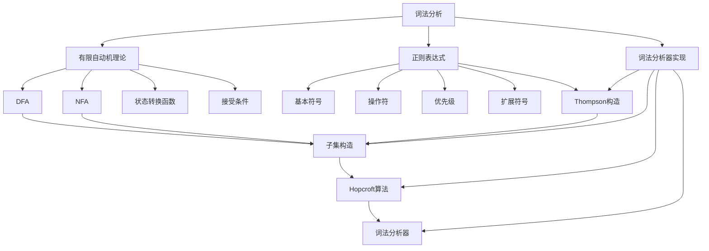
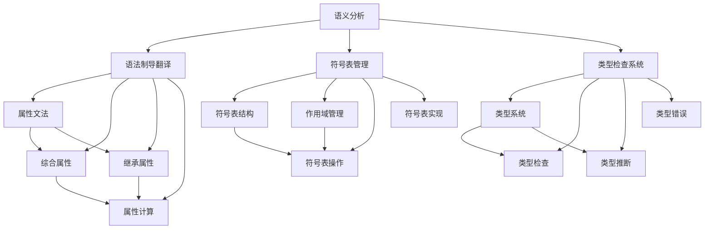
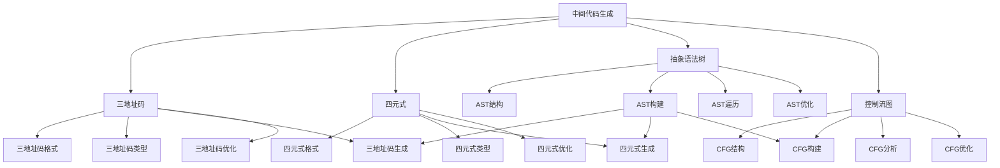
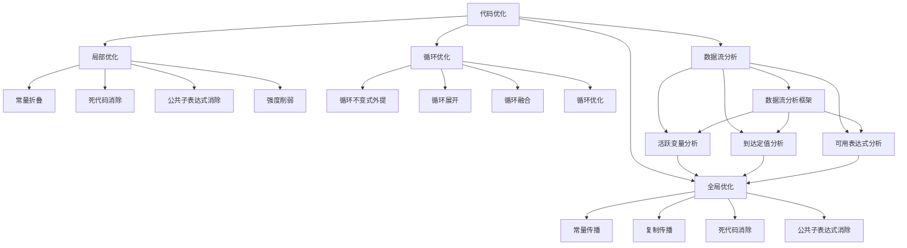
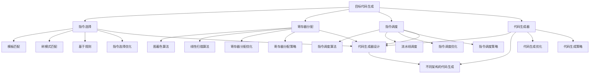
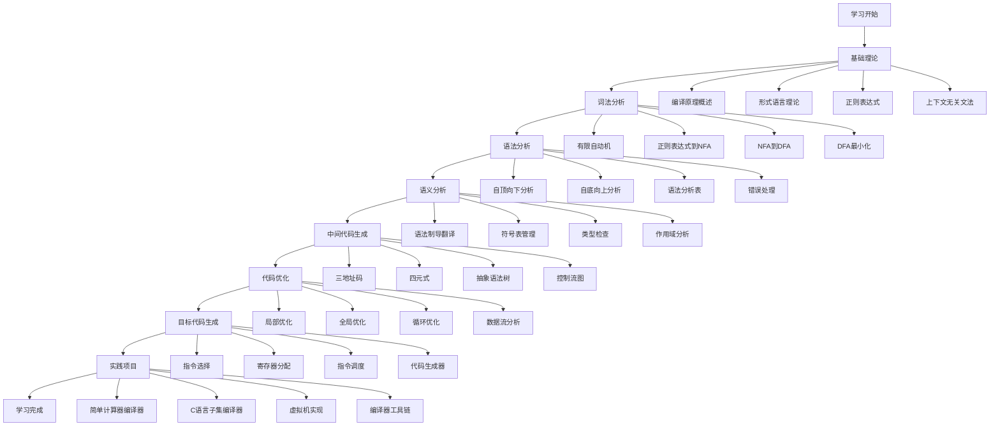

# 知识关联图

## 🎯 编译原理知识关联图

**编译原理知识关联图**是编译器原理学习的重要组成部分，通过系统总结编译原理的知识关联图，帮助学习者建立完整的知识体系，理解各知识点间的关系。

## 🧠 整体知识关联图

```mermaid
graph TD
    A[编译原理] --> B[基础理论]
    A --> C[词法分析]
    A --> D[语法分析]
    A --> E[语义分析]
    A --> F[中间代码生成]
    A --> G[代码优化]
    A --> H[目标代码生成]
    
    B --> B1[编译原理概述]
    B --> B2[形式语言理论]
    B --> B3[正则表达式与正则语言]
    B --> B4[上下文无关文法]
    B --> B5[语法分析树]
    B --> B6[编译器分类与历史]
    
    C --> C1[词法分析概述]
    C --> C2[有限自动机理论]
    C --> C3[正则表达式到NFA转换]
    C --> C4[NFA到DFA转换算法]
    C --> C5[DFA最小化算法]
    C --> C6[词法分析器实现]
    C --> C7[词法分析错误处理]
    
    D --> D1[语法分析概述]
    D --> D2[自顶向下分析]
    D --> D3[LL(1)文法与构造]
    D --> D4[自底向上分析]
    D --> D5[LR(0)分析表构造]
    D --> D6[SLR(1)分析技术]
    D --> D7[LR(1)分析表构造]
    D --> D8[LALR(1)分析技术]
    D --> D9[语法分析错误处理]
    D --> D10[语法分析算法对比]
    
    E --> E1[语义分析概述]
    E --> E2[语法制导翻译]
    E --> E3[属性文法与计算]
    E --> E4[符号表管理]
    E --> E5[类型检查系统]
    E --> E6[作用域分析]
    E --> E7[语义分析错误处理]
    
    F --> F1[中间代码概述]
    F --> F2[三地址码生成]
    F --> F3[四元式表示]
    F --> F4[抽象语法树构建]
    F --> F5[控制流图构建]
    F --> F6[中间代码优化基础]
    
    G --> G1[代码优化概述]
    G --> G2[局部优化技术]
    G --> G3[全局优化技术]
    G --> G4[循环优化技术]
    G --> G5[数据流分析框架]
    G --> G6[活跃变量分析]
    G --> G7[到达定值分析]
    G --> G8[可用表达式分析]
    G --> G9[寄存器分配算法]
    G --> G10[优化算法复杂度分析]
    
    H --> H1[目标代码生成概述]
    H --> H2[指令选择算法]
    H --> H3[寄存器分配算法详解]
    H --> H4[指令调度技术]
    H --> H5[代码生成器设计]
    H --> H6[不同架构的代码生成]
```

## 🔍 词法分析知识关联图



## 📊 语法分析知识关联图

```mermaid
graph TD
    A[语法分析] --> B[自顶向下分析]
    A --> C[自底向上分析]
    A --> D[语法分析表]
    
    B --> B1[递归下降]
    B --> B2[LL(1)分析]
    B --> B3[FIRST集合]
    B --> B4[FOLLOW集合]
    
    C --> C1[移进-归约]
    C --> C2[LR(0)分析]
    C --> C3[SLR(1)分析]
    C --> C4[LR(1)分析]
    C --> C5[LALR(1)分析]
    
    D --> D1[预测分析表]
    D --> D2[动作表]
    D --> D3[转移表]
    
    B3 --> D1
    B4 --> D1
    C2 --> D2
    C3 --> D2
    C4 --> D2
    C5 --> D2
```

## 🧠 语义分析知识关联图



## 🔧 中间代码生成知识关联图



## ⚡ 代码优化知识关联图



## 🎯 目标代码生成知识关联图



## 🔗 算法复杂度关联图

```mermaid
graph TD
    A[算法复杂度] --> B[时间复杂度]
    A --> C[空间复杂度]
    A --> D[算法实现技巧]
    A --> E[性能优化策略]
    
    B --> B1[O(1) - 常数时间]
    B --> B2[O(n) - 线性时间]
    B --> B3[O(n²) - 平方时间]
    B --> B4[O(2^n) - 指数时间]
    
    C --> C1[O(1) - 常数空间]
    C --> C2[O(n) - 线性空间]
    C --> C3[O(n²) - 平方空间]
    C --> C4[O(2^n) - 指数空间]
    
    D --> D1[数据结构选择]
    D --> D2[算法优化]
    D --> D3[内存管理]
    D --> D4[缓存优化]
    
    E --> E1[编译时优化]
    E --> E2[内存使用优化]
    E --> E3[目标代码优化]
    E --> E4[算法选择指南]
    
    B1 --> D1
    B2 --> D1
    B3 --> D2
    B4 --> D2
    C1 --> D3
    C2 --> D3
    C3 --> D4
    C4 --> D4
```

## 📚 学习路径关联图



## 🔗 相关链接
- [[知识点总结]] - 知识点总结
- [[算法总结]] - 算法总结
- [[记忆技巧]] - 记忆技巧
- [[常见问题解答]] - 常见问题解答
- [[考试重点]] - 考试重点
- [[学习心得]] - 学习心得

