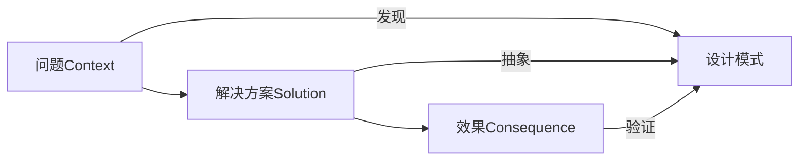
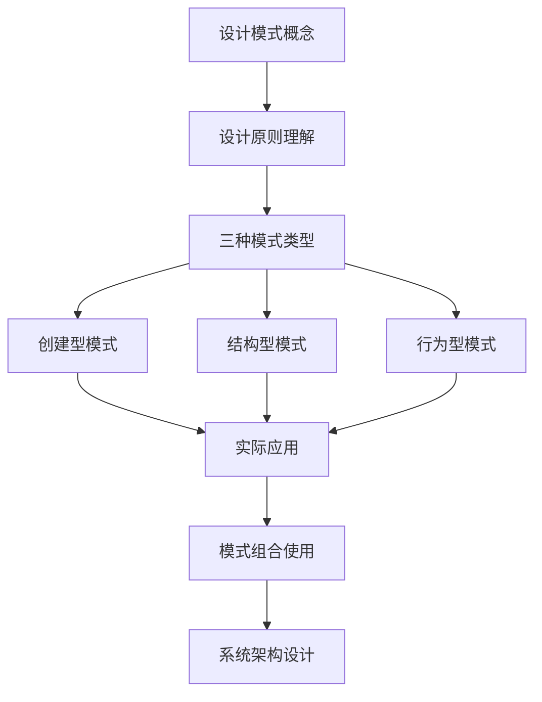

# 设计模式概念与价值

[[设计模式学习图谱]]
## 🎯 核心概念

### 设计模式的定义
> **设计模式是对软件开发中反复出现问题的解决方案的描述**

设计模式不是代码，而是：
- **专家经验**的抽象总结
- **问题解决思路**的规范化描述  
- **代码设计**的指导原则

### 设计模式的三要素

## 🏗️ 核心价值

### 1. 思维框架价值
- **结构化思维**：将复杂设计问题分解为可管理的模式
- **标准化语言**：团队成员使用统一的术语和概念
- **经验传承**：避免重复发明轮子

### 2. 代码质量价值
| 价值维度 | 具体体现 | 实现手段 |
|---------|---------|---------|
| **可维护性** | 代码结构清晰，易于理解 | [[02-设计原则]] |
| **可扩展性** | 对修改关闭，对扩展开放 | 创建型模式 |
| **可重用性** | 避免重复代码 | 结构型模式 |
| **灵活性** | 运行时动态选择 | 行为型模式 |

### 3. 团队协作价值
- **沟通桥梁**：统一的词汇表提升沟通效率
- **知识共享**：新成员快速掌握设计思路
- **一致性**：团队代码风格统一

## 📚 学习路径图

## 🎯 学习目标

### 初级目标 (认识层)
- ✅ 理解设计模式的基本概念和价值
- ✅ 识别软件开发中的常见问题
- ✅ 掌握设计模式的基本分类

### 中级目标 (理解层)  
- ✅ 理解每种模式的内在动机
- ✅ 掌握模式的使用场景和限制
- ✅ 建立模式间的关联理解

### 高级目标 (应用层)
- ✅ 能够在实际项目中灵活应用模式
- ✅ 能够组合多种模式解决复杂问题
- ✅ 能够识别和避免反模式

## 🔗 关联学习

- **下一步** → [[02-GoF-23种经典模式概览]] - 了解所有模式概览
- **理论基础** → [[02-设计原则]] - 理解设计原则支撑
- **实战应用** → [[08-实际应用]] - 看模式的实际运用

---
*💡 **费曼技巧**：尝试用简单的话向朋友解释什么是设计模式，以及为什么学习它很重要。*
