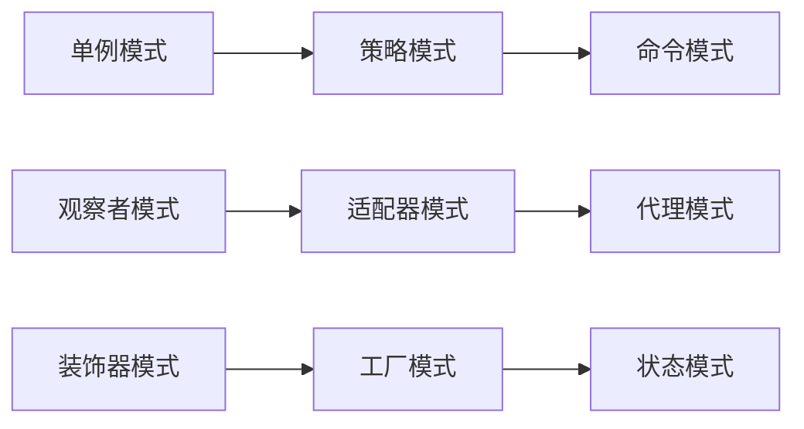
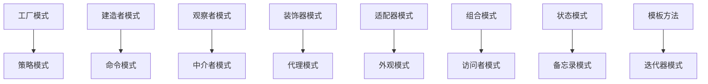

# GoF-23种经典模式概览

[[设计模式概念与价值]] ← → [[设计模式历史与发展]]
## 📚 模式全景图

```mermaid
graph TB<｜tool▁sep｜>subgraph "GoF 23种设计模式"
    subgraph 创建型模式
        A1[工厂模式 Factory]
        A2[抽象工厂 Abstract Factory]
        A3[建造者 Builder]
        A4[原型 Prototype]
        A5[单例 Singleton]
    end
    
    subgraph 结构型模式
        B1[适配器 Adapter]
        B2[桥接 Bridge]
        B3[组合 Composite]
        B4[装饰器 Decorator]
        B5[外观 Facade]
        B6[享元 Flyweight]
        B7[代理 Proxy]
    end
    
    subgraph 行为型模式
        C1[责任链 Chain of Responsibility]
        C2[命令 Command]
        C3[解释器 Interpreter]
        C4[迭代器 Iterator]
        C5[中介者 Mediator]
        C6[备忘录 Memento]
        C7[观察者 Observer]
        C8[状态 State]
        C9[策略 Strategy]
        C10[模板方法 Template Method]
        C11[访问者 Visitor]
    end
end
```

## 🏗️ 模式分类详解

### 创建型模式 (Creational Patterns)
| 模式 | 核心问题 | 解决方案 | 难度等级 |
|------|----------|----------|----------|
| **工厂模式** | 如何创建对象 | 统一工厂接口 | ⭐⭐ |
| **抽象工厂** | 如何创建对象族 | 抽象工厂接口 | ⭐⭐⭐ |
| **建造者模式** | 如何构建复杂对象 | 分步构建对象 | ⭐⭐⭐ |
| **原型模式** | 如何复制对象 | 克隆对象机制 | ⭐⭐ |
| **单例模式** | 如何保证唯一实例 | 控制实例创建 | ⭐ |

> 💡 **学习顺序建议**：单例 → 工厂 → 原型 → 建造者 → 抽象工厂

### 结构型模式 (Structural Patterns)
| 模式 | 核心关系 | 作用机制 | 复杂度 |
|------|----------|----------|--------|
| **适配器** | 接口不匹配 | 适配器转换 | ⭐⭐ |
| **桥接** | 抽象与实现分离 | 桥接抽象层次 | ⭐⭐⭐ |
| **组合** | 树形结构 | 递归组合 | ⭐⭐⭐ |
| **装饰器** | 动态添加功能 | 包装器扩展 | ⭐⭐⭐ |
| **外观** | 简化复杂系统 | 统一接口 | ⭐⭐ |
| **享元** | 共享细粒度对象 | 对象池缓存 | ⭐⭐⭐ |
| **代理** | 控制对象访问 | 代理对象中介 | ⭐⭐ |

> 💡 **学习优先级**：装饰器、代理（高频使用） > 适配器、外观 > 组合、桥接、享元

### 行为型模式 (Behavioral Patterns)
| 模式分类 | 模式名称 | 核心职责 | 使用频率 |
|----------|----------|----------|----------|
| **对象行为** | 策略、状态、备忘录 | 封装对象行为 | ⭐⭐⭐⭐ |
| **对象通信** | 观察者、命令、责任链 | 解耦对象通信 | ⭐⭐⭐⭐ |
| **对象交互** | 中介者、访问者 | 管理对象交互 | ⭐⭐⭐ |
| **对象遍历** | 迭代器 | 统一遍历方式 | ⭐⭐⭐ |
| **对象解析** | 解释器 | 解析特定语法 | ⭐⭐ |
| **对象算法** | 模板方法 | 定义算法框架 | ⭐⭐⭐ |

## 📊 模式重要程度评估

### 🔥 必掌握 (Core Patterns)


### 📈 重要程度排序
1= **必选** >> **重要** > **选择** >> **了解**

| 必选模式 | 重要模式 | 扩展模式 |
|----------|----------|----------|
| 单例、策略、观察者 | 工厂、适配器、装饰器 | 桥接、享元、中介者 |
| 命令、建造者 | 代理、模板方法、状态 | 访问者、解释器、备忘录 |

## 🎯 学习规划路径

### 第一阶段：核心基础 (2周)
- [ ] [[03-创建型模式/06-单例模式]] ⭐
- [ ] [[05-行为型模式/10-策略模式]] ⭐⭐ 
- [ ] [[05-行为型模式/08-观察者模式]] ⭐⭐

### 第二阶段：常用模式 (3周)
- [ ] [[03-创建型模式/02-工厂模式]] ⭐⭐
- [ ] [[04-结构型模式/02-适配器模式]] ⭐⭐
- [ ] [[04-结构型模式/05-装饰器模式]] ⭐⭐⭐

### 第三阶段：高级模式 (4周)
- [ ] [[05-行为型模式/03-命令模式]] ⭐⭐
- [ ] [[03-创建型模式/04-建造者模式]] ⭐⭐⭐
- [ ] [[04-结构型模式/03-组合模式]] ⭐⭐⭐

### 第四阶段：综合应用 (2周)
- [ ] [[07-模式关系与组合]] - 模式组合使用
- [ ] [[08-实际应用]] - 项目实战应用

## 🔗 模式间关系图



---
**📝 实践提示**：先掌握核心模式，再学习边缘模式。每个模式都要配套实际案例理解。
