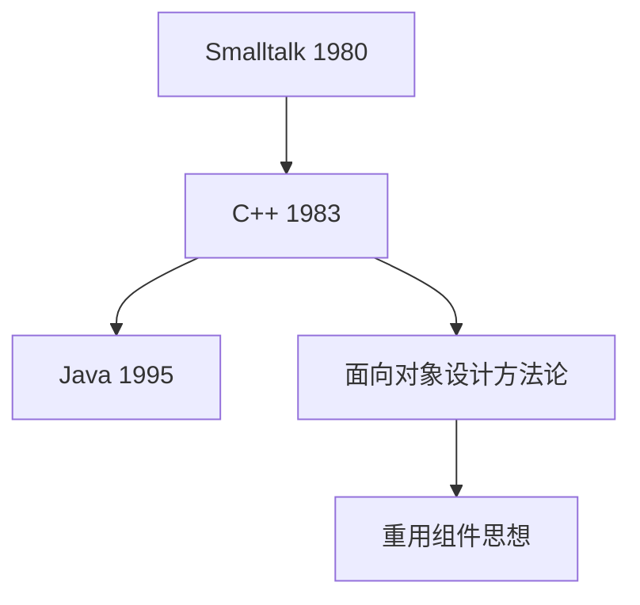
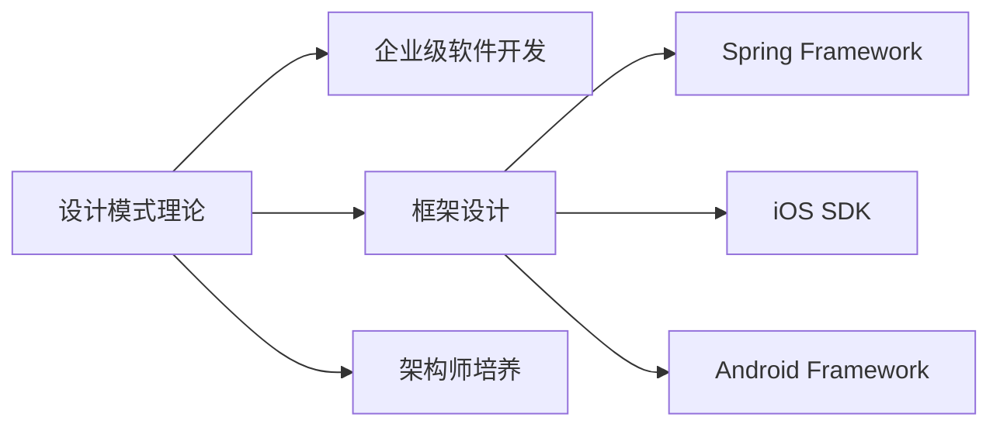
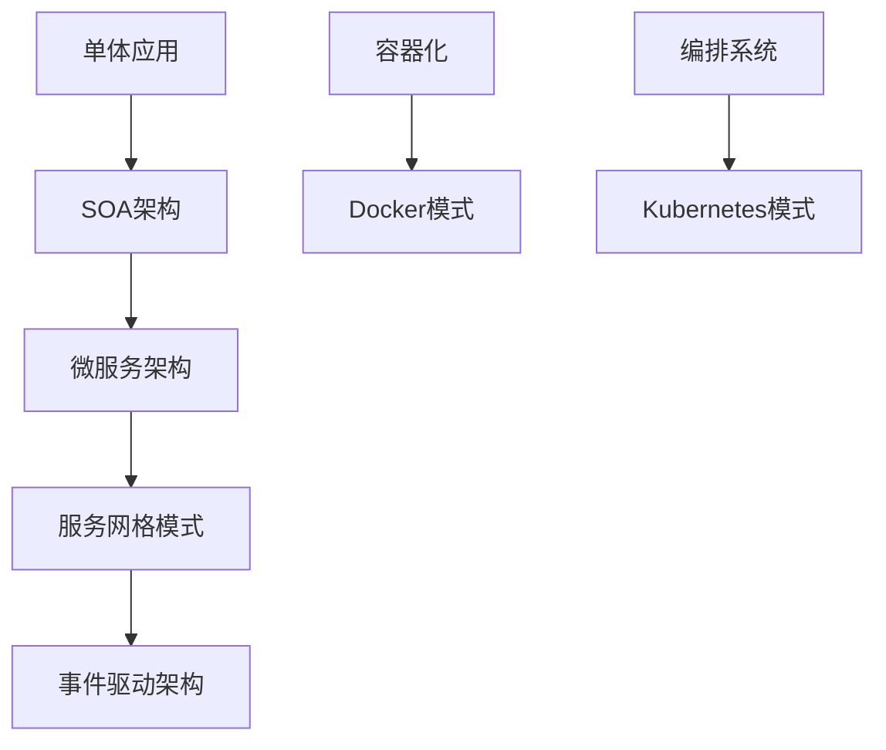
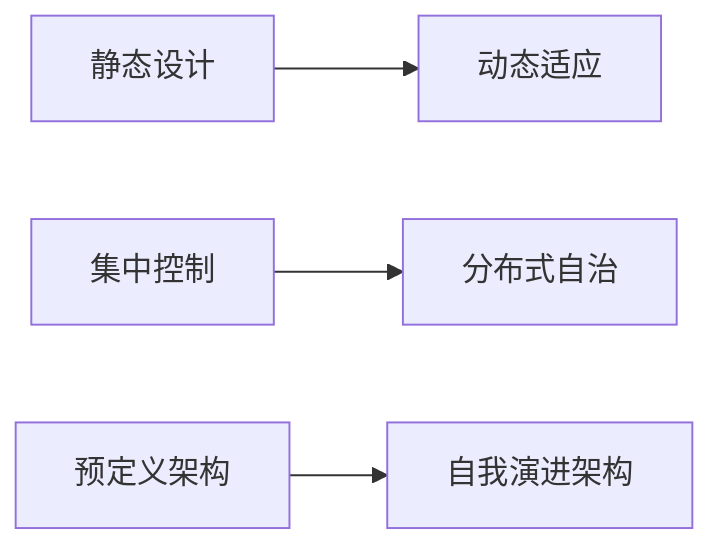

# 设计模式历史与发展

[[GoF-23种经典模式概览]] ← → [[模式快速查询索引]]

## 📜 发展历程时间线

```mermaid
graph LR
    A[1960s 结构化编程] --> B[1970s 面向对象]
    B --> C[1980s 可重用组件]
    C --> D[1990s 设计模式诞生]
    D --> E[2000s 企业级模式]
    E --> F[2010s 现代化模式]
    F → G[2020s AI时代模式]
    
    style D fill:#ff9999
    style F fill:#99ff99
```

## 🏛️ 历史演进阶段

### 第一阶段：模式思想萌芽 (1960s-1970s)
#### 结构化编程时代
- **代表人物**：Dijkstra、Wirth
- **核心贡献**：程序结构化和模块化思想
- **影响力**：奠定了软件设计的基本思路

| 年代 | 重大突破 | 设计思想 |
|------|----------|----------|
| 1960s | ALGOL语言 | 结构化控制流 |
| 1970s | Pascal语言 | 模块化程序设计 |
| 1975 | Dijkstra论著 | 结构化程序理论 |

### 第二阶段：面向对象革命 (1980s-1990s)
#### 对象思维确立
- **关键人物**：Alan Kay (Smalltalk发明者)
- **核心理念**：消息传递、封装、继承、多态
- **里程碑**：Java、C++的广泛采用



### 第三阶段：设计模式诞生 (1994-1995)
#### Gang of Four 的伟大贡献

**👥 四人团队背景**
| 成员 | 学术背景 | 主要贡献 |
|------|----------|----------|
| **Erich Gamma** | 苏黎世理工大学 | Visitor模式专家 |
| **Richard Helm** | IBM悉尼研究院 | 并发模式研究 |
| **Ralph Johnson** | UIUC教授 | OOP框架设计 |
| **John Vlissides** | IBM架构师 | 模式理论建设 |

**📖 《设计模式》的诞生过程**
1. **1991**：Smalltalk Companion出版
2. **1993**：ECOOP会议模式讨论
3. **1994年夏**：四人齐聚制定模式模板
4. **1995年**：《设计模式》正式出版

## 🌟 里程碑意义

### 理论贡献
- **方法论突破**：将抽象设计思想具体化
- **知识体系化**：23种模式形成完整体系
- **语言统一**：建立了设计领域的共同语言

### 实践影响


## 🚀 后期发展 (2000s-至今)

### 企业级模式扩展
#### Martin Fowler 贡献
- **企业架构模式**：《企业应用架构模式》
- **重构理论**：《重构：改善既有代码的设计》
- **SOA模式**：服务导向架构模式

| 模式类别 | 典型代表 | 应用场景 |
|----------|----------|----------|
| **表现层模式** | MVC、MVP、MVVM | 用户界面设计 |
| **领域层模式** | Repository、DTO | 业务逻辑组织 |
| **数据层模式** | Unit of Work、Active Record | 数据持久化 |

### 现代化模式浪潮

#### 微服务时代模式 (2010s)


#### 云原生模式 (2015s-至今)
| 模式层次 | 具体模式 | 技术栈 |
|----------|----------|--------|
| **架构模式** | Serverless、Mesh | AWS Lambda、Istio |
| **部署模式** | 蓝绿部署、金丝雀 | CI/CD Pipeline |
| **开发模式** | 12-Factor App | DevOps实践 |

### AI时代新模式 (2020s-)
#### 新兴设计挑战
- **ML模型管理**：模型版本控制、A/B测试
- **数据管道**：ETL/ELT模式、数据血缘
- **分布式AI**：Federated Learning模式

## 🔮 未来发展趋势

### 技术演进方向
1. **量子计算模式**：并行计算设计模式
2. **边缘计算模式**：分布式系统新模式
3. **无服务器模式**：事件驱动架构演进

### 设计哲学变化


## 🎯 学习启示

### 历史观察
- **设计模式不是银弹**：需要根据时代特点灵活应用
- **知识传承重要性**：优秀设计思想具有持久价值
- **实践驱动理论**：模式来源于实际问题的解决

### 现代应用策略
- **因地制宜**：结合具体技术栈选择合适模式  
- **渐进演进**：从传统模式向现代化模式过渡
- **模式组合**：单一模式局限性，组合解决复杂问题

## 🔗 知识关联

- **理论深入** → [[02-设计原则/01-SOLID原则详解]] - 理解模式的理论基础
- **实践应用** → [[07-模式关系与组合/05-现代化设计模式扩展]] - 看现代模式发展
- **快速查询** → [[模式快速查询索引]] - 掌握模式检索能力

---
**💭 思考题**：想象一下，如果没有设计模式，我们的软件开发会是什么样子？GoF四人组真正改变了什么？
