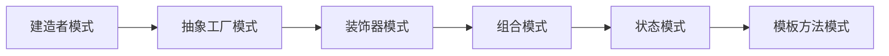
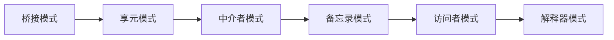
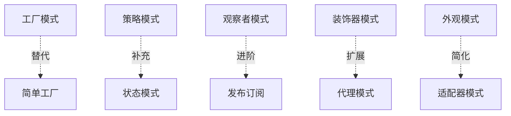
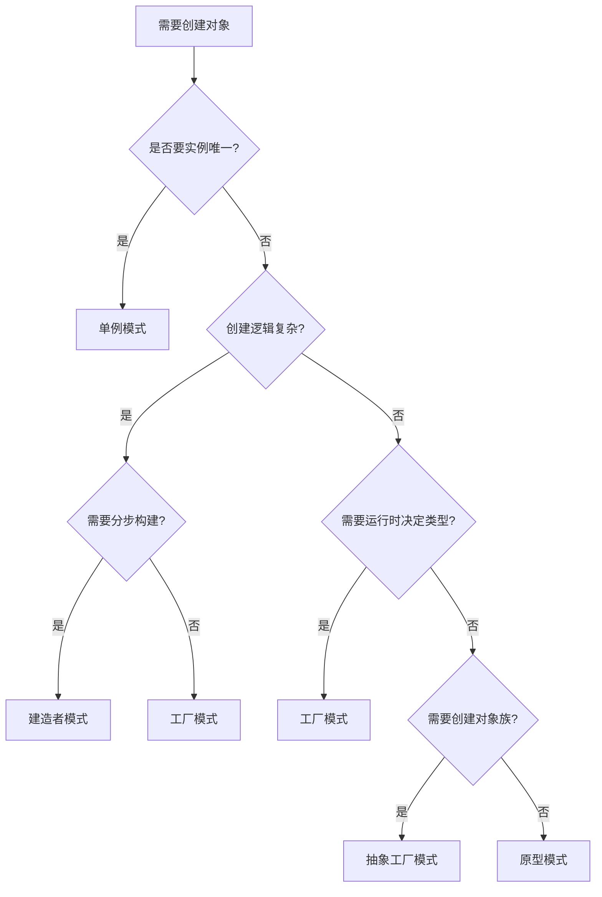

# 模式快速查询索引

[[设计模式历史与发展]] ← → [[02-设计原则/01-SOLID原则详解]]

## 🔍 按问题类型查询

### 💡 创建对象相关问题
| 问题描述 | 适用模式 | 链接 | 复杂度 |
|----------|----------|------|--------|
| 需要系统中有且仅有一个实例 | [[03-创建型模式/06-单例模式]] | ✅ | ⭐ |
| 创建过程复杂，需要分步构建 | [[03-创建型模式/04-建造者模式]] | ✅ | ⭐⭐⭐ |
| 运行时决定创建哪种对象 | [[03-创建型模式/02-工厂模式]] | ✅ | ⭐⭐ |
| 需要创建整个对象族 | [[03-创建型模式/03-抽象工厂模式]] | ✅ | ⭐⭐⭐ |
| 已有对象太昂贵，需要克隆 | [[03-创建型模式/05-原型模式]] | ✅ | ⭐⭐ |

### 🔧 结构组织相关问题
| 问题描述 | 适用模式 | 链接 | 复杂度 |
|----------|----------|------|--------|
| 两个不兼容的接口需要协作 | [[04-结构型模式/02-适配器模式]] | ✅ | ⭐⭐ |
| 抽象与实现需要分离 | [[04-结构型模式/03-桥接模式]] | ✅ | ⭐⭐⭐ |
| 需要用树形结构组织对象 | [[04-结构型模式/04-组合模式]] | ✅ | ⭐⭐⭐ |
| 需要动态添加功能 | [[04-结构型模式/05-装饰器模式]] | ✅ | ⭐⭐⭐ |
| 需要简化复杂系统的对外接口 | [[04-结构型模式/06-外观模式]] | ✅ | ⭐⭐ |
| 需要优化大量相似对象的存储 | [[04-结构型模式/07-享元模式]] | ✅ | ⭐⭐⭐ |
| 访问对象前需要验证/缓存/延迟等处理 | [[04-结构型模式/08-代理模式]] | ✅ | ⭐⭐ |

### 🎭 行为控制相关问题
| 问题描述 | 适用模式 | 链接 | 复杂度 |
|----------|----------|------|--------|
| 需要在不同算法间灵活切换 | [[05-行为型模式/10-策略模式]] | ✅ | ⭐⭐ |
| 需要支持撤销和重做操作 | [[05-行为型模式/03-命令模式]] | ✅ | ⭐⭐ |
| 需要将请求沿链传递直到被处理 | [[05-行为型模式/02-责任链模式]] | ✅ | ⭐⭐ |
| 对象的内部状态改变时需要通知其他对象 | [[05-行为型模式/08-观察者模式]] | ✅ | ⭐⭐ |
| 对象在运行时刻需要改变其行为 | [[05-行为型模式/09-状态模式]] | ✅ | ⭐⭐⭐ |
| 需要统一遍历内聚对象 | [[05-行为型模式/05-迭代器模式]] | ✅ | ⭐⭐ |

## 📊 模式难度速查表

### 🟢 入门级模式 (⭐-⭐⭐)


### 🟡 进阶级模式 (⭐⭐-⭐⭐⭐)


### 🔴 高级模式 (⭐⭐⭐-⭐⭐⭐⭐)


## 🎯 使用场景速查

### 📱 前端开发必用
- **策略模式** → 不同布局算法切换
- **观察者模式** → 事件监听机制  
- **装饰器模式** → 动态添加功能
- **工厂模式** → 组件创建管理

### 🔧 后端架构必用
- **单例模式** → 数据源、日志管理器
- **适配器模式** → 第三方API集成
- **责任链模式** → 中间件管道
- **代理模式** → 缓存、权限控制

### 🌐 分布式系统
- **外观模式** → 微服务网关
- **命令模式** → 消息队列
- **状态模式** → 工作流引擎
- **中介者模式** → 服务协调

## 🔗 模式替代关系图



### 替代选择指南

| 当考虑... | 优先选择 | 次选方案 | 理由 |
|-----------|----------|----------|------|
| **简单对象创建** | 工厂模式 | 建造者模式 | 建造者适合复杂对象 |
| **动态功能添加** | 装饰器模式 | 适配器模式 | 装饰器更灵活 |
| **算法切换** | 策略模式 | 状态模式 | 策略无状态依赖 |
| **对象解耦** | 观察者模式 | 中介者模式 | 观察者更松耦合 |

## 🚀 快速决策树

### 创建型模式决策


## 📝 记忆口诀速查

### 🎵 模式分类口诀
```
创建型：单厂建抽象原型
结构型：适配组装饰外观享元代理  
行为型：责任命令解释迭代中介备忘观察状态策略模板访问
```

### 🔖 模式速记法
- **单厂建** → 单例、工厂、建造者（创建顺序）
- **策略观察** → 策略模式、观察者模式（最常用行为模式）
- **适配装饰** → 适配器、装饰器（最常用结构模式）

## 🔍 交叉引用表

| 查询维度 | 直接链接 | 说明 |
|----------|----------|------|
| [[06-模式识别与选择]] | 详细的选择决策指南 | 深度选择策略 |
| [[07-模式关系与组合]] | 模式间的关系图谱 | 关联模式学习 |
| [[09-记忆强化]] | 记忆技巧和方法 | 长期记忆巩固 |

---
**💡 使用提示**：用Ctrl+F搜索具体问题关键词，快速定位适用的模式！
