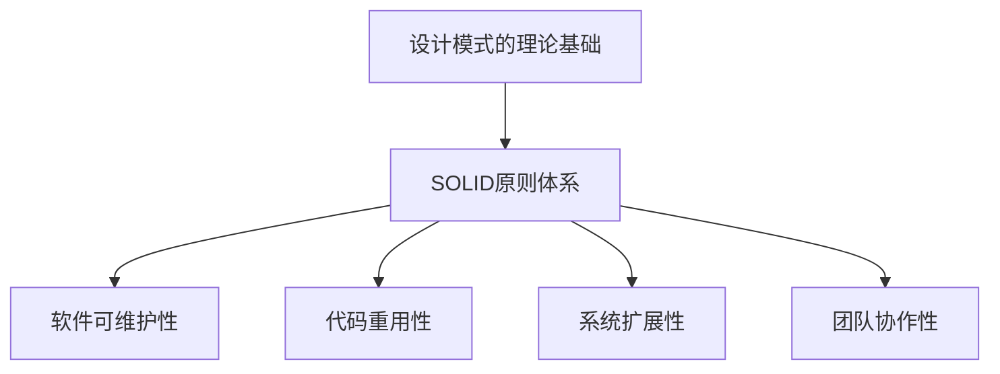
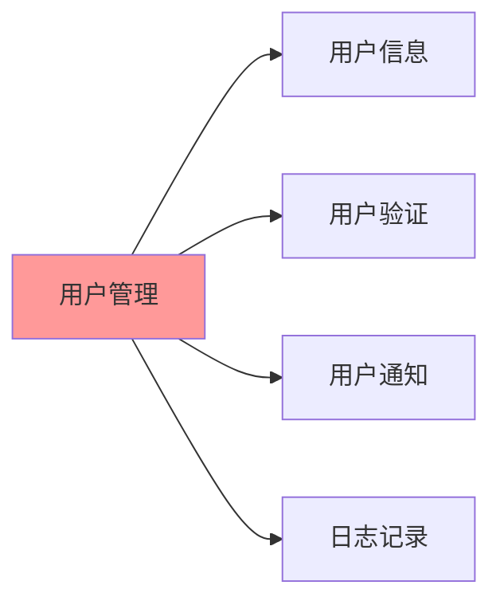
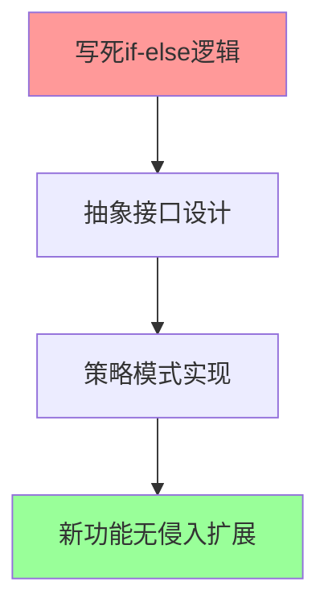
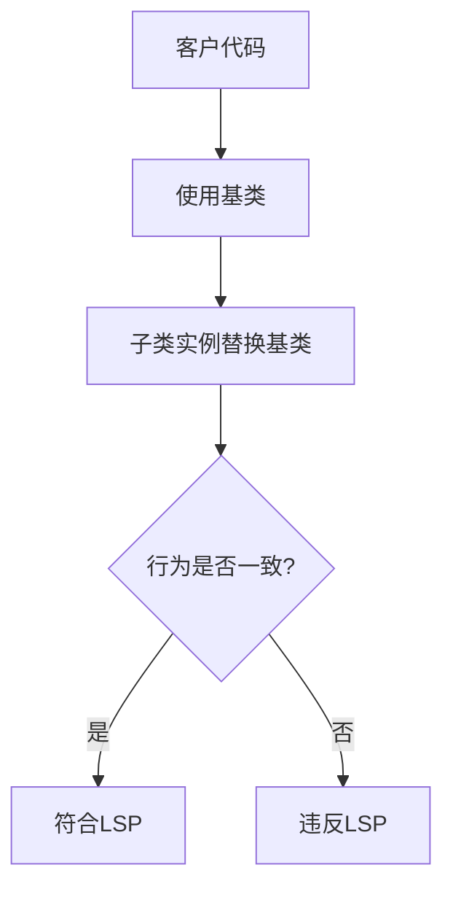
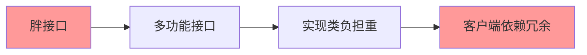
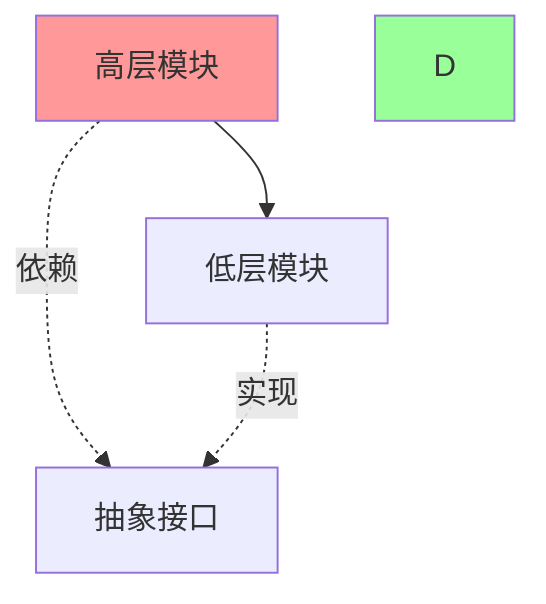
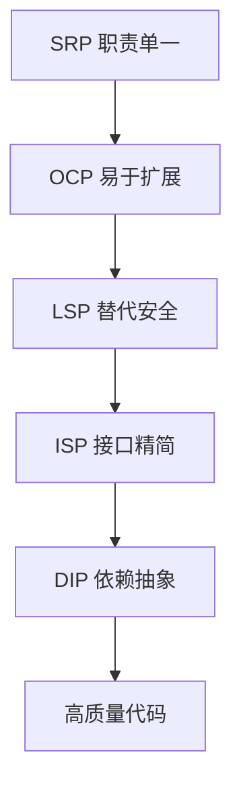

# SOLID原则详解

[[设计模式概念与价值]] → [[其他重要设计原则]]
## 🎯 SOLID原则概览

### 核心价值


> **SOLID原则是设计模式的理论基础，理解好这些原则才能真正掌握设计的精髓。**

## 📋 五大原则分解

### 🔮 SRP - 单一职责原则
> **Single Responsibility Principle**

#### 核心定义
> **一个类只有一个理由去改变**

#### 🎯 问题识别


**❌ 违反示例**
```java
// 职责混乱的用户类
class User {
    String name;
    // 职责1：用户信息管理
    void setName(String name) { this.name = name; }
    
    // 职责2：数据库操作  
    void save() { /* 数据库操作 */ }
    
    // 职责3：邮件通知
    void sendEmail() { /* 邮件发送 */ }
    
    // 职责4：日志记录
    void log(String message) { /* 日志写入 */ }
}
```

**✅ 正确做法**
```java
// 分离职责
class User {
    String name;
    void setName(String name) { this.name = name; }
}

class UserRepository {
    void save(User user) { /* 数据库操作 */ }
}

class EmailService {
    void sendEmail(User user, String message) { /* 邮件发送 */ }
}

class Logger {
    void log(String message) { /* 日志写入 */ }
}
```

#### 📊 应用效果对比

| 维度 | 违反SRP | 遵循SRP |
|------|---------|---------|
| **变化频率** | 高（多职责变化） | 低（单一职责变化） |
| **测试复杂度** | 高（需测试多场景） | 低（专注单一场景） |
| **复用性** | 低（耦合严重） | 高（职责清晰） |

### 🔓 OCP - 开闭原则  
> **Open Closed Principle**

#### 核心定义
> **对扩展开放，对修改关闭**

#### 🌳 设计思路转型


#### 🎯 实际案例：图形绘制系统

**❌ 违反OCP的例子**
```java
class ShapeDrawer {
    void draw(String type) {
        if (type.equals("circle")) {
            // 绘制圆形的代码
        } else if (type.equals("rectangle")) {
            // 绘制矩形的代码  
        } else if (type.equals("triangle")) {
            // 绘制三角形的代码
        }
        // 每增加新图形都要修改这个方法！
    }
}
```

**✅ 遵循OCP的设计**
```java
// 抽象接口
interface Shape {
    void draw();
}

// 具体实现
class Circle implements Shape {
    void draw() { /* 绘制圆形 */ }
}

class Rectangle implements Shape {
    void draw() { /* 绘制矩形 */ }
}

// 扩展：添加新图形无需修改现有代码
class Triangle implements Shape {
    void draw() { /* 绘制三角形 */ }
}
```

#### 🔗 设计模式关联
- [[05-行为型模式/10-策略模式]] - 封装算法变化
- [[05-行为型模式/11-模板方法模式]] - 定义扩展点
- [[04-结构型模式/05-装饰器模式]] - 动态添加功能

### 🔄 LSP - 里氏替换原则
> **Liskov Substitution Principle**

#### 核心定义
> **子类对象必须能够完全替代父类对象**

#### 🎯 关键判断标准


#### 🚨 常见违反情况

##### 案例1：异常抛出不一致
```java
// ❌ 违反LSP
class Bird {
    void fly() { 
        System.out.println("鸟在飞"); 
    }
}

class Penguin extends Bird {
    void fly() {
        throw new RuntimeException("企鹅不能飞!"); // 破坏了客户期望
    }
}

// ✅ 正确设计
abstract classBird {
    abstract void move();
}

class Swan extends Bird {
    void move() { fly(); }
    private void fly() { /* 飞行实现 */ }
}

class Penguin extends Bird {
    void move() { swim(); }
    private void swim() { /* 游泳实现 */ }
}
```

#### 📐 设计约束清单

| 约束项目 | 检查要点 | 示例 |
|----------|----------|------|
| **前置条件** | 子类可以削弱父类的前置条件 | 父类要求非空→子类允许空值 |
| **后置条件** | 子类不能削弱后置条件 | 父类保证返回非空→子类也必须 |
| **异常约束** | 子类不能抛出父类没有的异常 | 父类无异常→子类不抛异常 |
| **不变量** | 维持父类的不变式 | 父类状态约束必须保持 |

### 🔗 ISP - 接口隔离原则
> **Interface Segregation Principle**

#### 核心定义  
> **客户端不应该依赖它不需要的接口**

#### 🎯 问题识别模式


#### 🏭 经典案例：多功能机器

**❌ 违背ISP的臃肿接口**
```java
interface MultiFunctionDevice {
    void print(String document);
    void scan(String document);
    void fax(String document);
    void email(String message);
}

class SmartPhone implements MultiFunctionDevice {
    // 被迫实现所有方法，即使有些功能没有
    void print(String document) { throw new UnsupportedOperationException(); }
    void scan(String document) { /* 扫码实现 */ }
    void fax(String document) { throw new UnsupportedOperationException(); }
    void email(String message) { /* 邮件实现 */ }
}
```

**✅ 接口分离设计**
```java
// 按功能分离的接口
interface Printer {
    void print(String document);
}

interface Scanner {
    void scan(String document);
}

interface FaxMachine {
    void fax(String document);
}

interface EmailSender {
    void send(String message);
}

// 客户端只依赖需要的接口
class Client {
    void scanDocument(Scanner scanner) {
        scanner.scan("document.pdf");
    }
}
```

#### 🎯 分离策略原则

| 策略 | 适用场景 | 优势 |
|------|----------|------|
| **功能分离** | 不同业务功能 | 职责清晰 |
| **客户端分离** | 不同使用者需求 | 减少耦合 |
| **时间分离** | 不同时间引入的功能 | 渐进演进 |

### ⬆️ DIP - 依赖倒置原则
> **Dependency Inversion Principle**

#### 核心定义
> **高层模块不依赖低层模块，两者都依赖抽象**

#### 🔄 依赖关系转型


#### 🎯 依赖注入实战

**❌ 传统紧耦合设计**
```java
class EmailNotification {
    void sendMessage(String message) {
        // 直接依赖具体实现
        GmailService gmail = new GmailService();
        gmail.send(message);
    }
}

class OrderService {
    // 订单服务依赖具体的邮件服务
    EmailNotification notification = new EmailNotification();
    
    void processOrder() {
        // 业务逻辑
        notification.sendMessage("订单已确认");
    }
}
```

**✅ 依赖倒置设计**
```java
// 抽象接口
interface NotificationService {
    void sendMessage(String message);
}

interface MessagePublisher {
    void publish(String topic, String message);
}

// 服务实现依赖抽象
class EmailNotification implements NotificationService {
    MessagePublisher publisher;
    
    EmailNotification(MessagePublisher publisher) {
        this.publisher = publisher;
    }
    
    void sendMessage(String message) {
        publisher.publish("email", message);
    }
}

// 高层业务逻辑依赖抽象
class OrderService {
    NotificationService notification;
    
    OrderService(NotificationService notification) {
        this.notification = notification;
    }
    
    void processOrder() {
        notification.sendMessage("订单已确认");
    }
}
```

## 🔗 SOLID原则联合应用

### 🎯 原则间的协同关系


### 💫 组合效应表

| 原则组合 | 协同效果 | 典型应用 |
|----------|----------|----------|
| **SRP + ISP** | 单一细粒度职责 | 微服务架构 |
| **OCP + LSP** | 安全的功能扩展 | 插件系统 |
| **DIP + OCP** | 灵活的实现切换 | 配置驱动 |
| **SRP + DIP** | 模块化可测试 | 单元测试友好 |

## 🔗 与设计模式的关联

### 📚 原则驱动的模式选择

| SOLID原则 | 相关设计模式 | 解决目标 |
|-----------|-------------|----------|
| **SRP** | 工厂模式、策略模式 | 职责分离 |
| **OCP** | 装饰器模式、适配器模式 | 扩展开放 |
| **LSP** | 代理模式 | 替代一致性 |
| **ISP** | 外观模式 | 接口精简 |
| **DIP** | 抽象工厂、观察者模式 | 依赖抽象 |

## 🎯 实践检查清单

### ✅ SRP检查
- [ ] 类的变化原因是否只有一个？
- [ ] 每个方法是否只做一件事？
- [ ] 类名是否准确描述其职责？

### ✅ OCP检查  
- [ ] 添加新功能是否需要修改现有代码？
- [ ] 是否有适合的抽象层？
- [ ] 扩展点是否设计合理？

### ✅ LSP检查
- [ ] 子类是否完全替换父类位置？
- [ ] 是否保持了契约一致性？
- [ ] 是否存在意外的行为变化？

### ✅ ISP检查
- [ ] 接口是否过于臃肿？
- [ ] 客户端是否依赖了不需要的方法？
- [ ] 接口是否可以进一步拆分？

### ✅ DIP检查
- [ ] 是否依赖抽象而不是具体实现？
- [ ] 是否有合适的依赖注入？
- [ ] 模块间耦合度是否足够低？

## 🔗 学习路径关联

- **理论基础** ← [[设计模式概念与价值]]
- **应用延伸** → [[其他重要设计原则]]
- **模式实践** → [[03-创建型模式/02-工厂模式]]
- **综合应用** → [[原则应用实践指南]]

---
**💡 SOLID记忆口诀**：**"单开替依隔"** - 单一职责、开闭原则、里氏替换、依赖倒置、接口隔离
