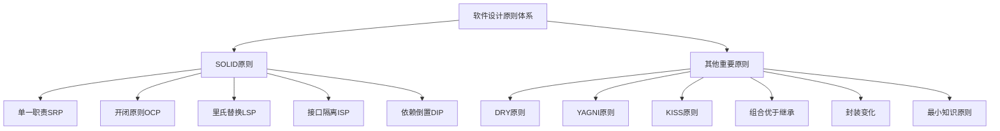
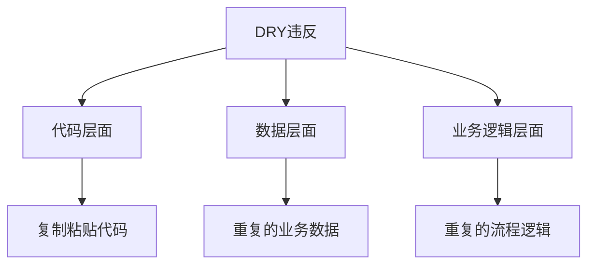
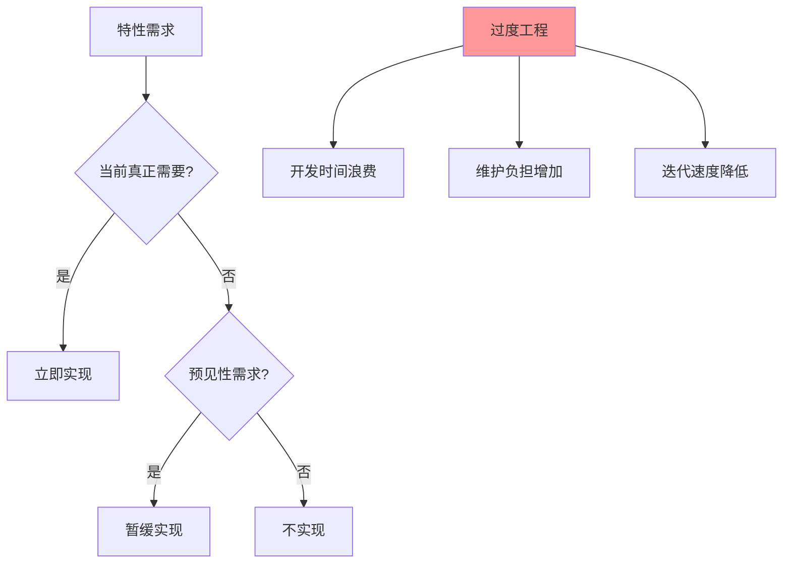
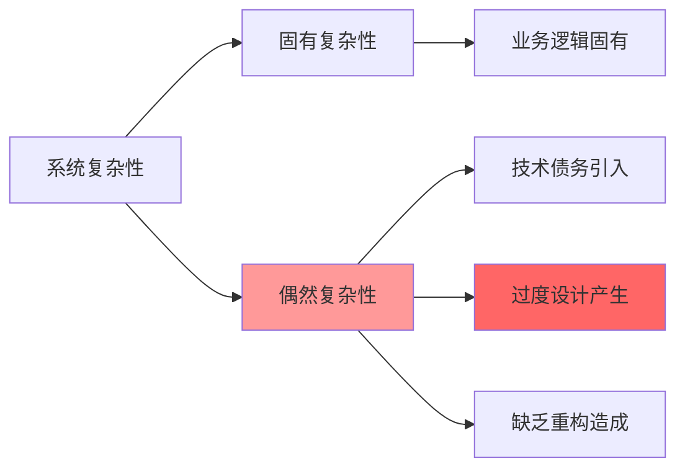
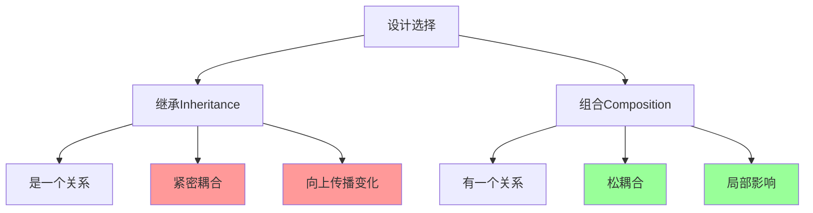
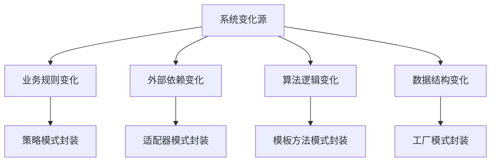
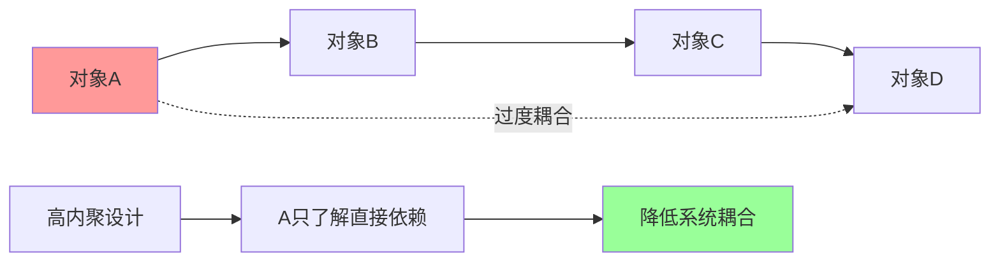
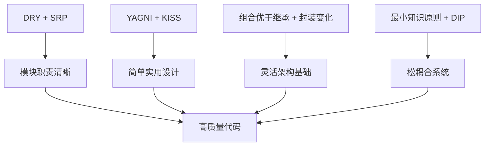

# 其他重要设计原则

[[SOLID原则详解]] → [[原则应用实践指南]]

## 🎯 核心设计原则全景



## 🔄 DRY原则
### Don't Repeat Yourself - 不要重复自己

#### 核心定义
> **系统中的每一条知识都必须在单一的、明确的、权威的表述中体现**

#### 🎯 DRY层次分析



#### 实践层次和策略

| 层次 | 问题表现 | 解决方案 | 技术手段 |
|------|----------|----------|----------|
| **代码复制** | 相同逻辑在不同位置出现 | 提取函数/方法 | Extract Method |
| **数据重复** | 相同数据存储在多处 | 统一数据源 | Database Normalization |
| **接口重复** | 相似API多套实现 | 统一接口规范 | API Gateway |
| **文档重复** | 多处维护相同文档 | 单一数据源文档 | Single Source of Truth |

#### 🚨 DRY常见陷阱

**❌ 过度DRY导致的问题**
```java
// 过度抽象的"万能函数"
GenericDataProcessor<T> {
    <R> R process(T input, String operation, Class<R> outputType) {
        // 复杂的泛型逻辑试图解决所有问题
        // 但实际上增加了复杂性，降低了可读性
    }
}
```

**✅ 合理DRY的平衡**
```java
// 在合适的抽象层次进行DRY
abstract class FileProcessor {
    abstract void process(File file);
    
    // 共同的预处理步骤抽取
    final File preprocessing(File file) {
        validateFile(file);
        normalizePath(file);
        return file;
    }
    
    private void validateFile(File file) { /* 验证逻辑 */ }
    private void normalizePath(File file) { /* 路径标准化 */ }
}
```

## ⚠️ YAGNI原则  
### You Aren't Gonna Need It - 你不会需要它

#### 核心思想
> **只有在真正需要功能时才去实现它，而不是在预见需要时就去实现**

#### 🎯 YAGNI决策框架



#### 📊 实施策略对比

| 策略类型 | YAGNI倡导 | 过度设计风险 | 建议方案 |
|----------|-----------|-------------|----------|
| **接口抽象** | 需要时再提取抽象 | 过早接口会过度抽象 | 重构引导提取 |
| **功能扩展** | 当前实现够用即可 | 预想功能可能用不到 | 简单实现+开放扩展 |
| **性能优化** | 性能问题出现时优化 | 过度优化增加复杂性 | 先走通再优化 |
| **架构设计** | 满足当前需求 | 过度架构难以维护 | 渐进式架构演进 |

#### 💡 YAGNI实战案例

**❌ 违反YAGNI的过度设计**
```java
// 为"可能"的国际化需求做准备
class SystemConfig {
    String language = "zh-CN";
    String timezone = "Asia/Shanghai";
    Map<String, Locale> supportedLocales = Map.of(
        "en-US", Locale.US,
        "zh-CN", Locale.CHINA,
        "ja-JP", Locale.JAPAN
    );
    
    // 复杂的国际化支持逻辑
    void setLocalization(String language) { /* ... */ }
    String translate(String key) { /* ... */ }
}
```

**✅ 遵循YAGNI的合理设计**
```java
// 简单实现，需要时扩展
class SystemConfig {
    String language = "zh-CN";
    
    // 当真正需要国际化时，再添加相应支持
    void setLanguage(String lang) {
        this.language = lang;
    }
}
```

## 🧠 KISS原则
### Keep It Simple, Stupid - 保持简单愚蠢

#### 核心理念
> **简单的解决方案往往是最好的解决方案**

#### 🎯 复杂性来源分析



#### 📋 KISS实践检查清单

| 检查维度 | 复杂信号 | 简化策略 |
|----------|----------|----------|
| **代码结构** | 嵌套层级 > 4层 | 抽取方法简化 |
| **参数传递** | 参数个数 > 5个 | 封装为对象 |
| **条件判断** | if-else分支 > 5个 | 策略模式/状态机 |
| **依赖关系** | 依赖层次 > 6层 | 依赖倒置/扁平化 |
| **命名长度** | 变量名 > 20字符 | 简化命名表达 |

#### 💡 简化技巧手册

##### 技巧1：减少认知负担
```java
// ❌ 复杂的工厂逻辑
class ComplexObjectFactory {
    Object create(Type type, Config config, Context context) {
        if (type == Type.A && config.has("x") && context.active()) {
            return new SpecificImpl1(config.get("x"));
        } else if (type == Type.B || config.has("y")) {
            if (context.permissions().contains("admin")) {
                return new SpecificImpl2(config.get("y"));
            }
            // ... 更多复杂逻辑
        }
        // ...
    }
}

// ✅ 简化的策略选择
class SimpleObjectFactory {
    Map<Type, ObjectCreator> creators = Map.of(
        Type.A, new CreatorA(),
        Type.B, new CreatorB()
    );
    
    Object create(Type type, Config config) {
        return creators.get(type).create(config);
    }
}
```

##### 技巧2：语言表达的简化
```java
// ❌ 冗长的业务逻辑
class OrderProcessor {
    public OrderProcessingResult executeOrderProcessingWorkflow(Order order) {
        OrderValidationResult validationResult = orderValidator.validateOrderCompleteness(order);
        if (validationResult.isSuccessfullyValidated()) {
            PaymentProcessingResult paymentResult = paymentProcessor.processPayment(order);
            if (paymentResult.isPaymentSuccessful()) {
                InventoryReservationResult inventoryResult = inventoryService.reserveInventory(order);
                if (inventoryResult.isInventorySufficient()) {
                    return new OrderProcessingResult(ResultType.SUCCESS);
                } else {
                    return new OrderProcessingResult(ResultType.INVENTORY_INSUFFICIENT);
                }
            } else {
                return new OrderProcessingResult(ResultType.PAYMENT_FAILED);
            }
        } else {
            return new OrderProcessingResult(ResultType.VALIDATION_FAILED);
        }
    }
}

// ✅ 简化的责任链模式
class OrderProcessor {
    public void process(Order order) {
        validate(order);
        charge(order);
        reserve(order);
    }
}
```

## 🔗 组合优于继承原则
### Composition Over Inheritance

#### 核心观点
> **"继承"表示"是一个"，"组合"表示"有一个"**

#### 🎯 继承vs组合对比分析



#### 📊 选择场景对比

| 场景特征 | 继承适用 | 组合适用 | 优选方案 |
|----------|----------|----------|----------|
| **关系类型** | 明确的is-a关系 | 松散的has-a关系 | 组合更灵活 |
| **变化频率** | 父类稳定 | 组件经常变化 | 组合适应性强 |
| **复用需求** | 整体行为复用 | 部分功能复用 | 组合复用性高 |
| **测试复杂度** | 需要整棵继承树 | 可以单独测试组件 | 组合易测试 |

#### 💡 重构示例：继承转组合

**❌ 过度使用继承**
```java
// 不当的继承设计
class Engine {
    void start() { /* 启动引擎 */ }
    void stop() { /* 停止引擎 */ }
}

class Vehicle extends Engine {
    String model;
    
    void drive() {
        start();
        System.out.println("车辆行驶中...");
    }
}

class Car extends Vehicle {
    void autoDrive() {
        drive();
        System.out.println("自动行驶...");
    }
}
```

**✅ 合理的组合设计**
```java
// 使用组合重构
interface Engine {
    void start();
    void stop();
}

class CarEngine implements Engine {
    void start() { /* 汽车引擎启动 */ }
    void stop() { /* 汽车引擎停止 */ }
}

class Vehicle {
    Engine engine;
    String model;
    
    Vehicle(Engine engine, String model) {
        this.engine = engine;
        this.model = model;
    }
    
    void drive() {
        engine.start();
        System.out.println(model + "启动行驶...");
    }
    
    void stop() {
        engine.stop();
        System.out.println(model + "停止...");
    }
}

class Car {
    Vehicle vehicle;
    
    Car(Engine engine, String model) {
        this.vehicle = new Vehicle(engine, model);
    }
    
    void autoDrive() {
        vehicle.drive();
        System.out.println("自动行驶模式...");
    }
}
```

## 🎭 封装变化原则
### Encapsulate What Varies

#### 设计哲学
> **识别系统中经常变化的部分，将其封装起来，使其变化不至于影响系统的其他部分**

#### 🔍 变化识别与封装策略



#### 📋 变化模式识别表

| 变化类型 | 识别特征 | 封装模式 | 示例场景 |
|----------|----------|----------|----------|
| **算法变化** | 计算逻辑经常调整 | 策略模式 | 支付方式、排序算法 |
| **流程变化** | 步骤顺序可能变动 | 模板方法模式 | 订单处理流程 |
| **对象创建** | 不同条件下创建不同对象 | 工厂模式 | 不同平台的UI组件 |
| **行为扩展** | 需要在运行时添加功能 | 装饰器模式 | 权限检查、日志记录 |

## 🔍 最小知识原则 (LKP)
### Law of Demeter - 迪米特法则

#### 核心约束
> **一个对象应该对其他对象有最少的了解**

#### 🎯 耦合度分析



#### 💡 LKP实践指南

**❌ 违反LKP的长调用链**
```java
class OrderService {
    void processOrder(Order order) {
        // 违反LKP：OrderService直接依赖CreditCard的细节
        if (order.getCustomer().getCreditCard().getType() == CreditCardType.VISA) {
            // 处理Visa卡逻辑
        } else if (order.getCustomer().getCreditCard().isExpired()) {
            // 处理过期卡逻辑
        }
    }
}

// 依赖链：OrderService → Order → Customer → CreditCard → Type/Validation
```

**✅ 遵循LKP的合理设计**
```java
class OrderService {
    PaymentService paymentService;
    
    void processOrder(Order order) {
        // 符合LKP：只调用直接依赖对象的接口
        PaymentResult result = paymentService.processPayment(order.getPayment());
        if (!result.isSuccess()) {
            handlePaymentError(result);
        }
    }
}

// 简化的依赖链：OrderService → PaymentService
```

## 🔗 原则协同效应

### 🌟 原则间的相互支撑



### 📊 原则应用优先级

| 开发阶段 | 重点关注原则 | 实施策略 |
|----------|-------------|----------|
| **早期设计** | SOLID + YAGNI | 避免过度设计 |
| **迭代开发** | DRY + KISS | 重构优化 |
| **功能扩展** | OCP + 组合原则 | 开闭修改 |
| **系统集成** | LKP + DIP | 降低耦合 |

## 🔗 学习路径关联

- **SOLID基础** ← [[SOLID原则详解]]
- **实践指南** → [[原则应用实践指南]]
- **对比总结** → [[设计原则对比表]]
- **模式应用** → [[03-创建型模式/01-创建型模式概述]]

---
**💡 设计原则记忆口诀**：**"DYK组合封装律"** 
- DRY(不要重复)、YAGNI(不需要就不做)、KISS(保持简单)
- 组合优于继承、封装变化、最小知识原则(迪米特法则)
