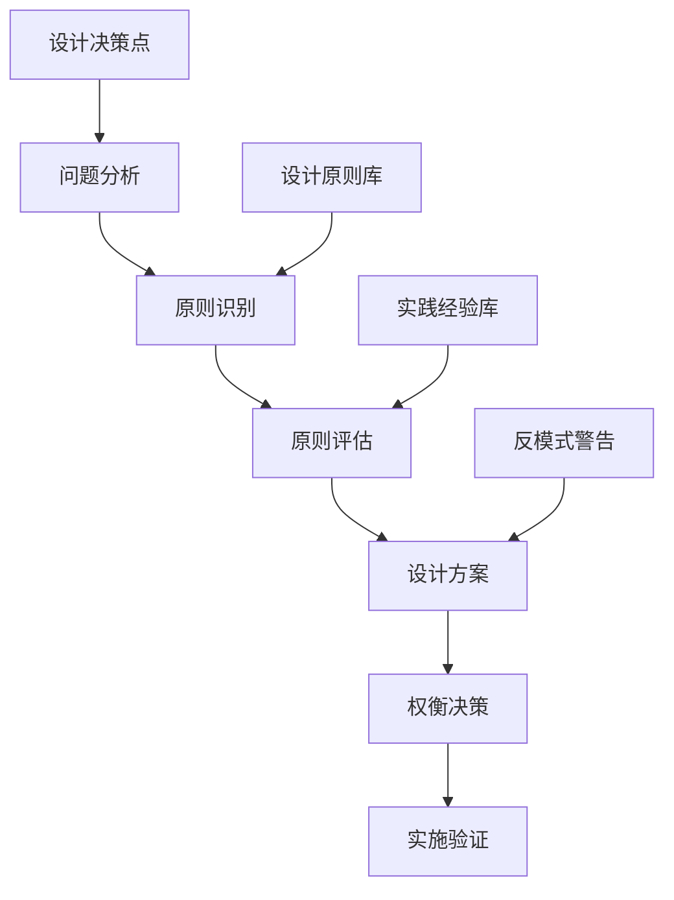
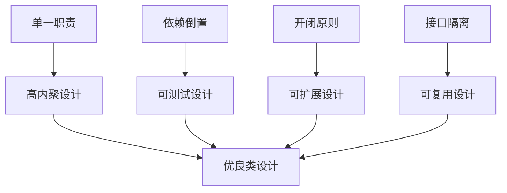
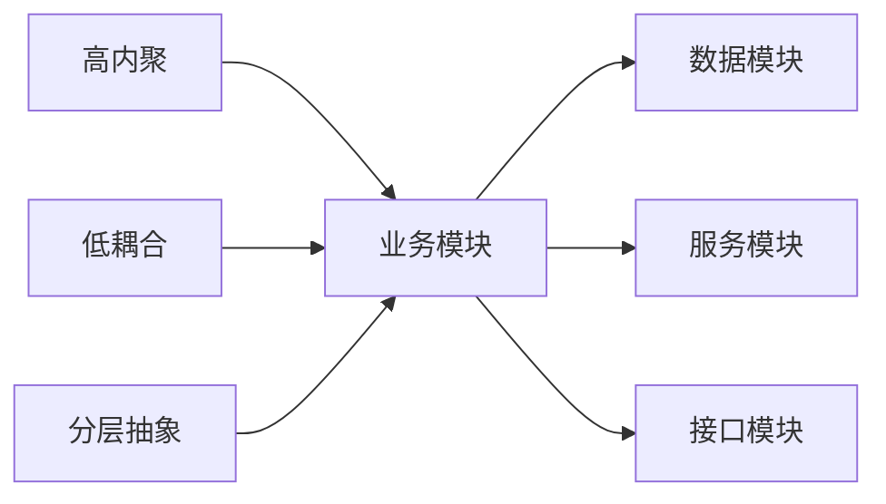
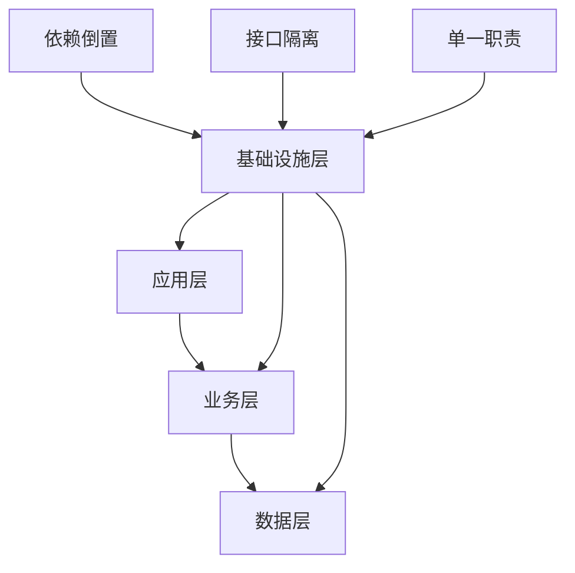
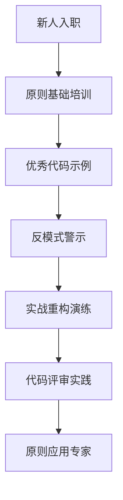
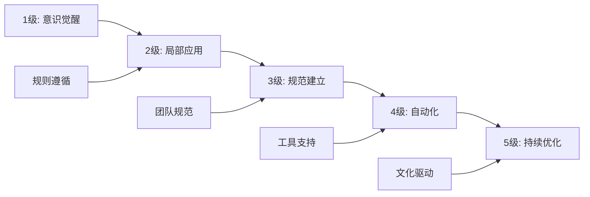

# 原则应用实践指南

[[其他重要设计原则]] → [[设计原则对比表]]

## 🎯 实践应用框架

### 🧠 原则应用思维模型



## 📊 原则优先级决策表

### 🔥 高频冲突场景处理

| 冲突场景 | 涉及原则 | 决策指导 | 实践建议 |
|----------|----------|----------|----------|
| **DRY vs SRP** | 不要重复 vs 单一职责 | 优先考虑职责边界 | 职责内的重复可抽取，跨职责的重复要谨慎 |
| **YAGNI vs OCP** | 不要预设计 vs 对扩展开放 | 平衡当前需求和未来扩展 | 简单实现 + 预留扩展点 |
| **KISS vs DIP** | 保持简单 vs 依赖抽象 | 抽象简化，接口精练 | 合理抽象层次，避免过度设计 |
| **组合 vs 继承** | 组合优于继承 | 首选组合，审慎使用继承 | 明确is-a vs has-a关系 |

#### 💡 实战案例：原则冲突解决

**场景：用户权限管理系统设计**

```java
// ❌ 违反多个原则的设计
class UserManager {
    void createUser(String name, String email, String role) {
        // 违反DRY：重复的参数验证
        if (name == null || name.isEmpty()) {
            throw new IllegalArgumentException("姓名不能为空");
        }
        if (email == null || !email.contains("@")) {
            throw new IllegalArgumentException("邮箱格式错误");
        }
        
        // 违反SRP：多种职责在同一个方法
        User user = new User(name, email, role);
        database.saveUser(user);
        emailService.sendWelcomeEmail(user);
        auditLogger.logUserCreation(user);
        
        // 违反YAGNI：预实现的复杂权限逻辑
        if (role.equals("admin")) {
            setupAdminDashboard(user);
            sendSecurityNotification(user);
            scheduleTopUpReminder(user);
        }
    }
}
```

**✅ 融合多种原则的重构**

```java
// DRY + SRP: 职责分离和消除重复
class UserValidator {
    void validateUserData(String name, String email) {
        Objects.requireNonNull(name, "姓名不能为空");
        if (email == null || !email.contains("@")) {
            throw new IllegalArgumentException("邮箱格式错误");
        }
    }
}

class UserManager {
    UserValidator validator;
    UserRepository repository;
    UserNotificationService notificationService;
    AuditService auditService;
    
    UserManager(UserValidator validator, UserRepository repository, 
                UserNotificationService notificationService, AuditService auditService) {
        this.validator = validator;
        this.repository                = repository;
        this.notificationService       = notificationService;
        this.auditService             = auditService;
    }
    
    void createUser(String name, String email, String role) {
        validator.validateUserData(name, email);
        
        User user = new User(name, email, role);
        repository.save(user);
        
        // 组合原则：使用服务组合而非继承
        notificationService.sendWelcome(user);
        auditService.logCreation(user);
    }
}

// YAGNI + OCP: 需要时才扩展，对修改关闭
class UserServiceFactory {
    static UserManager createUserManager(String role) {
        return new UserManager(
            new UserValidator(),
            new UserRepository(),
            new UserNotificationService(),
            new AuditService()
        );
    }
}

// KISS + DIP: 保持简单接口，依赖抽象
interface UserRepository {
    void save(User user);
    User findById(String id);
} 
```

## 🎯 原则应用检查清单

### ✅ 日常开发中的原则检查

#### 编写新类时
- [ ] **SRP检查**：这个类只负责一件事吗？
- [ ] **DIP检查**：依赖的是抽象接口还是具体实现？
- [ ] **ISP检查**：接口是否过于庞大？
- [ ] **DRY检查**：是否有重复逻辑需要抽取？
- [ ] **KISS检查**：设计是否过于复杂？

#### 修改现有代码时
- [ ] **LSP检查**：子类是否能够完全替换父类？
- [ ] **OCP检查**：修改是否会影响现有功能？
- [ ] **组合检查**：是否可以通过组合而非继承来解决？

#### 设计接口时
- [ ] **ISP检查**：客户端是否需要所有的方法？
- [ ] **DIP检查**：接口是否足够抽象？
- [ ] **LKP检查**：调用链是否过长？

## 📈 原则应用进阶策略

### 🎯 原则驱动的架构设计

#### 微观设计 (类级别)


#### 中观设计 (模块级别)


#### 宏观设计 (系统级别)


### 🎨 架构模式与原则映射

| 架构模式 | 体现原则 | 实现方式 |
|----------|----------|----------|
| **分层架构** | SRP + DIP | 每层单一职责，依赖下层抽象 |
| **微服务** | SRP + ISP | 服务单一职责，接口精简 |
| **DDD** | SRP + 组合原则 | 聚合根单一职责，业务对象组合 |
| **CQRS** | SRP | 读写分离，各自职责单一 |
| **事件驱动** | OCP + DIP | 事件发布订阅，对扩展开放 |

## 🚀 重构引导原则应用

### 📋 代码坏味道与原则映射

| 代码坏味道 | 违反原则 | 重构方向 | 技术手段 |
|------------|----------|----------|----------|
| **长方法** | SRP + KISS | 方法拆分 | Extract Method |
| **大类** | SRP | 类拆分 | Extract Class |
| **重复代码** | DRY | 代码抽取 | Extract Method/Variable |
| **长参数列表** | ISP | 对象包装 | Introduce Parameter Object |
| **条件复杂** | OCP + 策略模式 | 策略抽取 | Replace Conditional with Strategy |
| **继承滥用** | 组合优于继承 | 委托机制 | Replace Inheritance with Delegation |

### 🔧 重构实战指南

#### 案例1：长方法重构
```java
// ❌ 违反SRP + KISS的长方法
public void processOrder(Order order) {
    // 验证订单
    if (order == null) throw new IllegalArgumentException("订单不能为空");
    if (order.getItems().isEmpty()) throw new IllegalArgumentException("订单必须包含商品");
    
    // 计算价格
    BigDecimal totalAmount = BigDecimal.ZERO;
    for (OrderItem item : order.getItems()) {
        BigDecimal itemTotal = item.getPrice().multiply(item.getQuantity());
        totalAmount = totalAmount.add(itemTotal);
        if (item.getDiscount() != null) {
            BigDecimal discountAmount = itemTotal.multiply(item.getDiscount());
            totalAmount = totalAmount.subtract(discountAmount);
        }
    }
    
    // 验证库存
    for (OrderItem item : order.getItems()) {
        Product product = productService.getProduct(item.getProductId());
        if (product.getStock() < item.getQuantity()) {
            throw new InsufficientStockException("库存不足");
        }
    }
    
    // 保存订单
    order.setStatus("PROCESSED");
    order.setTotalAmount(totalAmount);
    orderRepository.save(order);
    
    // 扣减库存
    for (OrderItem item : order.getItems()) {
        Product product = productService.getProduct(item.getProductId());
        product.setStock(product.getStock() - item.getQuantity());
        productService.updateProduct(product);
    }
    
    // 发送通知
    notificationService.sendOrderConfirmation(order);
}

// ✅ 遵循SRP + DRY的重构
public void processOrder(Order order) {
    OrderValidator validator = new OrderValidator(order);
    validator.validate();
    
    OrderCalculator calculator = new OrderCalculator(order);
    BigDecimal totalAmount = calculator.calculateTotal();
    
    InventoryManager inventory = new InventoryManager(order);
    inventory.reserveInventory();
    
    OrderProcessor processor = new OrderProcessor(order);
    processor.saveOrder(totalAmount);
    
    NotificationService notification = new NotificationService(order);
    notification.sendConfirmation();
}
```

### 🎯 原则应用评估工具

#### 📊 设计质量评估表

| 评估维度 | 权重 | 评分标准(1-5分) | 原则依据 |
|----------|------|----------------|----------|
| **可维护性** | 25% | 修改影响范围小 | SRP + DRY |
| **可扩展性** | 20% | 新功能易于添加 | OCP + DIP |
| **可测试性** | 20% | 单元测试覆盖率 | DIP + SRP |
| **可读性** | 15% | 代码清晰易懂 | KISS + SRP |
| **复用性** | 10% | 组件可独立使用 | ISP + 组合原则 |
| **性能** | 10% | 执行效率满足要求 | KISS + DRY |

#### 💡 评估计算示例
```java
// 设计质量分数计算
class DesignQualityAssessment {
    double calculateScore(ProjectMetrics metrics) {
        double maintainability = metrics.modificationImpact() * 0.25;
        double extensibility = metrics.newFeatureComplexity() * 0.20;
        double testability = metrics.testCoverage() * 0.20;
        double readability = metrics.codeClarityScore() * 0.15;
        double reusability = metrics.componentIndependence() * 0.10;
        double performance = metrics.executionEfficiency() * 0.10;
        
        return maintainability + extensibility + testability + 
               readability + reusability + performance;
    }
}
```

## 🔗 团队协作中的原则应用

### 👥 团队知识共享策略

#### 📚 原则培训体系


#### 🎯 代码评审检查点

| 评审维度 | 检查要点 | 常见问题 | 改进建议 |
|----------|----------|----------|----------|
| **职责单一** | 方法/类是否只做一件事 | 方法过长，职责混合 | 职责拆分，方法提取 |
| **依赖管理** | 是否依赖抽象 | 硬编码依赖 | 依赖注入，接口隔离 |
| **扩展设计** | 是否预留扩展点 | 硬编码逻辑 | 策略模式，配置化 |
| **代码复用** | 是否存在重复 | 复制粘贴代码 | 抽取公共方法/类 |

### 🚀 持续改进流程

#### 📈 原则应用成熟度模型



#### 🎯 改进里程碑设定

| 阶段 | 目标 | 关键指标 | 行动要点 |
|------|------|----------|----------|
| **入门级** | 理解原则内涵 | 理论学习达标率 | 培训 + 考核 |
| **应用级** | 在简单场景应用 | 原则应用正确率 | 实践 + 反馈 |
| **熟练级** | 能在复杂场景应用 | 问题解决成功率 | 项目 + 总结 |
| **专家级** | 团队原则推广 | 团队整体提升 | 指导 + 传承 |

## 🔗 学习路径关联

- **理论夯实** ← [[SOLID原则详解]] + [[其他重要设计原则]]
- **对比理解** → [[设计原则对比表]]
- **模式应用** → [[03-创建型模式/01-创建型模式概述]]

---
**💡 实践智慧**：原则不是教条，是指导决策的工具。在具体项目中，要根据业务特点、团队能力、技术约束等因素灵活运用。
