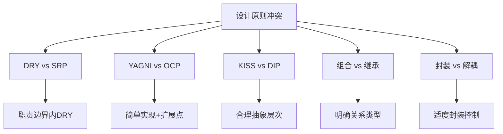
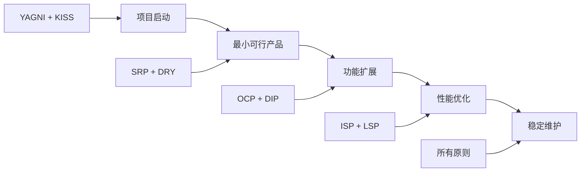
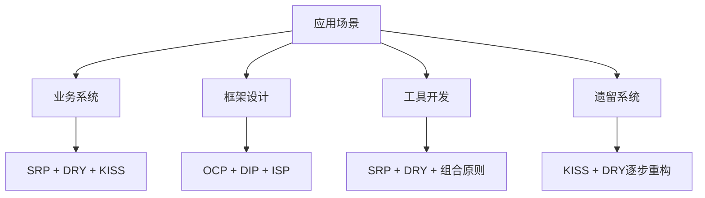

# 设计原则对比表

[[原则应用实践指南]] ← → [[03-创建型模式/01-创建型模式概述]]

## 📊 原则对比分析全景

### 🎯 核心原则对比矩阵

| 设计原则 | 主要目标 | 适用场景 | 常见违反 | 重构手段 | 实施难度 |
|----------|----------|----------|----------|----------|----------|
| **SRP** | 职责单一 | 复杂业务模块设计 | 上帝类、多功能方法 | Extract Class/Method | ⭐⭐⭐ |
| **OCP** | 扩展开放 | 框架设计、插件系统 | 频繁修改核心类 | Strategy/Template Method | ⭐⭐⭐⭐ |
| **LSP** | 替代安全 | 继承体系设计 | 子类破坏父类契约 | 重新设计继承关系 | ⭐⭐⭐⭐ |
| **ISP** | 接口精简 | API设计、服务设计 | 胖接口、方法冗余 | Interface Segregation | ⭐⭐⭐ |
| **DIP** | 依赖抽象 | 架构设计、解耦 | 直接依赖具体实现 | Dependency Injection | ⭐⭐⭐⭐ |
| **DRY** | 消除重复 | 代码重构优化 | 复制粘贴、重复逻辑 | Extract Method/Class | ⭐⭐ |
| **YAGNI** | 避免过度设计 |  Agile开发、快速迭代 | 预留无用功能 | 代码清理 | ⭐ |
| **KISS** | 保持简单 | 所有场景 | 过度工程、复杂设计 | Simplify Logic | ⭐⭐ |

## 🔥 高频冲突场景详解

### 🎯 原则冲突矩阵



#### 🔴 冲突1：DRY vs SRP - 职责优先还是复用优先？

**核心矛盾**：复用代码可能在职责边界上产生交叉

**决策框架**：
```java
// ❌ 错误：过度DRY导致违反SRP
class MultiPurposeProcessor {
    // 这个方法试图用一个接口处理多种不同类型的数据
    <T> void process(T data, String operation) {
        // 违反SRP：处理log、order、user等多种数据
        if (data instanceof Order) processOrder((Order) data, operation);
        else if (data instanceof Log) processLog((Log) data, operation);
        else if (data instanceof User) processUser((User) data, operation);
        // ... 更多的if-else
    }
}

// ✅ 正确：SRP优先，在单一职责内DRY
abstract class BaseProcessor<T> {
    // SRP：单一职责处理器
    abstract void process(T data);
    
    // DRY：在单一职责内的公共逻辑
    protected final void validateData(T data) {
        Objects.requireNonNull(data, "数据不能为空");
    }
    
    protected final void auditOperation(String operation) {
        auditService.log(operation, getCurrentUser());
    }
}

class OrderProcessor extends BaseProcessor<Order> {
    void process(Order order) {
        validateData(order);
        processOrderInternal(order);
        auditOperation("order.processed");
    }
    
    private void processOrderInternal(Order order) {
        // 订单特有的处理逻辑
    }
}
```

**评判标准**：
- ✅ **优先SRP**：职责边界清晰，单一类变化
- ✅ **适度DRY**：职责内公共逻辑抽取
- ❌ **避免过度DRY**：跨职责的勉强重复

#### 🟡 冲突2：YAGNI vs OCP - 当前需求还是未来扩展？

**核心矛盾**：简单实现vs预留扩展空间

**决策指南**：
```java
// ❌ 错误：不当地遵循YAGNI导致违反OCP
class PaymentProcessor {
    void processPayment(PaymentInfo payment) {
        // 违反OCP：硬编码支付方式，每次新增都要修改
        if ("credit_card".equals(payment.getType())) {
            CreditCardPayService.process(payment);
        } else if ("paypal".equals(payment.getType())) {
            PayPalPayService.process(payment);
        }
        // 新增支付方式需要修改这里！
    }
}

// ✅ 正确：平衡YAGNI和OCP
interface PaymentStrategy {
    boolean supports(String paymentType);
    void process(PaymentInfo payment);
}

class PaymentProcessor {
    List<PaymentStrategy> strategies = new ArrayList<>();
    
    PaymentProcessor() {
        // YAGNI：只加载当前需要的策略
        strategies.add(new CreditCardStrategy());
        strategies.add(new PaypalStrategy());
    }
    
    // OCP：新增策略无需修改此方法
    void processPayment(PaymentInfo payment) {
        PaymentStrategy strategy = findStrategy(payment.getType());
        if (strategy != null) {
            strategy.process(payment);
        } else {
            throw new UnsupportedPaymentException("不支持的支付方式");
        }
    }
    
    private PaymentStrategy findStrategy(String type) {
        return strategies.stream()
            .filter(s -> s.supports(type))
            .findFirst()
            .orElse(null);
    }
}
```

**平衡策略**：
- ✅ **简单实现**：当前功能快速实现
- ✅ **开放扩展点**：为未来变化预留接口
- ❌ **避免过度设计**：不要预实现未来可能不需要的功能

#### 🟠 冲突3：KISS vs DIP - 简单直观还是抽象解耦？

**核心矛盾**：直观简单vs架构抽象

**折中方案**：
```java
// ❌ 过度抽象违反KISS
interface GenericDataProcessor<T, R, C, H> {
    <P extends T, Q extends R> Q process(
        P input, 
        Supplier<C> configSupplier,
        Function<T, R> transformer,
        Predicate<T> validator,
        BiFunction<R, H, Q> combiner,
        Consumer<R> sideEffectHandler
    );
}

// ✅ 平衡KISS和DIP的简单抽象
interface PaymentService {
    PaymentResult processPayment(PaymentRequest request);
}

class CreditCardPaymentService implements PaymentService {
    PaymentResult processPayment(PaymentRequest request) {
        // 简单直接的实现
        String cardNumber = request.getCardNumber();
        validateCard(cardNumber);
        return charge(cardNumber, request.getAmount());
    }
    
    private void validateCard(String cardNumber) { /* 简单验证逻辑 */ }
    private PaymentResult charge(String card, BigDecimal amount) { /* 简洁扣费逻辑 */ }
}
```

## 📈 原则应用优先级策略

### 🎯 项目阶段与原则选择



### 📊 原则权重分配表

| 原则类别 | 权重 | 适用阶段 | 决策依据 |
|----------|------|----------|----------|
| **基础构建** | 40% | MVP阶段 | SRP(15%) + DRY(15%) + KISS(10%) |
| **架构扩展** | 30% |<｜tool▁call▁begin｜>
发展期 | OCP(12%) + DIP(12%) + ISP(6%) |
| **质量保证** | 20% | 成熟期 | LSP(8%) + 组合原则(12%) |
| **优化提升** | 10% | 稳定期 | 封装变化(5%) + LKP(5%) |

### 🎨 团队选择原则指南

#### 📋 团队能力评估表

| 团队特征 | 推荐原则组合 | 实施策略 | 风险提醒 |
|----------|-------------|----------|----------|
| **新手团队** | SRP + KISS + DRY | 从简单开始，逐步深入 | 避免过早追求复杂性 |
| **经验团队** | 全部原则 | 全面应用，精益求精 | 注意原则冲突处理 |
| **敏捷团队** | YAGNI + KISS + OCP | 快速迭代，预留扩展 | 平衡速度与质量 |
| **传统团队** | SRP + DRY + ISP | 结构化改进 | 注重团队培训 |

## 🏆 最佳实践总结

### 🎯 原则应用黄金准则

#### 🔥 Top 5 必遵循原则
1. **SRP** - 功能职责清晰的基础
2. **DRY** - 减少维护负担的核心
3. **DIP** - 架构灵活性的关键
4. **KISS** - 团队协作的保障
5. **OCP** - 长期发展的支撑

#### 🎨 情境化应用策略



### 🔍 原则衡量指标体系

#### 📊 量化评估模型

| 评估指标 | 测量方式 | 目标值 | 原则依据 |
|----------|----------|--------|----------|
| **代码重复率** | 重复行数/总行数 | < 5% | DRY |
| **类职责纯度** | 类的变更原因数量 | ≤ 1 | SRP |
| **依赖复杂度** | 依赖层深度 | ≤ 3 | DIP + LKP |
| **接口复杂度** | 接口方法数量 | ≤ 7 | ISP + KISS |
| **扩展兼容性** | 新增功能修改代码率 | < 20% | OCP |

## 🔗 学习路径关联

- **实践深化** ← [[原则应用实践指南]]
- **理论基础** ← [[SOLID原则详解]] + [[其他重要设计原则]]
- **模式理解** → [[03-创建型模式/01-创建型模式概述]]

---
**💡 核心认知**：设计原则不是教条规则，而是指导思维的工具。在实际应用中，要根据具体场景、业务需求、团队能力等因素进行权衡决策。掌握原则冲突的处理方法比记住所有原则更重要。