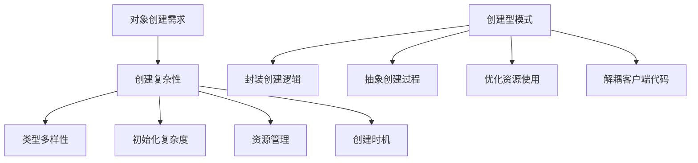
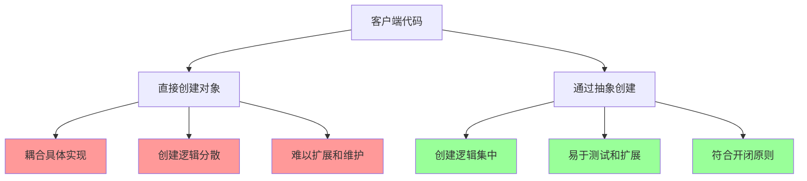
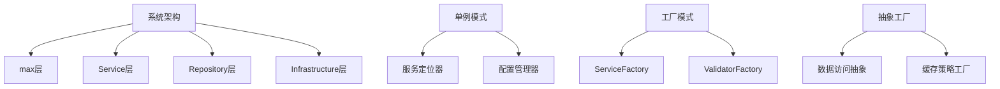
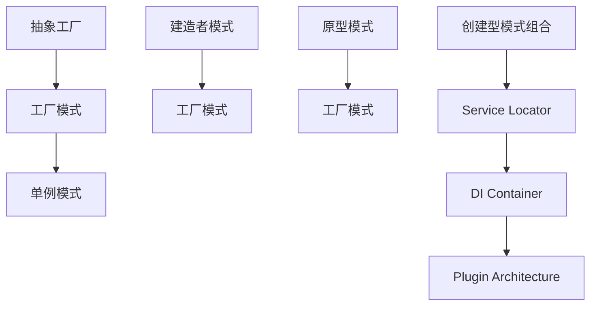

# 创建型模式概述

[[02-设计原则/04-设计原则对比表]] → [[02-工厂模式]]
## 🎯 创建型模式核心概念

### 🤔 核心问题
> **在软件系统中，对象的创建是一个复杂的系统工程，如何有效地管理对象创建过程？**



## 🏗️ 五大创建型模式概览

### 📊 模式特征对比

| 模式名称 | 核心目标 | 适用场景 | 典型例子 | 学习难度 |
|----------|----------|----------|----------|----------|
| **单例模式** | 全局唯一实例 | 配置管理、日志、连接池 | DatabaseManager | ⭐ |
| **工厂模式** | 统一对象创建接口 | 运行时类型决定 | ShapeFactory | ⭐⭐ |
| **抽象工厂** | 创建对象族 | 跨平台UI组件 | UIFactory | ⭐⭐⭐ |
| **建造者** | 分步构建复杂对象 | 复杂对象组装 | QueryBuilder | ⭐⭐⭐ |
| **原型模式** | 对象克隆创建 | 成本高昂的对象复制 | PrototypeRegister | ⭐⭐ |

### 🎯 学习路径规划


**推荐学习顺序**：单例 ➜ 工厂 ➜ 抽象工厂 ➜ 原型 ➜ 建造者

## 🔍 核心设计思想

### 🎯 抽象与封装原则

#### 问题层次分析


### 📚 设计原则体现

#### 创建型模式体现的SOLID原则

| SOLID原则 | 创建型模式体现 | 具体表现 |
|-----------|----------------|----------|
| **SRP** | 专门负责对象创建 | 创建逻辑与其他职责分离 |
| **OCP** | 对扩展开放 | 新增产品类型无需修改现有代码 |
| **DIP** | 依赖抽象创建 | 客户端依赖抽象而非具体类 |
| **ISP** | 接口职责单一 | 创建者只负责创建，不管理生命周期 |

## 🛠️ 实现技术要素

### 🔧 核心技术组件

#### 抽象产品接口
```java
// 创建型模式的通用抽象
interface Product {
    void operation();
}

// 具体产品实现
class ConcreteProduct implements Product {
    public void operation() {
        System.out.println("具体产品操作");
    }
}
```

#### 创建者接口
```java
// 通用的创建者抽象
interface Creator {
    Product create();
}

// 具体创建者实现
class ConcreteCreator implements Creator {
    public Product create() {
        return new ConcreteProduct();
    }
}
```

### 🎨 模式实现技术栈

| 实现层次 | 技术要点 | 注意事项 |
|----------|----------|----------|
| **接口设计** | 抽象产品接口定义 | 接口粒度适中，职责单一 |
| **类型安全** | 泛型约束创建类型 | 编译时类型检查 |
| **线程安全** | 多线程环境下安全性 | 考虑单例的线程安全实现 |
| **资源管理** | 对象生命周期管理 | 及时释放资源，避免内存泄漏 |

## 🎯 应用场景分析

### 🌟 高适用场景

#### 架构设计中的创建型模式


#### 框架开发中的应用
| 框架层次 | 使用模式 | 具体实现 |
|----------|----------|----------|
| **ORM框架** | 工厂模式 | EntityManagerFactory |
| **MVC框架** | 抽象工厂 | ControllerFactory |
| **IoC容器** | 工厂+单例 | BeanFactory |
| **插件系统** | 抽象工厂 | PluginFactory |

### 🎯 实际业务应用

#### 电商系统示例
```java
// 订单系统中的创建型模式应用
class OrderProcessingSystem {
    // 单例：订单处理器
    public static OrderProcessor getInstance() { /* 单例实现 */ }
    
    // 工厂：创建不同支付方式
    public PaymentProcessor createPaymentProcessor(String type) {
        return PaymentProcessorFactory.create(type);
    }
    
    // 建造者：构建复杂订单
    public Order buildOrder(OrderBuilder builder) {
        return builder
            .setCustomer(customer)
            .addItem(item1)
            .addItem(item2)
            .setShipping(shipping)
            .build();
    }
    
    // 原型：克隆常用订单模板
    public Order createFromTemplate(String templateName) {
        Order template = OrderTemplateRegistry.get(templateName);
        return (Order) template.clone();
    }
}
```

## 🔗 模式间关系

### 🤝 协同工作模式



### 📋 组合使用策略

| 组合场景 | 模式组合 | 实现案例 |
|----------|----------|----------|
| **配置系统** | 单例 + 工厂 | ConfigManager + ConfigFactory |
| **数据库访问** | 抽象工厂 + 原型 | DAOFactory + Connection Pool |
| **UI组件库** | 抽象工厂 + 建造者 | WidgetFactory + LayoutBuilder |
| **缓存系统** | 单例 + 工厂 | CacheManager + CacheStrategyFactory |

## 🔍 常见陷阱与解决

### ⚠️ 反模式识别

#### 常见错误模式
```java
// ❌ 违反单一职责：创建者承担过多职责
class BadUserService {
    public User createUser(String name, String email) {
        // 创建用户
        User user = new User(name, email);
        
        // 验证用户
        validateUser(user);
        
        // 保存用户
        userRepository.save(user);
        
        // 发送邮件
        emailService.sendWelcomeEmail(user);
        
        // 记录审计日志
        auditService.log("user.created", user.getId());
        
        return user;
    }
}

// ✅ 职责分离的正确设计
class UserService {
    private UserFactory userFactory;
    private UserValidator validator;
    private UserRepository repository;
    private NotificationService notification;
    private AuditService audit;
    
    public User createUser(String name, String email) {
        User user = userFactory.createUser(name, email);
        validator.validate(user);
        repository.save(user);
        notification.notify(user);
        audit.record("user.created", user.getId());
        return user;
    }
}
```

### 🎯 最佳实践指导

#### 设计决策检查清单
- [ ] **创建职责是否单一**？（SRP）
- [ ] **新增类型是否需要修改现有代码**？（OCP）
- [ ] **客户端是否依赖抽象创建接口**？（DIP）
- [ ] **是否可以简化创建复杂性**？（KISS）
- [ ] **是否避免了不必要的创建重复**？（DRY）

## 🔗 学习关联

### 📚 前置知识
- **设计原则基础** ← [[02-设计原则/01-SOLID原则详解]]
- **面向对象概念** ← [[设计模式概念与价值]]

### 🔄 后续学习
- **具体模式详细** → [[02-工厂模式]]
- **模式对比总结** → [[07-创建型模式对比表]]
- **实际应用案例** → [[08-实际应用]]

### 🎯 实践路径
1. **理论学习**：理解各模式的动机和结构
2. **代码练习**：手写各种模式示例代码  
3. **项目应用**：在真实项目中应用创建型模式
4. **问题解决**：学会识别何时使用哪个模式

---
**💡 学习要点**：创建型模式是设计模式的基础，掌握好这些模式将为后续的结构型和行为型模式学习打下坚实基础。重点是理解"为什么需要抽象创建过程"这个核心问题。
