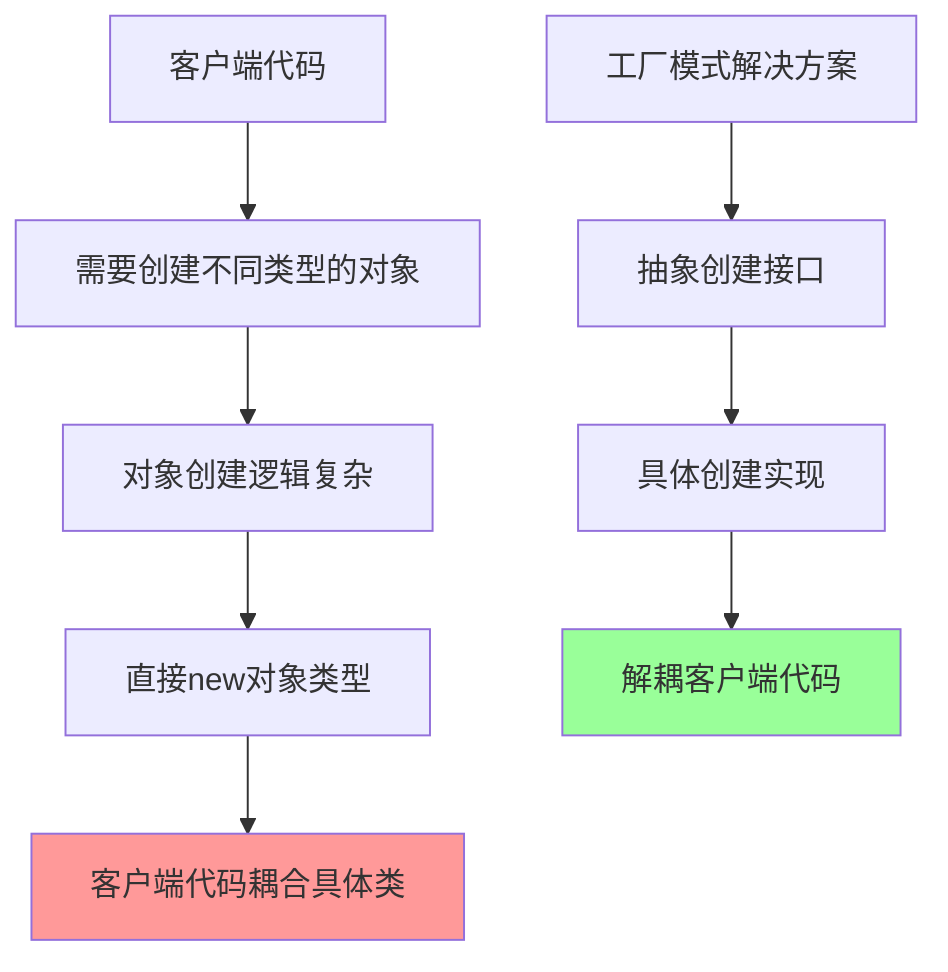
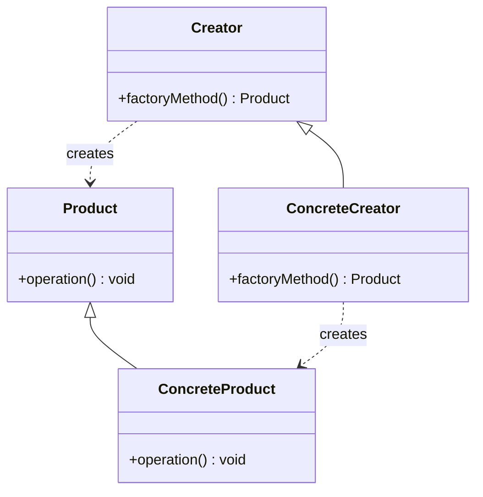
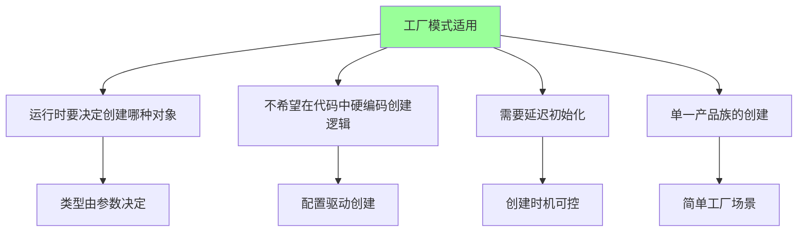
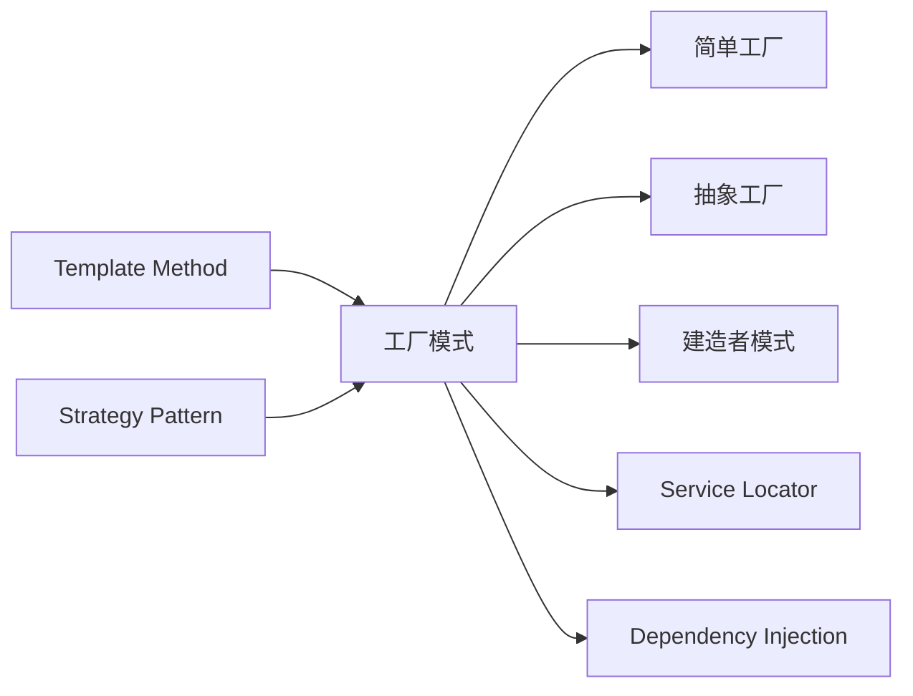

# 工厂模式 Factory Pattern

[[01-创建型模式概述]] → [[03-抽象工厂模式]]

## 🎯 模式定义与意图

### 📖 官方定义
> **定义一个创建对象的接口，让其子类决定实例化哪一个类。工厂模式使一个类的实例化延迟到其子类进行。**

### 🤔 核心问题


## 🏗️ 结构图与参与者

### 📊 UML类图


### 👥 参与者职责

| 参与者 | 职责描述 | 示例角色 |
|--------|----------|----------|
| **Product** | 定义产品的抽象接口 | Shape, PaymentProcessor |
| **ConcreteProduct** | 具体产品的实现类 | Circle, CreditCardProcessor |
| **Creator** | 声明工厂方法接口 | ShapeFactory, PaymentFactory |
| **ConcreteCreator** | 具体工厂的实现 | CircleFactory, CreditCardFactory |

## 💡 实现示例

### 🎯 经典示例：图形绘制系统

```java
// 抽象产品
interface Shape {
    void draw();
    void doubleArea();
}

// 具体产品
class Circle implements Shape {
    private double radius;
    
    Circle(double radius) {
        this.radius = radius;
    }
    
    public void draw() {
        System.out.println("绘制圆形，半径: " + radius);
    }
    
    public void doubleArea() {
        radius *= Math.sqrt(2);
    }
}

class Rectangle implements Shape {
    private double width, height;
    
    Rectangle(double width, double height) {
        this.width = width;
        this.height = height;
    }
    
    public void draw() {
        System.out.println("绘制矩形，长: " + width + ", 宽: " + height);
    }
    
    public void doubleArea() {
        width *= Math.sqrt(2);
        height *= Math.sqrt(2);
    }
}

class Triangle implements Shape {
    private double a, b, c;
    
    Triangle(double a, double b, double c) {
        this.a = a; this.b = b; this.c = c;
    }
    
    public void draw() {
        System.out.println("绘制三角形，边长: " + a + ", " + b + ", " + c);
    }
    
    public void doubleArea() {
        // 三角形面积翻倍的逻辑
        a *= Math.sqrt(2);
        b *= Math.sqrt(2);
        c *= Math.sqrt(2);
    }
}

// 抽象创建者
abstract class ShapeFactory {
    public abstract Shape createShape();
    
    public void drawShape() {
        Shape shape = createShape();
        shape.draw();
    }
}

// 具体创建者
class CircleFactory extends ShapeFactory {
    private double defaultRadius = 1.0;
    
    public CircleFactory(double defaultRadius) {
        this.defaultRadius = defaultRadius;
    }
    
    @Override
    public Shape createShape() {
        return new Circle(defaultRadius);
    }
}

class RectangleFactory extends ShapeFactory {
    private double defaultWidth = 1.0;
    private double defaultHeight = 1.0;
    
    public RectangleFactory(double width, double height) {
        this.defaultWidth = width;
        this.defaultHeight = height;
    }
    
    @Override
    public Shape createShape() {
        return new Rectangle(defaultWidth, defaultHeight);
    }
}

class TriangleFactory extends ShapeFactory {
    private double defaultSideA = 1.0;
    private double defaultSideB = 1.0;
    private double defaultSideC = 1.0;
    
    public TriangleFactory(double a, double b, double c) {
        this.defaultSideA = a;
        this.defaultSideB = b;
        this.defaultSideC = c;
    }
    
    @Override
    public Shape createShape() {
        return new Triangle(defaultSideA, defaultSideB, defaultSideC);
    }
}

// 客户端代码
public class FactoryPatternDemo {
    public static void main(String[] args) {
        ShapeFactory factory1 = new CircleFactory(5.0);
        ShapeFactory factory2 = new RectangleFactory(3.0, 4.0);
        ShapeFactory factory3 = new TriangleFactory(3.0, 4.0, 5.0);
        
        factory1.drawShape(); // 输出: 绘制圆形，半径: 5.0
        factory2.drawShape(); // 输出: 绘制矩形，长: 3.0, 宽: 4.0
        factory3.drawShape(); // 输出: 绘制三角形，边长: 3.0, 4.0, 5.0
    }
}
```

## 🔥 现代实现：参数化工厂方法

### 🎯 企业级应用示例

```java
// 支付处理器工厂
enum PaymentType {
    CREDIT_CARD, DEBIT_CARD, BANK_TRANSFER, E_WALLET, CRYPTOCURRENCY
}

interface PaymentProcessor {
    PaymentResult process(PaymentRequest request);
    boolean supports(PaymentType type);
    String getProviderName();
}

// 具体支付处理器
class CreditCardProcessor implements PaymentProcessor {
    public PaymentResult process(PaymentRequest request) {
        // 信用卡处理逻辑
        return PaymentResult.success("信用卡支付成功");
    }
    
    public boolean supports(PaymentType type) {
        return type == PaymentType.CREDIT_CARD;
    }
    
    public String getProviderName() {
        return "Stripe Credit Card";
    }
}

class EwalletProcessor implements PaymentProcessor {
    public PaymentResult process(PaymentRequest request) {
        // 电子钱包处理逻辑
        return PaymentResult.success("电子钱包支付成功");
    }
    
    public boolean supports(PaymentType type) {
        return type == PaymentType.E_WALLET;
    }
    
    public String getProviderName() {
        return "PayPal";
    }
}

// 参数化工厂类
class PaymentProcessorFactory {
    private static final Map<PaymentType, PaymentProcessor> processors = Map.of(
        PaymentType.CREDIT_CARD, new CreditCardProcessor(),
        PaymentType.E_WALLET, new EwalletProcessor()
        // 可以注册更多处理器
    );
    
    public static PaymentProcessor create(PaymentType type) {
        PaymentProcessor processor = processors.get(type);
        if (processor == null) {
            throw new UnsupportedOperationException("不支持的支付类型: " + type);
        }
        return processor;
    }
    
    public static List<PaymentProcessor> getAllSupported() {
        return new ArrayList<>(processors.values());
    }
    
    public static boolean isSupported(PaymentType type) {
        return processors.containsKey(type);
    }
}

// 使用示例
public class PaymentService {
    public PaymentResult processPayment(PaymentRequest request) {
        PaymentProcessor processor = PaymentProcessorFactory.create(request.getType());
        return processor.process(request);
    }
    
    public List<String> getAvailablePaymentMethods() {
        return PaymentProcessorFactory.getAllSupported()
            .stream()
            .map(PaymentProcessor::getProviderName)
            .collect(Collectors.toList());
    }
}
```

## 🎯 应用场景

### ✅ 适用场景



#### 🌟 典型应用场景

| 应用领域 | 具体场景 | 实现方式 |
|----------|----------|----------|
| **UI框架** | 跨平台控件创建 | WebButtonFactory, MobileButtonFactory |
| **数据库** | 不同数据库会话创建 | MySQLSessionFactory, PostgreSQLSessionFactory |
| **文件处理** | 不同格式解析器创建 | JSONParserFactory, XMLParserFactory |
| **消息系统** | 消息处理器创建 | EmailHandlerFactory, SMSHandlerFactory |
| **日志框架** | 日志记录器创建 | ConsoleLoggerFactory, FileLoggerFactory |

### ❌ 不适用场景

| 情况 | 原因 | 替代方案 |
|------|------|----------|
| **对象创建很简单** | 过于复杂化 | 直接new |
| **需要创建产品族** | 工厂模式不支持产品族 | 抽象工厂模式 |
| **需要控制对象数量** | 工厂无法控制实例数量 | 单例模式 |
| **对象创建需要复杂初始化** | 工厂方法不够灵活 | 建造者模式 |

## 🔧 实现变种

### 🎯 简单工厂模式 (Simple Factory)

```java
// 简单工厂示例
class ShapeSimpleFactory {
    public Shape createShape(String type) {
        switch (type) {
            case "circle": return new Circle(1.0);
            case "rectangle": return new Rectangle(1.0, 1.0);
            case "triangle": return new Triangle(1.0, 1.0, 1.0);
            default: throw new IllegalArgumentException("未知形状类型");
        }
    }
}
```

**对比分析**：
| 特性 | 简单工厂 | 工厂方法 |
|------|----------|----------|
| **复杂性** | 简单 | 复杂 |
| **扩展性** | 差，需修改代码 | 好，新增位置扩展 |
| **职责分离** | 集中 | 分散 |
| **OCP原则** | 违反 | 遵循 |

### 🔄 工厂注册模式

```java
// 注册式工厂
class RegistryBasedFactory {
    private static Map<String, Supplier<?>> registry = new HashMap<>();
    
    static {
        registry.put("circle", Circle::new);
        registry.put("rectangle", () -> new Rectangle(1.0, 1.0));
        registry.put("triangle", () -> new Triangle(1.0, 1.0, 1.0));
    }
    
    public static void register(String type, Supplier<?> creator) {
        registry.put(type, creator);
    }
    
    public static Shape createShape(String type) {
        Supplier<?> creator = registry.get(type);
        if (creator == null) {
            throw new IllegalArgumentException("未注册的类型: " + type);
        }
        return (Shape) creator.get();
    }
}
```

## 💡 优缺点分析

### ✅ 优点

| 优点 | 详细说明 | 价值体现 |
|------|----------|----------|
| **解耦客户端** | 客户端不需要知道具体产品类 | 遵循依赖倒置原则 |
| **支持开闭原则** | 新增产品类型无需修改现有代码 | 易于扩展 |
| **职责分离** | 将创建逻辑从业务逻辑中分离 | 单一职责原则 |
| **代码复用** | 创建逻辑可以在多个地方复用 | DRY原则 |
| **测试友好** | 可以注入Mock工厂 | 提高可测试性 |

### ❌ 缺点

| 缺点 | 详细说明 | 缓解方案 |
|------|----------|----------|
| **增加复杂性** | 引入额外的类层级 | 权衡复杂性与可维护性 |
| **类数量增多** | 每个产品都需要对应的工厂 | 考虑是否值得为此付出成本 |
| **过度抽象** | 简单创建场景可能过度设计 | KISS原则指导 |

## 🔗 与其他模式的关系

### 🤝 模式协同



### 📋 模式比较

| 对比维度 | 工厂模式 | 抽象工厂 | 建造者模式 |
|----------|----------|----------|------------|
| **目标** | 单一产品创建 | 产品族创建 | 复杂对象构建 |
| **复杂度** | 中等 | 高 | 中等 |
| **扩展性** | 好 | 好 | 很好 |
| **使用场景** | 运行时决定类型 | 相关产品组 | 分步构建 |

## 🎯 最佳实践

### 📚 设计指导原则

1. **遵循开闭原则**：新产品类型的添加不应修改现有代码
2. **保持简单**：避免不必要的工厂层次
3. **命名规范**：工厂类命名以"Factory"结尾
4. **错误处理**：提供清晰的异常信息
5. **线程安全**：如果工厂被多线程访问，确保线程安全

### 🛠️ 代码质量检查

- [ ] 工厂接口是否足够抽象？
- [ ] 具体工厂是否只负责创建单一产品？
- [ ] 是否可以轻松添加新的产品类型？
- [ ] 是否遵循了开闭原则？
- [ ] 错误处理是否完善？

## 🔗 学习衔接

- **前置基础** ← [[01-创建型模式概述]]
- **深化学习** → [[03-抽象工厂模式]]  
- **对比总结** → [[07-创建型模式对比表]]
- **实际应用** → [[08-实际应用]]

---
**💡 核心认知**：工厂模式是最实用的创建型模式之一。理解"为什么需要抽象创建过程"比记住具体实现更重要。在实际项目中，要根据复杂性和扩展需求选择合适的花枝变种。
