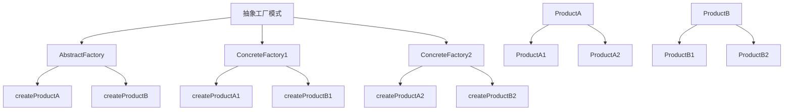

# 🏭 抽象工厂模式

[[03-创建型模式/02-工厂模式]] ← [[03-创建型模式/04-建造者模式]]
## 🎯 抽象工厂模式概览

### 📊 模式结构图



## 🏗️ 模式定义与特点

### 📋 **模式定义**
抽象工厂模式提供一个创建一系列相关或相互依赖对象的接口，而无需指定它们具体的类。

### 📋 **核心特点**
- **产品族**: 创建一系列相关的产品
- **抽象接口**: 定义创建产品的抽象方法
- **具体工厂**: 实现具体产品的创建
- **产品等级**: 同一产品的不同实现

### 📋 **适用场景**
- 系统需要独立于产品的创建、组合和表示
- 系统需要配置多个产品族中的一个
- 需要提供产品类库，只想显示接口而不是实现

## 🏗️ 模式实现

### 📋 **基础实现**

#### **抽象工厂接口**
```java
// ✅ 抽象工厂接口
public interface AbstractFactory {
    ProductA createProductA();
    ProductB createProductB();
}

// ✅ 具体工厂1
public class ConcreteFactory1 implements AbstractFactory {
    @Override
    public ProductA createProductA() {
        return new ConcreteProductA1();
    }
    
    @Override
    public ProductB createProductB() {
        return new ConcreteProductB1();
    }
}

// ✅ 具体工厂2
public class ConcreteFactory2 implements AbstractFactory {
    @Override
    public ProductA createProductA() {
        return new ConcreteProductA2();
    }
    
    @Override
    public ProductB createProductB() {
        return new ConcreteProductB2();
    }
}
```

#### **产品接口和实现**
```java
// ✅ 产品A接口
public interface ProductA {
    void doSomething();
}

// ✅ 产品A1实现
public class ConcreteProductA1 implements ProductA {
    @Override
    public void doSomething() {
        System.out.println("ProductA1 doing something");
    }
}

// ✅ 产品A2实现
public class ConcreteProductA2 implements ProductA {
    @Override
    public void doSomething() {
        System.out.println("ProductA2 doing something");
    }
}

// ✅ 产品B接口
public interface ProductB {
    void doSomething();
}

// ✅ 产品B1实现
public class ConcreteProductB1 implements ProductB {
    @Override
    public void doSomething() {
        System.out.println("ProductB1 doing something");
    }
}

// ✅ 产品B2实现
public class ConcreteProductB2 implements ProductB {
    @Override
    public void doSomething() {
        System.out.println("ProductB2 doing something");
    }
}
```

### 📋 **使用示例**
```java
// ✅ 客户端使用
public class Client {
    public static void main(String[] args) {
        // 使用工厂1创建产品族1
        AbstractFactory factory1 = new ConcreteFactory1();
        ProductA productA1 = factory1.createProductA();
        ProductB productB1 = factory1.createProductB();
        
        productA1.doSomething();
        productB1.doSomething();
        
        // 使用工厂2创建产品族2
        AbstractFactory factory2 = new ConcreteFactory2();
        ProductA productA2 = factory2.createProductA();
        ProductB productB2 = factory2.createProductB();
        
        productA2.doSomething();
        productB2.doSomething();
    }
}
```

## 🏗️ 实际应用案例

### 📋 **UI组件工厂案例**

#### **UI组件抽象工厂**
```java
// ✅ UI组件抽象工厂
public interface UIFactory {
    Button createButton();
    TextField createTextField();
    Window createWindow();
}

// ✅ Windows UI工厂
public class WindowsUIFactory implements UIFactory {
    @Override
    public Button createButton() {
        return new WindowsButton();
    }
    
    @Override
    public TextField createTextField() {
        return new WindowsTextField();
    }
    
    @Override
    public Window createWindow() {
        return new WindowsWindow();
    }
}

// ✅ Mac UI工厂
public class MacUIFactory implements UIFactory {
    @Override
    public Button createButton() {
        return new MacButton();
    }
    
    @Override
    public TextField createTextField() {
        return new MacTextField();
    }
    
    @Override
    public Window createWindow() {
        return new MacWindow();
    }
}
```

#### **UI组件实现**
```java
// ✅ Button接口
public interface Button {
    void render();
    void onClick();
}

// ✅ Windows Button
public class WindowsButton implements Button {
    @Override
    public void render() {
        System.out.println("Rendering Windows button");
    }
    
    @Override
    public void onClick() {
        System.out.println("Windows button clicked");
    }
}

// ✅ Mac Button
public class MacButton implements Button {
    @Override
    public void render() {
        System.out.println("Rendering Mac button");
    }
    
    @Override
    public void onClick() {
        System.out.println("Mac button clicked");
    }
}

// ✅ TextField接口
public interface TextField {
    void render();
    void setText(String text);
    String getText();
}

// ✅ Windows TextField
public class WindowsTextField implements TextField {
    private String text;
    
    @Override
    public void render() {
        System.out.println("Rendering Windows text field");
    }
    
    @Override
    public void setText(String text) {
        this.text = text;
    }
    
    @Override
    public String getText() {
        return text;
    }
}

// ✅ Mac TextField
public class MacTextField implements TextField {
    private String text;
    
    @Override
    public void render() {
        System.out.println("Rendering Mac text field");
    }
    
    @Override
    public void setText(String text) {
        this.text = text;
    }
    
    @Override
    public String getText() {
        return text;
    }
}

// ✅ Window接口
public interface Window {
    void render();
    void setTitle(String title);
}

// ✅ Windows Window
public class WindowsWindow implements Window {
    private String title;
    
    @Override
    public void render() {
        System.out.println("Rendering Windows window: " + title);
    }
    
    @Override
    public void setTitle(String title) {
        this.title = title;
    }
}

// ✅ Mac Window
public class MacWindow implements Window {
    private String title;
    
    @Override
    public void render() {
        System.out.println("Rendering Mac window: " + title);
    }
    
    @Override
    public void setTitle(String title) {
        this.title = title;
    }
}
```

#### **UI应用使用**
```java
// ✅ UI应用
public class UIApplication {
    private UIFactory uiFactory;
    
    public UIApplication(UIFactory uiFactory) {
        this.uiFactory = uiFactory;
    }
    
    public void createUI() {
        // 创建UI组件
        Window window = uiFactory.createWindow();
        Button button = uiFactory.createButton();
        TextField textField = uiFactory.createTextField();
        
        // 设置属性
        window.setTitle("My Application");
        textField.setText("Hello World");
        
        // 渲染UI
        window.render();
        button.render();
        textField.render();
        
        // 处理事件
        button.onClick();
    }
}

// ✅ 使用示例
public class UIDemo {
    public static void main(String[] args) {
        // 创建Windows UI应用
        UIFactory windowsFactory = new WindowsUIFactory();
        UIApplication windowsApp = new UIApplication(windowsFactory);
        windowsApp.createUI();
        
        System.out.println("---");
        
        // 创建Mac UI应用
        UIFactory macFactory = new MacUIFactory();
        UIApplication macApp = new UIApplication(macFactory);
        macApp.createUI();
    }
}
```

### 📋 **数据库访问工厂案例**

#### **数据库访问抽象工厂**
```java
// ✅ 数据库访问抽象工厂
public interface DatabaseFactory {
    Connection createConnection();
    Command createCommand();
    Transaction createTransaction();
}

// ✅ MySQL数据库工厂
public class MySQLFactory implements DatabaseFactory {
    @Override
    public Connection createConnection() {
        return new MySQLConnection();
    }
    
    @Override
    public Command createCommand() {
        return new MySQLCommand();
    }
    
    @Override
    public Transaction createTransaction() {
        return new MySQLTransaction();
    }
}

// ✅ PostgreSQL数据库工厂
public class PostgreSQLFactory implements DatabaseFactory {
    @Override
    public Connection createConnection() {
        return new PostgreSQLConnection();
    }
    
    @Override
    public Command createCommand() {
        return new PostgreSQLCommand();
    }
    
    @Override
    public Transaction createTransaction() {
        return new PostgreSQLTransaction();
    }
}
```

#### **数据库组件实现**
```java
// ✅ Connection接口
public interface Connection {
    void connect();
    void disconnect();
    boolean isConnected();
}

// ✅ MySQL Connection
public class MySQLConnection implements Connection {
    private boolean connected = false;
    
    @Override
    public void connect() {
        System.out.println("Connecting to MySQL database");
        connected = true;
    }
    
    @Override
    public void disconnect() {
        System.out.println("Disconnecting from MySQL database");
        connected = false;
    }
    
    @Override
    public boolean isConnected() {
        return connected;
    }
}

// ✅ PostgreSQL Connection
public class PostgreSQLConnection implements Connection {
    private boolean connected = false;
    
    @Override
    public void connect() {
        System.out.println("Connecting to PostgreSQL database");
        connected = true;
    }
    
    @Override
    public void disconnect() {
        System.out.println("Disconnecting from PostgreSQL database");
        connected = false;
    }
    
    @Override
    public boolean isConnected() {
        return connected;
    }
}

// ✅ Command接口
public interface Command {
    void execute(String sql);
    ResultSet query(String sql);
}

// ✅ MySQL Command
public class MySQLCommand implements Command {
    @Override
    public void execute(String sql) {
        System.out.println("Executing MySQL command: " + sql);
    }
    
    @Override
    public ResultSet query(String sql) {
        System.out.println("Querying MySQL: " + sql);
        return new MySQLResultSet();
    }
}

// ✅ PostgreSQL Command
public class PostgreSQLCommand implements Command {
    @Override
    public void execute(String sql) {
        System.out.println("Executing PostgreSQL command: " + sql);
    }
    
    @Override
    public ResultSet query(String sql) {
        System.out.println("Querying PostgreSQL: " + sql);
        return new PostgreSQLResultSet();
    }
}

// ✅ Transaction接口
public interface Transaction {
    void begin();
    void commit();
    void rollback();
}

// ✅ MySQL Transaction
public class MySQLTransaction implements Transaction {
    @Override
    public void begin() {
        System.out.println("Beginning MySQL transaction");
    }
    
    @Override
    public void commit() {
        System.out.println("Committing MySQL transaction");
    }
    
    @Override
    public void rollback() {
        System.out.println("Rolling back MySQL transaction");
    }
}

// ✅ PostgreSQL Transaction
public class PostgreSQLTransaction implements Transaction {
    @Override
    public void begin() {
        System.out.println("Beginning PostgreSQL transaction");
    }
    
    @Override
    public void commit() {
        System.out.println("Committing PostgreSQL transaction");
    }
    
    @Override
    public void rollback() {
        System.out.println("Rolling back PostgreSQL transaction");
    }
}
```

## 🎯 模式优势与劣势

### 📋 **优势**
- **产品族一致性**: 确保产品族内产品的一致性
- **易于扩展**: 添加新的产品族很容易
- **符合开闭原则**: 对扩展开放，对修改关闭
- **解耦**: 客户端与具体产品类解耦

### 📋 **劣势**
- **复杂度增加**: 增加了系统的复杂度
- **难以扩展产品**: 添加新产品需要修改抽象工厂
- **类数量增加**: 需要创建大量的类

### 📋 **与工厂方法模式的区别**
| 方面 | 工厂方法模式 | 抽象工厂模式 |
|------|-------------|-------------|
| **产品数量** | 单一产品 | 产品族 |
| **工厂职责** | 创建单一产品 | 创建产品族 |
| **扩展性** | 易于添加新产品 | 易于添加产品族 |
| **复杂度** | 相对简单 | 相对复杂 |

## 🔗 学习衔接

- **上一文档** ← [[工厂模式]]
- **下一文档** → [[建造者模式]]
- **模式基础** → [[01-基础认知]]

---
**💡 抽象工厂精髓**: 抽象工厂模式就像是一个"产品族工厂"，它能够创建一系列相关的产品，确保这些产品能够协同工作。当我们需要创建多个相关的产品时，抽象工厂模式是最佳选择！
