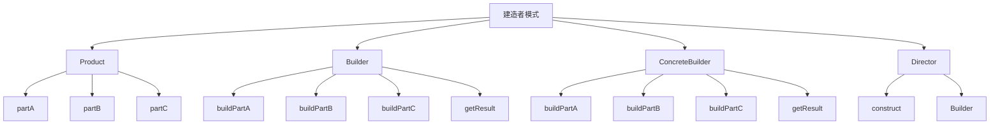

# 🔨 建造者模式

[[03-创建型模式/03-抽象工厂模式]] ← [[03-创建型模式/05-原型模式]]
## 🎯 建造者模式概览

### 📊 模式结构图



## 🏗️ 模式定义与特点

### 📋 **模式定义**
建造者模式将一个复杂对象的构建与它的表示分离，使得同样的构建过程可以创建不同的表示。

### 📋 **核心特点**
- **分步构建**: 分步骤构建复杂对象
- **构建过程**: 统一的构建过程
- **不同表示**: 可以创建不同的表示
- **链式调用**: 支持链式调用

### 📋 **适用场景**
- 需要创建的对象有复杂的内部结构
- 需要创建的对象内部属性相互依赖
- 需要创建的对象有多个表示形式
- 需要分步骤构建对象

## 🏗️ 模式实现

### 📋 **基础实现**

#### **产品类**
```java
// ✅ 产品类
public class Product {
    private String partA;
    private String partB;
    private String partC;
    
    public Product() {}
    
    public void setPartA(String partA) {
        this.partA = partA;
    }
    
    public void setPartB(String partB) {
        this.partB = partB;
    }
    
    public void setPartC(String partC) {
        this.partC = partC;
    }
    
    @Override
    public String toString() {
        return "Product{" +
                "partA='" + partA + '\'' +
                ", partB='" + partB + '\'' +
                ", partC='" + partC + '\'' +
                '}';
    }
}
```

#### **抽象建造者**
```java
// ✅ 抽象建造者
public abstract class Builder {
    protected Product product = new Product();
    
    public abstract void buildPartA();
    public abstract void buildPartB();
    public abstract void buildPartC();
    
    public Product getResult() {
        return product;
    }
}
```

#### **具体建造者**
```java
// ✅ 具体建造者1
public class ConcreteBuilder1 extends Builder {
    @Override
    public void buildPartA() {
        product.setPartA("PartA1");
    }
    
    @Override
    public void buildPartB() {
        product.setPartB("PartB1");
    }
    
    @Override
    public void buildPartC() {
        product.setPartC("PartC1");
    }
}

// ✅ 具体建造者2
public class ConcreteBuilder2 extends Builder {
    @Override
    public void buildPartA() {
        product.setPartA("PartA2");
    }
    
    @Override
    public void buildPartB() {
        product.setPartB("PartB2");
    }
    
    @Override
    public void buildPartC() {
        product.setPartC("PartC2");
    }
}
```

#### **指挥者**
```java
// ✅ 指挥者
public class Director {
    private Builder builder;
    
    public Director(Builder builder) {
        this.builder = builder;
    }
    
    public Product construct() {
        builder.buildPartA();
        builder.buildPartB();
        builder.buildPartC();
        return builder.getResult();
    }
}
```

#### **使用示例**
```java
// ✅ 客户端使用
public class Client {
    public static void main(String[] args) {
        // 使用建造者1
        Builder builder1 = new ConcreteBuilder1();
        Director director1 = new Director(builder1);
        Product product1 = director1.construct();
        System.out.println("Product 1: " + product1);
        
        // 使用建造者2
        Builder builder2 = new ConcreteBuilder2();
        Director director2 = new Director(builder2);
        Product product2 = director2.construct();
        System.out.println("Product 2: " + product2);
    }
}
```

## 🏗️ 现代实现方式

### 📋 **链式调用建造者**

#### **链式建造者实现**
```java
// ✅ 链式建造者
public class ChainBuilder {
    private String partA;
    private String partB;
    private String partC;
    
    public ChainBuilder setPartA(String partA) {
        this.partA = partA;
        return this;
    }
    
    public ChainBuilder setPartB(String partB) {
        this.partB = partB;
        return this;
    }
    
    public ChainBuilder setPartC(String partC) {
        this.partC = partC;
        return this;
    }
    
    public Product build() {
        Product product = new Product();
        product.setPartA(partA);
        product.setPartB(partB);
        product.setPartC(partC);
        return product;
    }
}

// ✅ 使用示例
public class ChainBuilderDemo {
    public static void main(String[] args) {
        Product product = new ChainBuilder()
                .setPartA("PartA")
                .setPartB("PartB")
                .setPartC("PartC")
                .build();
        
        System.out.println("Chain Builder Product: " + product);
    }
}
```

### 📋 **静态内部类建造者**

#### **静态内部类实现**
```java
// ✅ 静态内部类建造者
public class StaticInnerBuilder {
    private String partA;
    private String partB;
    private String partC;
    
    private StaticInnerBuilder(Builder builder) {
        this.partA = builder.partA;
        this.partB = builder.partB;
        this.partC = builder.partC;
    }
    
    public static class Builder {
        private String partA;
        private String partB;
        private String partC;
        
        public Builder setPartA(String partA) {
            this.partA = partA;
            return this;
        }
        
        public Builder setPartB(String partB) {
            this.partB = partB;
            return this;
        }
        
        public Builder setPartC(String partC) {
            this.partC = partC;
            return this;
        }
        
        public StaticInnerBuilder build() {
            return new StaticInnerBuilder(this);
        }
    }
    
    @Override
    public String toString() {
        return "StaticInnerBuilder{" +
                "partA='" + partA + '\'' +
                ", partB='" + partB + '\'' +
                ", partC='" + partC + '\'' +
                '}';
    }
}

// ✅ 使用示例
public class StaticInnerBuilderDemo {
    public static void main(String[] args) {
        StaticInnerBuilder product = new StaticInnerBuilder.Builder()
                .setPartA("PartA")
                .setPartB("PartB")
                .setPartC("PartC")
                .build();
        
        System.out.println("Static Inner Builder Product: " + product);
    }
}
```

## 🏗️ 实际应用案例

### 📋 **SQL查询建造者案例**

#### **SQL查询建造者**
```java
// ✅ SQL查询建造者
public class SQLQueryBuilder {
    private StringBuilder query;
    private List<String> conditions;
    private List<String> orderBy;
    private Integer limit;
    private Integer offset;
    
    public SQLQueryBuilder() {
        this.query = new StringBuilder();
        this.conditions = new ArrayList<>();
        this.orderBy = new ArrayList<>();
    }
    
    public SQLQueryBuilder select(String... columns) {
        query.append("SELECT ");
        if (columns.length == 0) {
            query.append("*");
        } else {
            query.append(String.join(", ", columns));
        }
        return this;
    }
    
    public SQLQueryBuilder from(String table) {
        query.append(" FROM ").append(table);
        return this;
    }
    
    public SQLQueryBuilder where(String condition) {
        conditions.add(condition);
        return this;
    }
    
    public SQLQueryBuilder and(String condition) {
        conditions.add("AND " + condition);
        return this;
    }
    
    public SQLQueryBuilder or(String condition) {
        conditions.add("OR " + condition);
        return this;
    }
    
    public SQLQueryBuilder orderBy(String column) {
        orderBy.add(column);
        return this;
    }
    
    public SQLQueryBuilder orderByDesc(String column) {
        orderBy.add(column + " DESC");
        return this;
    }
    
    public SQLQueryBuilder limit(int limit) {
        this.limit = limit;
        return this;
    }
    
    public SQLQueryBuilder offset(int offset) {
        this.offset = offset;
        return this;
    }
    
    public String build() {
        // 添加WHERE条件
        if (!conditions.isEmpty()) {
            query.append(" WHERE ");
            query.append(String.join(" ", conditions));
        }
        
        // 添加ORDER BY
        if (!orderBy.isEmpty()) {
            query.append(" ORDER BY ");
            query.append(String.join(", ", orderBy));
        }
        
        // 添加LIMIT
        if (limit != null) {
            query.append(" LIMIT ").append(limit);
        }
        
        // 添加OFFSET
        if (offset != null) {
            query.append(" OFFSET ").append(offset);
        }
        
        return query.toString();
    }
}

// ✅ 使用示例
public class SQLQueryBuilderDemo {
    public static void main(String[] args) {
        String query = new SQLQueryBuilder()
                .select("id", "name", "email")
                .from("users")
                .where("age > 18")
                .and("status = 'active'")
                .orderBy("name")
                .limit(10)
                .offset(0)
                .build();
        
        System.out.println("SQL Query: " + query);
    }
}
```

### 📋 **HTTP请求建造者案例**

#### **HTTP请求建造者**
```java
// ✅ HTTP请求建造者
public class HttpRequestBuilder {
    private String method;
    private String url;
    private Map<String, String> headers;
    private Map<String, String> parameters;
    private String body;
    
    public HttpRequestBuilder() {
        this.headers = new HashMap<>();
        this.parameters = new HashMap<>();
    }
    
    public HttpRequestBuilder get(String url) {
        this.method = "GET";
        this.url = url;
        return this;
    }
    
    public HttpRequestBuilder post(String url) {
        this.method = "POST";
        this.url = url;
        return this;
    }
    
    public HttpRequestBuilder put(String url) {
        this.method = "PUT";
        this.url = url;
        return this;
    }
    
    public HttpRequestBuilder delete(String url) {
        this.method = "DELETE";
        this.url = url;
        return this;
    }
    
    public HttpRequestBuilder header(String key, String value) {
        this.headers.put(key, value);
        return this;
    }
    
    public HttpRequestBuilder parameter(String key, String value) {
        this.parameters.put(key, value);
        return this;
    }
    
    public HttpRequestBuilder body(String body) {
        this.body = body;
        return this;
    }
    
    public HttpRequest build() {
        return new HttpRequest(method, url, headers, parameters, body);
    }
}

// ✅ HTTP请求类
public class HttpRequest {
    private String method;
    private String url;
    private Map<String, String> headers;
    private Map<String, String> parameters;
    private String body;
    
    public HttpRequest(String method, String url, Map<String, String> headers, 
                      Map<String, String> parameters, String body) {
        this.method = method;
        this.url = url;
        this.headers = headers;
        this.parameters = parameters;
        this.body = body;
    }
    
    @Override
    public String toString() {
        return "HttpRequest{" +
                "method='" + method + '\'' +
                ", url='" + url + '\'' +
                ", headers=" + headers +
                ", parameters=" + parameters +
                ", body='" + body + '\'' +
                '}';
    }
}

// ✅ 使用示例
public class HttpRequestBuilderDemo {
    public static void main(String[] args) {
        HttpRequest request = new HttpRequestBuilder()
                .post("https://api.example.com/users")
                .header("Content-Type", "application/json")
                .header("Authorization", "Bearer token123")
                .parameter("page", "1")
                .parameter("size", "10")
                .body("{\"name\":\"John\",\"email\":\"john@example.com\"}")
                .build();
        
        System.out.println("HTTP Request: " + request);
    }
}
```

### 📋 **配置对象建造者案例**

#### **配置对象建造者**
```java
// ✅ 配置对象建造者
public class ConfigBuilder {
    private String databaseUrl;
    private String databaseUsername;
    private String databasePassword;
    private String redisUrl;
    private String redisPassword;
    private String logLevel;
    private String logFile;
    private boolean enableCache;
    private int cacheSize;
    private int threadPoolSize;
    
    public ConfigBuilder setDatabaseUrl(String databaseUrl) {
        this.databaseUrl = databaseUrl;
        return this;
    }
    
    public ConfigBuilder setDatabaseUsername(String databaseUsername) {
        this.databaseUsername = databaseUsername;
        return this;
    }
    
    public ConfigBuilder setDatabasePassword(String databasePassword) {
        this.databasePassword = databasePassword;
        return this;
    }
    
    public ConfigBuilder setRedisUrl(String redisUrl) {
        this.redisUrl = redisUrl;
        return this;
    }
    
    public ConfigBuilder setRedisPassword(String redisPassword) {
        this.redisPassword = redisPassword;
        return this;
    }
    
    public ConfigBuilder setLogLevel(String logLevel) {
        this.logLevel = logLevel;
        return this;
    }
    
    public ConfigBuilder setLogFile(String logFile) {
        this.logFile = logFile;
        return this;
    }
    
    public ConfigBuilder setEnableCache(boolean enableCache) {
        this.enableCache = enableCache;
        return this;
    }
    
    public ConfigBuilder setCacheSize(int cacheSize) {
        this.cacheSize = cacheSize;
        return this;
    }
    
    public ConfigBuilder setThreadPoolSize(int threadPoolSize) {
        this.threadPoolSize = threadPoolSize;
        return this;
    }
    
    public Config build() {
        return new Config(databaseUrl, databaseUsername, databasePassword,
                         redisUrl, redisPassword, logLevel, logFile,
                         enableCache, cacheSize, threadPoolSize);
    }
}

// ✅ 配置类
public class Config {
    private String databaseUrl;
    private String databaseUsername;
    private String databasePassword;
    private String redisUrl;
    private String redisPassword;
    private String logLevel;
    private String logFile;
    private boolean enableCache;
    private int cacheSize;
    private int threadPoolSize;
    
    public Config(String databaseUrl, String databaseUsername, String databasePassword,
                  String redisUrl, String redisPassword, String logLevel, String logFile,
                  boolean enableCache, int cacheSize, int threadPoolSize) {
        this.databaseUrl = databaseUrl;
        this.databaseUsername = databaseUsername;
        this.databasePassword = databasePassword;
        this.redisUrl = redisUrl;
        this.redisPassword = redisPassword;
        this.logLevel = logLevel;
        this.logFile = logFile;
        this.enableCache = enableCache;
        this.cacheSize = cacheSize;
        this.threadPoolSize = threadPoolSize;
    }
    
    @Override
    public String toString() {
        return "Config{" +
                "databaseUrl='" + databaseUrl + '\'' +
                ", databaseUsername='" + databaseUsername + '\'' +
                ", redisUrl='" + redisUrl + '\'' +
                ", logLevel='" + logLevel + '\'' +
                ", enableCache=" + enableCache +
                ", cacheSize=" + cacheSize +
                ", threadPoolSize=" + threadPoolSize +
                '}';
    }
}

// ✅ 使用示例
public class ConfigBuilderDemo {
    public static void main(String[] args) {
        Config config = new ConfigBuilder()
                .setDatabaseUrl("jdbc:mysql://localhost:3306/test")
                .setDatabaseUsername("root")
                .setDatabasePassword("password")
                .setRedisUrl("redis://localhost:6379")
                .setLogLevel("INFO")
                .setLogFile("app.log")
                .setEnableCache(true)
                .setCacheSize(1000)
                .setThreadPoolSize(10)
                .build();
        
        System.out.println("Config: " + config);
    }
}
```

## 🎯 模式优势与劣势

### 📋 **优势**
- **分步构建**: 可以分步骤构建复杂对象
- **链式调用**: 支持链式调用，代码更简洁
- **参数灵活**: 可以灵活设置参数
- **可读性好**: 代码可读性好，易于理解

### 📋 **劣势**
- **代码量增加**: 需要创建建造者类
- **复杂度增加**: 增加了系统的复杂度
- **内存开销**: 需要额外的内存开销

### 📋 **与工厂模式的区别**
| 方面 | 工厂模式 | 建造者模式 |
|------|----------|----------|
| **构建过程** | 一步构建 | 分步构建 |
| **参数数量** | 参数较少 | 参数较多 |
| **构建复杂度** | 相对简单 | 相对复杂 |
| **使用场景** | 简单对象创建 | 复杂对象构建 |

## 🔗 学习衔接

- **上一文档** ← [[抽象工厂模式]]
- **下一文档** → [[原型模式]]
- **模式基础** → [[01-基础认知]]

---
**💡 建造者精髓**: 建造者模式就像搭积木，可以一步一步地构建复杂的对象。当我们需要创建参数很多、构建过程复杂的对象时，建造者模式是最佳选择！
