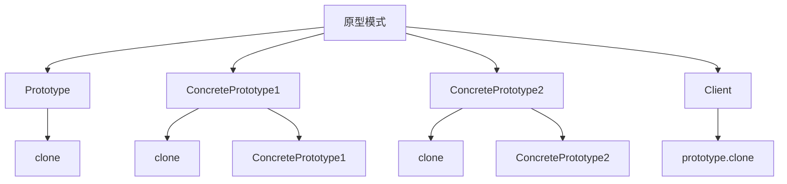

# 🧬 原型模式

[[03-创建型模式/04-建造者模式]] ← [[03-创建型模式/06-创建型模式对比表]]
## 🎯 原型模式概览

### 📊 模式结构图



## 🏗️ 模式定义与特点

### 📋 **模式定义**
原型模式用原型实例指定创建对象的种类，并且通过拷贝这些原型创建新的对象。

### 📋 **核心特点**
- **克隆创建**: 通过克隆创建新对象
- **原型实例**: 使用原型实例指定对象种类
- **深拷贝**: 支持深拷贝和浅拷贝
- **性能优化**: 避免重复创建复杂对象

### 📋 **适用场景**
- 需要创建的对象成本很高
- 需要大量相似对象
- 需要动态创建对象
- 需要避免使用new关键字

## 🏗️ 模式实现

### 📋 **基础实现**

#### **原型接口**
```java
// ✅ 原型接口
public interface Prototype {
    Prototype clone();
}

// ✅ 具体原型1
public class ConcretePrototype1 implements Prototype {
    private String name;
    private int value;
    
    public ConcretePrototype1(String name, int value) {
        this.name = name;
        this.value = value;
    }
    
    @Override
    public Prototype clone() {
        return new ConcretePrototype1(this.name, this.value);
    }
    
    @Override
    public String toString() {
        return "ConcretePrototype1{" +
                "name='" + name + '\'' +
                ", value=" + value +
                '}';
    }
}

// ✅ 具体原型2
public class ConcretePrototype2 implements Prototype {
    private String type;
    private List<String> items;
    
    public ConcretePrototype2(String type, List<String> items) {
        this.type = type;
        this.items = new ArrayList<>(items);
    }
    
    @Override
    public Prototype clone() {
        return new ConcretePrototype2(this.type, this.items);
    }
    
    @Override
    public String toString() {
        return "ConcretePrototype2{" +
                "type='" + type + '\'' +
                ", items=" + items +
                '}';
    }
}
```

#### **使用示例**
```java
// ✅ 客户端使用
public class Client {
    public static void main(String[] args) {
        // 创建原型
        ConcretePrototype1 prototype1 = new ConcretePrototype1("Prototype1", 100);
        ConcretePrototype2 prototype2 = new ConcretePrototype2("Prototype2", 
                Arrays.asList("item1", "item2", "item3"));
        
        // 克隆原型
        ConcretePrototype1 clone1 = (ConcretePrototype1) prototype1.clone();
        ConcretePrototype2 clone2 = (ConcretePrototype2) prototype2.clone();
        
        System.out.println("Original 1: " + prototype1);
        System.out.println("Clone 1: " + clone1);
        System.out.println("Original 2: " + prototype2);
        System.out.println("Clone 2: " + clone2);
    }
}
```

## 🏗️ Java Cloneable实现

### 📋 **Cloneable接口实现**

#### **浅拷贝实现**
```java
// ✅ 浅拷贝实现
public class ShallowCopyPrototype implements Cloneable {
    private String name;
    private int value;
    private List<String> items;
    
    public ShallowCopyPrototype(String name, int value, List<String> items) {
        this.name = name;
        this.value = value;
        this.items = items;
    }
    
    @Override
    public Object clone() throws CloneNotSupportedException {
        return super.clone();
    }
    
    public String getName() { return name; }
    public void setName(String name) { this.name = name; }
    public int getValue() { return value; }
    public void setValue(int value) { this.value = value; }
    public List<String> getItems() { return items; }
    public void setItems(List<String> items) { this.items = items; }
    
    @Override
    public String toString() {
        return "ShallowCopyPrototype{" +
                "name='" + name + '\'' +
                ", value=" + value +
                ", items=" + items +
                '}';
    }
}
```

#### **深拷贝实现**
```java
// ✅ 深拷贝实现
public class DeepCopyPrototype implements Cloneable {
    private String name;
    private int value;
    private List<String> items;
    
    public DeepCopyPrototype(String name, int value, List<String> items) {
        this.name = name;
        this.value = value;
        this.items = new ArrayList<>(items);
    }
    
    @Override
    public Object clone() throws CloneNotSupportedException {
        DeepCopyPrototype clone = (DeepCopyPrototype) super.clone();
        clone.items = new ArrayList<>(this.items);
        return clone;
    }
    
    public String getName() { return name; }
    public void setName(String name) { this.name = name; }
    public int getValue() { return value; }
    public void setValue(int value) { this.value = value; }
    public List<String> getItems() { return items; }
    public void setItems(List<String> items) { this.items = items; }
    
    @Override
    public String toString() {
        return "DeepCopyPrototype{" +
                "name='" + name + '\'' +
                ", value=" + value +
                ", items=" + items +
                '}';
    }
}
```

#### **拷贝测试**
```java
// ✅ 拷贝测试
public class CloneTest {
    public static void main(String[] args) throws CloneNotSupportedException {
        // 测试浅拷贝
        List<String> originalItems = Arrays.asList("item1", "item2", "item3");
        ShallowCopyPrototype shallowOriginal = new ShallowCopyPrototype("Shallow", 100, originalItems);
        ShallowCopyPrototype shallowClone = (ShallowCopyPrototype) shallowOriginal.clone();
        
        System.out.println("=== 浅拷贝测试 ===");
        System.out.println("Original: " + shallowOriginal);
        System.out.println("Clone: " + shallowClone);
        
        // 修改原始对象的引用类型
        shallowOriginal.getItems().add("item4");
        System.out.println("After modifying original:");
        System.out.println("Original: " + shallowOriginal);
        System.out.println("Clone: " + shallowClone);
        
        System.out.println();
        
        // 测试深拷贝
        List<String> deepOriginalItems = Arrays.asList("item1", "item2", "item3");
        DeepCopyPrototype deepOriginal = new DeepCopyPrototype("Deep", 200, deepOriginalItems);
        DeepCopyPrototype deepClone = (DeepCopyPrototype) deepOriginal.clone();
        
        System.out.println("=== 深拷贝测试 ===");
        System.out.println("Original: " + deepOriginal);
        System.out.println("Clone: " + deepClone);
        
        // 修改原始对象的引用类型
        deepOriginal.getItems().add("item4");
        System.out.println("After modifying original:");
        System.out.println("Original: " + deepOriginal);
        System.out.println("Clone: " + deepClone);
    }
}
```

## 🏗️ 实际应用案例

### 📋 **文档模板原型案例**

#### **文档模板原型**
```java
// ✅ 文档模板原型
public class DocumentTemplate implements Cloneable {
    private String title;
    private String content;
    private String author;
    private Date createDate;
    private List<String> tags;
    private Map<String, String> metadata;
    
    public DocumentTemplate(String title, String content, String author) {
        this.title = title;
        this.content = content;
        this.author = author;
        this.createDate = new Date();
        this.tags = new ArrayList<>();
        this.metadata = new HashMap<>();
    }
    
    @Override
    public Object clone() throws CloneNotSupportedException {
        DocumentTemplate clone = (DocumentTemplate) super.clone();
        clone.tags = new ArrayList<>(this.tags);
        clone.metadata = new HashMap<>(this.metadata);
        clone.createDate = new Date();
        return clone;
    }
    
    public void addTag(String tag) {
        tags.add(tag);
    }
    
    public void addMetadata(String key, String value) {
        metadata.put(key, value);
    }
    
    public void setTitle(String title) {
        this.title = title;
    }
    
    public void setContent(String content) {
        this.content = content;
    }
    
    public void setAuthor(String author) {
        this.author = author;
    }
    
    @Override
    public String toString() {
        return "DocumentTemplate{" +
                "title='" + title + '\'' +
                ", content='" + content + '\'' +
                ", author='" + author + '\'' +
                ", createDate=" + createDate +
                ", tags=" + tags +
                ", metadata=" + metadata +
                '}';
    }
}

// ✅ 文档管理器
public class DocumentManager {
    private Map<String, DocumentTemplate> templates;
    
    public DocumentManager() {
        this.templates = new HashMap<>();
        initializeTemplates();
    }
    
    private void initializeTemplates() {
        // 创建报告模板
        DocumentTemplate reportTemplate = new DocumentTemplate(
                "Report Template", 
                "This is a report template.", 
                "System"
        );
        reportTemplate.addTag("report");
        reportTemplate.addTag("template");
        reportTemplate.addMetadata("type", "report");
        reportTemplate.addMetadata("version", "1.0");
        templates.put("report", reportTemplate);
        
        // 创建邮件模板
        DocumentTemplate emailTemplate = new DocumentTemplate(
                "Email Template", 
                "This is an email template.", 
                "System"
        );
        emailTemplate.addTag("email");
        emailTemplate.addTag("template");
        emailTemplate.addMetadata("type", "email");
        emailTemplate.addMetadata("version", "1.0");
        templates.put("email", emailTemplate);
    }
    
    public DocumentTemplate createDocument(String templateName, String title, String content, String author) 
            throws CloneNotSupportedException {
        DocumentTemplate template = templates.get(templateName);
        if (template == null) {
            throw new IllegalArgumentException("Template not found: " + templateName);
        }
        
        DocumentTemplate document = (DocumentTemplate) template.clone();
        document.setTitle(title);
        document.setContent(content);
        document.setAuthor(author);
        return document;
    }
}

// ✅ 使用示例
public class DocumentManagerDemo {
    public static void main(String[] args) throws CloneNotSupportedException {
        DocumentManager manager = new DocumentManager();
        
        // 创建报告文档
        DocumentTemplate report1 = manager.createDocument(
                "report", 
                "Monthly Report", 
                "This is the monthly report content.", 
                "John Doe"
        );
        System.out.println("Report 1: " + report1);
        
        // 创建邮件文档
        DocumentTemplate email1 = manager.createDocument(
                "email", 
                "Welcome Email", 
                "Welcome to our service!", 
                "Jane Smith"
        );
        System.out.println("Email 1: " + email1);
    }
}
```

### 📋 **游戏对象原型案例**

#### **游戏对象原型**
```java
// ✅ 游戏对象原型
public class GameObject implements Cloneable {
    private String name;
    private String type;
    private int health;
    private int attack;
    private int defense;
    private List<String> skills;
    private Map<String, Object> properties;
    
    public GameObject(String name, String type, int health, int attack, int defense) {
        this.name = name;
        this.type = type;
        this.health = health;
        this.attack = attack;
        this.defense = defense;
        this.skills = new ArrayList<>();
        this.properties = new HashMap<>();
    }
    
    @Override
    public Object clone() throws CloneNotSupportedException {
        GameObject clone = (GameObject) super.clone();
        clone.skills = new ArrayList<>(this.skills);
        clone.properties = new HashMap<>(this.properties);
        return clone;
    }
    
    public void addSkill(String skill) {
        skills.add(skill);
    }
    
    public void setProperty(String key, Object value) {
        properties.put(key, value);
    }
    
    public void setName(String name) {
        this.name = name;
    }
    
    public void setHealth(int health) {
        this.health = health;
    }
    
    public void setAttack(int attack) {
        this.attack = attack;
    }
    
    public void setDefense(int defense) {
        this.defense = defense;
    }
    
    @Override
    public String toString() {
        return "GameObject{" +
                "name='" + name + '\'' +
                ", type='" + type + '\'' +
                ", health=" + health +
                ", attack=" + attack +
                ", defense=" + defense +
                ", skills=" + skills +
                ", properties=" + properties +
                '}';
    }
}

// ✅ 游戏对象工厂
public class GameObjectFactory {
    private Map<String, GameObject> prototypes;
    
    public GameObjectFactory() {
        this.prototypes = new HashMap<>();
        initializePrototypes();
    }
    
    private void initializePrototypes() {
        // 创建战士原型
        GameObject warrior = new GameObject("Warrior", "Fighter", 100, 20, 15);
        warrior.addSkill("Sword Attack");
        warrior.addSkill("Shield Defense");
        warrior.setProperty("weapon", "Sword");
        warrior.setProperty("armor", "Chain Mail");
        prototypes.put("warrior", warrior);
        
        // 创建法师原型
        GameObject mage = new GameObject("Mage", "Caster", 80, 25, 10);
        mage.addSkill("Fireball");
        mage.addSkill("Heal");
        mage.setProperty("weapon", "Staff");
        mage.setProperty("armor", "Robe");
        prototypes.put("mage", mage);
        
        // 创建盗贼原型
        GameObject rogue = new GameObject("Rogue", "Stealth", 90, 18, 12);
        rogue.addSkill("Stealth");
        rogue.addSkill("Backstab");
        rogue.setProperty("weapon", "Dagger");
        rogue.setProperty("armor", "Leather");
        prototypes.put("rogue", rogue);
    }
    
    public GameObject createGameObject(String type, String name) throws CloneNotSupportedException {
        GameObject prototype = prototypes.get(type);
        if (prototype == null) {
            throw new IllegalArgumentException("Prototype not found: " + type);
        }
        
        GameObject gameObject = (GameObject) prototype.clone();
        gameObject.setName(name);
        return gameObject;
    }
}

// ✅ 使用示例
public class GameObjectFactoryDemo {
    public static void main(String[] args) throws CloneNotSupportedException {
        GameObjectFactory factory = new GameObjectFactory();
        
        // 创建战士
        GameObject warrior1 = factory.createGameObject("warrior", "Conan");
        GameObject warrior2 = factory.createGameObject("warrior", "Aragorn");
        
        // 创建法师
        GameObject mage1 = factory.createGameObject("mage", "Gandalf");
        GameObject mage2 = factory.createGameObject("mage", "Merlin");
        
        // 创建盗贼
        GameObject rogue1 = factory.createGameObject("rogue", "Legolas");
        GameObject rogue2 = factory.createGameObject("rogue", "Thief");
        
        System.out.println("Warrior 1: " + warrior1);
        System.out.println("Warrior 2: " + warrior2);
        System.out.println("Mage 1: " + mage1);
        System.out.println("Mage 2: " + mage2);
        System.out.println("Rogue 1: " + rogue1);
        System.out.println("Rogue 2: " + rogue2);
    }
}
```

### 📋 **配置对象原型案例**

#### **配置对象原型**
```java
// ✅ 配置对象原型
public class Configuration implements Cloneable {
    private String environment;
    private String databaseUrl;
    private String databaseUsername;
    private String databasePassword;
    private String redisUrl;
    private String logLevel;
    private boolean enableCache;
    private int cacheSize;
    private Map<String, String> customProperties;
    
    public Configuration(String environment) {
        this.environment = environment;
        this.customProperties = new HashMap<>();
        initializeConfiguration();
    }
    
    private void initializeConfiguration() {
        switch (environment) {
            case "development":
                this.databaseUrl = "jdbc:mysql://localhost:3306/dev";
                this.databaseUsername = "dev_user";
                this.databasePassword = "dev_password";
                this.redisUrl = "redis://localhost:6379";
                this.logLevel = "DEBUG";
                this.enableCache = false;
                this.cacheSize = 100;
                break;
            case "testing":
                this.databaseUrl = "jdbc:mysql://test-server:3306/test";
                this.databaseUsername = "test_user";
                this.databasePassword = "test_password";
                this.redisUrl = "redis://test-server:6379";
                this.logLevel = "INFO";
                this.enableCache = true;
                this.cacheSize = 500;
                break;
            case "production":
                this.databaseUrl = "jdbc:mysql://prod-server:3306/prod";
                this.databaseUsername = "prod_user";
                this.databasePassword = "prod_password";
                this.redisUrl = "redis://prod-server:6379";
                this.logLevel = "WARN";
                this.enableCache = true;
                this.cacheSize = 1000;
                break;
        }
    }
    
    @Override
    public Object clone() throws CloneNotSupportedException {
        Configuration clone = (Configuration) super.clone();
        clone.customProperties = new HashMap<>(this.customProperties);
        return clone;
    }
    
    public void setCustomProperty(String key, String value) {
        customProperties.put(key, value);
    }
    
    public void setDatabaseUrl(String databaseUrl) {
        this.databaseUrl = databaseUrl;
    }
    
    public void setDatabaseUsername(String databaseUsername) {
        this.databaseUsername = databaseUsername;
    }
    
    public void setDatabasePassword(String databasePassword) {
        this.databasePassword = databasePassword;
    }
    
    @Override
    public String toString() {
        return "Configuration{" +
                "environment='" + environment + '\'' +
                ", databaseUrl='" + databaseUrl + '\'' +
                ", databaseUsername='" + databaseUsername + '\'' +
                ", redisUrl='" + redisUrl + '\'' +
                ", logLevel='" + logLevel + '\'' +
                ", enableCache=" + enableCache +
                ", cacheSize=" + cacheSize +
                ", customProperties=" + customProperties +
                '}';
    }
}

// ✅ 配置管理器
public class ConfigurationManager {
    private Map<String, Configuration> prototypes;
    
    public ConfigurationManager() {
        this.prototypes = new HashMap<>();
        initializePrototypes();
    }
    
    private void initializePrototypes() {
        prototypes.put("development", new Configuration("development"));
        prototypes.put("testing", new Configuration("testing"));
        prototypes.put("production", new Configuration("production"));
    }
    
    public Configuration createConfiguration(String environment) throws CloneNotSupportedException {
        Configuration prototype = prototypes.get(environment);
        if (prototype == null) {
            throw new IllegalArgumentException("Configuration prototype not found: " + environment);
        }
        
        return (Configuration) prototype.clone();
    }
}

// ✅ 使用示例
public class ConfigurationManagerDemo {
    public static void main(String[] args) throws CloneNotSupportedException {
        ConfigurationManager manager = new ConfigurationManager();
        
        // 创建开发环境配置
        Configuration devConfig = manager.createConfiguration("development");
        devConfig.setCustomProperty("debug", "true");
        System.out.println("Development Config: " + devConfig);
        
        // 创建测试环境配置
        Configuration testConfig = manager.createConfiguration("testing");
        testConfig.setCustomProperty("testData", "mock");
        System.out.println("Testing Config: " + testConfig);
        
        // 创建生产环境配置
        Configuration prodConfig = manager.createConfiguration("production");
        prodConfig.setCustomProperty("monitoring", "enabled");
        System.out.println("Production Config: " + prodConfig);
    }
}
```

## 🎯 模式优势与劣势

### 📋 **优势**
- **性能优化**: 避免重复创建复杂对象
- **动态创建**: 可以在运行时创建对象
- **减少子类**: 减少子类的数量
- **配置灵活**: 可以动态配置对象

### 📋 **劣势**
- **深拷贝复杂**: 深拷贝实现复杂
- **循环引用**: 可能存在循环引用问题
- **内存开销**: 需要额外的内存开销
- **克隆限制**: 某些对象可能无法克隆

### 📋 **与工厂模式的区别**
| 方面 | 工厂模式 | 原型模式 |
|------|----------|----------|
| **创建方式** | 通过工厂创建 | 通过克隆创建 |
| **性能** | 每次重新创建 | 克隆现有对象 |
| **复杂度** | 相对简单 | 相对复杂 |
| **使用场景** | 简单对象创建 | 复杂对象克隆 |

## 🔗 学习衔接

- **上一文档** ← [[建造者模式]]
- **下一文档** → [[创建型模式对比表]]
- **模式基础** → [[01-基础认知]]

---
**💡 原型精髓**: 原型模式就像复制粘贴，可以快速创建与现有对象相同的新对象。当我们需要创建成本很高的对象，或者需要大量相似对象时，原型模式是最佳选择！
