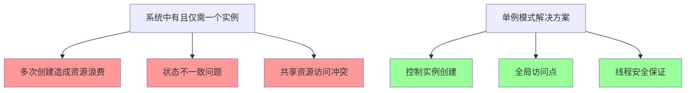
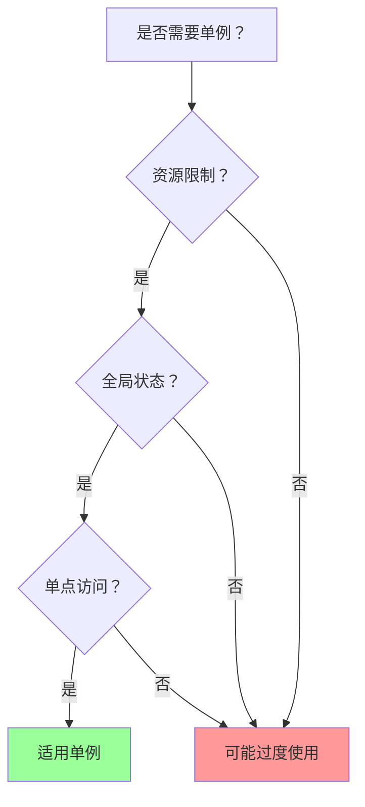

# 单例模式 Singleton Pattern

[[01-创建型模式概述]] → [[04-结构型模式/01-结构型模式概述]]
## 🎯 模式定义与核心问题

### 📖 官方定义
> **确保一个类只有一个实例，并提供一个全局访问点。**

### 🤔 核心问题解决


## 🏗️ 经典实现方式

### 🔴 懒汉式单例 (Lazy Singleton)

```java
public class LazySingleton {
    private static LazySingleton instance;
    
    // 私有构造函数，防止外部实例化
    private LazySingleton() {}
    
    // 公有静态方法返回实例
    public static LazySingleton getInstance() {
        if (instance == null) {
            instance = new LazySingleton();
        }
        return instance;
    }
}
```

**问题**：线程不安全，多线程环境下可能创建多个实例。

### 🟢 线程安全懒汉式

```java
public class SynchronizedSingleton {
    private static SynchronizedSingleton instance;
    
    private SynchronizedSingleton() {}
    
    // 同步方法确保线程安全
    public static synchronized SynchronizedSingleton getInstance() {
        if (instance == null) {
            instance = new SynchronizedSingleton();
        }
        return instance;
    }
}
```

**问题**：性能较差，每次获取实例都需要同步。

### 🔥 双重校验锁单例 (DCL)

```java
public class DoubleCheckedLockingSingleton {
    // volatile确保多线程可见性
    private static volatile DoubleCheckedLockingSingleton instance;
    
    private DoubleCheckedLockingSingleton() {}
    
    public static DoubleCheckedLockingSingleton getInstance() {
        if (instance == null) {
            synchronized (DoubleCheckedLockingSingleton.class) {
                if (instance == null) {
                    instance = new DoubleCheckedLockingSingleton();
                }
            }
        }
        return instance;
    }
}
```

**优势**：线程安全 + 高性能

### ⚡ 饿汉式单例 (Eager Singleton)

```java
public class EagerSingleton {
    // 类加载时就创建实例
    private static final EagerSingleton instance = new EagerSingleton();
    
    private EagerSingleton() {}
    
    public static EagerSingleton getInstance() {
        return instance;
    }
}
```

**特点**：类加载时就创建，最简单的线程安全方式。

### 🚀 枚举单例 (Enum Singleton) - 推荐

```java
public enum EnumSingleton {
    INSTANCE;
    
    private EnumSingleton() {
        // 初始化逻辑
    }
    
    public void doSomething() {
        // 业务方法
    }
}

// 使用方式
public class Client {
    public void useSingleton() {
        EnumSingleton.INSTANCE.doSomething();
    }
}
```

**优势**：
- ✅ 天然线程安全
- ✅ 防止反射攻击
- ✅ 防止序列化攻击
- ✅ 代码简洁

## 💡 现代实用实现

### 🎯 企业级单例示例

```java
public class DatabaseConnectionManager {
    private static volatile DatabaseConnectionManager instance;
    private final Map<String, Connection> connectionPool;
    private final DatabaseConfig config;
    
    private DatabaseConnectionManager() {
        this.config = DatabaseConfig.load();
        this.connectionPool = initializeConnectionPool();
    }
    
    public static DatabaseConnectionManager getInstance() {
        if (instance == null) {
            synchronized (DatabaseConnectionManager.class) {
                if (instance == null) {
                    instance = new DatabaseConnectionManager();
                }
            }
        }
        return instance;
    }
    
    public Connection getConnection(String databaseName) {
        return connectionPool.get(databaseName);
    }
    
    private Map<String, Connection> initializeConnectionPool() {
        Map<String, Connection> pool = new HashMap<>();
        config.getDatabases().forEach((name, config) -> {
            pool.put(name, createConnection(config));
        });
        return pool;
    }
    
    private Connection createConnection(DatabaseConfig.DatabaseConfigInfo dbConfig) {
        // 创建数据库连接的逻辑
        return new Connection(dbConfig.getUrl(), dbConfig.getUsername(), dbConfig.getPassword());
    }
}
```

### 🔧 配置管理器单例

```java
public class ConfigurationManager {
    private static final ConfigurationManager instance = new ConfigurationManager();
    
    private Properties properties;
    private final Map<String, Object> cache = new HashMap<>();
    
    private ConfigurationManager() {
        loadProperties();
    }
    
    public static ConfigurationManager getInstance() {
        return instance;
    }
    
    public String getString(String key) {
        return properties.getProperty(key);
    }
    
    public int getInt(String key) {
        String value = getString(key);
        return Integer.parseInt(value);
    }
    
    public boolean getBoolean(String key) {
        String value = getString(key);
        return Boolean.parseBoolean(value);
    }
    
    // 缓存支持的方法
    public <T> T getCached(String key, Supplier<T> supplier) {
        if (cache.containsKey(key)) {
            return (T) cache.get(key);
        }
        T value = supplier.get();
        cache.put(key, value);
        return value;
    }
    
    private void loadProperties() {
        properties = new Properties();
        try (InputStream input = getClass().getClassLoader().getResourceAsStream("config.properties")) {
            if (input != null) {
                properties.load(input);
            }
        } catch (IOException e) {
            throw new RuntimeException("无法加载配置文件", e);
        }
    }
}
```

## 🎯 适用场景

### ✅ 典型应用场景

| 应用场景 | 具体示例 | 使用原因 |
|----------|----------|----------|
| **数据库连接池** | DatabaseConnectionManager | 共享数据库连接资源 |
| **日志管理器** | Logger | 全局日志记录配置 |
| **缓存管理器** | CacheManager | 全局缓存策略 |
| **配置管理器** | ConfigurationManager | 系统配置信息 |
| **线程池管理器** | ThreadPoolManager | 共享线程池资源 |
| **资源管理器** | ResourceManager | 管理稀缺资源 |

### 📊 适用性评估



## ⚠️ 常见陷阱与反模式

### ❌ 反模式1：工具类使用单例

```java
// ❌ 错误：工具类不应该用单例
public class MathUtilsSingleton {
    private static MathUtilsSingleton instance;
    
    public static MathUtilsSingleton getInstance() {
        if (instance == null) {
            instance = new MathUtilsSingleton();
        }
        return instance;
    }
    
    public int add(int a, int b) {
        return a + b;
    }
}

// ✅ 正确：工具类应该是静态方法
public class MathUtils {
    private MathUtils() {} // 防止实例化
    
    public static int add(int a, int b) {
        return a + b;
    }
}
```

### ❌ 反模式2：不必要的单例

```java
// ❌ 错误：普通业务对象强制单例
public class UserProfileSingleton {
    private static UserProfileSingleton instance;
    
    public static UserProfileSingleton getInstance() {
        // ... 单例逻辑
    }
    
    private String userId;
    private String userName;
    // ... 用户相关信息
}

// ✅ 正确：多实例的业务对象
public class UserProfile {
    private String userId;
    private String userName;
    
    public UserProfile(String userId, String userName) {
        this.userId = userId;
        this // ... 构造逻辑
    }
}
```

### 🚫 单例的局限和替代方案

#### 问题1：测试困难
```java
// 问题：无法注入Mock对象测试
public class EmailServiceSingleton {
    private static EmailServiceSingleton instance = new EmailServiceSingleton();
    
    public static EmailServiceSingleton getInstance() {
        return instance;
    }
    
    public void sendEmail(String to, String message) {
        // 发送邮件逻辑 - 测试时无法Mock
    }
}

// ✅ 解决方案：依赖注入
public class EmailServiceMockable {
    private final EmailProvider emailProvider;
    
    public EmailServiceMockable(EmailProvider emailProvider) {
        this.emailProvider = emailProvider;
    }
    
    public void sendEmail(String to, String message) {
        emailProvider.send(to, message);
    }
}
```

#### 问题2：违反单一职责原则
```java
// ✅ 更灵活的设计：分离职责
public class ServiceLocator {
    private static final Map<Class<?>, Object> services = new HashMap<>();
    
    public static <T> T get(Class<T> serviceClass) {
        return (T) services.get(serviceClass);
    }
    
    public static <T> void register(Class<T> serviceClass, T implementation) {
        services.put(serviceClass, implementation);
    }
}

public class DatabaseConnectionManager {
    // 专注于数据库连接管理，不需要单例
    public DatabaseConnection createConnection() {
        return new DatabaseConnection();
    }
}
```

## 🔗 现代替代方案

### 🌟 Spring容器的单例Bean

```java
@Component
@Scope("singleton") // Spring默认就是单例
public class ModernDatabaseService {
    private final Properties config;
    
    @Autowired
    public ModernDatabaseService(Properties config) {
        this.config = config;
    }
    
    public Connection getConnection() {
        // 数据库连接逻辑
        return createConnection();
    }
}
```

### 🚀 Guice依赖注入

```java
@Singleton
public class GuiceSingletonService {
    @Inject
    public GuiceSingletonService() {
        // Guice会自动管理单例生命周期
    }
}
```

## 💡 最佳实践

### ✅ 使用单例的指导原则

1. **确实需要全局唯一**
2. **确保线程安全**
3. **避免反射攻击**
4. **考虑序列化安全**
5. **提供克隆保护**

### 📋 设计检查清单

- [ ] 该类是否真的需要全局唯一？
- [ ] 是否考虑了线程安全问题？
- [ ] 是否能通过依赖注入替代？
- [ ] 是否会影响代码测试？
- [ ] 是否违反了开闭原则？

## 🔗 学习衔接

- **基础理解** ← [[01-创建型模式概述]]
- **进阶学习** → [[04-结构型模式/08-代理模式]]
- **对比总结** → [[07-创建型模式对比表]]

---
**💡 核心认知**：单例模式是最简单也是最容易被误用的设计模式。现代开发中，优先考虑依赖注入容器管理的单例Bean，而不是手动实现的单例类。
