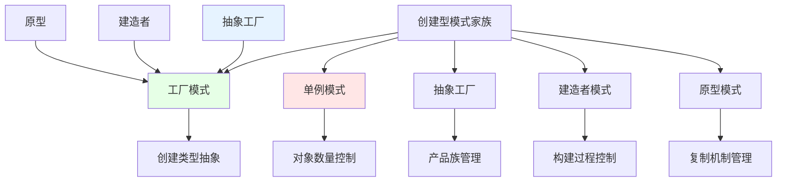
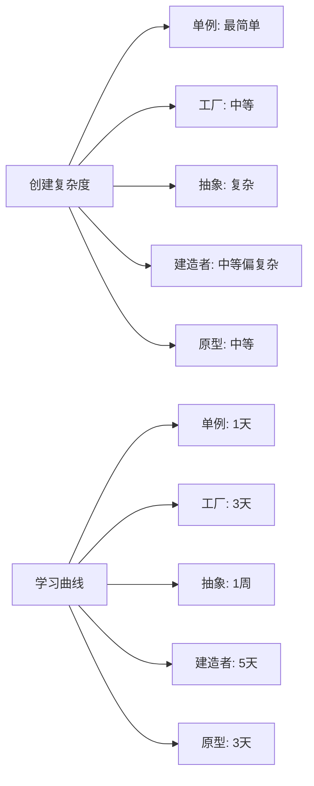
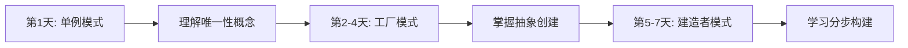
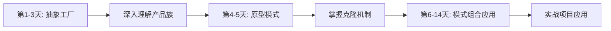

# 创建型模式对比表

[[创建型模式概述]] ← → [[04-结构型模式/01-结构型模式概述]]
## 📊 创建型模式全景对比

### 🎯 核心对比矩阵

| 模式 | 解决问题 | 核心机制 | 适用场景 | 复杂度 | 学习建议 |
|------|----------|----------|----------|--------|----------|
| **单例模式** | 全局唯一实例 | 控制实例创建 | 配置、日志、连接池 | ⭐ | 最快掌握 |
| **工厂模式** | 统一创建入口 | 抽象创建接口 | 运行时决定类型 | ⭐⭐ | 重点掌握 |
| **抽象工厂** | 产品族创建 | 多工厂管理 | 跨平台UI组件 | ⭐⭐⭐ | 高级应用 |
| **建造者** | 复杂对象构建 | 分步构建 | 复杂对象组装 | ⭐⭐⭐ | 实用工具 |
| **原型** | 克隆对象 | 对象复制 | 昂贵对象创建 | ⭐⭐ | 特殊场景 |

## 🔄 模式关系图谱



## 🎯 使用场景对比分析

### 📋 场景选择指南

| 使用场景 | 优先模式 | 备选模式 | 选择理由 |
|----------|----------|----------|----------|
| **需要全局唯一实例** | 单例模式 | - | 唯一选择 |
| **运行时决定创建类型** | 工厂模式 | 抽象工厂 | 简单首选 |
| **创建相关产品组** | 抽象工厂 | 工厂模式 | 更适合产品族 |
| **构建过程复杂** | 建造者模式 | 工厂模式 | 分步构建 |
| **对象创建成本高** | 原型模式 | 工厂模式 | 克隆更高效 |

### 🔍 复杂度对比分析



## 💡 实现对比详解

### 🛠️ 代码结构对比

#### 单例模式特点
```java
public class Singleton {
    private static volatile Singleton instance;
    
    public static Singleton getInstance() {
        // 控制实例数量 = 1
    }
}
```

#### 工厂模式特点
```java
public abstract class Creator {
    public abstract Product create();
    // 抽象创建接口
}
```

#### 抽象工厂特点
```java
public abstract class AbstractFactory {
    public abstract ProductA createProductA();
    public abstract ProductB createProductB();
    // 多个相关产品创建
}
```

#### 建造者特点
```java
public class Director {
    public Product build(Builder builder) {
        return builder.step1().step2().step3().build();
    }
    // 分步构建过程
}
```

#### 原型特点
```java
public interface Cloneable {
    Object clone();
    // 对象复制能力
}
```

### 📊 设计原则遵循情况

| SOLID原则 | 单例 | 工厂 | 抽象工厂 | 建造者 | 原型 |
|-----------|------|------|----------|--------|------|
| **SRP 单一职责** | ✅ | ✅ | ✅ | ✅ | ✅ |
| **OCP 开闭原则** | ❌ | ✅ | ✅ | ✅ | ✅ |
| **LSP 里氏替换** | N/A | ✅ | ✅ | ✅ | ✅ |
| **ISP 接口隔离** | ✅ | ✅ | ✅ | ✅ | ✅ |
| **DIP 依赖倒置** | ❌ | ✅ | ✅ | ✅ | ✅ |

**说明**：
- ✅ = 很好地支持
- ❌ = 支持不够好  
- N/A = 不适用

## 🔗 模式组合使用案例

### 🎯 企业应用典型组合

#### 组合1：单例 + 工厂
```java
// 数据库连接管理器（单例）
public class DatabaseManager {
    private static volatile DatabaseManager instance;
    private final DatabaseFactory factory;
    
    private DatabaseManager() {
        this.factory = new MySQLConnectionFactory();
    }
    
    public Connection getConnection(String type) {
        return factory.createConnection(type);
    }
}
```

#### 组合2：抽象工厂 + 建造者
```java
// UI组件抽象工厂使用建造者模式构建
public abstract class UIComponentFactory {
    public Component createComplexComponent() {
        return new ComponentBuilder()
            .setHeader(createHeader())
            .setBody(createBody())
            .setFooter(createFooter())
            .build();
    }
    
    protected abstract Component createHeader();
    protected abstract Component createBody();
    protected abstract Component createFooter();
}
```

#### 组合3：工厂 + 原型
```java
// 游戏对象工厂使用原型加速创建
public class GameObjectFactory {
    private final Map<String, GameObject> prototypes = new HashMap<>();
    
    public GameObject create(String type) {
        GameObject prototype = prototypes.get(type);
        if (prototype != null) {
            return (GameObject) prototype.clone(); // 使用原型克隆
        }
        return createNew(type); // 创建新原型
    }
}
```

## 🎯 学习路径优化

### 📚 学习顺序建议

#### 初学者路径（2周）


#### 进阶者路径（1-2周）


### 📊 掌握程度评估

| 模式 | 理论学习 | 独立实现 | 项目应用 | 专家级 |
|------|----------|----------|----------|--------|
| **单例** | 1小时 | 1天 | 1-2天 | 理解反模式 |
| **工厂** | 4小时 | 2-3天 | 1周 | 性能优化 |
| **抽象工厂** | 8小时 | 1周 | 2-3周 | 架构设计 |
| **建造者** | 6小时 | 3-5天 | 1-2周 | 复杂场景 |
| **原型** | 3小时 | 2天 | 3-5天 | 深拷贝知识 |

## 🚨 常见错误和最佳实践

### ❌ 常见错误模式

| 错误 | 错误示例 | 正确做法 |
|------|----------|----------|
| **单例滥用** | User类用单例 | Service类才用单例 |
| **工厂过度设计** | 简单对象用工厂 | 复杂对象创建用工厂 |
| **抽象工厂误用** | 单一产品用抽象工厂 | 产品族才用抽象工厂 |
| **建造者过于复杂** | 简单对象用建造者 | 多步骤构建用建造者 |
| **原型浅拷贝问题** | 忽略深拷贝 | 确保深拷贝安全 |

### ✅ 最佳实践总结

#### 选择模式的原则
1. **简单优先**：能用简单工厂就不用抽象工厂
2. **需求驱动**：根据实际需求选择模式
3. **避免过度设计**：不要在不需要时强行使用模式
4. **考虑维护成本**：模式会增加复杂性，要考虑维护成本

#### 实施检查清单
- [ ] 选择的模式是否真的解决了问题？
- [ ] 是否为未来的扩展做好准备了？
- [ ] 是否遵循了SOLID原则？
- [ ] 是否可以简化设计？
- [ ] 团队是否理解这个模式？

## 🔗 学习关联

### 📖 前置知识回顾
- **设计原则基础** ← [[02-设计原则/01-SOLID原则详解]]
- **面向对象深入** ← [[01-基础认知]]

### 🚀 后续学习走向
- **结构型模式深入学习** → [[04-结构型模式/01-结构型模式概述]]
- **模式实战应用** → [[08-实际应用]]
- **模式识别技能** → [[06-模式识别与选择]]

---
**💡 总结心得**：创建型模式是设计模式中相对容易掌握的一组，但也是最容易滥用的。掌握创建型模式的关键是理解"何时需要抽象创建过程"，而不是简单记住实现方式。在实际项目中，要根据复杂性和扩展需求选择合适的模式，避免过度设计。
