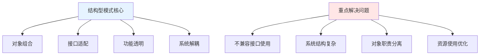
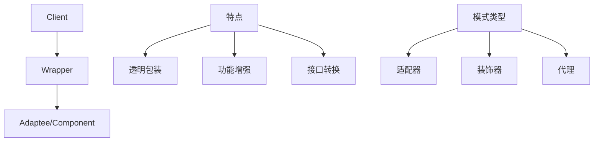
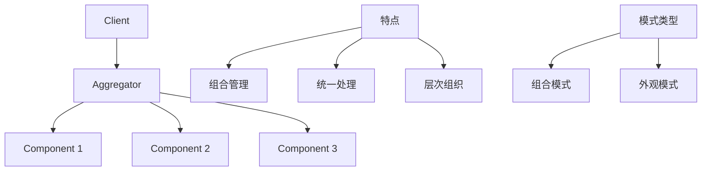
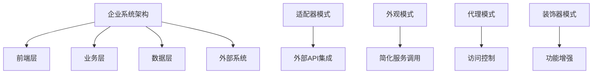
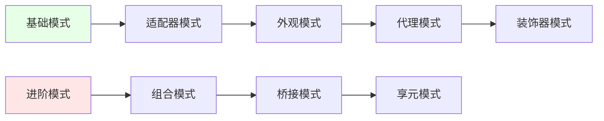

# 结构型模式概述

[[03-创建型模式/07-创建型模式对比表]] → [[02-适配器模式]]
## 🎯 结构型模式核心概念

### 📖 官方定义
> **结构型模式关注对象和类的组合，以获得更大的结构。它们不仅定义对象和类的组织方式，还定义了它们之间的关系。**

### 🧠 核心思想


## 🏗️ 八大结构型模式概览

### 📊 模式特征对比

| 模式名称 | 核心目标 | 主要机制 | 典型场景 | 学习难度 |
|----------|----------|----------|----------|----------|
| **适配器模式** | 接口转换 | 包装适配 | 第三方API集成 | ⭐⭐ |
| **桥接模式** | 抽象与实现分离 | 桥接组合 | 跨平台开发 | ⭐⭐⭐ |
| **组合模式** | 树形结构统一处理 | 递归组合 | 文件系统、GUI | ⭐⭐⭐ |
| **装饰器模式** | 动态功能添加 | 透明包装 | 功能扩展、缓存 | ⭐⭐⭐ |
| **外观模式** | 简化复杂系统接口 | 统一门面 | 子系统调用简化 | ⭐⭐ |
| **享元模式** | 对象共享优化 | 状态分离 | 大量相似对象 | ⭐⭐⭐ |
| **代理模式** | 访问控制 | 代理中介 | 远程调用、缓存 | ⭐⭐ |

### 🎯 学习路径推荐

```mermaid
graph LR
    A[适配器模式] --> B[理解接口转换]
    B --> C[外观模式]
    C --> D[简化复杂接口]
    D --> E[代理模式]
    E --> F[控制访问代理]
    F --> G[装饰器模式]
    G --> H[动态功能增强]
    H --> I[组合模式]
    I --> J[树形结构处理]
    J --> K[桥接模式]
    K --> L[抽象实现分离]
    L --> M[享元模式]
    M --> N[对象共享优化]
```



## 🔍 设计思想深度解析

### 🎯 包装模式 vs 聚合模式

#### 包装模式（Wrapper Patterns）


#### 聚合模式（Aggregation Patterns）


### 📚 SOLID原则在结构型模式中的体现

| SOLID原则 | 结构型模式体现 | 具体应用 |
|-----------|----------------|----------|
| **SRP** | 单一功能包装 | 每个包装器只负责一个功能 |
| **OCP** | 功能可扩展 | 装饰器模式的新功能扩展 |
| **LSP** | 替换一致性 | 适配器保持接口兼容性 |
| **ISP** | 接口精简 | 外观模式简化复杂接口 |
| **DIP** | 抽象依赖 | 桥接模式的抽象层依赖 |

## 💡 实现技术要素

### 🔧 核心技术组件

#### 接口抽象
```java
// 结构型模式的通用接口抽象
interface Target {
    void operation();
}

interface Component {
    void operation();
}

// 适配器接口转换
class Adapter implements Target {
    private Adaptee adaptee;
    
    public Adapter(Adaptee adaptee) {
        this.adaptee = adaptee;
    }
    
    public void operation() {
        adaptee.specificOperation(); // 接口转换
    }
}
```

#### 组合结构
```java
// 组合模式的树形结构
class Composite implements Component {
    private List<Component> children = new ArrayList<>();
    
    public void add(Component component) {
        children.add(component);
    }
    
    public void operation() {
        for (Component child : children) {
            child.operation(); // 递归处理
        }
    }
}
```

### 🎨 模式实现技术栈

| 实现层次 | 技术要点 | 注意事项 |
|----------|----------|----------|
| **接口设计** | 清晰的目标接口定义 | 保持接口稳定性和一致性 |
| **对象组合** | 灵活的组合方式 | 避免循环依赖 |
| **继承层次** | 合理的抽象层次 | 避免过深的继承链 |
| **多态应用** | 运行时类型判断 | 确保类型安全 |

## 🎯 应用场景分析

### 🌟 高适用场景

#### 企业系统集成


#### 框架开发中的结构型模式
| 框架类型 | 使用模式 | 具体实现 |
|----------|----------|----------|
| **Web框架** | 装饰器模式 | Middleware、Filter链 |
| **ORM框架** | 适配器模式 | 数据库驱动程序适配 |
| **UI框架** | 组合模式 | Widget树结构 |
| **分布式框架** | 代理模式 | RPC调用代理 |

### 🎯 实际业务应用案例

#### 电商系统示例
```java
// 支付系统的结构型模式应用
public class PaymentSystem {
    // 适配器：集成多个支付方式
    private PaymentAdapter stripe = new StripeAdapter();
    private PaymentAdapter alipay = new AlipayAdapter();
    
    // 装饰器：添加功能增强
    private PaymentProcessor processor = new CachingDecorator(
        new LoggingDecorator(
            new BasicPaymentProcessor()
        )
    );
    
    // 外观：简化复杂支付流程
    public PaymentResult processPayment(PaymentRequest request) {
        return PaymentFacade.getInstance()
            .processPayment(request);
    }
    
    // 代理：控制支付访问
    public PaymentResult securePayment(PaymentRequest request) {
        PaymentProxy proxy = new SecurePaymentProxy(processor);
        return proxy.process(request);
    }
}
```

## 🔗 模式间关系

### 🤝 协同工作模式

```mermaid
graph TD
    A[结构型模式协作] --> B[适配器 + 外观]
    A --> C 装饰器 + 代理]
    A --> D[组合 + 享元]
    A --> E[桥接 + 组合]
    
    F[组合策略] --> G[接口统一]
    F --> H[功能叠加]
    F --> I[结构优化]
    F --> J[性能提升]
```

### 📋 模式组合使用策略

| 组合场景 | 模式组合 | 实现案例 |
|----------|----------|----------|
| **系统集成** | 适配器 + 外观 | API适配 + 服务整合 |
| **功能增强** | 装饰器 + 代理 | 缓存 + 权限控制 |
| **界面设计** | 组合 + 享元 | Widget树 + 图标共享 |
| **数据访问** | 桥接 + 适配器 | 数据库抽象 + 驱动适配 |

## 🔍 常见问题与解决

### ⚠️ 常见障碍

#### 问题1：过度设计
```java
// ❌ 违反KISS原则：过度使用结构型模式
public class OverEngineeredService {
    public static final Service instance = 
        new AdapterDecoratorProxy(
            new CompositeBridgeFlyweight(
                new OriginalService()
            )
        );
}

// ✅ 适度使用：根据实际需要选择模式
public class ReasonableService {
    private final DataAdapter adapter; // 确实需要适配
    private final CacheDecorator cache; // 确实需要缓存
    
    public ReasonableService(DataAdapter adapter, CacheDecorator cache) {
        this.adapter = adapter;
        this.cache = cache;
    }
}
```

#### 问题2：接口混乱
```java
// ❌ 接口设计混乱：职责不清
interface MultiPurposeInterface {
    void adapt();
    void decorate();
    void compose();
    void bridge();
    void facade();
}

// ✅ 职责清晰的接口设计
interface PaymentProcessor {
    PaymentResult process(PaymentRequest request);
}

interface PaymentAdapter {
    PaymentResult adapt(LegacySystemData data);
}

interface PaymentDecorator {
    PaymentResult enhance(PaymentProcessor processor, PaymentRequest request);
}
```

### 🎯 最佳实践指导

#### 设计决策检查清单
- [ ] **结构复杂度是否合理**？（KISS原则）
- [ ] **接口设计是否清晰**？（ISP原则）
- [ ] **是否可以简化设计**？（DRY原则）
- [ ] **扩展性是否良好**？（OCP原则）
- [ ] **耦合度是否合理**？（DIP原则）

## 🔗 学习策略与路径

### 📚 学习建议

#### 理论与实践结合
1. **理论学习**：理解各模式的结构和意图
2. **代码实践**：手写各种模式示例
3. **框架探索**：研究现有框架的模式应用
4. **项目应用**：在实际项目中使用结构型模式

#### 学习优先级排序


## 🔗 学习衔接

### 📖 前置知识
- **创建型模式基础** ← [[03-创建型模式/07-创建型模式对比表]]
- **设计原则理解** ← [[02-设计原则/01-SOLID原则详解]]

### 🔄 后续学习
- **具体模式深入** → [[02-适配器模式]]
- **模式对比总结** → [[09-结构型模式对比表]]
- **模式识别技能** → [[06-模式识别与选择]]

---
**💡 核心认知**：结构型模式的精髓在于"组合优于继承"，通过灵活的对象组合来解决复杂的结构问题。重点是理解何时需要重新组织对象关系，而不是盲目使用模式。
