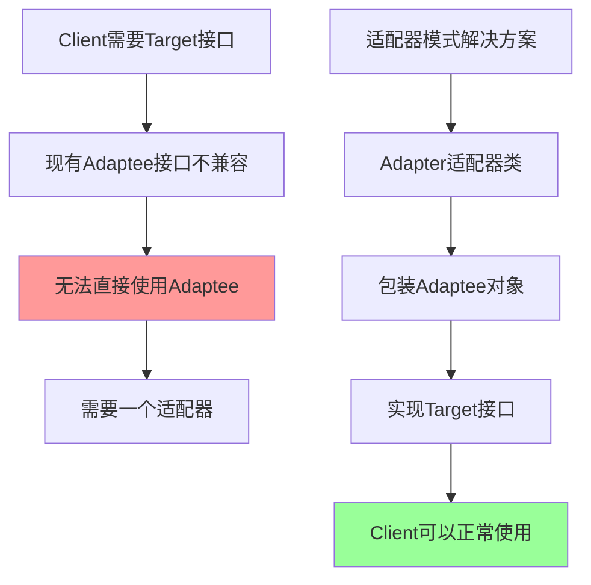
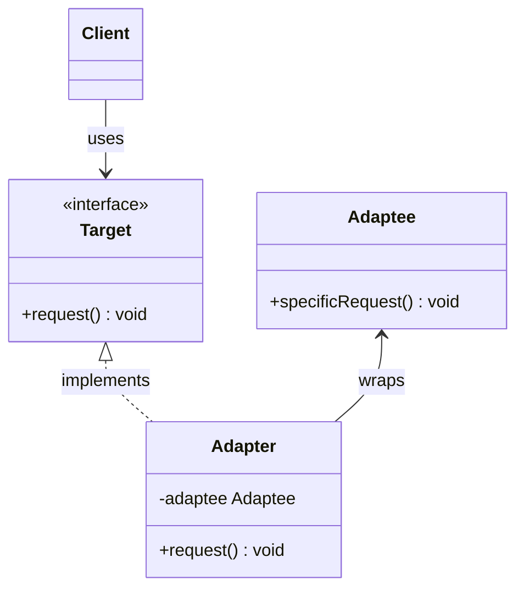

# 适配器模式 Adapter Pattern

[[01-结构型模式概述]] → [[03-桥接模式]]
## 🎯 模式定义与意图

### 📖 官方定义
> **将一个类的接口转换成客户希望的另一个接口。适配器模式使得原本由于接口不兼容而不能一起工作的类可以一起工作。**

### 🤔 核心问题


## 🏗️ 结构图与参与者

### 📊 UML类图


### 👥 参与者职责

| 参与者 | 职责描述 | 示例角色 |
|--------|----------|----------|
| **Target** | 客户期望的接口 | Database接口 |
| **Adaptee** | 需要被适配的类 | LegacyDatabase |
| **Adapter** | 适配器类 | DatabaseAdapter |
| **Client** | 使用Target的客户端 | Application |

## 💡 实现示例

### 🎯 经典示例：媒体播放器

```java
// Target接口：现代媒体播放器期望的接口
interface MediaPlayer {
    void play(String audioType, String fileName);
}

interface AdvancedMediaPlayer {
    void playVlc(String fileName);
    void playMp4(String fileName);
}

// Adaptee：具体的媒体播放实现
class VlcPlayer implements AdvancedMediaPlayer {
    public void playVlc(String fileName) {
        System.out.println("Playing vlc file: " + fileName);
    }
    
    public void playMp4(String fileName) {
        // VLC不支持MP4
    }
}

class Mp4Player implements AdvancedMediaPlayer {
    public void playVlc(String fileName) {
        // MP4不支持VLC
    }
    
    public void playMp4(String fileName) {
        System.out.println("Playing mp4 file: " + fileName);
    }
}

// Adapter：媒体播放器适配器
class MediaAdapter implements MediaPlayer {
    AdvancedMediaPlayer advancedMusicPlayer;
    
    public MediaAdapter(String audioType) {
        if (audioType.equalsIgnoreCase("vlc")) {
            advancedMusicPlayer = new VlcPlayer();
        } else if (audioType.equalsIgnoreCase("mp4")) {
            advancedMusicPlayer = new Mp4Player();
        }
    }
    
    public void play(String audioType, String fileName) {
        if (audioType.equalsIgnoreCase("vlc")) {
            advancedMusicPlayer.playVlc(fileName);
        } else if (audioType.equalsIgnoreCase("mp4")) {
            advancedMusicPlayer.playMp4(fileName);
        }
    }
}

// 主要播放器类
class AudioPlayer implements MediaPlayer {
    MediaAdapter mediaAdapter;
    
    public void play(String audioType, String fileName) {
        // 内置支持的格式
        if (audioType.equalsIgnoreCase("mp3")) {
            System.out.println("Playing mp3 file: " + fileName);
        }
        // 使用适配器支持的格式
        else if (audioType.equalsIgnoreCase("vlc") || audioType.equalsIgnoreCase("mp4")) {
            mediaAdapter = new MediaAdapter(audioType);
            mediaAdapter.play(audioType, fileName);
        } else {
            System.out.println("Invalid media type: " + audioType);
        }
    }
}

// 客户端使用
public class AdapterPatternDemo {
    public static void main(String[] args) {
        AudioPlayer audioPlayer = new AudioPlayer();
        
        audioPlayer.play("mp3", "beyond_the_horizon.mp3");
        audioPlayer.play("mp4", "alone.mp4");
        audioPlayer.play("vlc", "far_far_away.vlc");
        audioPlayer.play("avi", "mind_me.avi");
    }
}
```

## 🔥 现代实现：数据转换适配器

### 🎯 企业级应用示例

```java
// 新系统期望的数据格式
interface ModernUserData {
    String getId();
    String getFullName();
    String getEmailAddress();
    LocalDateTime getLastLogin();
}

// 遗留系统的数据格式
class LegacyUserRecord {
    private String userID;
    private String firstName;
    private String lastName;
    private String email;
    private String lastActiveDate; // 格式：yyyy-MM-dd HH:mm:ss
    
    // 构造函数和getter/setter...
}

// 数据适配器
class LegacyUserAdapter implements ModernUserData {
    private LegacyUserRecord legacyUser;
    
    public LegacyUserAdapter(LegacyUserRecord legacyUser) {
        this.legacyUser = legacyUser;
    }
    
    public String getId() {
        return "USER_" + legacyUser.getUserID();
    }
    
    public String getFullName() {
        return legacyUser.getFirstName() + " " + legacyUser.getLastName();
    }
    
    public String getEmailAddress() {
        return legacyUser.getEmail().toUpperCase(); // 新系统要求大写邮箱
    }
    
    public LocalDateTime getLastLogin() {
        try {
            return LocalDateTime.parse(legacyUser.getLastActiveDate(), 
                DateTimeFormatter.ofPattern("yyyy-MM-dd HH:mm:ss"));
        } catch (Exception e) {
            return LocalDateTime.now();
        }
    }
}

// 数据服务适配器
class DataServiceAdapter {
    private LegacyDataService legacyService;
    
    public DataServiceAdapter(LegacyDataService legacyService) {
        this.legacyService = legacyService;
    }
    
    public List<ModernUserData> getAllUsers() {
        List<LegacyUserRecord> legacyUsers = legacyService.getAllUsers();
        return legacyUsers.stream()
            .map(LegacyUserAdapter::new)
            .collect(Collectors.toList());
    }
    
    public ModernUserData getUserById(String id) {
        String legacyId = id.replace("USER_", "");
        LegacyUserRecord legacyUser = legacyService.getUserById(legacyId);
        return legacyUser != null ? new LegacyUserAdapter(legacyUser) : null;
    }
}

// 客户端使用
public class ModernUserService {
    private DataServiceAdapter adapter;
    
    public ModernUserService(DataServiceAdapter adapter) {
        this.adapter = adapter;
    }
    
    public void processUsers() {
        List<ModernUserData> users = adapter.getAllUsers();
        users.forEach(user -> {
            System.out.println("User: " + user.getFullName());
            System.out.println("Email: " + user.getEmailAddress());
            System.out.println("Last Login: " + user.getLastLogin());
        });
    }
}
```

## 🎯 适配器模式变种

### 🔀 1. 对象适配器 (Object Adapter)

```java
// 对象适配器：通过组合实现
class ObjectAdapter implements Target {
    private Adaptee adaptee;
    
    public ObjectAdapter(Adaptee adaptee) {
        this.adaptee = adaptee;
    }
    
    public void request() {
        adaptee.specificRequest();
    }
}
```

### 🔀 2. 类适配器 (Class Adapter)

```java
// 类适配器：通过继承实现
class ClassAdapter extends Adaptee implements Target {
    public void request() {
        specificRequest();
    }
}
```

### 📊 两种适配器对比

| 特性 | 对象适配器 | 类适配器 |
|------|------------|----------|
| **灵活性** | 高（可以适配多个适配者） | 低（只能适配一个适配者） |
| **继承层次** | 不改变继承关系 | 改变继承关系 |
| **Java兼容性** | ✅ 完全支持 | ❌ Java不支持多继承 |
| **重用性** | 好 | 差 |
| **推荐程度** | ⭐⭐⭐⭐⭐ | ⭐⭐ |

## 🎯 应用场景

### ✅ 典型应用场景

| 应用领域 | 具体场景 | 适配对象 | 目标接口 |
|----------|----------|----------|----------|
| **系统集成** | 新老系统对接 | 遗留API | 现代接口 |
| **第三方库** | 第三方组件集成 | 第三方库 | 系统接口 |
| **数据转换** | 数据格式转换 | 旧数据格式 | 新数据格式 |
| **服务集成** | 微服务调用 | 外部服务 | 内部接口 |
| **硬件接口** | 设备驱动适配 | 硬件接口 | 应用接口 |

### 🌟 现代框架中的应用

#### Spring Boot中的适配器
```java
// Spring Boot配置适配器
@Configuration
public class DatabaseConfigAdapter {
    
    @Bean
    @ConditionalOnProperty(name = "database.type", havingValue = "postgres")
    public DataSourceAdapter postgresAdapter() {
        return new PostgresDataSourceAdapter();
    }
    
    @Bean
    @ConditionalOnProperty(name = "database.type", havingValue = "mysql")
    public DataSourceAdapter mysqlAdapter() {
        return new MySQLDataSourceAdapter();
    }
}

// 适配器实现
public class PostgresDataSourceAdapter implements DataSourceAdapter {
    @Value("${database.postgres.url}")
    private String url;
    
    @Value("${database.postgres.username}")
    private String username;
    
    @Value("${database.postgres.password}")
    private String password;
    
    @Override
    public DataSource createDataSource() {
        return DataSourceBuilder.create()
            .url(url)
            .username(username)
            .password(password)
            .driverClassName("org.postgresql.Driver")
            .build();
    }
}
```

### ❌ 不适用场景

| 场景 | 原因 | 替代方案 |
|------|------|----------|
| **接口差异较大** | 适配成本过高 | 重新设计接口 |
| **功能根本性不同** | 强行适配无意义 | 使用其他模式 |
| **性能要求极高** | 适配器增加开销 | 直接重构底层 |

## 💡 适配器模式优缺点

### ✅ 优点

| 优点 | 详细说明 |
|------|----------|
| **提高复用性** | 现有的不兼容类可以被重用 |
| **系统解耦** | 客户端无需关心接口差异 |
| **易于扩展** | 可以添加新的适配器类 |
| **符合开闭原则** | 可以扩展适配器而无需修改现有代码 |
| **降低修改成本** | 适配器模式比修改原有类成本更低 |

### ❌ 缺点

| 缺点 | 详细说明 |
|------|----------|
| **增加复杂度** | 引入额外的适配器层次 |
| **维护成本** | 需要维护适配器类 |
| **性能开销** | 额外的方法调用层 |
| **调试困难** | 错误定位可能较复杂 |

## 🔗 与其他模式的关系

### 🤝 模式比较

| 模式 | 与适配器的关系 | 主要区别 |
|------|----------------|----------|
| **装饰器模式** | 结构相似但意图不同 | 装饰器增强功能，适配器转换接口 |
| **外观模式** | 都可以简化接口 | 外观模式创建新接口，适配器转换现有接口 |
| **代理模式** | 都是间接访问对象 | 代理控制访问，适配器转换接口 |
| **桥接模式** | 都涉及接口解耦 | 桥接分离抽象和实现，适配器转换接口 |

### 📋 模式协同使用

```java
// 适配器 + 装饰器的组合使用
public class EnhancedAdapter extends DatabaseAdapter implements DataAccessComponent {
    private SecurityDecorator security;
    private LoggingDecorator logging;
    private CachingDecorator cache;
    
    public EnhancedAdapter(LegacyDatabase database) {
        super(database);
        this.security = new SecurityDecorator(this);
        this.logging = new LoggingDecorator(this);
        this.cache = new CachingDecorator(this);
    }
}
```

## 🎯 最佳实践

### 📚 设计指导原则

1. **保持适配器简单**：只负责接口转换，不要添加业务逻辑
2. **明确适配范围**：清楚定义需要适配的接口
3. **错误处理**：适配器中的错误应该有合理的处理机制
4. **文档清晰**：适配器的使用应该有清楚的文档说明

### 🛠️ 实现建议

#### 代码质量检查
- [ ] 适配器是否只负责接口转换？
- [ ] 是否保持了原有类的完整性？
- [ ] 错误处理是否完善？
- [ ] 性能是否满足要求？

## 🔗 学习衔接

- **前置基础** ← [[01-结构型模式概述]]
- **深化学习** → [[03-桥接模式]]
- **对比总结** → [[09-结构型模式对比表]]

---
**💡 核心认知**：适配器模式是处理接口不兼容问题的经典解决方案。关键在于理解"什么时候需要适配"，以及"如何优雅地适配"。在实际项目中，适配器模式常与其他模式组合使用，要灵活掌握。
