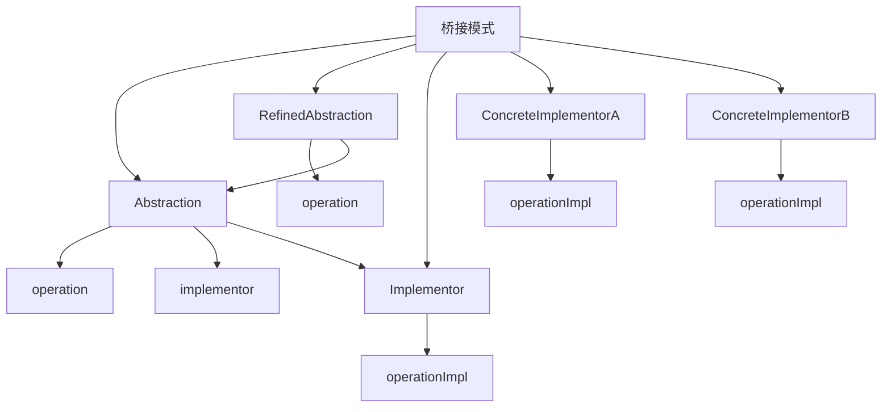

# 🌉 桥接模式

[[04-结构型模式/02-适配器模式]] ← [[04-结构型模式/04-组合模式]]
## 🎯 桥接模式概览

### 📊 模式结构图



## 🏗️ 模式定义与特点

### 📋 **模式定义**
桥接模式将抽象部分与它的实现部分分离，使它们都可以独立地变化。

### 📋 **核心特点**
- **分离抽象**: 抽象与实现分离
- **独立变化**: 抽象和实现可以独立变化
- **组合关系**: 使用组合而不是继承
- **解耦**: 降低抽象与实现的耦合度

### 📋 **适用场景**
- 需要在运行时切换实现
- 需要避免抽象与实现的绑定
- 需要共享实现
- 需要扩展抽象和实现

## 🏗️ 模式实现

### 📋 **基础实现**

#### **实现者接口**
```java
// ✅ 实现者接口
public interface Implementor {
    void operationImpl();
}

// ✅ 具体实现者A
public class ConcreteImplementorA implements Implementor {
    @Override
    public void operationImpl() {
        System.out.println("ConcreteImplementorA operation");
    }
}

// ✅ 具体实现者B
public class ConcreteImplementorB implements Implementor {
    @Override
    public void operationImpl() {
        System.out.println("ConcreteImplementorB operation");
    }
}
```

#### **抽象类**
```java
// ✅ 抽象类
public abstract class Abstraction {
    protected Implementor implementor;
    
    public Abstraction(Implementor implementor) {
        this.implementor = implementor;
    }
    
    public void operation() {
        implementor.operationImpl();
    }
}

// ✅ 具体抽象类
public class RefinedAbstraction extends Abstraction {
    public RefinedAbstraction(Implementor implementor) {
        super(implementor);
    }
    
    @Override
    public void operation() {
        System.out.println("RefinedAbstraction operation");
        implementor.operationImpl();
    }
}
```

#### **使用示例**
```java
// ✅ 客户端使用
public class Client {
    public static void main(String[] args) {
        // 使用实现者A
        Implementor implementorA = new ConcreteImplementorA();
        Abstraction abstraction1 = new RefinedAbstraction(implementorA);
        abstraction1.operation();
        
        // 使用实现者B
        Implementor implementorB = new ConcreteImplementorB();
        Abstraction abstraction2 = new RefinedAbstraction(implementorB);
        abstraction2.operation();
    }
}
```

## 🏗️ 实际应用案例

### 📋 **图形绘制桥接案例**

#### **图形绘制桥接**
```java
// ✅ 绘制实现者接口
public interface DrawingAPI {
    void drawCircle(double x, double y, double radius);
    void drawRectangle(double x, double y, double width, double height);
}

// ✅ Windows绘制实现
public class WindowsDrawingAPI implements DrawingAPI {
    @Override
    public void drawCircle(double x, double y, double radius) {
        System.out.println("Windows: Drawing circle at (" + x + ", " + y + ") with radius " + radius);
    }
    
    @Override
    public void drawRectangle(double x, double y, double width, double height) {
        System.out.println("Windows: Drawing rectangle at (" + x + ", " + y + ") with size " + width + "x" + height);
    }
}

// ✅ Linux绘制实现
public class LinuxDrawingAPI implements DrawingAPI {
    @Override
    public void drawCircle(double x, double y, double radius) {
        System.out.println("Linux: Drawing circle at (" + x + ", " + y + ") with radius " + radius);
    }
    
    @Override
    public void drawRectangle(double x, double y, double width, double height) {
        System.out.println("Linux: Drawing rectangle at (" + x + ", " + y + ") with size " + width + "x" + height);
    }
}

// ✅ Mac绘制实现
public class MacDrawingAPI implements DrawingAPI {
    @Override
    public void drawCircle(double x, double y, double radius) {
        System.out.println("Mac: Drawing circle at (" + x + ", " + y + ") with radius " + radius);
    }
    
    @Override
    public void drawRectangle(double x, double y, double width, double height) {
        System.out.println("Mac: Drawing rectangle at (" + x + ", " + y + ") with size " + width + "x" + height);
    }
}
```

#### **图形抽象类**
```java
// ✅ 图形抽象类
public abstract class Shape {
    protected DrawingAPI drawingAPI;
    
    public Shape(DrawingAPI drawingAPI) {
        this.drawingAPI = drawingAPI;
    }
    
    public abstract void draw();
}

// ✅ 圆形类
public class Circle extends Shape {
    private double x, y, radius;
    
    public Circle(double x, double y, double radius, DrawingAPI drawingAPI) {
        super(drawingAPI);
        this.x = x;
        this.y = y;
        this.radius = radius;
    }
    
    @Override
    public void draw() {
        drawingAPI.drawCircle(x, y, radius);
    }
}

// ✅ 矩形类
public class Rectangle extends Shape {
    private double x, y, width, height;
    
    public Rectangle(double x, double y, double width, double height, DrawingAPI drawingAPI) {
        super(drawingAPI);
        this.x = x;
        this.y = y;
        this.width = width;
        this.height = height;
    }
    
    @Override
    public void draw() {
        drawingAPI.drawRectangle(x, y, width, height);
    }
}
```

#### **使用示例**
```java
// ✅ 使用示例
public class DrawingDemo {
    public static void main(String[] args) {
        // Windows绘制
        DrawingAPI windowsAPI = new WindowsDrawingAPI();
        Shape circle1 = new Circle(10, 10, 5, windowsAPI);
        Shape rectangle1 = new Rectangle(20, 20, 10, 8, windowsAPI);
        
        circle1.draw();
        rectangle1.draw();
        
        System.out.println();
        
        // Linux绘制
        DrawingAPI linuxAPI = new LinuxDrawingAPI();
        Shape circle2 = new Circle(10, 10, 5, linuxAPI);
        Shape rectangle2 = new Rectangle(20, 20, 10, 8, linuxAPI);
        
        circle2.draw();
        rectangle2.draw();
        
        System.out.println();
        
        // Mac绘制
        DrawingAPI macAPI = new MacDrawingAPI();
        Shape circle3 = new Circle(10, 10, 5, macAPI);
        Shape rectangle3 = new Rectangle(20, 20, 10, 8, macAPI);
        
        circle3.draw();
        rectangle3.draw();
    }
}
```

### 📋 **消息发送桥接案例**

#### **消息发送桥接**
```java
// ✅ 消息发送实现者接口
public interface MessageSender {
    void sendMessage(String message, String recipient);
}

// ✅ 邮件发送实现
public class EmailSender implements MessageSender {
    @Override
    public void sendMessage(String message, String recipient) {
        System.out.println("Sending email to " + recipient + ": " + message);
    }
}

// ✅ 短信发送实现
public class SMSSender implements MessageSender {
    @Override
    public void sendMessage(String message, String recipient) {
        System.out.println("Sending SMS to " + recipient + ": " + message);
    }
}

// ✅ 微信发送实现
public class WeChatSender implements MessageSender {
    @Override
    public void sendMessage(String message, String recipient) {
        System.out.println("Sending WeChat to " + recipient + ": " + message);
    }
}
```

#### **消息抽象类**
```java
// ✅ 消息抽象类
public abstract class Message {
    protected MessageSender sender;
    protected String content;
    protected String recipient;
    
    public Message(MessageSender sender, String content, String recipient) {
        this.sender = sender;
        this.content = content;
        this.recipient = recipient;
    }
    
    public abstract void send();
}

// ✅ 文本消息类
public class TextMessage extends Message {
    public TextMessage(MessageSender sender, String content, String recipient) {
        super(sender, content, recipient);
    }
    
    @Override
    public void send() {
        sender.sendMessage(content, recipient);
    }
}

// ✅ 图片消息类
public class ImageMessage extends Message {
    private String imageUrl;
    
    public ImageMessage(MessageSender sender, String content, String recipient, String imageUrl) {
        super(sender, content, recipient);
        this.imageUrl = imageUrl;
    }
    
    @Override
    public void send() {
        String messageWithImage = content + " [Image: " + imageUrl + "]";
        sender.sendMessage(messageWithImage, recipient);
    }
}

// ✅ 文件消息类
public class FileMessage extends Message {
    private String fileName;
    private String fileSize;
    
    public FileMessage(MessageSender sender, String content, String recipient, String fileName, String fileSize) {
        super(sender, content, recipient);
        this.fileName = fileName;
        this.fileSize = fileSize;
    }
    
    @Override
    public void send() {
        String messageWithFile = content + " [File: " + fileName + " (" + fileSize + ")]";
        sender.sendMessage(messageWithFile, recipient);
    }
}
```

#### **使用示例**
```java
// ✅ 使用示例
public class MessageDemo {
    public static void main(String[] args) {
        // 邮件发送
        MessageSender emailSender = new EmailSender();
        Message textEmail = new TextMessage(emailSender, "Hello World", "user@example.com");
        Message imageEmail = new ImageMessage(emailSender, "Check this out", "user@example.com", "image.jpg");
        
        textEmail.send();
        imageEmail.send();
        
        System.out.println();
        
        // 短信发送
        MessageSender smsSender = new SMSSender();
        Message textSMS = new TextMessage(smsSender, "Hello World", "1234567890");
        Message fileSMS = new FileMessage(smsSender, "Here's the file", "1234567890", "document.pdf", "2MB");
        
        textSMS.send();
        fileSMS.send();
        
        System.out.println();
        
        // 微信发送
        MessageSender weChatSender = new WeChatSender();
        Message textWeChat = new TextMessage(weChatSender, "Hello World", "wechat_user");
        Message imageWeChat = new ImageMessage(weChatSender, "Check this out", "wechat_user", "image.jpg");
        
        textWeChat.send();
        imageWeChat.send();
    }
}
```

### 📋 **数据库访问桥接案例**

#### **数据库访问桥接**
```java
// ✅ 数据库访问实现者接口
public interface DatabaseAccess {
    void connect();
    void disconnect();
    void executeQuery(String sql);
    void executeUpdate(String sql);
}

// ✅ MySQL数据库访问实现
public class MySQLAccess implements DatabaseAccess {
    @Override
    public void connect() {
        System.out.println("Connecting to MySQL database");
    }
    
    @Override
    public void disconnect() {
        System.out.println("Disconnecting from MySQL database");
    }
    
    @Override
    public void executeQuery(String sql) {
        System.out.println("MySQL: Executing query - " + sql);
    }
    
    @Override
    public void executeUpdate(String sql) {
        System.out.println("MySQL: Executing update - " + sql);
    }
}

// ✅ PostgreSQL数据库访问实现
public class PostgreSQLAccess implements DatabaseAccess {
    @Override
    public void connect() {
        System.out.println("Connecting to PostgreSQL database");
    }
    
    @Override
    public void disconnect() {
        System.out.println("Disconnecting from PostgreSQL database");
    }
    
    @Override
    public void executeQuery(String sql) {
        System.out.println("PostgreSQL: Executing query - " + sql);
    }
    
    @Override
    public void executeUpdate(String sql) {
        System.out.println("PostgreSQL: Executing update - " + sql);
    }
}

// ✅ Oracle数据库访问实现
public class OracleAccess implements DatabaseAccess {
    @Override
    public void connect() {
        System.out.println("Connecting to Oracle database");
    }
    
    @Override
    public void disconnect() {
        System.out.println("Disconnecting from Oracle database");
    }
    
    @Override
    public void executeQuery(String sql) {
        System.out.println("Oracle: Executing query - " + sql);
    }
    
    @Override
    public void executeUpdate(String sql) {
        System.out.println("Oracle: Executing update - " + sql);
    }
}
```

#### **数据访问抽象类**
```java
// ✅ 数据访问抽象类
public abstract class DataAccess {
    protected DatabaseAccess databaseAccess;
    
    public DataAccess(DatabaseAccess databaseAccess) {
        this.databaseAccess = databaseAccess;
    }
    
    public void connect() {
        databaseAccess.connect();
    }
    
    public void disconnect() {
        databaseAccess.disconnect();
    }
}

// ✅ 用户数据访问类
public class UserDataAccess extends DataAccess {
    public UserDataAccess(DatabaseAccess databaseAccess) {
        super(databaseAccess);
    }
    
    public void createUser(String name, String email) {
        String sql = "INSERT INTO users (name, email) VALUES ('" + name + "', '" + email + "')";
        databaseAccess.executeUpdate(sql);
    }
    
    public void getUserById(int id) {
        String sql = "SELECT * FROM users WHERE id = " + id;
        databaseAccess.executeQuery(sql);
    }
    
    public void updateUser(int id, String name, String email) {
        String sql = "UPDATE users SET name = '" + name + "', email = '" + email + "' WHERE id = " + id;
        databaseAccess.executeUpdate(sql);
    }
    
    public void deleteUser(int id) {
        String sql = "DELETE FROM users WHERE id = " + id;
        databaseAccess.executeUpdate(sql);
    }
}

// ✅ 订单数据访问类
public class OrderDataAccess extends DataAccess {
    public OrderDataAccess(DatabaseAccess databaseAccess) {
        super(databaseAccess);
    }
    
    public void createOrder(int userId, String product, double amount) {
        String sql = "INSERT INTO orders (user_id, product, amount) VALUES (" + userId + ", '" + product + "', " + amount + ")";
        databaseAccess.executeUpdate(sql);
    }
    
    public void getOrderById(int id) {
        String sql = "SELECT * FROM orders WHERE id = " + id;
        databaseAccess.executeQuery(sql);
    }
    
    public void updateOrderStatus(int id, String status) {
        String sql = "UPDATE orders SET status = '" + status + "' WHERE id = " + id;
        databaseAccess.executeUpdate(sql);
    }
}
```

#### **使用示例**
```java
// ✅ 使用示例
public class DatabaseAccessDemo {
    public static void main(String[] args) {
        // MySQL用户数据访问
        DatabaseAccess mysqlAccess = new MySQLAccess();
        UserDataAccess mysqlUserAccess = new UserDataAccess(mysqlAccess);
        
        mysqlUserAccess.connect();
        mysqlUserAccess.createUser("John Doe", "john@example.com");
        mysqlUserAccess.getUserById(1);
        mysqlUserAccess.updateUser(1, "John Smith", "johnsmith@example.com");
        mysqlUserAccess.deleteUser(1);
        mysqlUserAccess.disconnect();
        
        System.out.println();
        
        // PostgreSQL订单数据访问
        DatabaseAccess postgresAccess = new PostgreSQLAccess();
        OrderDataAccess postgresOrderAccess = new OrderDataAccess(postgresAccess);
        
        postgresOrderAccess.connect();
        postgresOrderAccess.createOrder(1, "Laptop", 999.99);
        postgresOrderAccess.getOrderById(1);
        postgresOrderAccess.updateOrderStatus(1, "shipped");
        postgresOrderAccess.disconnect();
        
        System.out.println();
        
        // Oracle用户数据访问
        DatabaseAccess oracleAccess = new OracleAccess();
        UserDataAccess oracleUserAccess = new UserDataAccess(oracleAccess);
        
        oracleUserAccess.connect();
        oracleUserAccess.createUser("Jane Doe", "jane@example.com");
        oracleUserAccess.getUserById(2);
        oracleUserAccess.disconnect();
    }
}
```

## 🎯 模式优势与劣势

### 📋 **优势**
- **分离抽象**: 抽象与实现分离
- **独立变化**: 抽象和实现可以独立变化
- **组合关系**: 使用组合而不是继承
- **解耦**: 降低抽象与实现的耦合度

### 📋 **劣势**
- **复杂度增加**: 增加了系统的复杂度
- **理解困难**: 理解桥接模式需要一定经验
- **设计复杂**: 需要正确识别抽象和实现

### 📋 **与适配器模式的区别**
| 方面 | 适配器模式 | 桥接模式 |
|------|------------|----------|
| **目的** | 接口转换 | 抽象与实现分离 |
| **时机** | 事后适配 | 事前设计 |
| **关系** | 组合关系 | 组合关系 |
| **复杂度** | 相对简单 | 相对复杂 |

## 🔗 学习衔接

- **上一文档** ← [[适配器模式]]
- **下一文档** → [[组合模式]]
- **模式基础** → [[01-基础认知]]

---
**💡 桥接精髓**: 桥接模式就像一座桥，连接抽象和实现，让它们可以独立变化。当我们需要在运行时切换实现，或者需要避免抽象与实现的绑定时，桥接模式是最佳选择！
