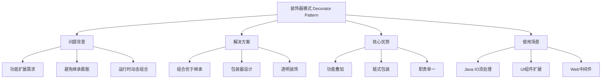
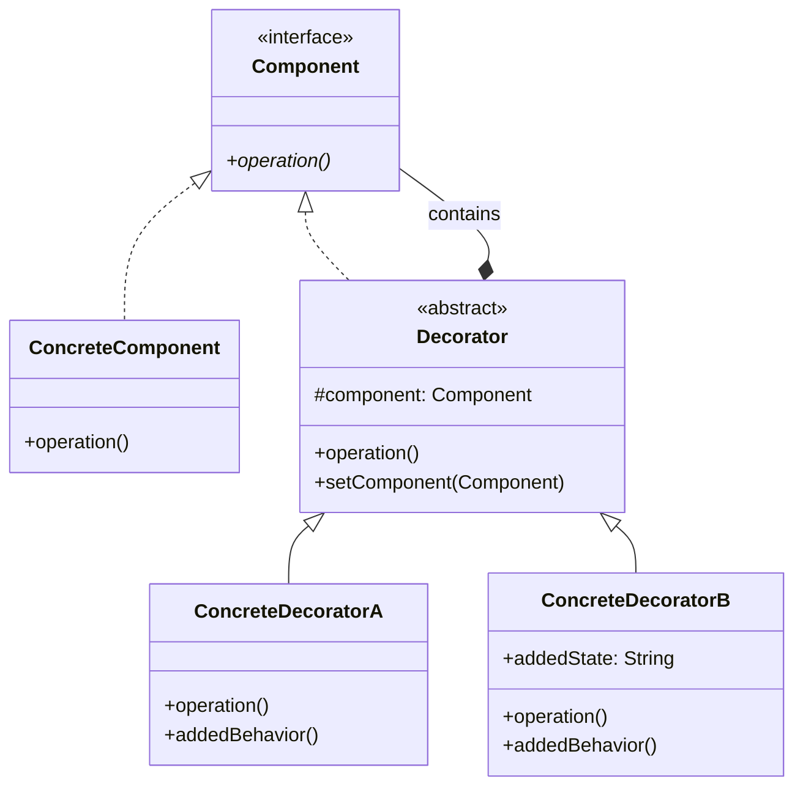

# 🎨 装饰器模式详解

[[04-结构型模式/02-适配器模式]] ← [[04-结构型模式/04-代理模式]]
## 🎯 装饰器模式概览

### 📊 模式基本信息



### 🎯 **定义与意图**
装饰器模式在不改变现有对象结构的前提下，动态地给一个对象添加一些额外的职责。通过创建一个包装对象来实现对原有对象功能的扩展。

### 📋 **核心价值**
- **运行时功能扩展**: 在不修改原有代码的情况下动态添加功能
- **避免继承膨胀**: 解决类继承带来的数量爆炸问题
- **单一职责**: 每个装饰器只负责一种功能扩展
- **高度灵活**: 功能组合的顺序和数量都可以自由控制

## 🏗️ 装饰器模式结构

### 📊 **类图结构**



### 🎯 **角色职责**

#### **Component (抽象组件)**
- 定义对象接口，声明具体类和装饰器的共同接口
- 可以是抽象类或接口

#### **ConcreteComponent (具体组件)**
- 实现了Component接口的具体对象
- 可以被装饰器添加功能的基础对象

#### **Decorator (抽象装饰器)**
- 实现Component接口，并持有一个Component对象的引用
- 可以调用被装饰对象的方法

#### **ConcreteDecorator (具体装饰器)**
- 继承自Decorator，负责向Component添加额外的职责或状态
- 可以添加新的行为或增强现有行为

## 💻 装饰器模式实现

### 🎯 **基础实现示例**

```java
// ✅ 抽象组件接口
public interface Coffee {
    String getDescription();
    double getCost();
}

// ✅ 具体组件：基础咖啡
public class SimpleCoffee implements Coffee {
    @Override
    public String getDescription() {
        return "Simple coffee";
    }
    
    @Override
    public double getCost() {
        return 2.0;
    }
}

// ✅ 抽象装饰器
public abstract class CoffeeDecorator implements Coffee {
    protected Coffee coffee;
    
    public CoffeeDecorator(Coffee coffee) {
        this.coffee = coffee;
    }
    
    @Override
    public String getDescription() {
        return coffee.getDescription();
    }
    
    @Override
    public double getCost() {
        return coffee.getCost();
    }
}

// ✅ 具体装饰器：添加牛奶
public class MilkDecorator extends CoffeeDecorator {
    
    public MilkDecorator(Coffee coffee) {
        super(coffee);
    }
    
    @Override
    public String getDescription() {
        return coffee.getDescription() + ", milk";
    }
    
    @Override
    public double getCost() {
        return coffee.getCost() + 0.5;
    }
}

// ✅ 具体装饰器：添加糖
public class SugarDecorator extends CoffeeDecorator {
    
    public SugarDecorator(Coffee coffee) {
        super(coffee);
    }
    
    @Override
    public String getDescription() {
        return coffee.getDescription() + ", sugar";
    }
    
    @Override
    public double getCost() {
        return coffee.getCost() + 0.3;
    }
}

// ✅ 具体装饰器：添加焦糖
public class CaramelDecorator extends CoffeeDecorator {
    
    private final int caramelStrength;
    
    public CaramelDecorator(Coffee coffee, int caramelStrength) {
        super(coffee);
        this.caramelStrength = caramelStrength;
    }
    
    @Override
    public String getDescription() {
        return coffee.getDescription() + 
               String.format(", caramel (%d drops)", caramelStrength);
    }
    
    @Override
    public double getCost() {
        return coffee.getCost() + (0.6 * caramelStrength);
    }
    
    // 装饰器特有的方法
    public String caramelInformation() {
        return "Caramel strength: " + caramelStrength + "/10";
    }
}

// ✅ 客户端使用示例
public class CoffeeShop {
    public static void main(String[] args) {
        // 创建基础咖啡
        Coffee coffee = new SimpleCoffee();
        System.out.println("Basic coffee: " + coffee.getDescription() + 
                         " - $" + coffee.getCost());
        
        // 添加装饰
        coffee = new MilkDecorator(coffee);
        coffee = new SugarDecorator(coffee);
        coffee = new CaramelDecorator(coffee, 3);
        
        System.out.println("Decorated coffee: " + coffee.getDescription() + 
                         " - $" + coffee.getCost());
        
        // 可以继续添加更多装饰
        coffee = new MilkDecorator(coffee); // 双层牛奶
        System.out.println("Double milk coffee: " + coffee.getDescription() + 
                         " - $" + coffee.getCost());
    }
}
```

### 🚀 **现代Java实现**

```java
// ✅ 函数式装饰器设计
@FunctionalInterface
public interface CoffeeEnhancer {
    Coffee apply(Coffee baseCoffee);
    
    // ✅ 静态方法：创建常用装饰器
    static CoffeeEnhancer withMilk() {
        return coffee -> new MilkDecorator(coffee);
    }
    
    static CoffeeEnhancer withSugar() {
        return coffee -> new SugarDecorator(coffee);
    }
    
    static CoffeeEnhancer withCaramel(int strength) {
        return coffee -> new CaramelDecorator(coffee, strength);
    }
    
    static CoffeeEnhancer withVanilla() {
        return coffee -> new VanillaDecorator(coffee);
    }
    
    // ✅ 方法链式组合
    static CoffeeEnhancer combine(CoffeeEnhancer... enhancers) {
        return Arrays.stream(enhancers)
                    .reduce(CoffeeEnhancer::andThen)
                    .orElse(Function.identity());
    }
}

// ✅ Stream API装饰器链
public class ModernCoffeeBuilder {
    
    private CoffeeEnhancer enhancerChain = CoffeeEnhancer.identity();
    
    public ModernCoffeeBuilder withMilk() {
        this.enhancerChain = enhancerChain.andThen(CoffeeEnhancer.withMilk());
        return this;
    }
    
    public ModernCoffeeBuilder withSugar() {
        this.enhancerChain = enhancerChain.andThen(CoffeeEnhancer.withSugar());
        return this;
    }
    
    public ModernCoffeeBuilder withCaramel(int strength) {
        this.enhancerChain = enhancerChain.andThen(CoffeeEnhancer.withCaramel(strength));
        return this;
    }
    
    public Coffee build(Coffee baseCoffee) {
        return enhancerChain.apply(baseCoffee);
    }
    
    // ✅ 预设配方
    public static Coffee buildMocha() {
        return CoffeeEnhancer.combine(
            CoffeeEnhancer.withMilk(),
            CoffeeEnhancer.withSugar(),
            CoffeeEnhancer.withCaramel(2)
        ).apply(new SimpleCoffee());
    }
    
    public static Coffee buildLatte() {
        return CoffeeEnhancer.combine(
            CoffeeEnhancer.withMilk(),
            CoffeeEnhancer.withMilk(), // 双倍牛奶
            CoffeeEnhancer.withVanilla()
        ).apply(new SimpleCoffee());
    }
}
```

## 🌟 装饰器模式在企业级应用

### 🎯 **Web开发中的应用**

```java
// ✅ HTTP请求装饰器
@Component
public class HttpRequestDecorator implements HttpServletRequest {
    
    private final HttpServletRequest delegate;
    
    public HttpRequestDecorator(HttpServletRequest delegate) {
        this.delegate = delegate;
    }
    
    @Override
    public String getParameter(String name) {
        String value = delegate.getParameter(name);
        // ✅ 装饰器功能：输入验证
        return validateParameter(name, value) ? value : null;
    }
    
    // ✅ Spring Boot过滤器装饰器
    @Component
    public class LoggingFilter implements Filter {
        
        private static final Logger logger = LoggerFactory.getLogger(LoggingFilter.class);
        
        @Override
        public void doFilter(ServletRequest request, ServletResponse response 
                          FilterChain chain) throws IOException, ServletException {
            
            HttpServletRequest httpRequest = (HttpServletRequest) request;
            
            // ✅ 请求前日志记录
            logger.info("Request started: {} {}", 
                       httpRequest.getMethod(), 
                       httpRequest.getRequestURI());
            
            long startTime = System.currentTimeMillis();
            
            try {
                // ✅ 装饰器模式：包装原过滤器链
                chain.doFilter(request, response);
            } finally {
                // ✅ 请求后性能统计
                long duration = System.currentTimeMillis() - startTime;
                logger.info("Request completed in {}ms", duration);
            }
        }
    }
}

// ✅ Spring AOP装饰器实现
@Aspect
@Component
public class MethodDecoratorAspect {
    
    private static final Logger logger = LoggerFactory.getLogger(MethodDecoratorAspect.class);
    
    @Around("@annotation(MethodDecoration)")
    public Object decorateMethod(ProceedingJoinPoint joinPoint) throws Throwable {
        
        String methodName = joinPoint.getSignature().getName();
        
        // ✅ 装饰器模式：方法执行前
        logger.info("Method {} execution started", methodName);
        
        try {
            // 执行原方法
            Object result = joinPoint.proceed();
            
            // ✅ 装饰器模式：方法执行后
            logger.info("Method {} execution completed successfully", methodName);
            
            return result;
            
        } catch (Exception e) {
            logger.error("Method {} execution failed", methodName, e);
            throw e;
        }
    }
}
```

### 🎯 **数据库访问装饰器**

```java
// ✅ 数据库连接装饰器
public class DatabaseConnectionDecorator implements Connection {
    
    private final Connection delegate;
    private final ConnectionPool pool;
    
    public DatabaseConnectionDecorator(Connection delegate, ConnectionPool pool) {
        this.delegate = delegate;
        this.pool = pool;
    }
    
    @Override
    public Statement createStatement() throws SQLException {
        // ✅ 装饰器功能：自动关闭语句缓存
        Statement stmt = delegate.createStatement();
        return new StatementWithAutoClose(stmt, this);
    }
    
    @Override
    public PreparedStatement prepareStatement(String sql) throws SQLException {
        // ✅ 装饰器功能：SQL注入防护
        String sanitizedSql = SqlInjectionProtection.sanitize(sql);
        PreparedStatement ps = delegate.prepareStatement(sanitizedSql);
        return new PreparedStatementDecorator(ps, sql); // 记录原始SQL
    }
    
    @Override
    public void close() throws SQLException {
        // ✅ 装饰器功能：连接回收
        pool.returnConnection(delegate);
        logger.info("Connection returned to pool");
    }
    
    // ✅ 装饰器特有功能
    public ConnectionStatistics getStatistics() {
        return new ConnectionStatistics(this);
    }
    
    public void reset() throws SQLException {
        // 重置连接状态
        delegate.rollback();
        delegate.setAutoCommit(true);
        logger.info("Connection reset successfully");
    }
}

// ✅ MyBatis查询装饰器
@Repository
public class QueryResultDecorator {
    
    @Autowired
    private UserMapper userMapper;
    
    private static final Logger logger = LoggerFactory.getLogger(QueryResultDecorator.class);
    
    // ✅ 装饰器模式：查询结果包装
    public List<User> findAllUsersWithPagination(UserQuery query) {
        
        logger.info("Starting user query: {}", query);
        
        try {
            List<User> rawUsers = userMapper.findAllUsers(query);
            
            // ✅ 装饰器功能：结果增强
            List<User> enhancedUsers = rawUsers.stream()
                .peek(user -> user.setQueryTime(Instant.now()))  // 添加查询时间
                .peek(this::enrichUserData)                      // 丰富用户数据
                .peek(this::maskSensitiveInfo)                   // 敏感信息脱敏
                .collect(Collectors.toList());
            
            logger.info("Query completed, returning {} enhanced users", enhancedUsers.size());
            
            return enhancedUsers;
            
        } catch (Exception e) {
            logger.error("User query failed", e);
            throw new QueryExecutionException("Failed to query users", e);
        }
    }
    
    private void enrichUserData(User user) {
        // 丰富用户数据：添加计算字段等
        user.setFullName(user.getFirstName() + " " + user.getLastName());
        user.setAccountAge(calculateAccountAge(user.getCreatedAt()));
    }
    
    private void maskSensitiveInfo(User user) {
        // 敏感信息脱敏
        String email = user.getEmail();
        if (email != null && email.contains("@")) {
            String[] parts = email.split("@");
            String masked = parts[0].charAt(0) + "***@" + parts[1];
            user.setMaskedEmail(masked);
        }
    }
}
```

## 🔧 装饰器模式高级技巧

### 🎯 **装饰器链的优化**

```java
// ✅ 装饰器链构建器
public class DecoratorChainBuilder<T> {
    
    private final List<Function<T, T>> decorators;
    
    private DecoratorChainBuilder() {
        this.decorators = new ArrayList<>();
    }
    
    public static <T> DecoratorChainBuilder<T> builder() {
        return new DecoratorChainBuilder<>();
    }
    
    public DecoratorChainBuilder<T> add(Function<T, T> decorator) {
        decorators.add(decorator);
        return this;
    }
    
    // ✅ 链式添加装饰器
    public DecoratorChainBuilder<T> addLogging(String operation) {
        return add(obj -> {
            logOperationStart(operation);
            try {
                return obj;
            } finally {
                logOperationComplete(operation);
            }
        });
    }
    
    public DecoratorChainBuilder<T> addValidation() {
        return add(obj -> {
            validateObject(obj);
            return obj;
        });
    }
    
    public DecoratorChainBuilder<T> addCaching() {
        return add(obj -> {
            return cacheOrReturn(obj);
        });
    }
    
    // ✅ 构建装饰器链
    public Function<T, T> build() {
        return decorators.stream()
            .reduce(Function.identity(), Function::andThen);
    }
    
    // ✅ 构建应用到具体对象
    public T apply(T baseObject) {
        return build().apply(baseObject);
    }
}

// ✅ 装饰器注册表
@Component
public class DecoratorRegistry {
    
    private final Map<Class<?>, List<Function<Object, Object>>> decorators;
    
    @Autowired
    public DecoratorRegistry(List<ObjectDecorator> availableDecorators) {
        this.decorators = new HashMap<>();
        registerAllDecorators(availableDecorators);
    }
    
    // ✅ 根据类型获取装饰器链
    public <T> List<Function<T, T>> getDecoratorsFor(Class<T> clazz) {
        return decorators.entrySet().stream()
            .filter(entry -> entry.getKey().isAssignableFrom(clazz))
            .flatMap(entry -> entry.getValue().stream())
            .map(decorator -> (Function<T, T>) decorator)
            .collect(Collectors.toList());
    }
    
    // ✅ 应用所有装饰器
    public <T> T applyDecorators(T object) {
        List<Function<T, T>> decoratorChain = getDecoratorsFor(object.getClass());
        
        return decoratorChain.stream()
            .reduce(Function.identity(), Function::andThen)
            .apply(object);
    }
    
    private void registerAllDecorators(List<ObjectDecorator> availableDecorators) {
        availableDecorators.forEach(this::registerDecorator);
    }
    
    private void registerDecorator(ObjectDecorator decorator) {
        Class<?> targetClass = getTargetClass(decorator);
        decorators.computeIfAbsent(targetClass, k -> new ArrayList<>())
                 .add(decorator::apply);
    }
}
```

### 🎯 **性能优化策略**

```java
// ✅ 装饰器缓存优化
@Component
public class CachedDecorator<T> implements Function<T, T> {
    
    private final LoadingCache<String, T> cache;
    private final Function<T, T> actualDecorator;
    
    public CachedDecorator(Function<T, T> actualDecorator) {
        this.actualDecorator = actualDecorator;
        this.cache = Caffeine.newBuilder()
            .maximumSize(10000)
            .expireAfterWrite(Duration.ofMinutes(10))
            .build(this::applyActualDecorator);
    }
    
    @Override
    public T apply(T input) {
        String cacheKey = generateCacheKey(input);
        return cache.get(cacheKey);
    }
    
    private T applyActualDecorator(String key) {
        // 实际的装饰器应用逻辑
        T input = parseFromCacheKey(key);
        return actualDecorator.apply(input);
    }
    
    // ✅ 异步装饰器
    @Component
    public class AsyncDecorator<T> implements Function<T, CompletableFuture<T>> {
        
        private final Function<T, T> decorator;
        private final ExecutorService executor;
        
        public AsyncDecorator(Function<T, T> decorator) {
            this.decorator = decorator;
            this.executor = Executors.newThreadPerTaskExecutor(
                Thread.ofVirtual().name("decorator-", 0).factory());
        }
        
        @Override
        public CompletableFuture<T> apply(T input) {
            return CompletableFuture.supplyAsync(() -> decorator.apply(input), executor);
        }
        
        public void shutdown() {
            executor.shutdown();
            try {
                if (!executor.awaitTermination(60, TimeUnit.SECONDS)) {
                    executor.shutdownNow();
                }
            } catch (InterruptedException e) {
                executor.shutdownNow();
                Thread.currentThread().interrupt();
            }
        }
    }
}
```

## 🚀 装饰器模式最佳实践

### 📋 **使用原则**

1. **保持接口一致**: 装饰器必须实现与原始组件相同的接口
2. **透明性**: 装饰器的存在对客户端应该是透明的
3. **单一职责**: 每个装饰器只负责一种功能扩展
4. **链式组合**: 装饰器可以任意组合，形成装饰器链

### ⚠️ **注意事项**

1. **性能考虑**: 装饰器链过长可能影响性能
2. **调试困难**: 多层装饰可能增加调试复杂度
3. **对象创建**: 每个装饰器都会创建新对象
4. **类型安全**: 需要确保装饰器的类型匹配

## 📊 与其他模式的对比

| 对比维度 | 装饰器模式 | 适配器模式 | 代理模式 |
|----------|------------|------------|----------|
| **目的** | 功能扩展 | 接口转换 | 访问控制 |
| **装饰** | 增加职责 | 包装原有接口 | 控制原对象访问 |
| **透明性** | 完全透明 | 客户端感知 | 可能不透明 |
| **实现方式** | 包装增强 | 适配转换 | 代理委托 |

## 🔗 学习衔接

- **上一模式** ← [[适配器模式]]
- **下一模式** → [[代理模式]]
- **模式对比** → [[04-结构型模式/09-结构型模式对比表]]
- **项目实战** → [[设计模式实战项目指南]]

---
**💡 装饰器模式精髓**: 装饰器模式体现了"组合优于继承"的设计思想。通过包装和扩展，我们可以灵活地为对象添加功能，而无需修改原有代码。这就像一个俄罗斯套娃，层层包装，功能也层层叠加！
