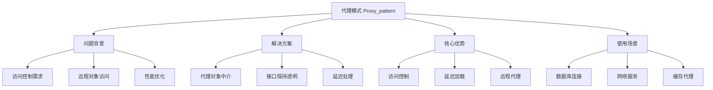
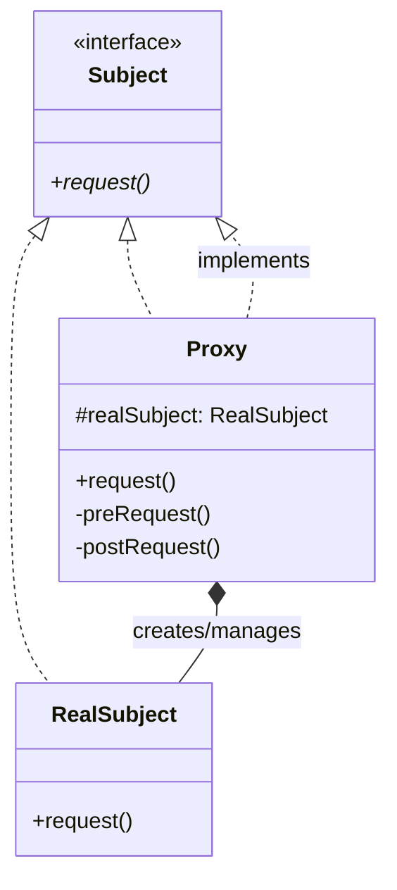

# 🛡️ 代理模式详解

[[04-结构型模式/03-装饰器模式]] ← [[04-结构型模式/05-外观模式]]
## 🎯 代理模式概览

### 📊 模式基本信息



### 🎯 **定义与意图**
代理模式为其他对象提供一种代理以控制对这个对象的访问。代理对象在客户端和目标对象之间起到中介作用，并可以对目标对象的访问进行额外处理。

### 📋 **核心价值**
- **访问控制**: 提供目标对象的访问控制机制
- **延迟加载**: 延迟目标对象的创建和初始化
- **增强功能**: 在不改变目标对象的情况下添加新功能
- **性能优化**: 通过缓存等方式提升访问性能

## 🏗️ 代理模式结构

### 📊 **类图结构**



### 🎯 **角色职责**

#### **Subject (主题接口)**
- 定义了RealSubject和Proxy的共同接口
- 客户端通过该接口访问RealSubject

#### **RealSubject (真实主题)**
- 定义了代理所代表的真实对象
- 包含了具体的业务逻辑实现

#### **Proxy (代理对象)**
- 保存了一个引用使得代理可以访问实体
- 提供一个与Subject接口相同的接口，以便代理可以替代表象
- 控制对真实主题的访问，并可能负责创建和删除它

## 💻 代理模式实现

### 🎯 **Java动态代理实现**

```java
// ✅ 服务接口定义
public interface UserService {
    User getUserById(Long id);
    User saveUser(User user);
    void deleteUser(Long id);
    List<User> getAllUsers();
}

// ✅ 真实服务实现
@Service
public class UserServiceImpl implements UserService {
    
    @Autowired
    private UserRepository userRepository;
    
    @Override
    public User getUserById(Long id) {
        System.out.println("从数据库查询用户: " + id);
        return userRepository.findById(id).orElse(null);
    }
    
    @Override
    public User saveUser(User user) {
        System.out.println("保存用户到数据库: " + user);
        return userRepository.save(user);
    }
    
    @Override
    public void deleteUser(Long id) {
        System.out.println("从数据库删除用户: " + id);
        userRepository.deleteById(id);
    }
    
    @Override
    public List<User> getAllUsers() {
        System.out.println("查询所有用户");
        return userRepository.findAll();
    }
}

// ✅ JDK动态代理实现
@Component
public class UserServiceProxy implements InvocationHandler {
    
    private final UserService target;
    private final CacheManager cacheManager;
    private final AuditService auditService;
    
    public UserServiceProxy(UserService target, 
                          CacheManager cacheManager,
                          AuditService auditService) {
        this.target = target;
        this.cacheManager = cacheManager;
        this.auditService = auditService;
    }
    
    @Override
    public Object invoke(Object proxy, Method method, Object[] args) throws Throwable {
        String methodName = method.getName();
        System.out.println("代理方法调用: " + methodName);
        
        // ✅ 前置处理
        preInvoke(method, args);
        
        Object result = null;
        try {
            // ✅ 缓存逻辑
            if ("getUserById".equals(methodName)) {
                Long userId = (Long) args[0];
                result = getUserByIdWithCache(userId);
            } else {
                result = method.invoke(target, args);
            }
            
            // ✅ 审计记录
            auditService.logOperation(methodName, args, result, true);
            
        } catch (Exception e) {
            auditService.logOperation(methodName, args, null, false);
            throw e;
        } finally {
            // ✅ 后置处理
            postInvoke(method, args, result);
        }
        
        return result;
    }
    
    // ✅ 用户查询的缓存代理逻辑
    @SuppressWarnings("unchecked")
    private User getUserByIdWithCache(Long userId) throws Exception {
        String cacheKey = "user:" + userId;
        
        // 先查缓存
        User cachedUser = (User) cacheManager.get(cacheKey);
        if (cachedUser != null) {
            System.out.println("从缓存获取用户: " + userId);
            return cachedUser;
        }
        
        // 缓存未命中，调用真实方法
        Method method = target.getClass().getMethod("getUserById", Long.class);
        User user = (User) method.invoke(target, userId);
        
        // 放入缓存
        if (user != null) {
            cacheManager.put(cacheKey, user, Duration.ofMinutes(30));
        }
        
        return user;
    }
    
    private void preInvoke(Method method, Object[] args) {
        System.out.println("执行前置处理: " + method.getName());
        // 记录请求日志、权限检查等
    }
    
    private void postInvoke(Method method, Object[] args, Object result) {
        System.out.println("执行后置处理: " + method.getName());
        // 记录响应日志、性能统计等
    }
    
    // ✅ 创建代理实例的工厂方法
    public static UserService createProxy(UserService target,
                                       CacheManager cacheManager,
                                       AuditService auditService) {
        return (UserService) Proxy.newProxyInstance(
            target.getClass().getClassLoader(),
            target.getClass().getInterfaces(),
            new UserServiceProxy(target, cacheManager, auditService)
        );
    }
}
```

### 🎯 **延迟加载代理**

```java
// ✅ 延迟加载的用户代理
public class LazyUserProxy implements UserService {
    
    private UserService realSubject;
    private final UserServiceFactory serviceFactory;
    private final CacheManager cacheManager;
    private volatile boolean initialized = false;
    
    public LazyUserProxy(UserServiceFactory serviceFactory, CacheManager cacheManager) {
        this.serviceFactory = serviceFactory;
        this.cacheManager = cacheManager;
    }
    
    @Override
    public User getUserById(Long id) {
        ensureInitialized();
        return realSubject.getUserById(id);
    }
    
    @Override
    public User saveUser(User user) {
        ensureInitialized();
        return realSubject.saveUser(user);
    }
    
    @Override
    public void deleteUser(Long id) {
        ensureInitialized();
        realSubject.deleteUser(id);
    }
    
    @Override
    public List<User> getAllUsers() {
        ensureInitialized();
        return realSubject.getAllUsers();
    }
    
    // ✅ 双重检查锁定确保线程安全
    private void ensureInitialized() {
        if (!initialized) {
            synchronized (this) {
                if (!initialized) {
                    realSubject = serviceFactory.createUserService();
                    initialized = true;
                    System.out.println("用户服务已初始化");
                }
            }
        }
    }
    
    // ✅ 代理状态检查
    public boolean isInitialized() {
        return initialized;
    }
    
    // ✅ 资源清理
    public void shutdown() {
        if (initialized && realSubject instanceof AutoCloseable) {
            try {
                ((AutoCloseable) realSubject).close();
            } catch (Exception e) {
                System.err.println("关闭用户服务失败: " + e.getMessage());
            }
        }
    }
}

// ✅ 远程代理实现
@Component
public class RemoteUserServiceProxy implements UserService {
    
    private final RestTemplate restTemplate;
    private final String remoteServiceUrl;
    private final CircuitBreaker circuitBreaker;
    
    public RemoteUserServiceProxy(RestTemplate restTemplate,
                                String remoteServiceUrl,
                                CircuitBreaker circuitBreaker) {
        this.restTemplate = restTemplate;
        this.remoteServiceUrl = remoteServiceUrl;
        this.circuitBreaker = circuitBreaker;
    }
    
    @Override
    public User getUserById(Long id) {
        return circuitBreaker.executeSupplier(() -> {
            String url = remoteServiceUrl + "/users/" + id;
            ResponseEntity<User> response = restTemplate.getForEntity(url, User.class);
            return response.getBody();
        });
    }
    
    @Override
    public User saveUser(User user) {
        return circuitBreaker.executeSupplier(() -> {
            String url = remoteServiceUrl + "/users";
            ResponseEntity<User> response = restTemplate.postForEntity(url, user, User.class);
            return response.getBody();
        });
    }
    
    @Override
    public void deleteUser(Long id) {
        circuitBreaker.executeSupplier(() -> {
            String url = remoteServiceUrl + "/users/" + id;
            restTemplate.delete(url);
            return null;
        });
    }
    
    @Override
    public List<User> getAllUsers() {
        return circuitBreaker.executeSupplier(() -> {
            String url = remoteServiceUrl + "/users";
            ResponseEntity<List<User>> response = restTemplate.exchange(
                url, HttpMethod.GET, null, new ParameterizedTypeReference<List<User>>() {}
            );
            return response.getBody();
        });
    }
}
```

## 🌟 Spring AOP中的代理模式

### 🎯 **Spring代理机制深度解析**

```java
// ✅ Spring事务代理示例
@Service
@Transactional
public class UserService {
    
    @Autowired
    private UserRepository userRepository;
    
    // ✅ 这个方法的调用会被Spring代理拦截
    public User createUserWithRollback(User user) {
        User savedUser = userRepository.save(user);
        
        // 模拟业务逻辑
        if (user.getEmail().contains("test")) {
            throw new RuntimeException("测试用户不允许创建");
        }
        
        return savedUser;
    }
    
    // ✅ 嵌套事务代理
    @Transactional(propagation = Propagation.REQUIRES_NEW)
    public void auditUserCreation(User user) {
        AuditLog auditLog = new AuditLog();
        auditLog.setAction("USER_CREATED");
        auditLog.setUserId(user.getId());
        auditLog.setTimestamp(Instant.now());
        
        // 审计日志保存（在新事务中）
        auditRepository.save(auditLog);
    }
}

// ✅ 自定义AOP代理
@Aspect
@Component
public class PerformanceAspect {
    
    private static final Logger logger = LoggerFactory.getLogger(PerformanceAspect.class);
    
    // ✅ 方法执行性能代理
    @Around("@annotation(MonitorPerformance)")
    public Object monitorPerformance(ProceedingJoinPoint joinPoint) throws Throwable {
        String className = joinPoint.getTarget().getClass().getSimpleName();
        String methodName = joinPoint.getSignature().getName();
        
        long startTime = System.currentTimeMillis();
        
        try {
            Object result = joinPoint.proceed();
            return result;
        } finally {
            long duration = System.currentTimeMillis() - startTime;
            logger.info("Performance - {}:{} took {}ms", className, methodName, duration);
            
            // 记录性能指标
            MetricsCollector.recordTiming(className, methodName, duration);
        }
    }
    
    // ✅ 安全代理：权限检查
    @Before("@annotation(RequirePermission)")
    public void checkPermission(JoinPoint joinPoint) {
        RequirePermission annotation = findAnnotation(joinPoint);
        String requiredPermission = annotation.value();
        
        SecurityContext context = SecurityContextHolder.getContext();
        Authentication auth = context.getAuthentication();
        
        if (auth == null || !hasPermission(auth, requiredPermission)) {
            throw new AccessDeniedException("缺少权限: " + requiredPermission);
        }
    }
    
    // ✅ 缓存代理：方法级别缓存
    @Around("@annotation(Cacheable)")
    public Object cacheResult(ProceedingJoinPoint joinPoint) throws Throwable {
        Cacheable annotation = findCacheableAnnotation(joinPoint);
        String cacheKey = generateCacheKey(joinPoint, annotation.key());
        
        Object cachedResult = cacheManager.get(cacheKey);
        if (cachedResult != null) {
            logger.info("缓存命中: {}", cacheKey);
            return cachedResult;
        }
        
        Object result = joinPoint.proceed();
        
        Duration cacheTimeout = Duration.parse(annotation.timeout());
        cacheManager.put(cacheKey, result, cacheTimeout);
        
        logger.info("结果已缓存: {}", cacheKey);
        return result;
    }
}
```

### 🎯 **Spring Boot配置代理**

```java
// ✅ Spring Boot配置类中的代理配置
@Configuration
@EnableAspectJAutoProxy(proxyTargetClass = true)
public class ProxyConfiguration {
    
    // ✅ JDK动态代理配置
    @Bean(name = "userServiceJdkProxy")
    @Scope("prototype")
    public UserService userServiceJdkProxy(@Qualifier("userServiceImpl") UserService target) {
        
        ProxyFactory proxyFactory = new ProxyFactory();
        proxyFactory.setTarget(target);
        proxyFactory.setInterfaces(UserService.class);
        
        // ✅ 添加代理拦截器
        proxyFactory.addInterceptor(new MethodInterceptor() {
            @Override
            public Object invoke(MethodInvocation invocation) throws Throwable {
                System.out.println("JDK代理拦截: " + invocation.getMethod().getName());
                return invocation.proceed();
            }
        });
        
        return (UserService) proxyFactory.getProxy();
    }
    
    // ✅ CGLib代理配置
    @Bean(name = "userServiceCglibProxy")
    @Scope("prototype")
    public UserService userServiceCglibProxy(@Qualifier("userServiceImpl") UserService target) {
        
        ProxyFactory proxyFactory = new ProxyFactory();
        proxyFactory.setTarget(target);
        proxyFactory.setProxyTargetClass(true); // ✅ 强制使用CGLib
        
        proxyFactory.addAdvice(new MethodBeforeAdvice() {
            @Override
            public void before(Method method, Object[] args, Object target) throws Throwable {
                System.out.println("CGLib代理前置通知: " + method.getName());
            }
        });
        
        return (UserService) proxyFactory.getProxy();
    }
    
    // ✅ 代理选择器配置
    @Bean
    public DefaultAdvisorAutoProxyCreator autoProxyCreator() {
        DefaultAdvisorAutoProxyCreator creator = new DefaultAdvisorAutoProxyCreator();
        
        // ✅ 设置代理构造器的选择器
        creator.setProxyCreatorFactory(proxyCreatorFactory());
        
        return creator;
    }
    
    @Bean
    public ProxyCreatorFactory proxyCreatorFactory() {
        return new ProxyCreatorFactory() {
            @Override
            public boolean useCglibProxy() {
                // ✅ 根据条件选择代理类型
                return !System.getProperty("proxy.type", "").equals("jdk");
            }
        };
    }
}
```

## 🔧 代理模式高级应用

### 🎯 **微服务中的网关代理**

```java
// ✅ API网关代理实现
@Component
public class ApiGatewayProxy {
    
    private final Map<String, ServiceProxy> services;
    private final LoadBalancer loadBalancer;
    
    public ApiGatewayProxy(LoadBalancer loadBalancer) {
        this.loadBalancer = loadBalancer;
        this.services = new ConcurrentHashMap<>();
    }
    
    // ✅ 服务注册和代理生成
    public void registerService(String serviceName, List<String> instances) {
        ServiceProxy proxy = new ServiceProxy(serviceName, instances, loadBalancer);
        services.put(serviceName, proxy);
    }
    
    // ✅ 代理调用
    public ResponseEntity<?> proxyRequest(String serviceName, 
                                        HttpMethod method,
                                        String path, 
                                        HttpHeaders headers,
                                        Object body) {
        
        ServiceProxy proxy = services.get(serviceName);
        if (proxy == null) {
            return ResponseEntity.notFound().build();
        }
        
        return proxy.forwardRequest(method, path, headers, body);
    }
    
    // ✅ 内部服务代理类
    private static class ServiceProxy {
        
        private final String serviceName;
        private final List<String> instances;
        private final LoadBalancer loadBalancer;
        private final RestTemplate restTemplate;
        
        public ServiceProxy(String serviceName, List<String> instances, LoadBalancer loadBalancer) {
            this.serviceName = serviceName;
            this.instances = instances;
            this.loadBalancer = loadBalancer;
            this.restTemplate = new RestTemplate();
        }
        
        public ResponseEntity<?> forwardRequest(HttpMethod method,
                                              String path,
                                              HttpHeaders headers,
                                              Object body) {
            
            // ✅ 负载均衡选择实例
            String instanceUrl = loadBalancer.selectInstance(instances);
            
            try {
                // ✅ 构建请求
                URI uri = new URI(instanceUrl + path);
                HttpEntity<?> entity = new HttpEntity<>(body, headers);
                
                // ✅ 转发请求
                ResponseEntity<String> response = restTemplate.exchange(
                    uri, method, entity, String.class);
                
                return ResponseEntity.ok(response.getBody());
                
            } catch (Exception e) {
                return ResponseEntity.status(HttpStatus.SERVICE_UNAVAILABLE).build();
            }
        }
    }
}

// ✅ 缓存代理服务器
@Component
public class CacheProxyServer {
    
    private final Map<String, ObjectStore> cacheStores;
    private final CachePolicy cachePolicy;
    
    public CacheProxyServer(CachePolicy cachePolicy) {
        this.cachePolicy = cachePolicy;
        this.cacheStores = new ConcurrentHashMap<>();
    }
    
    // ✅ 缓存代理操作
    public <T> T get(String key, Class<T> type, Supplier<T> valueLoader) {
        
        if (cachePolicy.shouldCache(key)) {
            ObjectStore store = getStoreForType(type);
            
            @SuppressWarnings("unchecked")
            T cachedValue = (T) store.get(key);
            
            if (cachedValue != null) {
                cachePolicy.recordHit(key);
                return cachedValue;
            }
            
            cachePolicy.recordMiss(key);
        }
        
        // ✅ 缓存未命中，执行实际加载
        T value = valueLoader.get();
        
        if (cachePolicy.shouldCache(key) && value != null) {
            ObjectStore store = getStoreForType(type);
            store.put(key, value, cachePolicy.getTtl(key));
        }
        
        return value;
    }
    
    // ✅ 异步缓存代理
    public <T> CompletableFuture<T> getAsync(String key, Class<T> type, Supplier<T> valueLoader) {
        
        return CompletableFuture.supplyAsync(() -> {
            
            if (cachePolicy.shouldCache(key)) {
                ObjectStore store = getStoreForType(type);
                
                @SuppressWarnings("unchecked")
                T cachedValue = (T) store.get(key);
                
                if (cachedValue != null) {
                    cachePolicy.recordHit(key);
                    return cachedValue;
                }
            }
            
            return valueLoader.get();
            
        }).thenApply(value -> {
            
            // ✅ 异步更新缓存
            if (cachePolicy.shouldCache(key) && value != null) {
                ObjectStore store = getStoreForType(type);
                store.putAsync(key, value, cachePolicy.getTtl(key));
            }
            
            return value;
        });
    }
    
    private ObjectStore getStoreForType(Class<?> type) {
        return cacheStores.computeIfAbsent(type.getSimpleName(), 
            k -> new ObjectStore());
    }
}
```

## 📊 代理模式性能优化

### 🎯 **代理池优化**

```java
// ✅ 代理对象池化
@Component
public class ProxyPool<T> {
    
    private final Queue<T> availableProxies;
    private final Map<T, Boolean> proxyMap;
    private final Supplier<T> proxyFactory;
    private final int maxSize;
    private final AtomicInteger currentSize;
    
    public ProxyPool(Supplier<T> proxyFactory, int maxSize) {
        this.proxyFactory = proxyFactory;
        this.maxSize = maxSize;
        this.availableProxies = new ConcurrentLinkedQueue<>();
        this.proxyMap = new ConcurrentHashMap<>();
        this.currentSize = new AtomicInteger(0);
    }
    
    // ✅ 获取代理对象
    public T borrowProxy() {
        T proxy = availableProxies.poll();
        
        if (proxy == null) {
            proxy = createProxy();
        }
        
        proxyMap.put(proxy, true); // 标记为使用中
        return proxy;
    }
    
    // ✅ 归还代理对象
    public void returnProxy(T proxy) {
        if (proxyMap.containsKey(proxy)) {
            proxyMap.put(proxy, false);
            
            if (shouldReturnToPool(proxy)) {
                availableProxies.offer(proxy);
            }
        }
    }
    
    // ✅ 代理生命周期管理
    public void warmup(int count) {
        for (int i = 0; i < Math.min(count, maxSize); i++) {
            if (currentSize.get() < maxSize) {
                T proxy = createProxy();
                availableProxies.offer(proxy);
                proxyMap.put(proxy, false);
            }
        }
    }
    
    public void shutdown() {
        availableProxies.clear();
        
        proxyMap.keySet().forEach(proxy -> {
            if (proxy instanceof AutoCloseable) {
                try {
                    ((AutoCloseable) proxy).close();
                } catch (Exception e) {
                    logger.warn("关闭代理失败", e);
                }
            }
        });
        
        proxyMap.clear();
    }
    
    private T createProxy() {
        if (currentSize.incrementAndGet() <= maxSize) {
            return proxyFactory.get();
        } else {
            currentSize.decrementAndGet();
            throw new IllegalStateException("代理池已满，无法创建新代理");
        }
    }
    
    private boolean shouldReturnToPool(T proxy) {
        // 根据代理的状态决定是否应该返回池中
        return isProxyHealthy(proxy) && availableProxies.size() < maxSize / 2;
    }
    
    private boolean isProxyHealthy(T proxy) {
        // 检查代理的健康状态
        return true; // 简化实现
    }
    
    // ✅ 代理池统计
    public ProxyPoolStatistics getStatistics() {
        return new ProxyPoolStatistics(
            proxyMap.size(),
            maxSize,
            availableProxies.size(),
            proxyMap.values().stream().mapToInt(b -> b ? 1 : 0).sum()
        );
    }
}
```

## 🚀 代理模式最佳实践

### 📋 **使用指南**

1. **代理类型选择**:
   - JDK动态代理：适用于接口代理
   - CGLib代理：适用于类代理
   - 静态代理：编译时确定，性能最优

2. **代理场景**:
   - 远程代理：网络通信代理
   - 虚拟代理：延迟加载代理
   - 保护代理：访问控制代理
   - 智能引用代理：引用计数、缓存

3. **性能考虑**:
   - 代理创建的成本
   - 方法调用的额外开销
   - 内存占用

### ⚠️ **注意事项**

1. **接口依赖性**: JDK代理只能代理接口
2. **final方法**: CGLib无法代理final方法
3. **包可见性**: 代理对包可见性有限制
4. **类型转换**: 代理对象与原对象类型不同

## 📊 与其他模式的对比

| 对比维度 | 代理模式 | 装饰器模式 | 适配器模式 |
|----------|----------|------------|------------|
| **目的** | 访问控制 | 功能扩展 | 接口转换 |
| **关系** | 代理目标 | 装饰原对象 | 适配不相容 |
| **透明性** | 可能不透明 | 完全透明 | 透明转换 |
| **实现** | 代理委托 | 包装增强 | 适配包装 |

## 🔗 学习衔接

- **上一模式** ← [[装饰器模式]]
- **下一模式** → [[外观模式]]
- **模式对比** → [[04-结构型模式/09-结构型模式对比表]]
- **Spring应用** → [[设计模式最佳实践秘典]]

---
**💡 代理模式精髓**: 代理就像一个中间人，在你和真实目标之间起到桥梁作用。它不仅能够控制访问，还能在访问前后进行各种处理，是现代框架中非常重要的模式！
