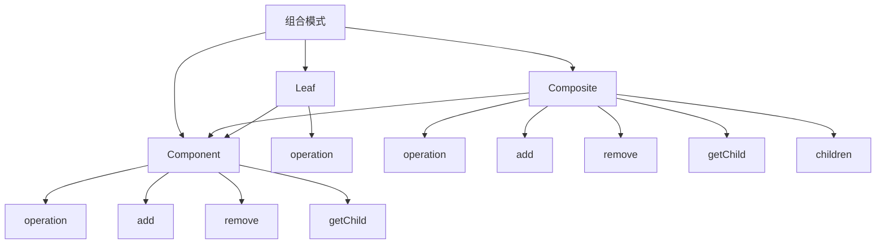

# 🌳 组合模式

[[04-结构型模式/03-桥接模式]] ← [[04-结构型模式/05-装饰器模式]]
## 🎯 组合模式概览

### 📊 模式结构图



## 🏗️ 模式定义与特点

### 📋 **模式定义**
组合模式将对象组合成树形结构以表示"部分-整体"的层次结构。组合模式使得用户对单个对象和组合对象的使用具有一致性。

### 📋 **核心特点**
- **树形结构**: 表示部分-整体的层次结构
- **统一接口**: 对单个对象和组合对象使用统一接口
- **递归结构**: 支持递归操作
- **透明性**: 客户端无需区分叶子节点和组合节点

### 📋 **适用场景**
- 需要表示对象的层次结构
- 需要统一处理单个对象和组合对象
- 需要递归操作
- 需要动态添加或删除组件

## 🏗️ 模式实现

### 📋 **基础实现**

#### **组件接口**
```java
// ✅ 组件接口
public interface Component {
    void operation();
    void add(Component component);
    void remove(Component component);
    Component getChild(int index);
}

// ✅ 叶子节点
public class Leaf implements Component {
    private String name;
    
    public Leaf(String name) {
        this.name = name;
    }
    
    @Override
    public void operation() {
        System.out.println("Leaf " + name + " operation");
    }
    
    @Override
    public void add(Component component) {
        throw new UnsupportedOperationException("Cannot add to leaf");
    }
    
    @Override
    public void remove(Component component) {
        throw new UnsupportedOperationException("Cannot remove from leaf");
    }
    
    @Override
    public Component getChild(int index) {
        throw new UnsupportedOperationException("Leaf has no children");
    }
}

// ✅ 组合节点
public class Composite implements Component {
    private String name;
    private List<Component> children;
    
    public Composite(String name) {
        this.name = name;
        this.children = new ArrayList<>();
    }
    
    @Override
    public void operation() {
        System.out.println("Composite " + name + " operation");
        for (Component child : children) {
            child.operation();
        }
    }
    
    @Override
    public void add(Component component) {
        children.add(component);
    }
    
    @Override
    public void remove(Component component) {
        children.remove(component);
    }
    
    @Override
    public Component getChild(int index) {
        return children.get(index);
    }
}
```

#### **使用示例**
```java
// ✅ 客户端使用
public class Client {
    public static void main(String[] args) {
        // 创建根节点
        Composite root = new Composite("Root");
        
        // 创建分支节点
        Composite branch1 = new Composite("Branch1");
        Composite branch2 = new Composite("Branch2");
        
        // 创建叶子节点
        Leaf leaf1 = new Leaf("Leaf1");
        Leaf leaf2 = new Leaf("Leaf2");
        Leaf leaf3 = new Leaf("Leaf3");
        
        // 构建树形结构
        root.add(branch1);
        root.add(branch2);
        branch1.add(leaf1);
        branch1.add(leaf2);
        branch2.add(leaf3);
        
        // 执行操作
        root.operation();
    }
}
```

## 🏗️ 实际应用案例

### 📋 **文件系统组合案例**

#### **文件系统组合**
```java
// ✅ 文件系统组件接口
public interface FileSystemComponent {
    void display(String indent);
    long getSize();
    void add(FileSystemComponent component);
    void remove(FileSystemComponent component);
    FileSystemComponent getChild(int index);
}

// ✅ 文件类（叶子节点）
public class File implements FileSystemComponent {
    private String name;
    private long size;
    
    public File(String name, long size) {
        this.name = name;
        this.size = size;
    }
    
    @Override
    public void display(String indent) {
        System.out.println(indent + "File: " + name + " (" + size + " bytes)");
    }
    
    @Override
    public long getSize() {
        return size;
    }
    
    @Override
    public void add(FileSystemComponent component) {
        throw new UnsupportedOperationException("Cannot add to file");
    }
    
    @Override
    public void remove(FileSystemComponent component) {
        throw new UnsupportedOperationException("Cannot remove from file");
    }
    
    @Override
    public FileSystemComponent getChild(int index) {
        throw new UnsupportedOperationException("File has no children");
    }
}

// ✅ 文件夹类（组合节点）
public class Directory implements FileSystemComponent {
    private String name;
    private List<FileSystemComponent> children;
    
    public Directory(String name) {
        this.name = name;
        this.children = new ArrayList<>();
    }
    
    @Override
    public void display(String indent) {
        System.out.println(indent + "Directory: " + name);
        for (FileSystemComponent child : children) {
            child.display(indent + "  ");
        }
    }
    
    @Override
    public long getSize() {
        long totalSize = 0;
        for (FileSystemComponent child : children) {
            totalSize += child.getSize();
        }
        return totalSize;
    }
    
    @Override
    public void add(FileSystemComponent component) {
        children.add(component);
    }
    
    @Override
    public void remove(FileSystemComponent component) {
        children.remove(component);
    }
    
    @Override
    public FileSystemComponent getChild(int index) {
        return children.get(index);
    }
}
```

#### **使用示例**
```java
// ✅ 使用示例
public class FileSystemDemo {
    public static void main(String[] args) {
        // 创建根目录
        Directory root = new Directory("Root");
        
        // 创建子目录
        Directory documents = new Directory("Documents");
        Directory pictures = new Directory("Pictures");
        Directory videos = new Directory("Videos");
        
        // 创建文件
        File file1 = new File("readme.txt", 1024);
        File file2 = new File("config.xml", 2048);
        File file3 = new File("photo1.jpg", 512000);
        File file4 = new File("photo2.jpg", 768000);
        File file5 = new File("movie1.mp4", 1024000);
        File file6 = new File("movie2.mp4", 2048000);
        
        // 构建文件系统
        root.add(documents);
        root.add(pictures);
        root.add(videos);
        
        documents.add(file1);
        documents.add(file2);
        
        pictures.add(file3);
        pictures.add(file4);
        
        videos.add(file5);
        videos.add(file6);
        
        // 显示文件系统
        root.display("");
        
        // 计算总大小
        System.out.println("\nTotal size: " + root.getSize() + " bytes");
    }
}
```

### 📋 **组织架构组合案例**

#### **组织架构组合**
```java
// ✅ 组织架构组件接口
public interface OrganizationComponent {
    void display(String indent);
    void add(OrganizationComponent component);
    void remove(OrganizationComponent component);
    OrganizationComponent getChild(int index);
}

// ✅ 员工类（叶子节点）
public class Employee implements OrganizationComponent {
    private String name;
    private String position;
    private double salary;
    
    public Employee(String name, String position, double salary) {
        this.name = name;
        this.position = position;
        this.salary = salary;
    }
    
    @Override
    public void display(String indent) {
        System.out.println(indent + "Employee: " + name + " (" + position + ") - $" + salary);
    }
    
    @Override
    public void add(OrganizationComponent component) {
        throw new UnsupportedOperationException("Cannot add to employee");
    }
    
    @Override
    public void remove(OrganizationComponent component) {
        throw new UnsupportedOperationException("Cannot remove from employee");
    }
    
    @Override
    public OrganizationComponent getChild(int index) {
        throw new UnsupportedOperationException("Employee has no children");
    }
}

// ✅ 部门类（组合节点）
public class Department implements OrganizationComponent {
    private String name;
    private List<OrganizationComponent> members;
    
    public Department(String name) {
        this.name = name;
        this.members = new ArrayList<>();
    }
    
    @Override
    public void display(String indent) {
        System.out.println(indent + "Department: " + name);
        for (OrganizationComponent member : members) {
            member.display(indent + "  ");
        }
    }
    
    @Override
    public void add(OrganizationComponent component) {
        members.add(component);
    }
    
    @Override
    public void remove(OrganizationComponent component) {
        members.remove(component);
    }
    
    @Override
    public OrganizationComponent getChild(int index) {
        return members.get(index);
    }
}
```

#### **使用示例**
```java
// ✅ 使用示例
public class OrganizationDemo {
    public static void main(String[] args) {
        // 创建公司
        Department company = new Department("TechCorp");
        
        // 创建部门
        Department engineering = new Department("Engineering");
        Department marketing = new Department("Marketing");
        Department sales = new Department("Sales");
        
        // 创建子部门
        Department frontend = new Department("Frontend");
        Department backend = new Department("Backend");
        
        // 创建员工
        Employee ceo = new Employee("John Smith", "CEO", 200000);
        Employee cto = new Employee("Jane Doe", "CTO", 150000);
        Employee dev1 = new Employee("Bob Johnson", "Frontend Developer", 80000);
        Employee dev2 = new Employee("Alice Brown", "Backend Developer", 85000);
        Employee marketer1 = new Employee("Charlie Wilson", "Marketing Manager", 70000);
        Employee sales1 = new Employee("Diana Lee", "Sales Representative", 60000);
        
        // 构建组织架构
        company.add(ceo);
        company.add(engineering);
        company.add(marketing);
        company.add(sales);
        
        engineering.add(cto);
        engineering.add(frontend);
        engineering.add(backend);
        
        frontend.add(dev1);
        backend.add(dev2);
        
        marketing.add(marketer1);
        sales.add(sales1);
        
        // 显示组织架构
        company.display("");
    }
}
```

### 📋 **菜单系统组合案例**

#### **菜单系统组合**
```java
// ✅ 菜单组件接口
public interface MenuComponent {
    void display(String indent);
    void add(MenuComponent component);
    void remove(MenuComponent component);
    MenuComponent getChild(int index);
}

// ✅ 菜单项类（叶子节点）
public class MenuItem implements MenuComponent {
    private String name;
    private String description;
    private double price;
    private boolean vegetarian;
    
    public MenuItem(String name, String description, double price, boolean vegetarian) {
        this.name = name;
        this.description = description;
        this.price = price;
        this.vegetarian = vegetarian;
    }
    
    @Override
    public void display(String indent) {
        System.out.print(indent + name);
        if (vegetarian) {
            System.out.print(" (v)");
        }
        System.out.println(", $" + price);
        System.out.println(indent + "  " + description);
    }
    
    @Override
    public void add(MenuComponent component) {
        throw new UnsupportedOperationException("Cannot add to menu item");
    }
    
    @Override
    public void remove(MenuComponent component) {
        throw new UnsupportedOperationException("Cannot remove from menu item");
    }
    
    @Override
    public MenuComponent getChild(int index) {
        throw new UnsupportedOperationException("Menu item has no children");
    }
}

// ✅ 菜单类（组合节点）
public class Menu implements MenuComponent {
    private String name;
    private String description;
    private List<MenuComponent> items;
    
    public Menu(String name, String description) {
        this.name = name;
        this.description = description;
        this.items = new ArrayList<>();
    }
    
    @Override
    public void display(String indent) {
        System.out.println(indent + name + ", " + description);
        System.out.println(indent + "---------------------");
        for (MenuComponent item : items) {
            item.display(indent + "  ");
        }
    }
    
    @Override
    public void add(MenuComponent component) {
        items.add(component);
    }
    
    @Override
    public void remove(MenuComponent component) {
        items.remove(component);
    }
    
    @Override
    public MenuComponent getChild(int index) {
        return items.get(index);
    }
}
```

#### **使用示例**
```java
// ✅ 使用示例
public class MenuDemo {
    public static void main(String[] args) {
        // 创建主菜单
        Menu allMenus = new Menu("ALL MENUS", "All menus combined");
        
        // 创建早餐菜单
        Menu breakfastMenu = new Menu("PANCAKE HOUSE MENU", "Breakfast");
        MenuItem pancake = new MenuItem("K&B's Pancake Breakfast", "Pancakes with scrambled eggs, and toast", 2.99, true);
        MenuItem waffle = new MenuItem("Regular Pancake Breakfast", "Pancakes with fried eggs, sausage", 2.99, false);
        MenuItem blueberryPancake = new MenuItem("Blueberry Pancakes", "Pancakes made with fresh blueberries", 3.49, true);
        
        breakfastMenu.add(pancake);
        breakfastMenu.add(waffle);
        breakfastMenu.add(blueberryPancake);
        
        // 创建午餐菜单
        Menu lunchMenu = new Menu("DINER MENU", "Lunch");
        MenuItem veggieBurger = new MenuItem("Vegetarian BLT", "(Fakin') Bacon with lettuce & tomato on whole wheat", 2.99, true);
        MenuItem soup = new MenuItem("Soup of the day", "Soup of the day, with a side of potato salad", 3.29, false);
        MenuItem hotdog = new MenuItem("Hotdog", "A hot dog, with saurkraut, relish, onions, topped with cheese", 3.05, false);
        
        lunchMenu.add(veggieBurger);
        lunchMenu.add(soup);
        lunchMenu.add(hotdog);
        
        // 创建甜点菜单
        Menu dessertMenu = new Menu("DESSERT MENU", "Dessert of course!");
        MenuItem applePie = new MenuItem("Apple Pie", "Apple pie with a flakey crust, topped with vanilla icecream", 1.59, true);
        MenuItem cheesecake = new MenuItem("Cheesecake", "Creamy New York cheesecake, with a chocolate graham crust", 1.99, true);
        MenuItem frozenYogurt = new MenuItem("Frozen Yogurt", "Creamy frozen yogurt", 1.29, true);
        
        dessertMenu.add(applePie);
        dessertMenu.add(cheesecake);
        dessertMenu.add(frozenYogurt);
        
        // 构建菜单系统
        allMenus.add(breakfastMenu);
        allMenus.add(lunchMenu);
        allMenus.add(dessertMenu);
        
        // 显示菜单
        allMenus.display("");
    }
}
```

## 🎯 模式优势与劣势

### 📋 **优势**
- **统一接口**: 对单个对象和组合对象使用统一接口
- **递归结构**: 支持递归操作
- **透明性**: 客户端无需区分叶子节点和组合节点
- **易于扩展**: 可以轻松添加新的组件类型

### 📋 **劣势**
- **设计复杂**: 需要正确识别组件和组合的关系
- **性能问题**: 递归操作可能影响性能
- **类型安全**: 需要处理类型安全问题

### 📋 **与装饰器模式的区别**
| 方面 | 装饰器模式 | 组合模式 |
|------|------------|----------|
| **目的** | 功能增强 | 层次结构 |
| **关系** | 包装关系 | 包含关系 |
| **结构** | 链式结构 | 树形结构 |
| **使用** | 功能增强 | 统一处理 |

## 🔗 学习衔接

- **上一文档** ← [[桥接模式]]
- **下一文档** → [[装饰器模式]]
- **模式基础** → [[01-基础认知]]

---
**💡 组合精髓**: 组合模式就像搭积木，可以将简单的积木组合成复杂的结构。当我们需要表示层次结构，或者需要统一处理单个对象和组合对象时，组合模式是最佳选择！
