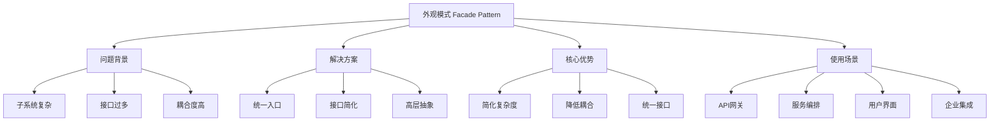
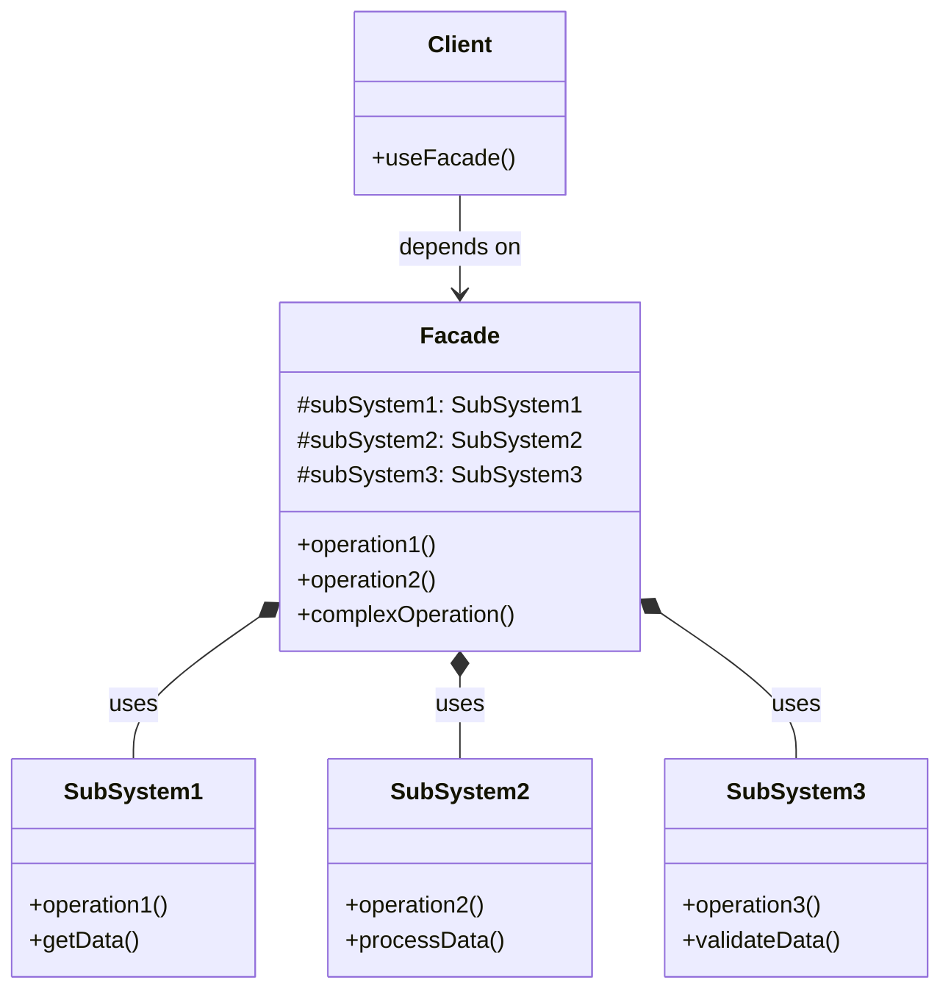

# 🏢 外观模式详解

[[04-结构型模式/04-代理模式]] ← [[04-结构型模式/06-组合模式]]
## 🎯 外观模式概览

### 📊 模式基本信息



### 🎯 **定义与意图**
外观模式为子系统中的一组接口提供一个一致的界面，定义一个高层接口，这个接口使得这一子系统更加容易使用。

### 📋 **核心价值**
- **简化接口**: 为复杂子系统提供简单易用的接口
- **降低耦合**: 客户端与子系统之间的解耦
- **统一门户**: 各个子系统的统一访问入口
- **易于维护**: 降低系统的复杂度和维护成本

## 🏗️ 外观模式结构

### 📊 **类图结构**



### 🎯 **角色职责**

#### **Facade (外观类)**
- 知道哪些子系统类负责处理请求
- 将客户的请求代理给适当的子系统对象

#### **SubSystem Classes (子系统类)**
- 实现子系统的功能
- 处理由Facade对象指派的任务
- 子系统类相互独立，没有Facade的任何信息

#### **Client (客户端)**
- 通过调用Facade的单一一套接口来使用子系统功能
- 无需直接与复杂的子系统交互

## 💻 外观模式实现

### 🎯 **经典实现示例**

```java
// ✅ 子系统1：用户服务
public class UserService {
    public User findUserById(Long id) {
        // 模拟数据库查询
        return User.builder()
            .id(id)
            .username("user" + id)
            .email("user" + id + "@example.com")
            .status("active")
            .build();
    }
    
    public User updateUserStatus(Long userId, String status) {
        User user = findUserById(userId);
        user.setStatus(status);
        System.out.println("用户状态已更新: " + userId + " -> " + status);
        return user;
    }
    
    public boolean validateUserPermissions(Long userId, String permission) {
        // 模拟权限验证
        System.out.println("验证用户权限: " + userId + " -> " + permission);
        return Math.random() > 0.3; // 70% 通过率
    }
}

// ✅ 子系统2：商品服务
public class ProductService {
    public Product findProductById(Long productId) {
        // 模拟商品查询
        return Product.builder()
            .id(productId)
            .name("Product " + productId)
            .price(new BigDecimal("99.99"))
            .stock(100)
            .category("Electronics")
            .build();
    }
    
    public boolean checkProductAvailability(Long productId, int quantity) {
        Product product = findProductById(productId);
        System.out.println("检查商品库存: " + productId + " 需要: " + quantity + " 可用: " + product.getStock());
        return product.getStock() >= quantity;
    }
    
    public boolean reserveProduct(Long productId, int quantity) {
        Product product = findProductById(productId);
        if (product.getStock() >= quantity) {
            product.setStock(product.getStock() - quantity);
            System.out.println("商品预留成功: " + productId + " 数量: " + quantity);
            return true;
        }
        return false;
    }
}

// ✅ 子系统3：订单服务
public class OrderService {
    public Order createOrder(Long userId, List<OrderItem> items) {
        Order order = Order.builder()
            .id(System.currentTimeMillis())
            .userId(userId)
            .items(new ArrayList<>(items))
            .status("pending")
            .createdAt(Instant.now())
            .build();
        
        System.out.println("订单创建成功: " + order.getId());
        return order;
    }
    
    public boolean processPayment(Long orderId, BigDecimal amount) {
        // 模拟支付处理
        System.out.println("处理支付: 订单" + orderId + " 金额: " + amount);
        return Math.random() > 0.1; // 90% 成功率
    }
    
    public void notifyCustomer(Long userId, String message) {
        System.out.println("通知客户 " + userId + ": " + message);
    }
}

// ✅ 外观类：购物门面
public class ShoppingFacade {
    private final UserService userService;
    private final ProductService productService;
    private final OrderService orderService;
    
    public ShoppingFacade(UserService userService,
                         ProductService productService,
                         OrderService orderService) {
        this.userService = userService;
        this.productService = productService;
        this.orderService = orderService;
    }
    
    // ✅ 简化接口1：一键购物
    public ShoppingResult buyProducts(Long userId, Map<Long, Integer> productQuantities) {
        
        System.out.println("开始购物流程...");
        
        // 1. 验证用户权限
        if (!userService.validateUserPermissions(userId, "purchase")) {
            return ShoppingResult.failure("用户权限不足");
        }
        
        // 2. 检查商品库存
        for (Map.Entry<Long, Integer> entry : productQuantities.entrySet()) {
            Long productId = entry.getKey();
            Integer quantity = entry.getValue();
            
            if (!productService.checkProductAvailability(productId, quantity)) {
                return ShoppingResult.failure("商品库存不足: " + productId);
            }
        }
        
        // 3. 创建订单
        List<OrderItem> orderItems = createOrderItems(productQuantities);
        Order order = orderService.createOrder(userId, orderItems);
        
        // 4. 预留商品
        for (OrderItem item : orderItems) {
            boolean reserved = productService.reserveProduct(item.getProductId(), item.getQuantity());
            if (!reserved) {
                return ShoppingResult.failure("商品预留失败: " + item.getProductId());
            }
        }
        
        // 5. 处理支付
        BigDecimal totalAmount = calculateTotalAmount(orderItems);
        if (!orderService.processPayment(order.getId(), totalAmount)) {
            return ShoppingResult.failure("支付失败");
        }
        
        // 6. 通知客户
        orderService.notifyCustomer(userId, "订单创建成功，订单号: " + order.getId());
        
        System.out.println("购物流程完成!");
        return ShoppingResult.success(order);
    }
    
    // ✅ 简化接口2：查询订单状态
    public OrderStatusInfo getOrderStatus(Long orderId, Long userId) {
        
        // 需要集成多个子系统才能提供完整信息
        Order order = getOrderById(orderId);
        User user = userService.findUserById(userId);
        
        return OrderStatusInfo.builder()
            .orderId(orderId)
            .orderStatus(order.getStatus())
            .customerName(user.getUsername())
            .createdAt(order.getCreatedAt())
            .totalAmount(calculateTotalAmount(order.getItems()))
            .build();
    }
    
    // ✅ 简化接口3：取消订单
    public boolean cancelOrder(Long orderId, Long userId) {
        
        System.out.println("取消订单流程开始...");
        
        // 1. 验证用户权限
        if (!userService.validateUserPermissions(userId, "cancel_order")) {
            System.out.println("用户权限不足");
            return false;
        }
        
        // 2. 获取订单信息
        Order order = getOrderById(orderId);
        if (order == null) {
            System.out.println("订单不存在");
            return false;
        }
        
        // 3. 检查订单状态
        if (!"pending".equals(order.getStatus())) {
            System.out.println("订单状态不允许取消");
            return false;
        }
        
        // 4. 释放预留商品
        for (OrderItem item : order.getItems()) {
            productService.reserveProduct(item.getProductId(), -item.getQuantity());
        }
        
        // 5. 更新订单状态
        order.setStatus("cancelled");
        
        // 6. 通知客户
        orderService.notifyCustomer(userId, "您的订单 " + orderId + " 已取消");
        
        System.out.println("订单取消成功!");
        return true;
    }
    
    // ✅ 私有辅助方法
    private List<OrderItem> createOrderItems(Map<Long, Integer> productQuantities) {
        return productQuantities.entrySet().stream()
            .map(entry -> {
                Product product = productService.findProductById(entry.getKey());
                return OrderItem.builder()
                    .productId(entry.getKey())
                    .productName(product.getName())
                    .quantity(entry.getValue())
                    .unitPrice(product.getPrice())
                    .build();
            })
            .collect(Collectors.toList());
    }
    
    private BigDecimal calculateTotalAmount(List<OrderItem> items) {
        return items.stream()
            .map(item -> item.getUnitPrice().multiply(BigDecimal.valueOf(item.getQuantity())))
            .reduce(BigDecimal.ZERO, BigDecimal::add);
    }
    
    private Order getOrderById(Long orderId) {
        // 模拟订单查询
        return Order.builder()
            .id(orderId)
            .userId(1001L)
            .status("pending")
            .build();
    }
}

// ✅ 客户端使用示例
public class ShoppingClient {
    public static void main(String[] args) {
        
        // ✅ 创建子系统实例
        UserService userService = new UserService();
        ProductService productService = new ProductService();
        OrderService orderService = new OrderService();
        
        // ✅ 创建外观实例
        ShoppingFacade shoppingFacade = new ShoppingFacade(userService, productService, orderService);
        
        // ✅ 使用简化的接口进行购物
        Long userId = 1001L;
        Map<Long, Integer> cartItems = Map.of(
            2001L, 2,  // 商品ID: 2001, 数量: 2
            2002L, 1   // 商品ID: 2002, 数量: 1
        );
        
        ShoppingResult result = shoppingFacade.buyProducts(userId, cartItems);
        System.out.println("购物结果: " + result);
        
        // ✅ 查询订单状态
        if (result.isSuccess()) {
            OrderStatusInfo statusInfo = shoppingFacade.getOrderStatus(result.getOrder().getId(), userId);
            System.out.println("订单状态: " + statusInfo);
        }
    }
}
```

### 🚀 **现代企业级实现**

```java
// ✅ 微服务API网关外观
@Component
public class ApiGatewayFacade {
    
    private final UserServiceClient userClient;
    private final ProductServiceClient productClient;
    private final OrderServiceClient orderClient;
    private final InventoryServiceClient inventoryClient;
    private final PaymentServiceClient paymentClient;
    private final NotificationServiceClient notificationClient;
    
    @Autowired
    public ApiGatewayFacade(UserServiceClient userClient,
                           ProductServiceClient productClient,
                           OrderServiceClient orderClient,
                           InventoryServiceClient inventoryClient,
                           PaymentServiceClient paymentClient,
                           NotificationServiceClient notificationClient) {
        this.userClient = userClient;
        this.productClient = productClient;
        this.orderClient = orderClient;
        this.inventoryClient = inventoryClient;
        this.paymentClient = paymentClient;
        this.notificationClient = notificationClient;
    }
    
    // ✅ 统一订单创建接口
    @PostMapping("/api/orders")
    public ResponseEntity<OrderResponse> createOrder(@RequestBody @Valid CreateOrderRequest request,
                                                   HttpServletRequest httpRequest) {
        
        try {
            // ✅ 应用外观模式：整合多个微服务
            return executeOrderCreation(request, httpRequest);
        } catch (Exception e) {
            log.error("订单创建失败", e);
            return ResponseEntity.status(HttpStatus.INTERNAL_SERVER_ERROR)
                .body(OrderResponse.failure("订单创建失败: " + e.getMessage()));
        }
    }
    
    private ResponseEntity<OrderResponse> executeOrderCreation(CreateOrderRequest request,
                                                             HttpServletRequest httpRequest) {
        
        String requestId = httpRequest.getHeader("X-Request-ID");
        String userId = extractUserId(httpRequest);
        
        // ✅ 步骤1：用户验证和权限检查
        UserInfo user = userClient.getUserInfo(userId);
        if (!isUserAuthorized(user, "create_order")) {
            return ResponseEntity.status(HttpStatus.FORBIDDEN)
                .body(OrderResponse.failure("用户无权限创建订单"));
        }
        
        // ✅ 步骤2：库存预留
        InventoryReservationResult inventoryResult = inventoryClient.reserveInventory(request.getItems());
        if (!inventoryResult.isSuccessful()) {
            return ResponseEntity.status(HttpStatus.BAD_REQUEST)
                .body(OrderResponse.failure("库存不足: " + inventoryResult.getErrorMessage()));
        }
        
        // ✅ 步骤3：创建订单
        OrderInfo order = orderClient.createOrder(CreateOrderInfo.builder()
            .userId(userId)
            .items(mapItems(request.getItems()))
            .shippingAddress(request.getShippingAddress())
            .paymentInfo(request.getPaymentInfo())
            .build());
        
        // ✅ 步骤4：处理支付
        PaymentResult paymentResult = paymentClient.processPayment(PaymentRequest.builder()
            .orderId(order.getId())
            .amount(order.getTotalAmount())
            .paymentMethod(request.getPaymentInfo().getMethod())
            .customerInfo(user.getCustomerInfo())
            .build());
        
        if (!paymentResult.isSuccessful()) {
            // ✅ 支付失败时撤销订单和库存预留
            compensationService.compensate(paymentResult.getTransactionId());
            return ResponseEntity.status(HttpStatus.PAYMENT_REQUIRED)
                .body(OrderResponse.failure("支付失败: " + paymentResult.getErrorMessage()));
        }
        
        // ✅ 步骤5：发送通知
        notificationClient.sendNotification(SendNotificationRequest.builder()
            .userId(userId)
            .type("ORDER_CREATED")
            .orderId(order.getId())
            .channel("EMAIL")
            .build());
        
        // ✅ 步骤6：返回成功响应
        OrderResponse response = OrderResponse.success(OrderResponseData.builder()
            .orderId(order.getId())
            .status(order.getStatus())
            .totalAmount(order.getTotalAmount())
            .estimatedDelivery(order.getEstimatedDelivery())
            .trackingNumber(order.getTrackingNumber())
            .build());
        
        return ResponseEntity.ok(response);
    }
    
    // ✅ 统一订单查询接口
    @GetMapping("/api/orders/{orderId}")
    public ResponseEntity<OrderDetailResponse> getOrderDetail(@PathVariable String orderId,
                                                           HttpServletRequest request) {
        
        String userId = extractUserId(request);
        
        try {
            // ✅ 外观模式：聚合多个服务的订单详情
            OrderDetailAggregate aggregate = aggregateOrderDetails(orderId, userId);
            
            OrderDetailResponse response = OrderDetailResponse.builder()
                .orderId(orderId)
                .orderInfo(aggregate.getOrderInfo())
                .customerInfo(aggregate.getCustomerInfo())
                .productDetails(aggregate.getProductDetails())
                .shippingInfo(aggregate.getShippingInfo())
                .paymentInfo(aggregate.getPaymentInfo())
                .timeline(aggregate.getTimeline())
                .build();
            
            return ResponseEntity.ok(response);
            
        } catch (EntityNotFoundException e) {
            return ResponseEntity.notFound().build();
        } catch (AuthorizationException e) {
            return ResponseEntity.status(HttpStatus.FORBIDDEN)
                .body(OrderDetailResponse.failure("无权限访问此订单"));
        } catch (Exception e) {
            log.error("订单详情查询失败", e);
            return ResponseEntity.status(HttpStatus.INTERNAL_SERVER_ERROR)
                .body(OrderDetailResponse.failure("订单详情查询失败"));
        }
    }
    
    // ✅ 聚合订单详情
    private OrderDetailAggregate aggregateOrderDetails(String orderId, String userId) {
        
        // ✅ 并行调用多个服务获取信息
        CompletableFuture<OrderInfo> orderFuture = orderClient.getOrderInfoAsync(orderId);
        CompletableFuture<List<ProductDetail>> productsFuture = productClient.getProductDetailsAsync(orderId);
        CompletableFuture<ShippingInfo> shippingFuture = orderService.getShippingInfoAsync(orderId);
        CompletableFuture<PaymentInfo> paymentFuture = paymentClient.getPaymentInfoAsync(orderId);
        
        // ✅ 验证权限
        OrderInfo orderInfo = orderFuture.join();
        if (!orderInfo.getUserId().equals(userId)) {
            throw new AuthorizationException("无权访问用户订单");
        }
        
        // ✅ 获取用户信息
        UserInfo customerInfo = userClient.getUserInfo(userId);
        
        // ✅ 构建响应数据
        return OrderDetailAggregate.builder()
            .orderInfo(orderInfo)
            .customerInfo(customerInfo)
            .productDetails(productsFuture.join())
            .shippingInfo(shippingFuture.join())
            .paymentInfo(paymentFuture.join())
            .timeline(buildOrderTimeline(orderInfo))
            .build();
    }
    
    // ✅ Spring Cloud Gateway集成
    @Component
    public class GatewayRoutingFacade {
        
        @Autowired
        private RouteLocator routeLocator;
        
        @Autowired
        private LoadBalancerResponseTimeFilter loadBalancerFilter;
        
        public Flux<Route> findRouteForRequest(ServerWebExchange exchange) {
            
            String path = exchange.getRequest().getURI().getPath();
            
            // ✅ 智能路由选择
            if (path.startsWith("/api/user")) {
                return Flux.just(buildUserServiceRoute());
            } else if (path.startsWith("/api/product")) {
                return Flux.just(buildProductServiceRoute());
            } else if (path.startsWith("/api/order")) {
                return Flux.just(buildOrderServiceRoute());
            } else if (path.startsWith("/api/admin")) {
                // ✅ 管理员路由需要额外验证
                return validateAdminRoute(exchange)
                    .map(valid -> valid ? buildAdminServiceRoute() : buildUnauthorizedRoute());
            }
            
            return Flux.empty(); // 找不到匹配路由
        }
        
        private Route buildUserServiceRoute() {
            return Route.builder()
                .id("user-service")
                .uri("lb://user-service")
                .predicate(exchange -> exchange.getRequest().getURI().getPath().startsWith("/api/user"))
                .filters(GatewayFilters.builder()
                    .requestRateLimiter(configureRateLimiter(100, 1, Duration.ofMinutes(1)))
                    .circuitBreaker(configureCircuitBreaker())
                    .addRequestHeader("X-Facade-Pattern", "true")
                    .build())
                .build();
        }
        
        private Mono<Route> validateAdminRoute(ServerWebExchange exchange) {
            // ✅ 验证管理员权限
            String authHeader = exchange.getRequest().getHeaders().getFirst("Authorization");
            
            return adminAuthService.validateToken(authHeader)
                .map(validation -> validation.hasAdminRole())
                .switchIfEmpty(Mono.just(false));
        }
    }
}

// ✅ 数据聚合外观
@Component
public class DataAggregationFacade {
    
    @Autowired
    private OrderRepository orderRepository;
    
    @Autowired
    private UserRepository userRepository;
    
    @Autowired
    private ProductRepository productRepository;
    
    @Autowired
    private PaymentRepository paymentRepository;
    
    // ✅ 聚合报表数据
    public DashboardData getDashboardData(String tenantId, DashboardRequest request) {
        
        LocalDate startDate = request.getStartDate();
        LocalDate endDate = request.getEndDate();
        
        // ✅ 并行数据获取
        CompletableFuture<OrderSummary> ordersFuture = 
            CompletableFuture.supplyAsync(() -> aggregateOrderSummary(tenantId, startDate, endDate));
        
        CompletableFuture<UserSummary> usersFuture = 
            CompletableFuture.supplyAsync(() -> aggregateUserSummary(tenantId, startDate, endDate));
        
        CompletableFuture<ProductSummary> productsFuture = 
            CompletableFuture.supplyAsync(() -> aggregateProductSummary(tenantId, startDate, endDate));
        
        CompletableFuture<RevenueSummary> revenueFuture = 
            CompletableFuture.supplyAsync(() -> aggregateRevenueSummary(tenantId, startDate, endDate));
        
        try {
            CompletableFuture.allOf(ordersFuture, usersFuture, productsFuture, revenueFuture).get();
            
            return DashboardData.builder()
                .orderSummary(ordersFuture.get())
                .userSummary(usersFuture.get())
                .productSummary(productsFuture.get())
                .revenueSummary(revenueFuture.get())
                .generatedAt(Instant.now())
                .tenantId(tenantId)
                .build();
                
        } catch (Exception e) {
            throw new DataAggregationException("仪表板数据聚合失败", e);
        }
    }
    
    // ✅ 搜索聚合
    public SearchResult performGlobalSearch(String query, SearchFilters filters) {
        
        // ✅ 多数据源搜索
        CompletableFuture<List<Product>> productsFuture = 
            productRepository.searchProductsAsync(query, filters.getProductFilters());
        
        CompletableFuture<List<User>> usersFuture = 
            userRepository.searchUsersAsync(query, filters.getUserFilters());
        
        CompletableFuture<List<Order>> ordersFuture = 
            orderRepository.searchOrdersAsync(query, filters.getOrderFilters());
        
        try {
            CompletableFuture.allOf(productsFuture, usersFuture, ordersFuture).get();
            
            return SearchResult.builder()
                .query(query)
                .products(productsFuture.get())
                .users(usersFuture.get())
                .orders(ordersFuture.get())
                .totalResults(calculateTotalResults(productsFuture.get(), usersFuture.get(), ordersFuture.get()))
                .searchTime(System.currentTimeMillis())
                .build();
                
        } catch (Exception e) {
            throw new SearchException("全局搜索失败", e);
        }
    }
    
    private OrderSummary aggregateOrderSummary(String tenantId, LocalDate startDate, LocalDate endDate) {
        // 复杂的订单数据聚合逻辑
        return OrderSummary.builder()
            .totalOrders(orderRepository.countOrdersInPeriod(tenantId, startDate, endDate))
            .totalRevenue(orderRepository.sumRevenueInPeriod(tenantId, startDate, endDate))
            .averageOrderValue(orderRepository.avgOrderValueInPeriod(tenantId, startDate, endDate))
            .conversionRate(calculateConversionRate(tenantId, startDate, endDate))
            .build();
    }
    
    // ... 其他聚合方法
}
```

## 🔧 外观模式高级应用

### 🎯 **配置管理外观**

```java
// ✅ 统一配置管理外观
@Component
public class ConfigurationFacade {
    
    private final DatabaseConfigService databaseConfigService;
    private final CacheConfigService cacheConfigService;
    private final MessageQueueConfigService queueConfigService;
    private final SecurityConfigService securityConfigService;
    private final NotificationConfigService notificationConfigService;
    
    @Autowired
    public ConfigurationFacade(DatabaseConfigService databaseConfigService,
                              CacheConfigService cacheConfigService,
                              MessageQueueConfigService queueConfigService,
                              SecurityConfigService securityConfigService,
                              NotificationConfigService notificationConfigService) {
        this.databaseConfigService = databaseConfigService;
        this.cacheConfigService = cacheConfigService;
        this.queueConfigService = queueConfigService;
        this.securityConfigService = securityConfigService;
        this.notificationConfigService = notificationConfigService;
    }
    
    // ✅ 统一应用启动配置
    @EventListener(ContextRefreshedEvent.class)
    public void initializeApplicationConfiguration() {
        
        try {
            Map<String, String> appConfig = loadApplicationConfiguration();
            
            // ✅ 单一入口配置所有子系统
            configureDatabase(appConfig);
            configureCache(appConfig);
            configureMessageQueue(appConfig);
            configureSecurity(appConfig);
            configureNotifications(appConfig);
            
            log.info("应用配置初始化完成");
            
        } catch (Exception e) {
            log.error("应用配置初始化失败", e);
            throw new ConfigurationException("配置加载失败", e);
        }
    }
    
    // ✅ 环境特定的配置切换
    public void switchEnvironment(EnvironmentType targetEnvironment) {
        
        log.info("切换环境到: {}", targetEnvironment);
        
        // ✅ 停止当前环境服务
        shutdownCurrentEnvironment();
        
        // ✅ 加载新环境配置
        Map<String, String> newConfig = loadEnvironmentConfiguration(targetEnvironment);
        
        // ✅ 重新配置所有子系统
        reconfigureAllServices(newConfig);
        
        // ✅ 重新启动服务
        restartServices();
        
        log.info("环境切换完成");
    }
    
    // ✅ 动态配置更新
    @EventListener(ConfigurationChangeEvent.class)
    public synchronized void handleConfigurationChange(ConfigurationChangeEvent event) {
        
        String changedProperty = event.getPropertyName();
        String newValue = event.getNewValue();
        
        log.info("配置变更: {} -> {}", changedProperty, newValue);
        
        // ✅ 根据变更属性决定需要重新配置的子系统
        Set<String> affectedServices = determineAffectedServices(changedProperty);
        
        affectedServices.forEach(serviceName -> {
            try {
                reconfigureService(serviceName, changedProperty, newValue);
                log.info("服务 {} 配置已更新", serviceName);
            } catch (Exception e) {
                log.error("服务 {} 配置更新失败", serviceName, e);
            }
        });
    }
    
    private void configureDatabase(Map<String, String> config) {
        DatabaseConfig dbConfig = DatabaseConfig.builder()
            .url(config.get("db.url"))
            .username(config.get("db.username"))
            .password(config.get("db.password"))
            .maxConnections(Integer.parseInt(config.get("db.maxConnections", "20")))
            .connectionTimeout(Integer.parseInt(config.get("db.connectionTimeout", "30000")))
            .build();
        
        databaseConfigService.configure(dbConfig);
    }
    
    private void configureCache(Map<String, String> config) {
        CacheConfig cacheConfig = CacheConfig.builder()
            .type(CacheType.valueOf(config.get("cache.type", "REDIS")))
            .host(config.get("cache.host", "localhost"))
            .port(Integer.parseInt(config.get("cache.port", "6379")))
            .ttl(Duration.ofMinutes(Long.parseLong(config.get("cache.ttl.minutes", "60"))))
            .maxSize(Integer.parseInt(config.get("cache.maxSize", "1000")))
            .build();
        
        cacheConfigService.configure(cacheConfig);
    }
    
    // ... 其他配置方法
}

// ✅ 健康检查外观
@Component
public class HealthCheckFacade {
    
    private final Map<String, HealthCheckService> healthCheckServices;
    
    @Autowired
    public HealthCheckFacade(List<HealthCheckService> services) {
        this.healthCheckServices = services.stream()
            .collect(Collectors.toMap(
                HealthCheckService::getServiceName,
                Function.identity()
            ));
    }
    
    // ✅ 综合健康检查
    public ApplicationHealthStatus performFullHealthCheck() {
        
        Map<String, ComponentHealth> componentHealths = new ConcurrentHashMap<>();
        
        // ✅ 并行检查所有组件的健康状况
        List<CompletableFuture<ComponentHealth>> healthChecks = 
            healthCheckServices.entrySet().stream()
                .map(entry -> 
                    CompletableFuture.supplyAsync(() -> 
                        performComponentHealthCheck(entry.getKey(), entry.getValue())
                    )
                )
                .collect(Collectors.toList());
        
        try {
            CompletableFuture.allOf(healthChecks.toArray(new CompletableFuture[0])).get();
            
            healthChecks.forEach(future -> {
                ComponentHealth health = future.join();
                componentHealths.put(health.getComponentName(), health);
            });
            
        } catch (Exception e) {
            log.error("健康检查执行失败", e);
        }
        
        // ✅ 基于组件健康状况计算总体状态
        ApplicationHealthStatus overallStatus = calculateOverallStatus(componentHealths);
        
        return ApplicationHealthStatus.builder()
            .overallStatus(overallStatus.getStatus())
            .timestamp(Instant.now())
            .componentHealths(componentHealths)
            .totalComponents(componentHealths.size())
            .healthyComponents((int) componentHealths.values().stream()
                .filter(health -> health.getStatus() == HealthStatus.UP)
                .count())
            .build();
    }
    
    private ComponentHealth performComponentHealthCheck(String componentName, 
                                                       HealthCheckService service) {
        
        try {
            HealthResult result = service.checkHealth();
            
            return ComponentHealth.builder()
                .componentName(componentName)
                .status(result.isHealthy() ? HealthStatus.UP : HealthStatus.DOWN)
                .responseTime(result.getResponseTime())
                .message(result.getMessage())
                .details(result.getDetails())
                .checkedAt(Instant.now())
                .build();
            
        } catch (Exception e) {
            return ComponentHealth.builder()
                .componentName(componentName)
                .status(HealthStatus.DOWN)
                .message("健康检查异常: " + e.getMessage())
                .checkedAt(Instant.now())
                .build();
        }
    }
    
    private ApplicationHealthStatus calculateOverallStatus(Map<String, ComponentHealth> componentHealths) {
        
        boolean hasCriticalDown = componentHealths.values().stream()
            .anyMatch(health -> health.getStatus() == HealthStatus.DOWN && 
                               health.isCritical());
        
        if (hasCriticalDown) {
            return ApplicationHealthStatus.critical();
        }
        
        boolean hasWarning = componentHealths.values().stream()
            .anyMatch(health -> health.getStatus() == HealthStatus.DOWN);
        
        if (hasWarning) {
            return ApplicationHealthStatus.warning();
        }
        
        return ApplicationHealthStatus.healthy();
    }
}
```

## 🚀 外观模式最佳实践

### 📋 **使用指南**

1. **外观设计的核心原则**:
   - 单一职责：每个外观只服务于一个业务流程
   - 高内聚低耦合：外观内部高内聚，对外低耦合
   - 简化复杂性：将复杂的子系统和交互封装成简单接口

2. **API设计最佳实践**:
   - 接口设计要符合业务语言
   - 提供合理的默认值和配置
   - 支持异步和批量操作
   - 错误处理要统一和友好

3. **性能优化策略**:
   - 使用异步并行调用提升性能
   - 缓存重复调用结果
   - 批量处理减少网络开销
   - 熔断器保护关键服务

### ⚠️ **注意事项**

1. **不要过度设计**: 外观应该保持简洁，不要成为新的复杂层级
2. **避免贫血外观**: 外观应该包含业务逻辑，而不仅仅是简单的委托
3. **保持一致性**: 外观的接口设计要保持一致的风格和错误处理
4. **单一责任**: 不要将一个外观用于太多不相关的业务场景

## 📊 与其他模式的对比

| 对比维度 | 外观模式 | 适配器模式 | 代理模式 |
|----------|----------|------------|----------|
| **目的** | 简化复杂系统 | 接口转换 | 访问控制 |
| **数量** | 一个外观对多个子系统 | 一对一适配 | 一对一代理 |
| **关系** | 高层接口 | 接口包装 | 控制访问 |
| **调用方式** | 统一入口 | 透明转换 | 可能非透明 |

## 🔗 学习衔接

- **上一模式** ← [[代理模式]]
- **下一模式** → [[组合模式]]
- **模式对比** → [[04-结构型模式/09-结构型模式对比表]]
- **微服务应用** → [[设计模式最佳实践秘典]]

---
**💡 外观模式精髓**: 外观就像一个大楼的门禁系统，虽然内部有复杂的电力、供水、网络等各种系统，但住户只需要一个统一的入口就能享受所有的服务。它让复杂变得简单，让混乱变得有序！
