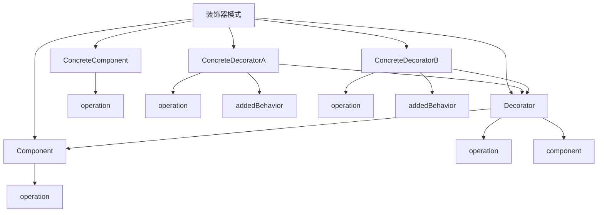

# 🎨 装饰器模式

[[04-结构型模式/04-组合模式]] ← [[04-结构型模式/06-外观模式]]
## 🎯 装饰器模式概览

### 📊 模式结构图



## 🏗️ 模式定义与特点

### 📋 **模式定义**
装饰器模式动态地给一个对象添加一些额外的职责。就增加功能来说，装饰器模式比生成子类更为灵活。

### 📋 **核心特点**
- **动态增强**: 动态地给对象添加功能
- **透明装饰**: 装饰器与被装饰对象有相同的接口
- **可组合**: 可以组合多个装饰器
- **灵活扩展**: 比继承更灵活

### 📋 **适用场景**
- 需要动态地给对象添加功能
- 需要透明地增强对象功能
- 需要组合多个功能
- 需要避免使用继承

## 🏗️ 模式实现

### 📋 **基础实现**

#### **组件接口**
```java
// ✅ 组件接口
public interface Component {
    void operation();
}

// ✅ 具体组件
public class ConcreteComponent implements Component {
    @Override
    public void operation() {
        System.out.println("ConcreteComponent operation");
    }
}

// ✅ 抽象装饰器
public abstract class Decorator implements Component {
    protected Component component;
    
    public Decorator(Component component) {
        this.component = component;
    }
    
    @Override
    public void operation() {
        component.operation();
    }
}

// ✅ 具体装饰器A
public class ConcreteDecoratorA extends Decorator {
    public ConcreteDecoratorA(Component component) {
        super(component);
    }
    
    @Override
    public void operation() {
        super.operation();
        addedBehavior();
    }
    
    private void addedBehavior() {
        System.out.println("ConcreteDecoratorA added behavior");
    }
}

// ✅ 具体装饰器B
public class ConcreteDecoratorB extends Decorator {
    public ConcreteDecoratorB(Component component) {
        super(component);
    }
    
    @Override
    public void operation() {
        super.operation();
        addedBehavior();
    }
    
    private void addedBehavior() {
        System.out.println("ConcreteDecoratorB added behavior");
    }
}
```

#### **使用示例**
```java
// ✅ 客户端使用
public class Client {
    public static void main(String[] args) {
        // 创建具体组件
        Component component = new ConcreteComponent();
        
        // 装饰组件
        Component decoratedComponent = new ConcreteDecoratorA(
            new ConcreteDecoratorB(component)
        );
        
        // 执行操作
        decoratedComponent.operation();
    }
}
```

## 🏗️ 实际应用案例

### 📋 **咖啡装饰器案例**

#### **咖啡装饰器**
```java
// ✅ 咖啡接口
public interface Coffee {
    double getCost();
    String getDescription();
}

// ✅ 基础咖啡
public class SimpleCoffee implements Coffee {
    @Override
    public double getCost() {
        return 2.0;
    }
    
    @Override
    public String getDescription() {
        return "Simple coffee";
    }
}

// ✅ 咖啡装饰器
public abstract class CoffeeDecorator implements Coffee {
    protected Coffee coffee;
    
    public CoffeeDecorator(Coffee coffee) {
        this.coffee = coffee;
    }
    
    @Override
    public double getCost() {
        return coffee.getCost();
    }
    
    @Override
    public String getDescription() {
        return coffee.getDescription();
    }
}

// ✅ 牛奶装饰器
public class MilkDecorator extends CoffeeDecorator {
    public MilkDecorator(Coffee coffee) {
        super(coffee);
    }
    
    @Override
    public double getCost() {
        return coffee.getCost() + 0.5;
    }
    
    @Override
    public String getDescription() {
        return coffee.getDescription() + ", milk";
    }
}

// ✅ 糖装饰器
public class SugarDecorator extends CoffeeDecorator {
    public SugarDecorator(Coffee coffee) {
        super(coffee);
    }
    
    @Override
    public double getCost() {
        return coffee.getCost() + 0.2;
    }
    
    @Override
    public String getDescription() {
        return coffee.getDescription() + ", sugar";
    }
}

// ✅ 香草装饰器
public class VanillaDecorator extends CoffeeDecorator {
    public VanillaDecorator(Coffee coffee) {
        super(coffee);
    }
    
    @Override
    public double getCost() {
        return coffee.getCost() + 0.8;
    }
    
    @Override
    public String getDescription() {
        return coffee.getDescription() + ", vanilla";
    }
}

// ✅ 巧克力装饰器
public class ChocolateDecorator extends CoffeeDecorator {
    public ChocolateDecorator(Coffee coffee) {
        super(coffee);
    }
    
    @Override
    public double getCost() {
        return coffee.getCost() + 1.0;
    }
    
    @Override
    public String getDescription() {
        return coffee.getDescription() + ", chocolate";
    }
}
```

#### **使用示例**
```java
// ✅ 使用示例
public class CoffeeDemo {
    public static void main(String[] args) {
        // 创建基础咖啡
        Coffee coffee = new SimpleCoffee();
        System.out.println("Cost: $" + coffee.getCost() + ", Description: " + coffee.getDescription());
        
        // 添加牛奶
        coffee = new MilkDecorator(coffee);
        System.out.println("Cost: $" + coffee.getCost() + ", Description: " + coffee.getDescription());
        
        // 添加糖
        coffee = new SugarDecorator(coffee);
        System.out.println("Cost: $" + coffee.getCost() + ", Description: " + coffee.getDescription());
        
        // 添加香草
        coffee = new VanillaDecorator(coffee);
        System.out.println("Cost: $" + coffee.getCost() + ", Description: " + coffee.getDescription());
        
        // 添加巧克力
        coffee = new ChocolateDecorator(coffee);
        System.out.println("Cost: $" + coffee.getCost() + ", Description: " + coffee.getDescription());
        
        System.out.println();
        
        // 创建不同的咖啡组合
        Coffee coffee1 = new MilkDecorator(new SugarDecorator(new SimpleCoffee()));
        System.out.println("Coffee 1 - Cost: $" + coffee1.getCost() + ", Description: " + coffee1.getDescription());
        
        Coffee coffee2 = new VanillaDecorator(new ChocolateDecorator(new SimpleCoffee()));
        System.out.println("Coffee 2 - Cost: $" + coffee2.getCost() + ", Description: " + coffee2.getDescription());
    }
}
```

### 📋 **文件流装饰器案例**

#### **文件流装饰器**
```java
// ✅ 文件流接口
public interface FileStream {
    void write(String data);
    String read();
    void close();
}

// ✅ 基础文件流
public class BasicFileStream implements FileStream {
    private String filename;
    private StringBuilder content;
    
    public BasicFileStream(String filename) {
        this.filename = filename;
        this.content = new StringBuilder();
    }
    
    @Override
    public void write(String data) {
        content.append(data);
        System.out.println("Writing to " + filename + ": " + data);
    }
    
    @Override
    public String read() {
        System.out.println("Reading from " + filename + ": " + content.toString());
        return content.toString();
    }
    
    @Override
    public void close() {
        System.out.println("Closing " + filename);
    }
}

// ✅ 文件流装饰器
public abstract class FileStreamDecorator implements FileStream {
    protected FileStream fileStream;
    
    public FileStreamDecorator(FileStream fileStream) {
        this.fileStream = fileStream;
    }
    
    @Override
    public void write(String data) {
        fileStream.write(data);
    }
    
    @Override
    public String read() {
        return fileStream.read();
    }
    
    @Override
    public void close() {
        fileStream.close();
    }
}

// ✅ 压缩装饰器
public class CompressionDecorator extends FileStreamDecorator {
    public CompressionDecorator(FileStream fileStream) {
        super(fileStream);
    }
    
    @Override
    public void write(String data) {
        String compressedData = compress(data);
        System.out.println("Compressing data: " + data + " -> " + compressedData);
        fileStream.write(compressedData);
    }
    
    @Override
    public String read() {
        String compressedData = fileStream.read();
        String decompressedData = decompress(compressedData);
        System.out.println("Decompressing data: " + compressedData + " -> " + decompressedData);
        return decompressedData;
    }
    
    private String compress(String data) {
        // 简单的压缩模拟
        return "compressed_" + data;
    }
    
    private String decompress(String data) {
        // 简单的解压缩模拟
        return data.startsWith("compressed_") ? data.substring(11) : data;
    }
}

// ✅ 加密装饰器
public class EncryptionDecorator extends FileStreamDecorator {
    public EncryptionDecorator(FileStream fileStream) {
        super(fileStream);
    }
    
    @Override
    public void write(String data) {
        String encryptedData = encrypt(data);
        System.out.println("Encrypting data: " + data + " -> " + encryptedData);
        fileStream.write(encryptedData);
    }
    
    @Override
    public String read() {
        String encryptedData = fileStream.read();
        String decryptedData = decrypt(encryptedData);
        System.out.println("Decrypting data: " + encryptedData + " -> " + decryptedData);
        return decryptedData;
    }
    
    private String encrypt(String data) {
        // 简单的加密模拟
        return "encrypted_" + data;
    }
    
    private String decrypt(String data) {
        // 简单的解密模拟
        return data.startsWith("encrypted_") ? data.substring(10) : data;
    }
}

// ✅ 日志装饰器
public class LoggingDecorator extends FileStreamDecorator {
    public LoggingDecorator(FileStream fileStream) {
        super(fileStream);
    }
    
    @Override
    public void write(String data) {
        System.out.println("Log: Writing data - " + data);
        fileStream.write(data);
    }
    
    @Override
    public String read() {
        System.out.println("Log: Reading data");
        String data = fileStream.read();
        System.out.println("Log: Read data - " + data);
        return data;
    }
    
    @Override
    public void close() {
        System.out.println("Log: Closing file stream");
        fileStream.close();
    }
}
```

#### **使用示例**
```java
// ✅ 使用示例
public class FileStreamDemo {
    public static void main(String[] args) {
        // 创建基础文件流
        FileStream fileStream = new BasicFileStream("test.txt");
        
        // 添加日志装饰器
        fileStream = new LoggingDecorator(fileStream);
        
        // 添加压缩装饰器
        fileStream = new CompressionDecorator(fileStream);
        
        // 添加加密装饰器
        fileStream = new EncryptionDecorator(fileStream);
        
        // 使用装饰后的文件流
        fileStream.write("Hello World");
        String data = fileStream.read();
        fileStream.close();
        
        System.out.println();
        
        // 创建不同的装饰器组合
        FileStream fileStream1 = new LoggingDecorator(new BasicFileStream("test1.txt"));
        fileStream1.write("Simple logging");
        fileStream1.close();
        
        System.out.println();
        
        FileStream fileStream2 = new CompressionDecorator(new EncryptionDecorator(new BasicFileStream("test2.txt")));
        fileStream2.write("Compressed and encrypted");
        fileStream2.close();
    }
}
```

### 📋 **HTTP请求装饰器案例**

#### **HTTP请求装饰器**
```java
// ✅ HTTP请求接口
public interface HttpRequest {
    void send();
    String getUrl();
    Map<String, String> getHeaders();
    String getBody();
}

// ✅ 基础HTTP请求
public class BasicHttpRequest implements HttpRequest {
    private String url;
    private Map<String, String> headers;
    private String body;
    
    public BasicHttpRequest(String url, String body) {
        this.url = url;
        this.body = body;
        this.headers = new HashMap<>();
    }
    
    @Override
    public void send() {
        System.out.println("Sending HTTP request to: " + url);
        System.out.println("Headers: " + headers);
        System.out.println("Body: " + body);
    }
    
    @Override
    public String getUrl() {
        return url;
    }
    
    @Override
    public Map<String, String> getHeaders() {
        return headers;
    }
    
    @Override
    public String getBody() {
        return body;
    }
}

// ✅ HTTP请求装饰器
public abstract class HttpRequestDecorator implements HttpRequest {
    protected HttpRequest httpRequest;
    
    public HttpRequestDecorator(HttpRequest httpRequest) {
        this.httpRequest = httpRequest;
    }
    
    @Override
    public void send() {
        httpRequest.send();
    }
    
    @Override
    public String getUrl() {
        return httpRequest.getUrl();
    }
    
    @Override
    public Map<String, String> getHeaders() {
        return httpRequest.getHeaders();
    }
    
    @Override
    public String getBody() {
        return httpRequest.getBody();
    }
}

// ✅ 认证装饰器
public class AuthenticationDecorator extends HttpRequestDecorator {
    private String token;
    
    public AuthenticationDecorator(HttpRequest httpRequest, String token) {
        super(httpRequest);
        this.token = token;
    }
    
    @Override
    public void send() {
        httpRequest.getHeaders().put("Authorization", "Bearer " + token);
        System.out.println("Adding authentication token");
        httpRequest.send();
    }
}

// ✅ 重试装饰器
public class RetryDecorator extends HttpRequestDecorator {
    private int maxRetries;
    
    public RetryDecorator(HttpRequest httpRequest, int maxRetries) {
        super(httpRequest);
        this.maxRetries = maxRetries;
    }
    
    @Override
    public void send() {
        for (int i = 0; i <= maxRetries; i++) {
            try {
                System.out.println("Attempt " + (i + 1) + " of " + (maxRetries + 1));
                httpRequest.send();
                break;
            } catch (Exception e) {
                if (i == maxRetries) {
                    System.out.println("All retry attempts failed");
                    throw e;
                }
                System.out.println("Request failed, retrying...");
            }
        }
    }
}

// ✅ 缓存装饰器
public class CacheDecorator extends HttpRequestDecorator {
    private Map<String, String> cache;
    
    public CacheDecorator(HttpRequest httpRequest) {
        super(httpRequest);
        this.cache = new HashMap<>();
    }
    
    @Override
    public void send() {
        String cacheKey = httpRequest.getUrl() + httpRequest.getBody();
        if (cache.containsKey(cacheKey)) {
            System.out.println("Cache hit: " + cache.get(cacheKey));
            return;
        }
        
        System.out.println("Cache miss, sending request");
        httpRequest.send();
        cache.put(cacheKey, "cached_response");
    }
}

// ✅ 日志装饰器
public class LoggingDecorator extends HttpRequestDecorator {
    public LoggingDecorator(HttpRequest httpRequest) {
        super(httpRequest);
    }
    
    @Override
    public void send() {
        System.out.println("Log: Starting HTTP request");
        System.out.println("Log: URL - " + httpRequest.getUrl());
        System.out.println("Log: Headers - " + httpRequest.getHeaders());
        System.out.println("Log: Body - " + httpRequest.getBody());
        
        httpRequest.send();
        
        System.out.println("Log: HTTP request completed");
    }
}
```

#### **使用示例**
```java
// ✅ 使用示例
public class HttpRequestDemo {
    public static void main(String[] args) {
        // 创建基础HTTP请求
        HttpRequest request = new BasicHttpRequest("https://api.example.com/users", "{\"name\":\"John\"}");
        
        // 添加日志装饰器
        request = new LoggingDecorator(request);
        
        // 添加认证装饰器
        request = new AuthenticationDecorator(request, "abc123");
        
        // 添加重试装饰器
        request = new RetryDecorator(request, 2);
        
        // 添加缓存装饰器
        request = new CacheDecorator(request);
        
        // 发送请求
        request.send();
        
        System.out.println();
        
        // 创建不同的装饰器组合
        HttpRequest request1 = new LoggingDecorator(new BasicHttpRequest("https://api.example.com/data", "{}"));
        request1.send();
        
        System.out.println();
        
        HttpRequest request2 = new AuthenticationDecorator(
            new RetryDecorator(new BasicHttpRequest("https://api.example.com/secure", "{}"), 1), 
            "xyz789"
        );
        request2.send();
    }
}
```

## 🎯 模式优势与劣势

### 📋 **优势**
- **动态增强**: 可以动态地给对象添加功能
- **透明装饰**: 装饰器与被装饰对象有相同的接口
- **可组合**: 可以组合多个装饰器
- **灵活扩展**: 比继承更灵活

### 📋 **劣势**
- **复杂度增加**: 增加了系统的复杂度
- **装饰器链**: 装饰器链过长可能影响性能
- **理解困难**: 理解装饰器链需要一定经验

### 📋 **与代理模式的区别**
| 方面 | 装饰器模式 | 代理模式 |
|------|------------|----------|
| **目的** | 功能增强 | 访问控制 |
| **透明性** | 透明装饰 | 非透明代理 |
| **组合** | 可以多层装饰 | 通常单层代理 |
| **时机** | 运行时决定 | 编译时决定 |

## 🔗 学习衔接

- **上一文档** ← [[组合模式]]
- **下一文档** → [[外观模式]]
- **模式基础** → [[01-基础认知]]

---
**💡 装饰器精髓**: 装饰器模式就像给礼物包装，可以一层一层地添加装饰，让原本简单的对象变得更加丰富和美观。当我们需要动态地给对象添加功能时，装饰器模式是最佳选择！
